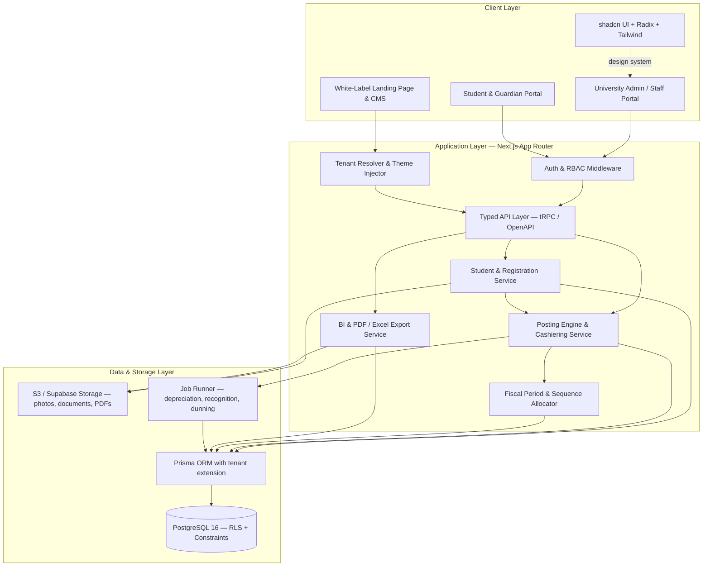
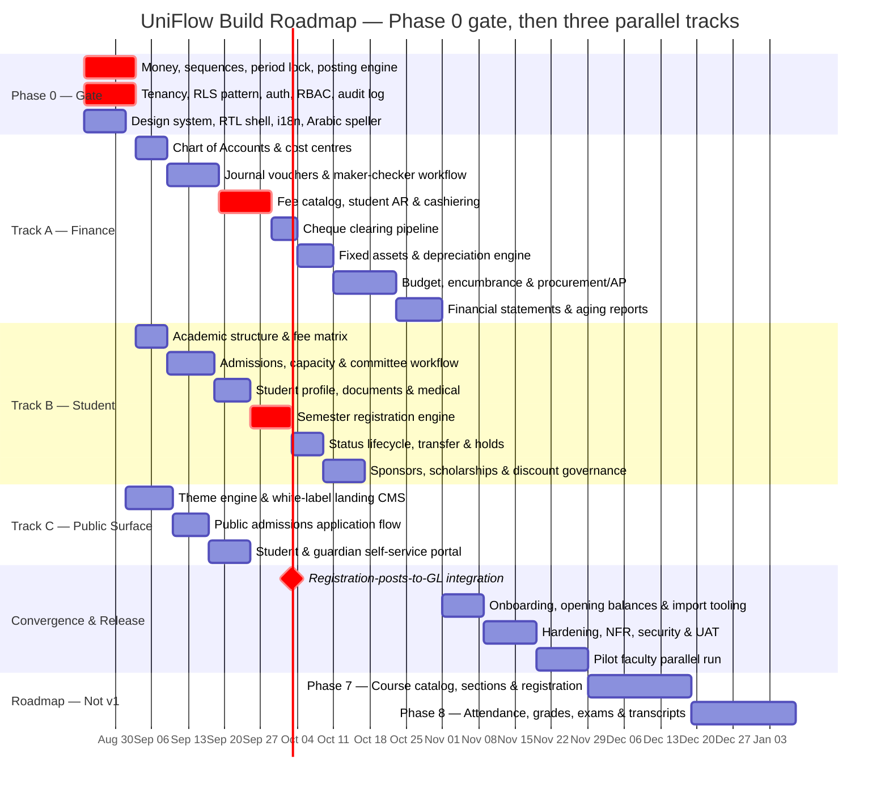

# Implementation Plan: UniFlow Multi-Tenant University ERP & White-Label Web Platform

**Version:** 2.8.0 · **Supersedes:** 1.0.0 - 2.7.0 · **Companion document:** [`srs_university_erp.md`](srs_university_erp.md) v2.8.0

Transformation of the legacy VB.NET / MS SQL desktop university system (Oasis E-University at Nile College; the Ribat University Application at Ribat and UOT) into a multi-tenant web application: student registration and lifecycle management, a double-entry university finance engine, and a white-label landing page per university client, built with **Next.js**, **shadcn UI** and **PostgreSQL**.

---

## 0. What changed from version 1.0.0

Version 1.0.0 was written from the legacy system's form and report filenames. Reading the VB.NET sources changed three things materially.

| # | Change | Reason |
| :--- | :--- | :--- |
| 1 | **New Phase 0** — ledger invariants and platform spine, before any screen is built | v1.0.0 began with the theme engine and landing CMS. Every hard correctness property of this product — voucher numbering, period locking, balanced postings, money precision, tenant isolation — lives in the ledger. None of it was a Phase 1 concern |
| 2 | **Roadmap restructured from one serial 93-day chain into three parallel tracks** with a named convergence milestone | The v1.0.0 Gantt was strictly sequential with no team allocation, implying a single infinitely fast developer, and gave no visibility into which work can proceed in parallel |
| 3 | **Legacy data migration removed** (was Phase 6.2), replaced by tenant onboarding and opening balances | Scope decision. Rationale in SRS §6 |
| 4 | Architecture diagram corrected | The v1.0.0 mermaid graph ended with `ClientLayer --> ApplicationLayer` and `ApplicationLayer --> DataLayer`, referencing node ids that were never declared — subgraph titles contain spaces and are not ids. Mermaid rendered three stray empty nodes |
| 5 | Stack pinned and an API-layer decision added | "Next.js 14+" is not a version. A student mobile app and public API are on the roadmap and Server Actions alone cannot serve them |
| 6 | RLS mechanism specified rather than asserted | Prisma does not emit `SET LOCAL app.tenant_id` on its own; v1.0.0 named RLS as the isolation strategy with no mechanism |
| 7 | Money type, idempotency, sequence allocation named as Phase 0 decisions | v1.0.0 never specified a monetary data type. The legacy system uses floating-point `Double` throughout |
| 8 | New modules scheduled: Fiscal Periods, Fee Catalog, Student Lifecycle, Sponsors, Procurement/AP, Admissions Capacity | See SRS §0 |
| 9 | Academic Records added as Phases 7-8 with a data-model-now constraint | The largest domain gap against comparable products; deferred, but the Phase 0 schema must accommodate it |
| 10 | Verification plan rewritten from five manual scenarios to property, concurrency, isolation, reconciliation, NFR and localization suites | v1.0.0's verification could not have caught any of the legacy defects the audit found |
| 11 | Risk register, environments/CI-CD, observability, security, team, and cutover sections added | Absent entirely from v1.0.0 |

---

## 0.1 Build status

**Phase 0 is complete. The gate is closed and Tracks A-C may start.** The
application lives in [`uniflow/`](uniflow/); see
[`uniflow/README.md`](uniflow/README.md) for setup and the Supabase deployment
path.

**588 tests pass across 19 suites; typecheck, lint and production build are all
clean.** Every item §4.1-§4.10 is built and verified.

**Track A is complete, A1-A7**: chart of accounts, journal vouchers and
maker-checker, fee catalog / student AR / cashiering, the cheque clearing
pipeline, fixed assets with the durable job runner, budget / encumbrance /
procure-to-pay, and the financial statements — trial balance, balance sheet,
income statement, sub-ledger reconciliation and their exports — together with
the two Module 12 requirements the statements depend on, opening balances and
the year-end close. See §0.2.

**Track B is under way.** B1 — academic structure and the effective-dated,
versioned fee matrix — and B2 — admissions capacity, eligibility screening and
the committee workflow — are both complete; see §6.1.

Six things were decided or corrected during the build and are recorded here
because they change what this document said (D-F are covered below the table):

| # | Decision / correction | Effect |
| :--- | :--- | :--- |
| A | **Next.js 16.3.1 + React 19.2** rather than the "Next.js 15 + React 19" pinned in §1 | Current release at scaffold time. No change to the architecture; the App Router / Server Component model this plan assumes is unchanged |
| B | **Prisma 7** moved connection URLs out of `schema.prisma` into `prisma.config.ts`, and made driver adapters mandatory | `datasource.url` in the config drives migrations; the runtime client is handed a `PrismaPg` adapter. This maps *better* onto Supabase's two endpoints than the old `directUrl` field did |
| C | **Tenant isolation is enforced by database ROLE, not by a session flag** — see below | Supersedes the "app-level tenant guard with RLS as defence-in-depth" option offered in §4.6 |
| D | **Local Postgres must be initialised `--encoding=UTF8`** | `initdb` inherits the Windows system locale and produces a WIN1252 cluster in which *no Arabic name can be stored at all*. Pinned in `scripts/pg.ts`; the test setup asserts it |

### On (C): the RLS trap was worse than §4.6 described

§4.6 offered two tenancy patterns and said to pick one. Building it showed the
choice is not free, and that the obvious implementation is silently inert:

1. PostgreSQL RLS **does not apply to superusers at all**, and does not apply
   to a table's owner unless the table is `FORCE ROW LEVEL SECURITY`. The role
   that runs migrations is necessarily the owner. An application connecting
   with that role has no isolation, and nothing reports this — no error, no
   warning, no degraded behaviour. On Supabase the default `postgres` role
   owns everything in `public`, so this is the *default* misconfiguration.
2. The first implementation added an `app.bypass_rls` session variable so that
   platform work could bypass policies. That is not a boundary: the same
   connection the policies constrain can set the variable and switch them off.

Both were caught by the isolation suite writing queries at the database layer.
The resolution is the standard Postgres separation, and the one Supabase uses
internally: **privilege comes from the role.** An owner role runs migrations
and platform work; a separate `NOSUPERUSER, NOBYPASSRLS`, non-owning app role
serves every request and is confined by RLS. The `app.bypass_rls` GUC is gone.

`npm run db:check-roles` asserts the split and **must run in CI against every
environment, production included**. A one-line connection-string mistake is
otherwise indistinguishable from a correct deployment until a tenant reads
another tenant's ledger.

### Phase 0 acceptance evidence

| Plan requirement | Status |
| :--- | :--- |
| §4.1 Money type and rounding policy | `numeric(19,4)` / `Prisma.Decimal`; half-up; exact-sum allocation for instalments and sponsor splits |
| §4.2 Sequence allocator, `MAX+1` prohibited | Row-locked counter per tenant × fiscal year × doc type; **60 parallel postings → 60 distinct gapless numbers** |
| §4.3 Fiscal period model and posting lock | Periods with `FUTURE/OPEN/CLOSED/PERMANENTLY_CLOSED`; non-overlap enforced by GiST exclusion constraint; posting into a non-open period rejected by trigger |
| §4.4 The posting engine | Single `post()`; balance, period, postability, control-account and cost-centre rules enforced in both the engine and the database |
| §4.5 Idempotency | Claim-before-work with stored response; replay returns the original; same key + different body is an error; failed work releases the claim |
| §4.6 Multi-tenancy and RLS | Role-based; verified at the database layer, not the API layer |
| §4.7 Audit log | Hash-chained per tenant, advisory-locked sequence, append-only by trigger; verifier locates both removal and alteration |
| §4.8 Auth, RBAC, segregation of duties | Argon2id, JWT sessions with immediate revocation, TOTP second factor with replay refusal, 52-permission catalogue, 13-pair SoD matrix enforced at role-save AND at role-assignment, plus per-document self-approval refusal |
| §4.9 Design system / localisation shell | Tailwind v4 tokens with per-tenant HSL palette, RTL shell (`dir` on `<html>`, Cairo for Arabic), next-intl with parity-tested catalogues, **working Arabic تفقيط**, Hijri/Gregorian dual calendar, Arabic search normalisation |
| §4.10 Data model accommodates Academic Records | Reviewed; `subledgerType`/`subledgerId`, `sourceModule`/`sourceRef` and the term-agnostic period model leave room for Module 18 without reshaping the ledger |

### Two further corrections found while closing the gate

| # | Correction | Effect |
| :--- | :--- | :--- |
| E | **Next.js 16 renamed Middleware to Proxy** — the file is `src/proxy.ts`, and a `middleware.ts` is simply not picked up | Locale negotiation lives there. Authorisation deliberately does **not**: Next's own guidance is that Proxy is for optimistic checks, not session management or authorisation. `requirePermission()` runs in the data access layer |
| F | **Arabic noun agreement is not what the first fixtures assumed** | After آلاف the counted noun is *singular* — خمسة آلاف جنيه, not جنيهات — and any count of 11 or more reverts to the singular. Three test fixtures were wrong and the implementation was right; corrected with the rule stated in the test. Getting this wrong prints a malformed amount on every voucher |

---

## 0.2 Track A progress

### A1 — Chart of Accounts & Cost Centres · complete

| Delivered | Notes |
| :--- | :--- |
| Normalised account tree | `id`, `code`, `parent_id`, derived `level`, bilingual names. Replaces five denormalised TEXT columns whose tree was rebuilt by five nested cursors on five separate connections |
| Single-query tree assembly | One indexed read, assembled in memory. The legacy screen issued O(nodes) round trips to render once |
| Structural rules enforced | Level derived from parent, never supplied · max depth 5 · only level-5 leaves postable · control accounts must declare their sub-ledger · root accounts must state their normal balance · sign inherited down each branch with an explicit override for contra-assets |
| Immutable code/level/parent | Ledger history attaches by id; re-parenting would silently restate prior periods. Deactivate and replace instead |
| Deactivate, never delete | Refuses while active children exist. Replaces the legacy `frmDeleteAcc.vb`, which deleted rows outright |
| Standard university COA template | 60+ accounts and 7 cost centres installed at onboarding (SRS §6 step 1), idempotent by code. Includes the three sub-ledger control accounts, accumulated depreciation as a contra-asset, unearned fees for REQ-FEE-02, and FX difference accounts for REQ-FIN-03 — none of which existed in the legacy chart |
| 27 tests | Template integrity, install idempotency, level derivation, sign inheritance, authorisation, deactivation rules, audit chain — plus an end-to-end posting of a tuition bill against the installed chart |

### A defect found by A1, fixed: the audit chain reported false tampering

The chart-of-accounts suite was the first to log an audit payload with more
than one key, and it failed the chain verification immediately.

**Cause.** Postgres `jsonb` does not preserve object key order — it normalises
keys by length then bytewise. A payload written as
`{nameAr, nameEn, requiresCostCenter, code}` reads back as
`{code, nameAr, nameEn, requiresCostCenter}`. The hash was taken over
`JSON.stringify` at write time and again at verify time, so the two digests
differed for byte-identical data.

**Impact had it shipped.** The scheduled chain verifier (plan §11) would have
raised a P1 tampering alert on essentially every real change, since almost
every audited change carries a multi-key before/after payload. The alert that
exists to detect a genuine breach would have been permanently crying wolf —
which is worse than not having it, because it would have been switched off.

**Fix.** Hashes are taken over a canonical, recursively key-sorted
serialisation ([`src/lib/canonical-json.ts`](uniflow/src/lib/canonical-json.ts)),
shared with the idempotency key hasher, which needed the same property for the
same reason. Two regression tests pin it: a multi-key payload, and a nested
payload with arrays.

### A2 — Journal Vouchers & Maker-Checker · complete

The legacy approval flow, in full: approving a voucher inserted its lines into
`Transactionees` and then ran `DELETE FROM TempVouchers`
(frmApprovingVouchers.vb:941-991). No reviewer stage, no reject path, no
comment, no approver recorded — and the delete destroyed the only evidence
that a voucher had ever been reviewed. With no roles in the system, anyone who
could open the approvals screen could approve their own work.

| Delivered | Notes |
| :--- | :--- |
| Four-state workflow | `DRAFT → PENDING_REVIEW → PENDING_APPROVAL → POSTED`, `REJECTED` reachable from either checker stage, plus `CANCELLED` for a maker abandoning their own draft. The legal transitions are enforced by trigger as well as in code |
| Full `approval_events` history | Every transition retained with actor, comment and timestamp. Append-only by trigger, because a rejection comment that can be edited afterwards is not evidence |
| Mandatory rejection comment | In code *and* as a CHECK constraint. A rejection with no reason produces a resubmission with the same defect |
| Approver ≠ maker ≠ reviewer | Three independent controls: the SoD matrix on permissions held, `assertNotSelfApproval` per document, and a reviewer check that reads who actually acted on *this* document — the case the matrix cannot see when roles change between stages |
| Content freeze | Once submitted, lines, date, description and type are immutable until rejection. Enforced at the table, because the attack (submit clean, swap the lines after review, get it approved) works against whichever code path forgets |
| Drafts are never deleted | Trigger-enforced. This is the single legacy behaviour the module exists to replace |
| Approval and posting in one transaction | A draft marked POSTED whose ledger entry rolled back cannot exist, and neither can the converse |
| Separate draft number series | An abandoned draft never burns a statutory voucher number. Allocated by the same row-locked upsert discipline as voucher numbers |
| Attachments | Metadata plus SHA-256 digest, frozen by the same trigger as the lines — "a checker approves what they were shown" has to include the evidence. Bytes go to object storage when that layer lands |
| Reversal | Bidirectional linkage, mandatory reason, once-only by UNIQUE constraint, posting into the period of the reversal date rather than the original's |
| Work queue | `awaitingMe` shows a checker only the stage they hold and never their own drafts; a queue listing items you cannot action trains people to ignore it |
| 56 tests | Including the four that describe attacks: self-approval, one person taking both checks, editing after review, and two approvers pressing Approve at the same instant |

**On "MFA above the approval threshold".** The threshold is zero, deliberately.
`voucher.approve` and `voucher.reverse` always demand a verified second factor.
A threshold below which approvals need no second factor is a documented amount
an attacker can stay under; the cost of a six-digit code is a few seconds. This
is stricter than §3 A2 specified, and is recorded here rather than silently
implemented.

**One refactor worth noting.** The line rules — sides, signs, FX conversion,
balancing — now live in one place
([`src/lib/ledger/lines.ts`](uniflow/src/lib/ledger/lines.ts)) shared by the
posting engine and the voucher grid. They were about to be written twice, once
throwing and once collecting, and a grid that reports "balanced" against a
server that reports "out by 0.01" leaves the maker unable to proceed and unable
to see why. Rounding a foreign-currency line to functional currency is exactly
where that divergence would have come from; a test now posts an FX voucher and
asserts the grid total equals the ledger total to the last digit.

**A structural gap closed while building it.** The isolation suite tested the
tables that existed when it was written. Adding a table and forgetting its RLS
policy is silent — the table simply has no isolation and every query returns
every tenant's rows. There is now a sweep over `pg_class` that fails if any
table in `public` lacks row-level security and a policy, with two names
declared global on purpose (`permissions`, `_prisma_migrations`).

---

### A3 — Fee Catalog, Student AR & Cashiering · complete

The critical path, and the part of the legacy system furthest from correct.
Its cashier screen had a fee grid **hardcoded to two rows**, looked accounts up
by their Arabic *names* and then wrote the English literals `"Current Assets"`,
`"Debtors"` and `"Students Fees"` into the grid, numbered receipts with
`MAX(MoveNo) + 1` read inside the transaction, recognised a full year's tuition
on registration day, and had no student control account at all — so a student's
balance and the general ledger could disagree indefinitely with nothing capable
of noticing.

| Delivered | Notes |
| :--- | :--- |
| Fee item catalog (REQ-FEE-01) | All fifteen heads, each with its own revenue account and its own deferrable / discountable / refundable flags. Installed at onboarding, idempotent by code |
| Structural account roles | Modules ask for `STUDENT_AR_CONTROL`, not for account code `11211`. A tenant may renumber its chart; the legacy system wrote account *names* into the source, so renaming an account broke posting |
| Student master (finance slice) | Number, bilingual name, national ID, status. Arabic-normalised search key, so a cashier typing احمد finds أحمد. National ID unique per tenant by partial index — duplicate applicants are the start of duplicate ledgers. Track B extends this table rather than replacing it |
| Charge raising (REQ-FEE-02) | `DR Student AR (net) · DR Discounts (discount) · CR Unearned or Revenue (gross)`. Gross billing keeps scholarship exposure on its own line — the number `viewDiscount` existed to reconstruct. Idempotency-keyed |
| Multi-channel cashiering (REQ-CSH-01) | Cash to the cashier's **own till**, bank transfer, cheque into cheques-receivable with its clearing detail, gateway. FIFO settlement by due date. **The idempotency key is a required argument, not an option** |
| Credit balances (REQ-FEE-04) | Unmatched money credits a *liability control account*, not receivables. Crediting the whole receipt to AR would leave a negative student balance sitting in an asset account. Applied to the next term's charges without burning a receipt number |
| Receipt cancellation (REQ-CSH-06) | Same day only, by a supervisor, with MFA; produces a linked reversal and keeps the number. After that day it goes through the voucher workflow and gets a second signature |
| Charge reversal | Unwinds recognised revenue and unearned income **in the proportions that apply now**, and returns money already paid to the student as credit rather than quietly keeping it |
| Revenue recognition (REQ-FEE-02) | The schedule is written when the charge is raised, so the period-end batch is a lookup and cannot arrive at a different answer on a re-run. Idempotent per period, period-locked, and it skips reversed charges |
| Instalment plans (REQ-CSH-02) | Dated schedules with exact-sum allocation. Overdue is cross-checked against the actual balance: a student who paid up front is not dunned because a date passed |
| Statement of account, aging | Running balance with a real opening figure carried into a date window. Aging from the due date, falling back to the document date |
| Fiscal year opening | Year, periods and **document counters in one transaction**, because a year without counters fails at its first posting |
| 56 tests | Including the reconciliation test below |

**The test that matters most.** After a scripted term — twelve students, mixed
discounts, cash and bank receipts, an overpayment, a same-day cancellation, a
partly-paid charge reversed, and two recognition runs — the student sub-ledger
equals its two control accounts **to the cent, with zero variance**. That check
is trivial to write against this design and was impossible against the legacy
one.

**Two ordering bugs, both mine, both caught by the database.**

1. Receipt cancellation released its allocations *after* stamping the
   cancellation. A cancelled receipt's allocations are frozen by trigger —
   which is what stops anyone re-pointing dead money at a live charge — so the
   database refused. The comment in the code had confidently asserted the
   opposite order was required. Fixed; the trigger is why this surfaced in a
   test rather than in a bursar's office.
2. `settled_amount` on a charge is denormalised so a screen listing forty
   charges does not aggregate the allocation table forty times. Denormalised
   totals are exactly what drifts, and a drifted student balance is what the
   legacy system shipped. A deferred constraint trigger now requires
   `settled_amount` to equal the sum of its allocations at commit, and a test
   proves a hand-written `UPDATE` cannot break it.

**A Prisma 7 interaction worth recording.** The statement-of-account query
originally pulled three sibling relations at once. Prisma 7's query interpreter
fans those loads out **concurrently onto the transaction's single connection**;
`pg` currently queues them and emits a deprecation warning, and will refuse
outright at pg 9. Correct today, an upgrade blocker tomorrow. The query now
resolves voucher references in one explicit pass — a fixed number of round
trips whatever the length of the history, which is the better shape anyway.
Worth watching for elsewhere: the only symptom is a `DeprecationWarning` from
`pg`, and nothing else.

**Deliberately not built yet, and why**

| Deferred | Reason |
| :--- | :--- |
| Payment-gateway provider adapters (REQ-CSH-05) | The interface is meaningless without a webhook route and a settlement-reconciliation job. `GATEWAY` receipts post to the bank account today and carry their provider reference |
| Automatic late fees (REQ-CSH-02) | The durable job runner it needed now exists (A5). The `LATE_FEE` catalog item and the overdue query are in place; only the schedule that raises it is missing |
| Refund disbursement (REQ-FEE-03) | The payment-voucher workflow it follows now exists (A6); a refund is a payment voucher against a student rather than a vendor. The withdrawal refund *policy* is a Track B lifecycle concern |

---

### A4 — Cheque Clearing Pipeline · complete

The legacy implementation was **one boolean**. `CheqClear` sat on the
`Transactions` row and was flipped by clicking a grid cell, which ran
`UPDATE Transactions SET CheqClear=1 WHERE TransNo = <concatenated>` and
nothing else ([frmCheqClearingSystem.vb:71-95](Nile College E-University System/Oasis - E-University/Financial System/Forms/frmCheqClearingSystem.vb#L71-L95)).
Reading the source turned up a third defect the plan had not recorded:

| # | Defect | Consequence |
| :--- | :--- | :--- |
| 1 | `0` rendered as "Rejected", and `0` was also the initial value | Every cheque merely waiting in the drawer was displayed to staff as bounced |
| 2 | No ledger entry on any transition | Clearing a cheque never moved the bank balance |
| 3 | A bounce reinstated nothing | A student whose cheque the bank refused went on showing as paid |

Defect 3 is the expensive one, and it is invisible: the institution believes
it has been paid, the student believes they have paid, and the money is not
there.

| Delivered | Notes |
| :--- | :--- |
| Five-state machine | `RECEIVED → SENT_TO_BANK → CLEARED`, with `BOUNCED` reachable from either and `CANCELLED` only before presentation. Legal transitions enforced by trigger, so a settled cheque cannot be resurrected |
| A GL entry at **every** transition | deposit `DR Cheques with Bank · CR Cheques on Hand` · clear `DR Bank · CR Cheques with Bank` · bounce and cancel `DR Student AR / Credit · CR` whichever account held it |
| Two cheque accounts, not one | "What is in our safe" and "what is with the bank" are different questions. REQ-CHQ-01 asks for custody; custody the ledger cannot report is custody nobody can audit |
| Custody tracked and constrained | `VAULT / WITH_BANK / RETURNED_TO_DRAWER / SETTLED`, tied to status by CHECK so the paper's whereabouts and its state cannot disagree |
| Batch deposit and clearing | A deposit slip carries many cheques and the bank credits it as one item, so one voucher covers the batch. A mixed batch debits each bank account for its own |
| Bounce unwinds correctly | The debit splits exactly as the original receipt split its credit: matched money back onto the receivable, unmatched money off the credit-balance liability. Anything else desynchronises the sub-ledger |
| Returned-cheque fee | Raised as its own document with its own number, in the same transaction as the bounce. Needs `charge.create` — recording the bounce does not |
| Repeat-bounce reporting (REQ-CHQ-03) | Grouped on a normalised drawer key, so a drawer whose name is spelled two ways is one drawer. An institution that cannot answer this goes on accepting paper from the same payer indefinitely |
| Append-only history | Every transition with its actor, the bank's refusal code verbatim, and the voucher it posted. The legacy grid let you click Cleared and then Rejected all afternoon and kept only the last click |
| 37 tests | Including one per legacy defect, which fails if the behaviour returns |

**A new receipt state: dishonoured.** A bounced cheque leaves its receipt in a
position the system had no word for. It is not cancelled — the cashier did
nothing wrong and the receipt keeps its number — but the money never arrived,
so it must stop counting towards what the student has paid. `dishonouredAt` is
that state, a CHECK forbids a receipt being both cancelled and dishonoured,
and the three places that ask "what has this student paid" now exclude both.

**A follow-up migration, deliberately separate.** `assert_allocation_live` was
written in A3 and froze the allocations of a *cancelled* receipt. Dishonour is
the same situation reached by a different route and needs the same rule, or an
allocation could be inserted afterwards and settle a charge with money that
never arrived. Amending the already-applied A3 migration would have been
dishonest about what shipped when, so it is its own migration.

**On `prisma migrate dev` and non-interactive environments.** Adding a unique
constraint makes the CLI prompt for confirmation, and there is no terminal
here to answer it. The migration was generated with
`prisma migrate diff --from-config-datasource --to-schema` and applied with
`migrate deploy` — worth knowing for CI, where the same prompt would hang a
pipeline rather than fail it.

**Deferred:** bank statement import and auto-reconciliation, which belongs with
the cash-controls module listed under "recommended, not scheduled" in SRS §7.
The clearing side is complete without it; reconciliation automates the reading
of the advice, not the accounting for it.

---

### A5 — Fixed Assets, Depreciation & the Job Runner · complete

Reading the legacy source turned up a worse starting point than the plan had
recorded. **There was no asset entity at all.** An "asset" was a row in the
chart of accounts — `Acc` with `Acc1 = 'Fixed Assets'` — carrying a
`DeprPerc` column and nothing else: no purchase date, no in-service date, no
salvage value, no useful life, no serial number, no custodian, no location.
There was no accumulated-depreciation account either, so **net book value was
not derivable from anything the system held**.

The depreciation run ([frmFixedAssetsManagement.vb:272-313](Nile College E-University System/Oasis - E-University/Financial System/Forms/frmFixedAssetsManagement.vb#L272-L313)):

```vb
cmd.CommandText = "Select IsNull(Max(MoveNo),0) From Transactions"   ' no filter at all
...
cmd.Parameters.AddWithValue("@Acc1", "Fixed Assets")                 ' English literals
cmd.Parameters.AddWithValue("@Acc3", "Depreciation Expenses")        ' into an Arabic chart
```

and the charge itself was `balance × DeprPerc / 100`, evaluated in a grid
against whatever the account's **current** balance happened to be. That is
reducing-balance by accident rather than by decision, it never terminates, and
because it read the live balance it produced a different answer every time the
screen was opened. Nothing stopped a second click posting the whole batch
again.

#### The durable job runner, built first

A6 dunning and the automatic late-fee rule need it too, so it is a module
rather than a helper inside depreciation.

| Guarantee | Mechanism |
| :--- | :--- |
| At most once per key | `(tenant, job_key)` unique, claimed before the work starts. A repeat invocation replays the stored result |
| Visible | Every run leaves a row: when, by whom, how long, what it posted, and why it failed. "When was depreciation last run" is a query, not archaeology |
| Retryable after failure, never after success | A failed run can be re-attempted under the same key with `attempts` incremented; a succeeded one is final, enforced by trigger |

Not the idempotency-key table: that is a request-level mechanism whose rows are
prunable and invisible to staff. A period-end batch is an operational event
somebody has to be able to look at months later. **Revenue recognition was
migrated onto the same runner**, so the two period-end batches are now one
concept rather than two.

#### Fixed assets

| Delivered | Notes |
| :--- | :--- |
| Real asset register | Cost, salvage, useful life, purchase *and* in-service dates, serial, barcode, custodian, location, status — none of which existed |
| Six categories, each bound to an account triple | Asset · accumulated depreciation · expense. Installed at onboarding, idempotent |
| Persisted schedule (REQ-AST-02) | Generated at capitalisation, one row per period. Accumulated depreciation and NBV are **derived from posted rows**, never recomputed |
| First period prorated by days | An asset installed on the 20th of a 31-day month takes 12/31 of a month's charge |
| The last period absorbs the residue | So the schedule sums to exactly cost − salvage. Same discipline as `allocate()`, and for the same reason: a schedule a few piastres short leaves a balance nothing ever clears |
| Reducing balance, bounded | Stops at salvage *and* at the end of the useful life. The legacy curve had neither bound |
| Idempotent, period-locked batch (REQ-AST-03) | Charge by cost centre, credit by category. Reports what it skipped and why |
| Schedule extension | A forty-year building outlives any calendar on the day it is bought; opening a fiscal year extends the schedules into it without touching posted rows |
| Disposal (REQ-AST-04) | Derecognises cost *and* accumulated depreciation, books gain or loss against proceeds, cancels the unposted schedule and keeps the posted rows |
| Custody history | Append-only. "Where was this in March" is what a physical count asks |
| 43 tests | Including a six-asset, five-period reconciliation with a sale at a gain and a write-off |

**The central check:** the asset register equals the general ledger, both for
cost and for accumulated depreciation, after a run of activity. Impossible
against the legacy design for the same reason the student one was — there was
no register and no contra-asset account, so there were not two numbers to
compare.

#### One test caught doing the very thing the product forbids

The schedule test summed its rows with
`rows.reduce((a, r) => a + Number(r.amount), 0)` and failed at
`9999.999999999998`. **The code was right; the test had reintroduced
floating-point error in the act of checking for it.** Summing through
`Number` is exactly what the legacy system did with VB `Double`. Corrected to
sum as `Decimal`, with the reason stated in the test — a test that reintroduces
the defect it is checking for proves nothing.

#### The Prisma sibling-relation threshold, now pinned

A4 recorded that three sibling relations in one query make Prisma 7 fan the
loads out concurrently onto the transaction's single connection. A5 hit it
again and the boundary is now established rather than guessed: **two sibling
relations are fine, three are not.** The symptom is a `DeprecationWarning`
from `pg` and nothing else; it becomes a hard failure at pg 9. Both occurrences
were fixed by resolving the extra relations in one explicit lookup, which is a
fixed number of round trips rather than a fan-out — the better shape anyway.

**Deferred:** componentisation, revaluation and QR-based physical count, all
listed under "recommended, not scheduled" in SRS §7. The register carries a
`barcode` field so a count app has something to scan when that lands.

---

### A6 — Budget, Encumbrance & Procurement/AP · complete

Two modules that only make sense together, and the reason REQ-BDG-02 and
REQ-BDG-03 existed with no source of data behind them.

#### What the legacy budget actually was

A budget line was one row:

```vb
cmd.CommandText = "Insert Into AccBudget (PeriodFrom,PeriodTo,Acc1,Acc2,Acc3,Acc4," & _
                  "Amount,UserName) Values (@PeriodFrom,@PeriodTo,@Acc1,@Acc2,@Acc3,@Acc4," & _
                  "@Amount,@UserName)"
cmd.Parameters.AddWithValue("@PeriodFrom", Me.DTPFrom.Value.ToShortDateString & " 10:10:10")
```
([frmBudget.vb:120-165](Nile College E-University System/Oasis - E-University/Financial System/Forms/frmBudget.vb#L120-L165))

Four *text* account names, a free-form date range with no relationship to the
fiscal calendar, and a literal `" 10:10:10"` stamped onto the boundary so the
row would sort inside the report's `"00:00:01".."23:59:59"` window. No
uniqueness, so two rows for the same account silently doubled the allocation.
No version and no approval: revision meant `Set Valid=0` and inserting
another, and "what did the board approve in October" was unanswerable.
Renaming an account in the chart orphaned its budget, silently, because the
join was on the name.

And it was advisory in the strongest possible sense: **nothing anywhere
consulted it.** `frmBudget`'s report button ran `dbo.GetAccBudget` beside
`dbo.GetAccAmount` and printed the two columns. It was a report you looked at
*after* you had overspent.

#### What the legacy procurement was

Nothing. There is no vendor table, no purchase order, no goods receipt, no
invoice and no payable anywhere in either build — grepping both trees for
vendor, supplier, purchase, requisition, encumbrance, مورد, توريد and مشتريات
returns no source file. (SRS v2.0.0 named the Ribat build's `frmRequestGetBill`
as a rudimentary precursor. It is not: `RequestBill` is a request for a
**student** fee bill and sits on the receipts side. Corrected in SRS §0.0.) `frmMakePayBill` posts a grid of expense lines against
cash in a single document at payment time, with the payee's name typed into a
free-text `Source` column and the voucher number taken from
`Max(MoveNo)` ([frmMakePayBill.vb:337](Nile College E-University System/Oasis - E-University/Financial System/Forms/frmMakePayBill.vb#L337)).

The consequence is an accounting one rather than a convenience one: goods
received in March and paid for in June were reported as a June expense, and
between those two dates there was no record anywhere that the institution owed
anything. A quarterly income statement was wrong by everything delivered and
not yet paid for.

#### Budget

| Delivered | Notes |
| :--- | :--- |
| Budget **versions** with approval (REQ-BDG-01) | Version 1 is the original; a revision is version 2 and version 1 stays readable beside it. Exactly one APPROVED version per fiscal year, enforced by a partial unique index |
| Lines by account **id** × cost centre | Unique with `NULLS NOT DISTINCT`, so "no cost centre" is not a licence to enter the same allocation twice |
| Monthly phasing, always written | Variance reporting wants to know what was *planned* for March even when availability is checked against the year. Unphased lines spread through `allocate()`, so the distribution sums to the allocation exactly |
| Two control bases | `ANNUAL`, and `CUMULATIVE_TO_PERIOD` for institutions that phase — under which a department cannot spend December's money in January |
| Per-line overrun policy (REQ-BDG-02) | `BLOCK`, `WARN`, `ADVISORY`. Per line, because a hard stop on stationery and a hard stop on emergency roof repairs are not the same decision, and a system that cannot express the difference gets its control switched off wholesale |
| Variance report (REQ-BDG-03) | Allocated · Encumbered · Actual · Available · Variance · Utilisation % |
| Approved budgets are immutable | Trigger. Editing one silently restates every availability check already made against it |

An account **no approved budget covers does not block**. A budget covering only
some accounts is the normal state in year one, and refusing everything it does
not mention would make the control unusable exactly when it is being adopted.
It is reported as `budgeted: false` instead.

#### Encumbrance (REQ-PRC-03)

The design decision worth recording: **an encumbrance is not a general-ledger
posting.** An approved purchase order has acquired no asset and incurred no
liability. Committing it to the ledger would put amounts in the trial balance
that no accounting standard recognises, and every statement would then need a
rule for taking them out again. It reduces *available budget* and nothing else,
and lives in its own table with an append-only movement log. (Public-sector
systems that keep a parallel budgetary ledger are doing something defensible;
it is just not something that mixes with a single ledger carrying a
balanced-posting invariant.)

Reserved at PO approval, released as goods arrive — the value *received*, so a
partial delivery releases a partial commitment and the rest stays reserved
because the institution is still on the hook for it. Closed out as `CANCEL`,
`LAPSE` or `CARRY_FORWARD`, which are three separate actions because "we
changed our mind", "the year ended" and "it is still coming" are three
different answers to an auditor asking where 400,000 of spending authority
went.

#### Procure-to-pay

Requisition → PO → GRN → invoice → three-way match → payment voucher, with the
accrual chain split into the three steps the legacy system collapsed into one:

```
receipt   DR Expense / Asset          CR Goods Received Not Invoiced
invoice   DR Goods Received Not Inv.  CR Vendor AP
payment   DR Vendor AP                CR Cash / Bank
```

so the expense keeps the date it was incurred, the payable appears on the day
the bill does, and at every point in between the institution can state what it
owes. A new account role, `GRNI_ACCRUAL` (template code 21231), holds the
middle.

| Delivered | Notes |
| :--- | :--- |
| Vendor master (REQ-PRC-01) | Bank details are **dual-authorised**, enforced by trigger — see below |
| Requisitions | No accounting effect at all, which is why they are a separate document: the financial controls start at the order, and the requisition is the record of the decision that led to one |
| Purchase orders | Approval checks the budget **line by line**, not on the order total — lines hit different accounts and an order that fits in aggregate can still exhaust one department's allocation |
| Goods receipts | Idempotency key **required**, not optional. The stores officer is on a phone at a loading bay, and a second tap would otherwise accrue the delivery twice and release the encumbrance twice with it |
| Three-way match (REQ-PRC-04) | Quantity against the order, quantity against receipts, price against the order, within a per-line tolerance of 2% or 10, whichever is larger |
| Exception approval | A failed match **holds** the invoice rather than rejecting it, because most failures are a price change somebody authorised verbally and nobody wrote down. A held invoice does not post — the payable does not exist until a second person has taken responsibility for the difference, and their name is on it |
| Duplicate-invoice guard | `UNIQUE (tenant, vendor, vendor_invoice_no)`. Paying the same bill twice is the largest single recurring loss in accounts payable, and it is nearly always a duplicate entry rather than a fraud |
| Non-PO invoices | A utility bill has no order and no delivery note, so it recognises its expense directly rather than clearing an accrual that never existed |
| Payment vouchers (REQ-PRC-05) | Two people; approval is what posts, because a voucher approved but unposted would be a decision to pay with no payment. Allocations are **re-validated at approval** — another payment may have settled the same invoice since the draft, and an approver signing an amount that no longer matches what is owed is exactly what a second signature is for |
| AP aging and payment proposal | Aged by **due date**, not invoice date: an invoice on 60-day terms raised sixty-one days ago is one day late, not two months late. The proposal selects; a person decides |
| Year-end encumbrance settlement | Lapse or carry forward, per tenant policy, stated at the call site rather than assumed |
| 55 tests | Across two suites |

#### The bank-detail control

Redirecting a real vendor's payments to an attacker's account is the
highest-value fraud in accounts payable, and it needs no forged invoice and no
accomplice — only an edit to one row, after which every legitimate invoice
pays the attacker. So the bank columns **cannot be changed by an UPDATE at
all**: a trigger refuses unless an APPROVED `vendor_bank_changes` row exists
proposing exactly those values, and separately refuses an approval by the
requester. `vendor.manage` and `vendor.approve` are a new SoD pair, both
demand a second factor, and `vendor.manage` already conflicted with
`payment.create`.

Vendors are also created *without* bank details, so there is no moment at which
one person has decided where the money goes.

#### Four new permissions, six new SoD pairs

`payment.approve`, `vendor.approve`, `apinvoice.record`, `apinvoice.approve`.

`payment.create` **lost** its MFA requirement and `payment.approve` gained one:
drafting a payment moves nothing, and demanding a second factor for an action
with no consequence trains people to reach for their phone without reading the
screen.

The new conflicts keep the three sides of the match in different hands —
ordering, confirming delivery, and billing — because a match between documents
written by the same hand proves nothing. A ninth default role, **Stores
Officer**, holds `grn.create` and nothing else for that reason.

#### The central check

**The vendor sub-ledger equals the Vendor AP control account**, to the cent,
after a scripted run: three orders across two vendors, one delivered short and
closed, one fully delivered and paid, one delivered and left unpaid, plus a
non-PO utility bill part-paid by cheque. Zero variance. Impossible against the
legacy design for the same reason the student one was — there was neither a
vendor sub-ledger nor a payable, so there were not two numbers to compare.

A second check on the clearing account: **the GRNI balance equals what has
arrived and not been billed.** A clearing account exists so that a discrepancy
is visible rather than absorbed, and the test asserts that it is.

And a third, on the encumbrance ledger: `released_amount` equals the sum of its
own RELEASE movements. A number maintained by increments and an append-only log
of those increments should agree; when they do not, one of the two write paths
has a bug.

#### Two defects found in my own work

**A CHECK constraint that erased the evidence it existed to protect.**
`chk_po_approval_complete` required `approved_by_id IS NULL` in the CANCELLED
state — right for an order abandoned as a draft, wrong for one cancelled after
approval, which is the case that matters because that is the order holding an
encumbrance. Satisfying it would have meant erasing the record of who
committed the money. Corrected in a follow-up migration rather than by
rewriting the applied one.

**A test that read another tenant's voucher.** `asSystem` connects as the owner
role and bypasses RLS. Voucher references are unique *per tenant*, so every
university in the suite has its own `VIV-2026-000001`, and a lookup by
reference alone silently matched a different test's voucher. It surfaced as a
non-PO invoice appearing to debit the accrual account; the code was right and
the assertion was reading somebody else's ledger. Every raw lookup in that file
now carries the tenant, with a note saying why.

#### The Prisma boundary, corrected

A5 recorded the rule as "two sibling relations are fine, three are not". That
was too narrow. This track hit the same `pg` deprecation warning from a query
with only *two* top-level relations — because their nested loads brought the
total to five. Bisecting located it exactly.

The rule as it actually is: **a query may carry at most two relation loads in
total, counting nested ones.** Prisma 7's query interpreter runs them
concurrently on the transaction's single connection; `pg` answers with a
deprecation warning today and will refuse outright at pg 9. Three queries were
flattened — a fixed number of round trips instead of a fan-out, which is the
better shape regardless.

**Deferred:** budget transfers between lines (REQ-BDG-02's third bullet — the
version mechanism covers revision, and a transfer is a convenience on top of
it), and vendor prepayments and retention. Both are listed under "recommended,
not scheduled".

---

### A7 — Financial Statements & Reports · complete

The track that makes the previous six legible. Every posting A1-A6 produces
converges here, and the two central properties are asserted rather than
assumed: **the trial balance balances**, and **every control account agrees
with its sub-ledger**.

#### What the legacy reports actually did

The trial balance and the balance sheet did not read the same table.

```vb
' frmTrialBalance
"Select ... Acc1,Acc2,Acc3,Acc4," & _
"Sum(TotalValueIn)-Sum(TotalValueOut) TotalValueIn," & _
"Sum(TotalValueIn)-Sum(TotalValueOut) TotalValueOut " & _
"From Transactionees where Transdate > ... Group By Acc1,Acc2,Acc3,Acc4"
```
([frmTrialBalance.vb:161-168](Nile College E-University System/Oasis - E-University/Financial System/Forms/frmTrialBalance.vb#L161-L168))

```vb
' frmBalanceSheetLevels
"Select Acc1,Acc2,Acc3,Acc4,Sum(TotalValueIn)-Sum(TotalValueout) TotalValueout ... " & _
"From Transactions Where Transdate < ... group by Acc1,Acc2,Acc3,Acc4"
```
([frmBalanceSheetLevels.vb:214-218](Nile College E-University System/Oasis - E-University/Financial System/Forms/frmBalanceSheetLevels.vb#L214-L218))

Four findings, all visible in those eight lines:

1. **The trial balance reads `Transactionees`; the balance sheet reads
   `Transactions`.** The two divergent ledger tables named in §0.1 are not
   merely a schema wart — the institution's two headline statements were built
   from different halves of its books, so they could never be reconciled to
   each other except on paper.
2. **The trial balance's debit and credit columns are the same expression.**
   `Sum(TotalValueIn)-Sum(TotalValueOut)` is aliased to `TotalValueIn` *and* to
   `TotalValueOut`. The report prints one net figure in both columns. It
   therefore always appears to balance, whatever the ledger contains, and the
   one question a trial balance exists to answer cannot be asked of it.
3. **No opening column, because there was nothing to open from.** With no
   fiscal period model the query can only express a movement window, so
   REQ-RPT-03's opening/movement/closing was not implementable against that
   schema at all.
4. **Grouping is by four text account names**, so there is no level-5 detail,
   no code, and renaming an account silently splits its history into two rows.

There is no income statement anywhere in either build. `frmRptIncome` looks
like one and is not: it selects `StudID, StudName, Program, Class,
TuitionFees1, RegsFees` from `View_1`
([frmRptIncome.vb:61-64](Nile College E-University System/Oasis - E-University/Financial System/Forms/frmRptIncome.vb#L61-L64)) — a
student fee-collection listing, not revenue less expenses. Levels 1-4 of the
balance sheet are four separate Crystal files chosen by radio button rather
than one report with a depth parameter.

#### One source of figures

Every statement reads `reports/balances.ts`. Three presentations of one
question cannot be allowed three implementations, or they will eventually give
three answers — which is exactly the defect above, in a newer costume.

| Delivered | Notes |
| :--- | :--- |
| **Trial balance** (REQ-RPT-03) | Opening · Movement · Closing, each as a debit and a credit column, levels 1-5. Netted per account on the **raw** direction, not the account's normal balance, so an account sitting on the wrong side is visible rather than presented as though it were not |
| Totals from postable accounts only | Parents are shown because REQ-RPT-03 asks for levels 1-5, but they aggregate the rows beneath them. Totalling both would count every figure once per level |
| Hiding a row never changes a total | Totalling happens before the level filter and the zero-row filter. A summary trial balance that showed no level-5 rows and therefore totalled zero would be a display option that makes money vanish |
| `balanced` is asserted, not assumed | All three column pairs must agree. False is a data-integrity alarm: something has written to the ledger outside `post()` |
| **Balance sheet** L1-L4 (REQ-RPT-04) | Any cutoff date, including one inside a period |
| **Income statement** (REQ-RPT-05) | Revenue less expenses, net surplus/deficit, cost-centre filter, and a comparative window — `prior-year` shifts by exactly a year, because enrolment is seasonal and last month is not a fair comparison for this month |
| **Sub-ledger reconciliation** (REQ-RPT-06) | The three existing checks — student AR (A3), asset register (A5), vendor AP (A6) — plus a fourth, run inside **one** read transaction. Run separately they can disagree with each other merely because a receipt posted between two of them |
| Contra accounts subtract | Figures are signed by the account's *class*, not its own normal balance, so accumulated depreciation reduces the asset group it sits under instead of adding to it |
| **CSV · XLSX · print sheet** (REQ-RPT-07) | One `ReportDocument` model, three renderers. Writing each exporter against each statement would be nine implementations and nine places for a column to go missing from one format only |

REQ-RPT-01 (student statement of account) and REQ-RPT-02 (receivables aging
from the instalment due date) were delivered in **A3** and are not rebuilt here;
the reconciliation report calls into the same functions rather than growing its
own copy of them.

#### Any cutoff date, without scanning the ledger

REQ-RPT-04 wants a balance sheet at any date; REQ-NFR-02 forbids ad-hoc `SUM()`
over `transaction_lines` in a report path. Both hold, because periods are
classified against the report window: those wholly before it and wholly inside
it come from `account_period_balances`, and **only a period the window cuts** is
read line by line. A report run to a period boundary — which is nearly all of
them — reads no journal lines at all.

#### Opening balances carry forward by derivation, not by copy

This is a deliberate departure from REQ-PER-04's literal wording and is
recorded as SRS correction 20.

The conventional design copies each year's closing balances into the next
year's opening columns. A copied figure can drift from the postings it claims
to summarise: a correction posted into a reopened period moves the movement and
not the copy downstream, and nothing reports the divergence. Here
`opening_debit`/`opening_credit` hold only balances **injected from outside the
ledger** — the go-live opening entry — and everything else, a prior year's
result included, is summed from the periods that came before. A derived figure
cannot drift, because it is recomputed from the same rows the movement column is
built from.

Balance-sheet accounts therefore carry forward whether or not anyone ran the
close. What the close is *for* is stated plainly in `ledger/year-end.ts`: it
stops last year's revenue appearing in this year's income statement, and it
moves the surplus into equity. A balance sheet whose result line still spans an
unclosed prior year says so — `spansPriorYears` — rather than letting the figure
quietly mean something other than "this year".

#### Two Phase 0 requirements that were still unbuilt

Module 12 specified them; nothing had needed them until a trial balance did.

- **REQ-PER-03 opening balances.** One voucher, flagged `isOpeningEntry`, which
  the posting engine routes into the `opening_*` columns instead of `movement_*`
  — so a university's starting position is reported as an opening balance and
  not as January activity, which would show the whole institution as having come
  into existence in one month. Refused unless debits equal credits, every
  control-account balance carries its party, and no live opening entry already
  exists. Correctable only by reversal: there is no such thing as quietly
  adjusting where the books started.
- **REQ-PER-04 year-end close.** One posting zeroes every revenue and expense
  account into Retained Surplus. Reversible until the year is
  `PERMANENTLY_CLOSED`, and the undo is itself a posting with a reason — not a
  delete. Refused while vouchers are still awaiting approval, because closing
  would shut the period they have to post into.

#### On the XLSX writer and the absence of a PDF writer

The `.xlsx` exporter is about two hundred lines with no dependency. Entries are
ZIP-stored rather than deflated and strings are inline rather than shared,
which removes the compression step and the shared-string index entirely.
Amounts are written into `<v>` as the decimal strings they already are; there
is no `Number(...)` anywhere in the file, so nothing passes through IEEE-754 on
its way to a spreadsheet.

**PDF is produced by printing the HTML sheet, and that is a decision.** Arabic
is cursive: four contextual forms per letter, obligatory ligatures, then
bidirectional reordering against any Latin text or figures beside it. A PDF
content stream carries positioned glyphs, so a generator must do all of that
itself. The failure mode is what settles it — output that *looks* like Arabic,
prints, gets signed, and is wrong in ways an English-reading developer cannot
see. Browsers already contain a correct shaping engine. The print stylesheet
carries the page setup, the letterhead and the repeated table header, so what
leaves the print dialog is a document rather than a screenshot.

#### Verification

50 tests. Beyond the per-report assertions: closing equals opening plus movement
on every row of every trial balance; a mid-period cutoff read line by line
agrees with the same figures read from the aggregates; the level limit changes
what is displayed and not what is totalled; a cost-centre segment is marked
`segmented` and is *expected* not to balance; and a second university's reports
read zero while the first university's read its own postings.

One test is worth naming. The reconciliation report's fourth check looks for a
control-account balance carrying no party — and the condition **cannot be
produced**: `trg_line_postable` refuses it even to the owner role, which
bypasses RLS entirely. That refusal is asserted as a test in its own right. The
backstop is then exercised with the trigger suppressed for one transaction, on
the principle that a backstop nobody has ever seen fire is a backstop nobody
knows is connected.

**Deferred:** the pre-close checklist gate of REQ-PER-02 (the reconciliation
report computes every figure it needs; wiring it as a hard block on
`setPeriodStatus` waits for the period-close screen), and FX revaluation, which
has no exchange-rate data to revalue until a tenant runs a second currency.

---


## 1. Architecture Decisions Requiring Sign-Off

> [!IMPORTANT]
> These five decisions constrain everything downstream. They should be agreed before Phase 0 begins.

**1. Multi-tenancy — shared database, `tenant_id` partitioning, defence in depth.**
A single PostgreSQL database with `tenant_id` on every operational table, protected by **both** Row-Level Security and an application-layer tenant guard. Neither alone is sufficient: RLS protects against an application bug that forgets a `WHERE`, the guard protects against a pooled connection that never had its tenant context set. See §4 for the Prisma mechanism, which is a known trap.

**2. Bilingual RTL/LTR from the first commit.**
Arabic RTL and English LTR via `next-intl`, with Cairo/Tajawal for Arabic and Inter for English, plus a correct Arabic monetary speller (تفقيط) and Hijri/Gregorian dual calendar. Retrofitting RTL is far more expensive than building with it; the legacy system's own amount speller is an English one patched with `.Replace("Dollar","Pound")`.

**3. Maker-checker with full state history.**
`Draft → Pending Review → Pending Approval → Posted`, with `Rejected` reachable from either review stage, and every transition retained. The legacy implementation deleted the draft row on approval, destroying the only evidence a voucher had been reviewed. Drafts are never deleted here.

**4. Money is `numeric(19,4)` in PostgreSQL and `Prisma.Decimal` in TypeScript.**
Floating-point arithmetic on monetary values is prohibited by lint rule and by code review. The legacy system uses VB `Double` throughout and formats with `"N2"` at the point of display, which hides accumulating error rather than preventing it.

**5. A typed API layer alongside Server Actions.**
Server Actions for form-driven server-rendered flows; a typed API layer (tRPC, or REST with an OpenAPI schema) for everything that a non-browser client must reach. The student mobile app and public API on the roadmap cannot consume Server Actions. Choosing this at Phase 0 costs little; retrofitting it after the finance module ships is a rewrite of every mutation path.

---

## 2. Technical Architecture



### Stack

| Concern | Choice | Note |
| :--- | :--- | :--- |
| Framework | **Next.js 15** (App Router, Server Components, Server Actions) + **React 19** | Pinned, not "14+" |
| Language | TypeScript, `strict: true` | |
| API | tRPC (or REST + OpenAPI) alongside Server Actions | Decision 5 |
| UI | **shadcn UI** — Dialog, DropdownMenu, Tabs, Popover, Command, Accordion, Tooltip, Select, Sheet, Card, Table, Form, Calendar, DatePicker, Badge, Sonner | |
| Styling | Tailwind CSS with HSL CSS-variable tokens for per-tenant theming | |
| Forms | React Hook Form + Zod, schemas shared client/server | |
| Data tables | TanStack Table v8 | Sorting, filtering, pagination, column visibility, export |
| Charts | Recharts | Revenue vs expenses, aging, enrolment by faculty |
| Icons | Lucide React | |
| Database | PostgreSQL 16 | Constraints and RLS carry the invariants — see SRS §4.3 |
| ORM | Prisma with a tenant-scoping client extension | §4 |
| Money | `numeric(19,4)` / `Prisma.Decimal` | Decision 4 |
| Jobs | A durable job runner (depreciation, revenue recognition, dunning, FX revaluation) | Must be idempotent and period-aware |
| PDF | `@react-pdf/renderer` with embedded Arabic fonts | Arabic shaping verified by visual snapshot, not assumed |
| i18n | `next-intl` + a custom Arabic/English monetary speller + Hijri calendar | |
| Auth | Argon2id, session cookies, TOTP MFA for financial approval | |

---

## 3. Roadmap

Phase 0 is a hard gate: nothing in Tracks A-C starts until it is complete. After that, three tracks run in parallel and converge at the **Registration-Posts-to-GL** milestone, which is the project's real integration test.



**Capacity assumption.** The durations above assume roughly **two engineers on Track A, two on Track B, one on Track C**, plus a shared lead across Phase 0 and convergence. State the actual figure before committing to dates — the v1.0.0 Gantt implied one developer working strictly serially, which is why its total looked achievable.

**Track dependencies.** Track C depends only on Phase 0 and can run start-to-finish in parallel. Track A `a3` (cashiering) and Track B `b4` (registration) must both complete before the convergence milestone; they are the two halves of the posting path the legacy system never joined.

---

## 4. Phase 0 — Ledger Invariants & Platform Spine

*The gate. Every item here is something the legacy system got wrong, and every one is far cheaper to build now than to retrofit.*

### 4.1 Money and arithmetic
- `numeric(19,4)` on every monetary column; `Prisma.Decimal` in application code.
- A single rounding policy (half-up to the currency's minor unit) applied at one place in the codebase.
- An ESLint rule failing arithmetic operators applied to values typed as monetary.

### 4.2 Document sequence allocator
- Per Tenant × Fiscal Year × Document Type, from a `document_sequences` row updated under `SELECT … FOR UPDATE`, or a dedicated PostgreSQL sequence per series where gapless numbering is not required.
- `UNIQUE (tenant_id, fiscal_year_id, voucher_type, voucher_no)` as a backstop.
- **`MAX(n)+1` is prohibited.** This is how the legacy system numbered every voucher; its fixed-asset module additionally omitted the `Year()` filter the other call sites applied, so its numbers collided with prior years.

### 4.3 Fiscal period model and posting lock
- `fiscal_years` and `fiscal_periods` with `Future | Open | Closed | PermanentlyClosed`.
- A trigger rejecting any `transaction_header` whose resolved period is not `Open`.
- Build this now even though period *close* ships with Track A: every posting path written after this point must resolve a period, and adding that later means touching all of them.

### 4.4 The posting engine
One function, used by every module that touches the ledger — registration, cashiering, cheques, depreciation, revenue recognition, procurement. It takes a document and a set of lines and either posts all of them or none.

```
post(tenantId, {
  voucherType, docDate, description, sourceModule, sourceRef,
  lines: [{ accountId, costCenterId, subledger, currency, fxRate, debit, credit, descr }]
}, idempotencyKey) → { headerId, voucherNo }
```

Responsibilities: resolve and lock the fiscal period · verify every account is postable and every control-account line carries sub-ledger identity · verify debits equal credits in functional currency · allocate the voucher number · insert header and lines · update `account_period_balances` · write the audit entry — all in one database transaction.

The database enforces the same invariants independently (SRS §4.3). The application check gives a good error message; the constraint guarantees correctness even when a code path is wrong.

### 4.5 Idempotency
- An `idempotency_keys` table storing key, endpoint, request hash and the original response.
- Every financial mutation requires a key. A replay returns the stored response and creates nothing; a key reused with a different request body is an error.
- **This is the highest-value single item in Phase 0.** A cashier on an unreliable connection pressing Save twice is the expected condition at these campuses, not the exceptional one.

### 4.6 Multi-tenancy and the Prisma/RLS mechanism
RLS needs `app.tenant_id` set on the *connection* for the duration of the transaction. Prisma does not do this on its own, and a pooled connection carrying a previous request's tenant is a cross-tenant data leak. Two workable patterns — pick one and apply it uniformly:

- **Transaction-scoped session variable.** Wrap every request in `prisma.$transaction`, issuing `SET LOCAL app.tenant_id = $1` as its first statement. `SET LOCAL` is scoped to the transaction, so it cannot leak across pooled connections. Costs a transaction on read paths.
- **Application guard with RLS as a backstop.** A Prisma client extension injects `tenant_id` into every `where`, `create` and `update`; RLS policies remain enabled and are verified by test rather than relied on at runtime.

Whichever is chosen, the cross-tenant isolation test (§8.3) asserts it at the database layer, not the API layer.

### 4.7 Audit log
- Append-only, hash-chained: each entry carries a hash of its predecessor, so deletion or alteration anywhere in the chain is detectable.
- Written inside the same transaction as the change it records.
- INSERT-only grants; a scheduled job verifies the chain and alerts on failure.

### 4.8 Auth, RBAC and segregation of duties
- Argon2id hashing, session cookies, TOTP MFA for financial approvals above a threshold.
- A permission model expressive enough for REQ-SOD-01, and a validator refusing to save a role that combines maker and checker rights on the same document type.

### 4.9 Design system and localization shell
- shadcn UI installed, tokenised theming wired to per-tenant HSL variables, RTL layout mirroring, `next-intl`.
- The **Arabic monetary speller** and **Hijri calendar** built and unit-tested here, with fixtures. They appear on every voucher and every official document, so they are infrastructure, not a feature.

### 4.10 Data model accommodates Academic Records
Even though Phases 7-8 are out of v1 scope, the Phase 0 schema must not preclude them: student-course enrolment, holds (already required by REQ-REG-06), and term structure need to slot in without reshaping `students`, `semester_registrations` or `academic_terms`. Review the Module 18 requirements against the schema before the Phase 0 gate closes.

---

## 5. Track A — Finance

**A1 · Chart of Accounts & Cost Centres** — Interactive tree table over the normalised 5-level COA with codes, `parent_id`, bilingual titles, normal balance, postable and control-account flags. Account maintenance with the constraint that an account carrying postings may be deactivated but never deleted or re-parented. Cost centre master.

**A2 · Journal Vouchers & Maker-Checker** — Multi-line voucher grid with live debit/credit balancing, attachments and draft saving. The four-state workflow with rejection comments, full `approval_events` history, approver-≠-maker enforcement, and MFA above the approval threshold. Voucher reversal with bidirectional linkage, mandatory reason, and the once-only constraint.

**A3 · Fee Catalog, Student AR & Cashiering** *(critical path)* — Fee item master with per-item GL mapping and deferrable/discountable/refundable/taxable flags. The cashier terminal: student lookup with live balance and instalment schedule, multi-channel capture (cash, bank, cheque, gateway), allocation across fee items, credit balances for overpayment, receipt numbering, bilingual thermal and A4 receipt PDFs with amount in words. Instalment plans with due dates and reminders. Receipt cancellation by linked reversal. Provider-agnostic gateway interface — no processor is hardcoded.

**A4 · Cheque Clearing Pipeline** — A real state machine (Received → Sent to Bank → Cleared / Bounced / Cancelled), each transition posting through the Phase 0 engine. Bounce reinstates student debt, optionally raises a penalty fee item, and records the bank's refusal code. Repeat-bounce reporting by drawer.

**A5 · Fixed Assets & Depreciation** — Registry with the GL account triple per category. A persisted depreciation schedule generated at capitalisation, with first- and final-period proration. The period-end batch is keyed on (tenant, period), rejects closed periods, and is a reporting no-op on repeat invocation. Disposal and write-off with gain/loss on NBV.

**A6 · Budget, Encumbrance & Procurement/AP** *(built — see §0.2)* — Budget versions with approval; available = allocated − encumbered − actual, checked at order approval rather than reported afterwards. Vendor master whose bank details a single person cannot change. Requisition → PO → GRN → invoice → three-way match → payment voucher. PO approval creates the encumbrance; receipt releases it and raises the accrual; the invoice moves the accrual to a payable; payment clears it. AP aging by due date and payment proposal runs. Year-end encumbrance lapse or carry-forward.

**A7 · Financial Statements & Reports** *(built — see §0.2)* — Trial Balance (opening / movement / closing, sourced from `account_period_balances`), Balance Sheet L1-L4, Income Statement with comparatives and cost-centre filtering, Student Statement of Account, Receivables Aging from **instalment due date**, and the Sub-Ledger Reconciliation report that makes control-account divergence visible. Excel, CSV and bilingual PDF export.

---

## 6. Track B — Student

**B1 · Academic Structure & Fee Matrix** *(built — see §6.1)* — Faculties, programmes, degrees, batches, academic years and terms. The **effective-dated, versioned** fee matrix: editing creates a new version, prior versions are retained and stay attached to the registrations raised under them. *(The legacy screen ran `DELETE FROM TuitionFees WHERE Batch=…` before re-inserting, destroying every prior schedule.)*

**B2 · Admissions, Capacity & Committee Workflow** *(built — see §6.1)* — Seat quotas per programme × batch × channel with live counters and override logging. Automatic eligibility screening by certificate type and score. Committee scoring, ranking and decisions. Offers with acceptance deadlines, optional online seat deposits, automatic lapse and waitlist promotion. Duplicate-applicant detection on national ID, passport and normalised Arabic name plus date of birth. Bulk intake import with dry-run preview.

**B3 · Student Profile, Documents & Medical** — Multi-step wizard capturing discrete 4-part Arabic and English names, dual-calendar dates, guardian details, secondary school record, photo capture and document uploads. Per-programme document checklists with verification state and expiry. Medical record: the five legacy fields plus vaccination status, chronic conditions, officer notes and a fitness verdict. Directory search with **Arabic normalisation** — alef, taa marbuta, yaa and tatweel folded — over a trigram index.

**B4 · Semester Registration Engine** *(critical path)* — Student lookup auto-filling programme and the effective fee schedule version. Per-item discount application with approval above threshold. **Atomic**: the registration row and its balanced GL posting are created in one database transaction through the Phase 0 posting engine, carrying an idempotency key and rejected if the period is closed. Registration card with QR verification.

**B5 · Status Lifecycle, Transfer & Holds** — The full status state machine with effective-dated history, each transition declaring its financial consequence. Programme transfer reversing the prior programme's billing by linked reversal and posting the new. Holds (financial, academic, disciplinary, documentary) that block registration, with placement and clearance authority.

**B6 · Sponsors, Scholarships & Discount Governance** — Sponsor master with contract terms. Split funding apportioning charges across self-pay and sponsors at billing time, so a student's statement shows only what the student owes. Sponsor invoicing, settlement and aging; sponsor-default transfer back to the student. Scholarship schemes with budget caps and award approval. Discount exposure reporting by faculty, programme, batch, scheme and year.

---

## 6.1 Track B progress

### B1 — Academic Structure & Fee Matrix · complete

The first half of Track B, and the half Track A has been waiting on: a fee
schedule is what a registration bills against, so B4 cannot exist until this
does.

#### The save that destroyed other faculties' fees

This is the single worst defect the legacy audit has found, and it is four
lines apart in one file.

The fee grid was **loaded** filtered on three columns:

```vb
"select Distinct Program,TuitionFees,RegFees From TuitionFees " & _
"where Batch= N'" & combBatch.SelectedItem & "' and Colleges=N'" & _
CombColleg.SelectedItem & "' and Type=N'" & CombType.SelectedItem & "'"
```
([frmTuitionFees.vb:48](Nile College E-University System/Oasis - E-University/Registration System/Forms/frmTuitionFees.vb#L48))

and **saved** by deleting on one:

```vb
cmd.CommandText = "Delete From TuitionFees Where Batch=N'" & combBatch.SelectedItem & "'"
cmd.ExecuteNonQuery()
cmd.CommandText = "insert into TuitionFees (Batch,Colleges,Program,TuitionFees,RegFees,Type,Employee) ..."
For Each row As DataGridViewRow In GridFees.Rows ...
```
([frmTuitionFees.vb:89-104](Nile College E-University System/Oasis - E-University/Registration System/Forms/frmTuitionFees.vb#L89-L104))

The `DELETE` names the batch. The `SELECT` names the batch, the college **and**
the admission type. So pressing Save on the Medicine / General fee grid deleted
the fee schedules of **every faculty and every admission type in that batch**,
then re-inserted only the dozen rows on screen. Pharmacy's fees, Dentistry's
fees, the Private and Foreign columns — gone, silently, with a
`MsgBox("تم الحفظ")` reporting success.

Four aggravating details:

- **No transaction.** `cmd.ExecuteNonQuery()` on an autocommit connection: a
  failure between the `DELETE` and the last `INSERT` left the batch priced at
  nothing, with the deletion already committed.
- **Exactly two fee columns.** `TuitionFees` and `RegFees`, both read through
  `CDbl(...)`. Every other fee an institution charges had nowhere to go.
- **No version history.** SRS v2.0.0 said this destroyed "every prior fee
  schedule". It destroys every *sibling* schedule as well, which is worse and
  is recorded as SRS correction 24.
- **The only audit was an `Employee` column** overwritten on every save.

The rest of the academic structure was the same disease the chart of accounts
had before A1: identity was a name. `Programs.ProgramName` inserted by string
concatenation and read back with `SELECT DISTINCT`
([frmListPrograms.vb:20,83](Nile College E-University System/Oasis - E-University/Registration System/Forms/frmListPrograms.vb#L20-L83));
a batch list living in a table called `AcademicYear`, with the academic year
itself existing nowhere
([frmListBatches.vb:9,47](Nile College E-University System/Oasis - E-University/Registration System/Forms/frmListBatches.vb#L9-L47));
and `Colleges` never a table at all, just a string copied onto every row that
mentioned it.

#### Delivered

| Delivered | Notes |
| :--- | :--- |
| Faculty → department → programme, keyed by **id** | Renaming a faculty disturbs nothing. Asserted by test: the rename happens mid-test and every reference survives it |
| Degree level, duration in **years and terms** | Not derived from one another — a summer intake, an intensive diploma and a five-year medical degree all break the two-terms-a-year assumption, and a fee matrix prices per term |
| Academic years and terms, non-overlapping | GiST exclusion constraint, the same mechanism as fiscal periods. **An academic year is deliberately not a fiscal year**: they straddle each other, and conflating them puts a September intake's revenue in the wrong set of accounts |
| Batches, admission categories, nationalities | Categories and nationalities are tables, not enums — institutions invent categories, and an enum change is a migration. The four shipped categories are what the legacy `Type` column actually contained |
| **Versioned, effective-dated fee schedules** (REQ-AC-04) | Keyed on programme × batch × admission category × nationality category, in one currency, over a date range |
| An approved schedule is **immutable** | Trigger. Editing, deleting or un-approving one is refused to every path including the owner role. Asserted four ways in the suite |
| **One answer per cohort per day** | Exclusion constraint over the effective range. Two published versions cannot both claim a date, so "what did this student owe when they registered" has exactly one answer, permanently |
| Supersession is adjacent, never overlapping and never gapped | Approving v2 closes v1 the day *before* v2 opens. A day priced by nothing is a day a registration cannot be billed |
| Two signatures | `feematrix.approve` added, with an SoD pair against `feematrix.manage` and a self-approval refusal on top — the matrix stops one role holding both, the runtime check stops one person holding two roles |
| Structure is deactivated, never deleted | Refused by trigger once anything refers to the row. `frmListBatches` deleted a batch with no check for students admitted under it |
| `resolveFeeSchedule` / `feeScheduleForStudent` | The handover to B4. The fee matrix owns what a student's fees are; registration will own what to do with the answer |

#### Resolution order, and why the fallback is nullable

`nationality_category` is nullable, and null is the row that applies to any
nationality. Resolution tries the student's own category first and falls back to
it. An institution prices most programmes once and only some of them
differently for expatriates; making the category a fourth non-null enum value
would force three identical schedules per programme to say so, and one of the
three would eventually be forgotten.

#### Two bugs found by the suite

Both were mine, both were caught by tests written to assert the property rather
than the implementation.

1. **The trigger's message was being thrown away.** `assert_no_dependants`
   raised `ERRCODE = 'foreign_key_violation'`, which the Prisma driver
   recognises and replaces with its own generic "Foreign key constraint
   violated" — discarding the sentence telling the user to deactivate the row
   instead. Changed to `check_violation`, which passes through intact.

2. **Superseding a version made it unresolvable for its own dates.** The
   overlap constraint and the resolver both filtered on `status = 'APPROVED'`,
   so the moment v2 was approved, v1 stopped answering for the months it had
   actually been in force — which is the exact property the whole track exists
   to provide. Both now cover `status <> 'DRAFT'`: a published version prices
   its range forever, and only a draft prices nothing.

#### Verification

31 tests. The load-bearing one is `prices one cohort without touching another`:
two faculties priced under one batch, one of them revised, and the other still
resolving to its original figures and version afterwards — the legacy save's
failure, written down as an assertion.

Alongside it, `supersedes without destroying` checks that a student registering
in March still resolves to the March schedule after a July revision, and that
every day either side of the boundary resolves to exactly one version.

**Deferred to B3:** making the four academic dimensions mandatory on a student.
They are nullable now because A3 created students before Track B existed and a
cashier must still be able to take money from them. `feeScheduleForStudent`
refuses to price a student missing any of them, with a message naming which.

---


### B2 — Admissions, Capacity & Committee Workflow · complete

#### The same defect, in a second screen

`frmStudentsVacants`, present only in the Ribat/UOT build, saved a seat quota
like this:

```vb
Dim cmdDel As New SqlCommand("Delete From StudentsVacants Where College=N'" & _
                             Me.CombColleges.SelectedItem & "'", cnn)
Dim cmd As New SqlCommand("Insert Into StudentsVacants (College,Batch,Amount) " & _
                          "Values (N'" & Me.CombColleges.SelectedItem & "',N'" & _
                          Me.CombBatch.SelectedItem & "'," & Me.txtAmount.Text.Trim & ")", cnn)
cmdDel.ExecuteNonQuery()
cmd.ExecuteNonQuery()
```
([frmStudentsVacants.vb:94-101](Nile College System - Ribat Univ/Rebat University Application/Form/frmStudentsVacants.vb#L94-L101))

The `DELETE` names the college. The `INSERT` names the college **and** the
batch. Setting the 2026 quota for Medicine therefore deleted Medicine's quota
for every other batch — the identical shape to the fee-matrix save found in B1,
which makes it a habit in that codebase rather than an accident. Two
`ExecuteNonQuery` calls on an autocommit connection, so a failure between them
left the college with no quota at all.

#### The deeper finding: capacity was a report, not a control

Nothing consulted the quota when a place was given. The screen's report rebuilt
two SQL views **at runtime**:

```vb
Dim cmd1 As New SqlCommand("ALTER VIEW [dbo].[viewCollegRegTotal]" & _
    " AS SELECT College, COUNT(DISTINCT StudID) AS Total FROM Transactions" & _
    " WHERE Transtype = N'سند قبض' AND (AcdYear = N'" & Me.CombAcdYear.SelectedItem & "')" & …
```
([frmStudentsVacants.vb:141-160](Nile College System - Ribat Univ/Rebat University Application/Form/frmStudentsVacants.vb#L141-L160))

Three things follow from those lines, all verifiable:

1. **Seats taken meant money received.** The count is over receipt vouchers
   (`Transtype = N'سند قبض'`) with a non-zero fee sum. An institution could
   over-admit freely and discover it when the cash arrived — there was no
   moment at which a place was allocated for capacity to be checked against.
2. **The application required DDL rights on the live database.** `ALTER VIEW`
   at runtime, from the client.
3. **The report was not reentrant.** Two people running it at once overwrote
   each other's view definition, so the second user's academic year decided
   what the first user saw. No error, just the wrong year's figures.

The quota itself was keyed on **college** alone — no programme, no admission
channel — in a column named `Amount`, and the academic-year dropdown was
populated by `select Distinct AcdYear From Transactions Where Descr=N'تسجيل
للعام الدراسي'`: an Arabic description string matched against ledger rows.

There was no application entity at all. A person became known to the system
when a cashier took money from them, which is why payment *was* admission, and
why there was nowhere to record that somebody applied and was refused.

#### Delivered

| Delivered | Notes |
| :--- | :--- |
| Quotas per **programme × batch × admission category** (REQ-ADM-CAP-01) | Three dimensions where the legacy table had one and a half. Setting one leaves the others alone, which is the assertion that names the legacy bug |
| Counters **counted, never stored** | `offered`, `confirmed`, `held`, `released` are derived from the offers each time. A stored counter is a second record of the same fact, and this project's legacy audit is a catalogue of what happens to those |
| Capacity checked **under a row lock**, at the moment a place is offered | `SELECT … FOR UPDATE` on the quota. Without it two officers issuing the last seat both read "one available" and both succeed — the lost-update race Phase 0 removed from voucher numbering, with a person's place instead of a document number |
| An **unanswered offer holds its seat** | `available` subtracts issued offers, not only accepted ones. Treating an unanswered offer as free is how a programme discovers it is over-subscribed on deadline day |
| Overrides carry a reason **and** a second person | `admission.override` is a separate permission, MFA-gated, with SoD pairs against both `admission.capacity` and `application.offer`. A CHECK constraint refuses an override row with no reason or no approver — recording that capacity was exceeded without recording who allowed it is indistinguishable from never having checked |
| Eligibility rules per programme × certificate type (REQ-ADM-CAP-02) | Minimum percentage, required subjects, age range, nationality restriction |
| Scores **normalised against the certificate's own scale** | A rule is a percentage; certificates are reported out of 100, 45 or 4. Comparing a raw 38 against a minimum of 80 refuses an IB candidate at 84.4% |
| Screening **reports, never blocks** | A failing applicant can still be offered a place with a recorded rationale. A system that discarded them would hide exactly the case a committee exists for — the applicant one mark short |
| Committee scoring, ranked lists, four decisions with mandatory rationale (REQ-ADM-CAP-03) | The rationale is enforced by CHECK, not only in code. A REJECT with no reason is the one an applicant comes back to ask about |
| Offers, deadlines, lapse, waitlist promotion (REQ-ADM-CAP-04) | A lapse is a **batch** that marks and timestamps, not a condition evaluated at read time — otherwise a seat is free in one report and taken in another depending on who asked |
| Duplicate detection across applications **and students** (REQ-ADM-CAP-05) | National ID and passport at HIGH confidence; Arabic-normalised name plus date of birth at MEDIUM. Surfaced to the reviewer, never auto-refused |
| Bulk intake import with dry-run preview (REQ-ADM-CAP-06) | Validates by **code**, not id, so a ministry roster needs no uuid lookups. One transaction for the whole file |

#### Two controls that emerged from the build

**An offer follows a committee decision.** The database constraint said an
application in state OFFERED must carry a decision; `issueOffer` did not require
one, and eighteen tests failed on the contradiction. The constraint was right,
so the code changed: allocating a seat now demands a recorded verdict of ACCEPT
or CONDITIONAL_ACCEPT with its rationale. It is the admissions equivalent of
maker-checker, and REQ-ADM-CAP-03 → -04 reads that way. Waitlist promotion goes
through the same door — it re-decides the applicant first, so the record says
why a place appeared in August.

**Deciding is not admitting.** A committee ACCEPT leaves the application
UNDER_REVIEW until a seat is actually allocated to it. Collapsing the two is
precisely how the legacy build over-admitted: nothing separated "we want this
person" from "we have somewhere to put them".

#### The import validates the thing most likely to be wrong

A roster's commonest error is a score entered against the wrong certificate's
scale — 620 in a column the file says is IB, which runs to 45. The preview
refuses it by name rather than putting the applicant through screening at a
meaningless percentage. Dates are parsed strictly for the same reason:
`new Date('2007-02-31')` silently becomes 3 March, which turns a typo in a date
of birth into a plausible wrong answer instead of an error somebody can fix.

#### Verification

57 tests. The two that matter most:

- `refuses an offer beyond the quota` and `counts an unanswered offer as a seat
  taken` — together, the property the legacy build never had.
- `updating one quota leaves the others untouched` — the legacy bug written down
  as an assertion, the same shape as B1's `prices one cohort without touching
  another`.

Four constraints are exercised by writing directly as the **owner role**, which
bypasses RLS entirely: reopening a closed offer, moving a quota to another
programme, an override with no approver, and a paid deposit with no receipt
behind it. All four are refused by the database, not by application code.

**Deferred:** bilingual offer-letter PDFs (the print path exists from A7; the
letter template is a Track C document), and online seat-deposit payment, which
needs the public portal C2. The deposit itself is wired — an offer names the
cashier's receipt that paid it, and a CHECK refuses a paid deposit without one.

---

## 7. Track C — Public Surface

**C1 · Theme Engine & Landing CMS** — Per-tenant branding tokens (names, logo, favicon, motto, HSL palette, typography, social links) driving both the public site and the admin portals. Hero with configurable media and CTAs; faculties and programmes explorer; news, announcements and academic calendar; campus contact and map. A live-preview editor in the admin panel for text, colours, banners and section toggles.

**C2 · Public Admissions Application Flow** — Multi-step public application: personal details, secondary certificate scores, ranked programme choices, document uploads. Optional application fee payable online. Tracking number and downloadable PDF slip. Feeds directly into the B2 committee queue.

**C3 · Student & Guardian Self-Service Portal** — Invoices, statement of account, instalment schedule with due dates, online payment, registration proofs and ID card, document upload, and application status. Guardian access scoped to their own students.

---

## 8. Verification

Replaces the five manual scenarios in v1.0.0, none of which would have detected any of the defects the legacy audit found.

### 8.1 Ledger property tests
Run against every posting path — registration, cashiering, cheque transitions, depreciation, revenue recognition, procurement:
- Posting leaves $\sum\text{debit} = \sum\text{credit}$ for the header, in functional currency.
- No posting lands in a period that is not `Open`.
- Replaying any request with the same idempotency key produces **exactly one** voucher and returns the original response.
- A control-account line without sub-ledger identity is rejected.
- A posting to a non-postable (level 1-4) account is rejected.
- Attempting to UPDATE or DELETE a posted transaction fails at the database, not merely in application code.

### 8.2 Concurrency
- N parallel receipt postings across the same tenant and fiscal year yield N distinct voucher numbers with no gaps and no collisions. Run at N = 500 to satisfy REQ-NFR-03.
- Concurrent registrations for the same student produce exactly one registration.
- Concurrent offers against a quota with one remaining seat produce exactly one confirmed allocation.

### 8.3 Tenant isolation
- An authenticated Tenant A principal cannot read or write any Tenant B row — asserted **at the database layer** by attempting the query with A's session context, not by checking that the API returns 403.
- A pooled connection that served Tenant A and is reused for Tenant B carries no residual context.

### 8.4 Reconciliation
- After a scripted term of activity (registrations, receipts, discounts, cheques including a bounce, a transfer, a withdrawal with refund, sponsor settlement), the student sub-ledger total equals the AR control account balance **to the cent**. Same for sponsor AR and vendor AP.
- Trial balance totals: debits equal credits; assets equal liabilities plus equity.
- Opening balances plus period movements equal closing balances for every account.

### 8.5 Business logic
- Fee calculation and per-item discount application across the discountable-flag matrix.
- Straight-line depreciation with first- and final-period proration; the batch is a no-op on a second run.
- Revenue recognition schedules sum exactly to the amount billed, with no rounding residue.
- Refund policy boundaries — the day before, the day of, and the day after each schedule threshold.
- Maker-checker state transitions, including every rejection path and the approver-≠-maker rule.

### 8.6 Non-functional
- Seed 100,000 students and 1,000,000 journal lines, then measure the latencies REQ-NFR-01 and REQ-NFR-02 promise. If trial balance is being computed by scanning the ledger rather than reading `account_period_balances`, this is where it surfaces.
- Load test 500 concurrent cashier sessions.
- Audit chain verification over a large log.

### 8.7 Localization
- RTL visual snapshots of every screen, in both themes.
- Arabic amount-in-words fixtures, including the cases the legacy speller gets wrong.
- Hijri ↔ Gregorian conversion across month and year boundaries.
- Arabic name search: `أحمد` / `احمد` / `آحمد` all match one another; `فاطمة` matches `فاطمه`.
- Arabic PDF output visually verified for shaping and right-alignment — this cannot be asserted by text comparison.

### 8.8 Security
- Automated dependency and container scanning in CI.
- Authorization tests per role against every endpoint, including the segregation-of-duties combinations.
- A penetration test as a gate before go-live.

### 8.9 User acceptance
Run with **actual cashiers and registrars, in Arabic, on the hardware and connection quality they have**. The single most likely production failure is a duplicate receipt created by a double-press on a slow link; that must be exercised deliberately in UAT, not discovered live.

---

## 9. Risk Register

| Risk | Impact | Likelihood | Mitigation |
| :--- | :--- | :--- | :--- |
| Opening balances wrong at go-live | Every subsequent statement is wrong; unwinding requires a re-implementation of the tenant | Medium | The §10 gate: debits = credits and every control account equals its sub-ledger, exported and signed off by the tenant's Financial Controller before go-live |
| Voucher number collision under concurrency | Duplicate or overwritten vouchers; statutory numbering broken | Medium without Phase 0 | Sequence allocator + unique constraint + the §8.2 concurrency test. This is a *realised* defect in the legacy system, not a hypothetical |
| Duplicate receipts from operator retry on a flaky link | Student overcharged or double-credited; cash reconciliation fails | **High** | Idempotency keys on every financial mutation (§4.5), exercised in UAT |
| Arabic PDF shaping fails in production | Every official document is unusable | Medium | Font embedding and visual snapshot tests in CI from Phase 0, not at the end |
| Scope creep from Academic Records | v1 never ships | High | Specified in the SRS, scheduled at Phases 7-8, and gated by the Phase 0 data-model review — but not built in v1 |
| Cross-tenant data leak via pooled connections | Catastrophic and contractually terminal | Low with §4.6, high without | One uniform tenancy pattern, plus the §8.3 database-layer isolation test |
| Sub-ledger diverges from control account | Silent, compounding, and exactly the legacy failure mode | Medium | Control-account postings only via sub-ledger; REQ-RPT-06 reconciliation report alerting on any variance |
| Connectivity or power loss at the cashier desk | Collections stop | High at these campuses | Offline-tolerant cashier PWA is in SRS §7 (unscheduled). Until then, document the manual fallback and the reconciliation procedure |
| Two-track integration lands late | Registration and cashiering ship but do not post correctly together | Medium | The convergence milestone is dated and treated as a hard gate, not as an integration to be discovered |

---

## 10. Tenant Onboarding & Opening Balances

Historical transactions are **not** migrated. Legacy databases remain available read-only for historical enquiry. Rationale in SRS §6.

1. **Chart of accounts** — CSV import or a shipped standard university template. Validates unique codes, parent references, five levels, normal balance set, control accounts identified.
2. **Master data** — faculties, programmes, batches, fee items, fee schedules, cost centres, and the student master. Student intake is by Excel/CSV import with column mapping, dry-run preview, per-row validation, duplicate detection and a correctable error report. The institutions already keep per-faculty student lists as spreadsheets, so this is the path they will actually use.
3. **Opening balances** — GL and per-party sub-ledger balances as at go-live.
4. **Gate** — debits = credits exactly; every control account equals the sum of its sub-ledger parties exactly; trial balance exported and signed off.
5. **Go-live** — users and roles created, SoD matrix reviewed, first fiscal year and periods opened, cashier accounts assigned, receipt numbering configured.

---

## 11. Environments, CI/CD & Operations

**Environments** — local, dev, staging (production-shaped, with a scrubbed dataset), production. Schema changes ship as reviewed Prisma migrations, forward-only, never edited after merge.

**CI** — typecheck, lint (including the monetary-arithmetic rule), unit and property suites, integration suite against an ephemeral PostgreSQL, RTL visual snapshots, dependency scan. The §8.1 ledger property tests and §8.3 isolation tests are **blocking**.

**Preview deployments** per pull request with a seeded tenant, so a reviewer can exercise a change in Arabic before approving it.

**Observability** — structured logs correlated by tenant and request; error tracking; alerting on posting failures, sub-ledger reconciliation variance, audit-chain verification failure, and job-runner failures for depreciation, revenue recognition and dunning.

**Runbooks** — a voucher stuck in approval; a failed period close; a depreciation batch that partially posted; a sub-ledger variance; a gateway webhook that never arrived.

**Backup & DR** — RPO ≤ 15 min, RTO ≤ 4 h, with a **scheduled restore drill**. A backup that has never been restored is not a backup.

---

## 12. Cutover

1. **Pilot faculty.** One faculty operates fully in the new system for a term while the rest continue as they are. Chosen for size, not for enthusiasm — a faculty large enough to exercise concurrency at the cashier desk.
2. **Parallel run.** Daily reconciliation of collections and registrations between old and new for the pilot period, with variances investigated rather than tolerated.
3. **Full cutover** at a fiscal period boundary, never mid-period.
4. **Rollback position** — the legacy system stays operable and its database untouched until the first full period has closed cleanly in the new system and its statements have been signed off.

---

## 13. Recommended, Not Scheduled

Deferred by decision, listed so the choice stays visible and revisitable. Full detail in SRS §7.

- **Cash controls** — cashier shift open/close with denomination count and Z-report; receipt-book serial custody per cashier; petty-cash imprest with settlement; bank statement import and reconciliation. *The legacy Ribat build already implements receipt-book serials (`BillSNo`, with an overlap check on issue) and imprest custody (`frmCustody`); deferring these means the new system temporarily loses controls the old one had.*
- **Payroll & HR-lite** — staff master, salary structure, monthly payroll journal, staff loans and advances, end-of-service.
- **Resilience** — offline-tolerant cashier PWA queueing receipts against pre-allocated serial ranges; ESC/POS thermal printing.
- **Engagement** — SMS / WhatsApp / email dunning; self-service certificate requests with workflow and fee; student mobile app.
- **Ancillary billing** — hostel, transport and library fines flowing into student AR.
- **Reporting & BI** — cash flow statement, statement of changes in equity; enrolment funnel; collection forecasting; at-risk early warning; regulator statistical returns.
- **Platform** — SaaS subscription billing and seat/feature metering; SSO; public API and webhooks; alumni verification portal.
- **Deeper finance** — period-end FX revaluation beyond REQ-FIN-03; units-of-production depreciation; asset componentisation; QR-based physical count; budget transfers between lines; vendor prepayments and retention.

---

*(End of Implementation Plan — Version 2.5.0)*
