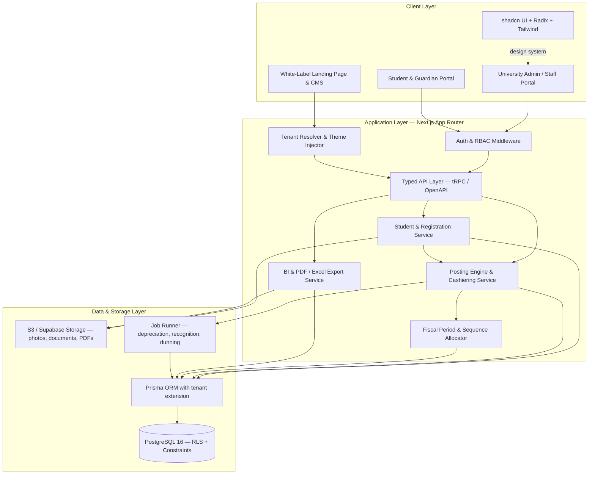
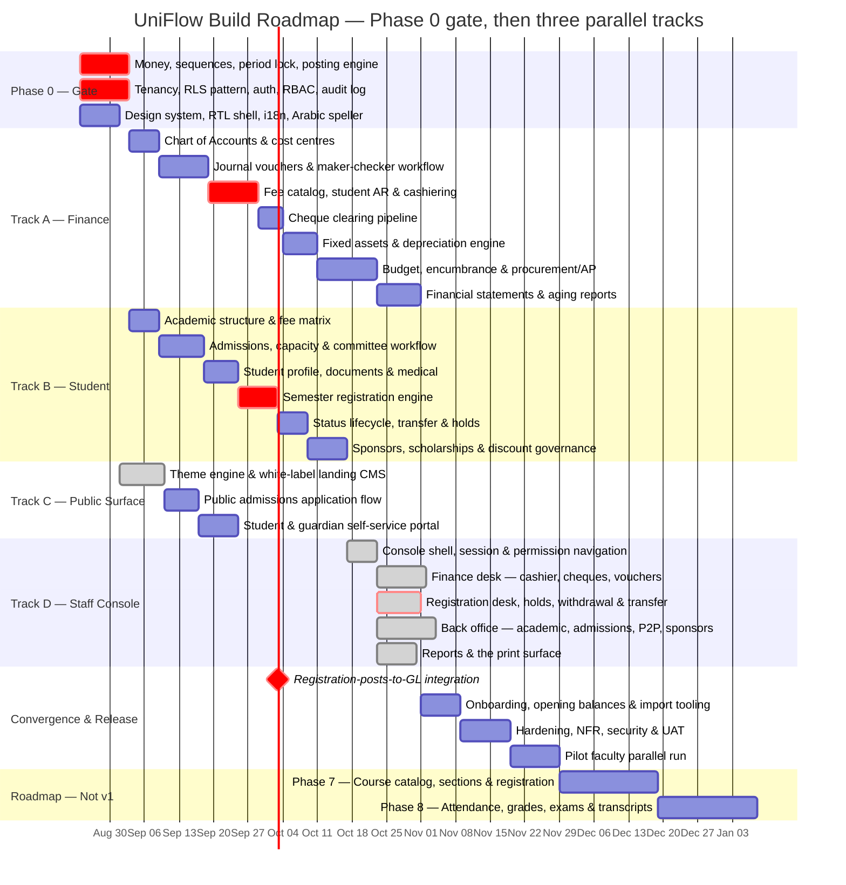

# Implementation Plan: UniFlow Multi-Tenant University ERP & White-Label Web Platform

**Version:** 2.9.0 · **Supersedes:** 1.0.0 - 2.8.0 · **Companion document:** [`srs_university_erp.md`](srs_university_erp.md) v2.9.0

Transformation of the legacy VB.NET / MS SQL desktop university system (Oasis E-University at Nile College; the Ribat University Application at Ribat and UOT) into a multi-tenant web application: student registration and lifecycle management, a double-entry university finance engine, and a white-label landing page per university client, built with **Next.js**, **shadcn UI** and **PostgreSQL**.

---

## 0. What changed from version 1.0.0

Version 1.0.0 was written from the legacy system's form and report filenames. Reading the VB.NET sources changed three things materially.

| # | Change | Reason |
| :--- | :--- | :--- |
| 1 | **New Phase 0** — ledger invariants and platform spine, before any screen is built | v1.0.0 began with the theme engine and landing CMS. Every hard correctness property of this product — voucher numbering, period locking, balanced postings, money precision, tenant isolation — lives in the ledger. None of it was a Phase 1 concern |
| 2 | **Roadmap restructured from one serial 93-day chain into three parallel tracks** with a named convergence milestone | The v1.0.0 Gantt was strictly sequential with no team allocation, implying a single infinitely fast developer, and gave no visibility into which work can proceed in parallel |
| 3 | **Legacy data migration removed** (was Phase 6.2), replaced by tenant onboarding and opening balances | Scope decision. Rationale in SRS §6 |
| 4 | Architecture diagram corrected | The v1.0.0 mermaid graph ended with `ClientLayer --> ApplicationLayer` and `ApplicationLayer --> DataLayer`, referencing node ids that were never declared — subgraph titles contain spaces and are not ids. Mermaid rendered three stray empty nodes |
| 5 | Stack pinned and an API-layer decision added | "Next.js 14+" is not a version. A student mobile app and public API are on the roadmap and Server Actions alone cannot serve them |
| 6 | RLS mechanism specified rather than asserted | Prisma does not emit `SET LOCAL app.tenant_id` on its own; v1.0.0 named RLS as the isolation strategy with no mechanism |
| 7 | Money type, idempotency, sequence allocation named as Phase 0 decisions | v1.0.0 never specified a monetary data type. The legacy system uses floating-point `Double` throughout |
| 8 | New modules scheduled: Fiscal Periods, Fee Catalog, Student Lifecycle, Sponsors, Procurement/AP, Admissions Capacity | See SRS §0 |
| 9 | Academic Records added as Phases 7-8 with a data-model-now constraint | The largest domain gap against comparable products; deferred, but the Phase 0 schema must accommodate it |
| 10 | Verification plan rewritten from five manual scenarios to property, concurrency, isolation, reconciliation, NFR and localization suites | v1.0.0's verification could not have caught any of the legacy defects the audit found |
| 11 | Risk register, environments/CI-CD, observability, security, team, and cutover sections added | Absent entirely from v1.0.0 |

---

## 0.1 Build status

**Phase 0 is complete. The gate is closed and Tracks A-C may start.** The
application lives in [`uniflow/`](uniflow/); see
[`uniflow/README.md`](uniflow/README.md) for setup and the Supabase deployment
path.

**991 tests pass across 26 suites; typecheck, lint and production build are all
clean.** Every item §4.1-§4.10 is built and verified.

**Track D is complete, D1-D5.** Every screen the console declares exists, and
`BUILT_PHASES` now holds all five phases.

**Track C is complete but for C3**: C1's theme engine and landing CMS, and
**C2's public admissions portal** — the multi-step application, the tracking
number and code, the printed application form, and the sessionless
registration-card verification page B4 and D3 both deferred here. What remains
of the roadmap is **C3** (the student and guardian portal) and the release
phases §11-§13.

**Track A is complete, A1-A7**: chart of accounts, journal vouchers and
maker-checker, fee catalog / student AR / cashiering, the cheque clearing
pipeline, fixed assets with the durable job runner, budget / encumbrance /
procure-to-pay, and the financial statements — trial balance, balance sheet,
income statement, sub-ledger reconciliation and their exports — together with
the two Module 12 requirements the statements depend on, opening balances and
the year-end close. See §0.2.

**Track B is complete, B1-B6**: academic structure and the effective-dated,
versioned fee matrix; admissions capacity, eligibility screening and the
committee workflow; the student profile, per-programme document checklists and
medical records; the semester registration engine; the status lifecycle,
programme transfer and holds; and sponsors, scholarships and discount
governance. See §6.1.

B4 closed milestone `m1`: a registration and its balanced double entry are one
database transaction. In the legacy build they were two systems reconciled by
hand, and the posting block that would have joined them is commented out in
the source with the note *"the debit/cridit will be inserted from financial
system"*.

B5 closed the seam B4 left open — a hold now blocks a registration, and
arrears are a control rather than the four reports the legacy build computed
and never consulted. B6 closed the deferral B5 recorded: a sponsored student's
refund apportions back to the sponsor, because the term's reversal releases
the sponsor's share and the retained portion re-splits under the same
contract.

**Tracks A and B are both closed**, and closing them exposed a gap in this
plan: thirteen phases deferred *"the screens"* to Track C, and Track C is the
**public** surface — landing page, applicant form, student portal. The
staff-facing screens those deferrals meant had no owner. **§8 Track D — Staff
Console** now owns them, and the deferral notes throughout §0.2 and §6.1 have
been corrected to point at it.

**C1 is complete** — the theme engine, the tenant-host resolver and the
landing CMS, and the first pages this application ever served to somebody who
is not logged in. See §7.1.

**D1 is complete** — the staff console's shell: sign-in bound to the host,
TOTP step-up, and a navigation tree generated from the signed-in user's
permissions against a route table that also guards the routes. It is the
first screen in this system a member of staff can log into, and the answer to
a question the legacy build could not answer about itself: *what may I do
here?*

**D3 is complete** — the registration desk and everything around it: student
search in either script, the student record on one page, preview → discount →
save with the figures that post, the hold banner before the work rather than
after it, the registration card and its QR, the withdrawal and transfer
wizards stating their financial consequence before confirmation, and document
and medical verification. It was scheduled ahead of D2 for the reason §8
records: D2 without D3 collects money against charges nobody can raise. See
§8.1.

That leaves, in order: **D2** (the finance desk), then **D4** and **D5**;
**C2** (the public admissions application flow) and **C3** (the student and
guardian portal); the release phases §11-§13; and the two Phase 7-8
academic-records phases deliberately scoped out of v1.

*All of that is now built except **C3** and the release phases — see §7.1 and
§8.1.*

Six things were decided or corrected during the build and are recorded here
because they change what this document said (D-F are covered below the table):

| # | Decision / correction | Effect |
| :--- | :--- | :--- |
| A | **Next.js 16.3.1 + React 19.2** rather than the "Next.js 15 + React 19" pinned in §1 | Current release at scaffold time. No change to the architecture; the App Router / Server Component model this plan assumes is unchanged |
| B | **Prisma 7** moved connection URLs out of `schema.prisma` into `prisma.config.ts`, and made driver adapters mandatory | `datasource.url` in the config drives migrations; the runtime client is handed a `PrismaPg` adapter. This maps *better* onto Supabase's two endpoints than the old `directUrl` field did |
| C | **Tenant isolation is enforced by database ROLE, not by a session flag** — see below | Supersedes the "app-level tenant guard with RLS as defence-in-depth" option offered in §4.6 |
| D | **Local Postgres must be initialised `--encoding=UTF8`** | `initdb` inherits the Windows system locale and produces a WIN1252 cluster in which *no Arabic name can be stored at all*. Pinned in `scripts/pg.ts`; the test setup asserts it |

### On (C): the RLS trap was worse than §4.6 described

§4.6 offered two tenancy patterns and said to pick one. Building it showed the
choice is not free, and that the obvious implementation is silently inert:

1. PostgreSQL RLS **does not apply to superusers at all**, and does not apply
   to a table's owner unless the table is `FORCE ROW LEVEL SECURITY`. The role
   that runs migrations is necessarily the owner. An application connecting
   with that role has no isolation, and nothing reports this — no error, no
   warning, no degraded behaviour. On Supabase the default `postgres` role
   owns everything in `public`, so this is the *default* misconfiguration.
2. The first implementation added an `app.bypass_rls` session variable so that
   platform work could bypass policies. That is not a boundary: the same
   connection the policies constrain can set the variable and switch them off.

Both were caught by the isolation suite writing queries at the database layer.
The resolution is the standard Postgres separation, and the one Supabase uses
internally: **privilege comes from the role.** An owner role runs migrations
and platform work; a separate `NOSUPERUSER, NOBYPASSRLS`, non-owning app role
serves every request and is confined by RLS. The `app.bypass_rls` GUC is gone.

`npm run db:check-roles` asserts the split and **must run in CI against every
environment, production included**. A one-line connection-string mistake is
otherwise indistinguishable from a correct deployment until a tenant reads
another tenant's ledger.

### Phase 0 acceptance evidence

| Plan requirement | Status |
| :--- | :--- |
| §4.1 Money type and rounding policy | `numeric(19,4)` / `Prisma.Decimal`; half-up; exact-sum allocation for instalments and sponsor splits |
| §4.2 Sequence allocator, `MAX+1` prohibited | Row-locked counter per tenant × fiscal year × doc type; **60 parallel postings → 60 distinct gapless numbers** |
| §4.3 Fiscal period model and posting lock | Periods with `FUTURE/OPEN/CLOSED/PERMANENTLY_CLOSED`; non-overlap enforced by GiST exclusion constraint; posting into a non-open period rejected by trigger |
| §4.4 The posting engine | Single `post()`; balance, period, postability, control-account and cost-centre rules enforced in both the engine and the database |
| §4.5 Idempotency | Claim-before-work with stored response; replay returns the original; same key + different body is an error; failed work releases the claim |
| §4.6 Multi-tenancy and RLS | Role-based; verified at the database layer, not the API layer |
| §4.7 Audit log | Hash-chained per tenant, advisory-locked sequence, append-only by trigger; verifier locates both removal and alteration |
| §4.8 Auth, RBAC, segregation of duties | Argon2id, JWT sessions with immediate revocation, TOTP second factor with replay refusal, 52-permission catalogue, 13-pair SoD matrix enforced at role-save AND at role-assignment, plus per-document self-approval refusal |
| §4.9 Design system / localisation shell | Tailwind v4 tokens with per-tenant HSL palette, RTL shell (`dir` on `<html>`, Cairo for Arabic), next-intl with parity-tested catalogues, **working Arabic تفقيط**, Hijri/Gregorian dual calendar, Arabic search normalisation |
| §4.10 Data model accommodates Academic Records | Reviewed; `subledgerType`/`subledgerId`, `sourceModule`/`sourceRef` and the term-agnostic period model leave room for Module 18 without reshaping the ledger |

### Two further corrections found while closing the gate

| # | Correction | Effect |
| :--- | :--- | :--- |
| E | **Next.js 16 renamed Middleware to Proxy** — the file is `src/proxy.ts`, and a `middleware.ts` is simply not picked up | Locale negotiation lives there. Authorisation deliberately does **not**: Next's own guidance is that Proxy is for optimistic checks, not session management or authorisation. `requirePermission()` runs in the data access layer |
| F | **Arabic noun agreement is not what the first fixtures assumed** | After آلاف the counted noun is *singular* — خمسة آلاف جنيه, not جنيهات — and any count of 11 or more reverts to the singular. Three test fixtures were wrong and the implementation was right; corrected with the rule stated in the test. Getting this wrong prints a malformed amount on every voucher |

---

## 0.2 Track A progress

### A1 — Chart of Accounts & Cost Centres · complete

| Delivered | Notes |
| :--- | :--- |
| Normalised account tree | `id`, `code`, `parent_id`, derived `level`, bilingual names. Replaces five denormalised TEXT columns whose tree was rebuilt by five nested cursors on five separate connections |
| Single-query tree assembly | One indexed read, assembled in memory. The legacy screen issued O(nodes) round trips to render once |
| Structural rules enforced | Level derived from parent, never supplied · max depth 5 · only level-5 leaves postable · control accounts must declare their sub-ledger · root accounts must state their normal balance · sign inherited down each branch with an explicit override for contra-assets |
| Immutable code/level/parent | Ledger history attaches by id; re-parenting would silently restate prior periods. Deactivate and replace instead |
| Deactivate, never delete | Refuses while active children exist. Replaces the legacy `frmDeleteAcc.vb`, which deleted rows outright |
| Standard university COA template | 60+ accounts and 7 cost centres installed at onboarding (SRS §6 step 1), idempotent by code. Includes the three sub-ledger control accounts, accumulated depreciation as a contra-asset, unearned fees for REQ-FEE-02, and FX difference accounts for REQ-FIN-03 — none of which existed in the legacy chart |
| 27 tests | Template integrity, install idempotency, level derivation, sign inheritance, authorisation, deactivation rules, audit chain — plus an end-to-end posting of a tuition bill against the installed chart |

### A defect found by A1, fixed: the audit chain reported false tampering

The chart-of-accounts suite was the first to log an audit payload with more
than one key, and it failed the chain verification immediately.

**Cause.** Postgres `jsonb` does not preserve object key order — it normalises
keys by length then bytewise. A payload written as
`{nameAr, nameEn, requiresCostCenter, code}` reads back as
`{code, nameAr, nameEn, requiresCostCenter}`. The hash was taken over
`JSON.stringify` at write time and again at verify time, so the two digests
differed for byte-identical data.

**Impact had it shipped.** The scheduled chain verifier (plan §12) would have
raised a P1 tampering alert on essentially every real change, since almost
every audited change carries a multi-key before/after payload. The alert that
exists to detect a genuine breach would have been permanently crying wolf —
which is worse than not having it, because it would have been switched off.

**Fix.** Hashes are taken over a canonical, recursively key-sorted
serialisation ([`src/lib/canonical-json.ts`](uniflow/src/lib/canonical-json.ts)),
shared with the idempotency key hasher, which needed the same property for the
same reason. Two regression tests pin it: a multi-key payload, and a nested
payload with arrays.

### A2 — Journal Vouchers & Maker-Checker · complete

The legacy approval flow, in full: approving a voucher inserted its lines into
`Transactionees` and then ran `DELETE FROM TempVouchers`
(frmApprovingVouchers.vb:941-991). No reviewer stage, no reject path, no
comment, no approver recorded — and the delete destroyed the only evidence
that a voucher had ever been reviewed. With no roles in the system, anyone who
could open the approvals screen could approve their own work.

| Delivered | Notes |
| :--- | :--- |
| Four-state workflow | `DRAFT → PENDING_REVIEW → PENDING_APPROVAL → POSTED`, `REJECTED` reachable from either checker stage, plus `CANCELLED` for a maker abandoning their own draft. The legal transitions are enforced by trigger as well as in code |
| Full `approval_events` history | Every transition retained with actor, comment and timestamp. Append-only by trigger, because a rejection comment that can be edited afterwards is not evidence |
| Mandatory rejection comment | In code *and* as a CHECK constraint. A rejection with no reason produces a resubmission with the same defect |
| Approver ≠ maker ≠ reviewer | Three independent controls: the SoD matrix on permissions held, `assertNotSelfApproval` per document, and a reviewer check that reads who actually acted on *this* document — the case the matrix cannot see when roles change between stages |
| Content freeze | Once submitted, lines, date, description and type are immutable until rejection. Enforced at the table, because the attack (submit clean, swap the lines after review, get it approved) works against whichever code path forgets |
| Drafts are never deleted | Trigger-enforced. This is the single legacy behaviour the module exists to replace |
| Approval and posting in one transaction | A draft marked POSTED whose ledger entry rolled back cannot exist, and neither can the converse |
| Separate draft number series | An abandoned draft never burns a statutory voucher number. Allocated by the same row-locked upsert discipline as voucher numbers |
| Attachments | Metadata plus SHA-256 digest, frozen by the same trigger as the lines — "a checker approves what they were shown" has to include the evidence. Bytes go to object storage when that layer lands |
| Reversal | Bidirectional linkage, mandatory reason, once-only by UNIQUE constraint, posting into the period of the reversal date rather than the original's |
| Work queue | `awaitingMe` shows a checker only the stage they hold and never their own drafts; a queue listing items you cannot action trains people to ignore it |
| 56 tests | Including the four that describe attacks: self-approval, one person taking both checks, editing after review, and two approvers pressing Approve at the same instant |

**On "MFA above the approval threshold".** The threshold is zero, deliberately.
`voucher.approve` and `voucher.reverse` always demand a verified second factor.
A threshold below which approvals need no second factor is a documented amount
an attacker can stay under; the cost of a six-digit code is a few seconds. This
is stricter than §3 A2 specified, and is recorded here rather than silently
implemented.

**One refactor worth noting.** The line rules — sides, signs, FX conversion,
balancing — now live in one place
([`src/lib/ledger/lines.ts`](uniflow/src/lib/ledger/lines.ts)) shared by the
posting engine and the voucher grid. They were about to be written twice, once
throwing and once collecting, and a grid that reports "balanced" against a
server that reports "out by 0.01" leaves the maker unable to proceed and unable
to see why. Rounding a foreign-currency line to functional currency is exactly
where that divergence would have come from; a test now posts an FX voucher and
asserts the grid total equals the ledger total to the last digit.

**A structural gap closed while building it.** The isolation suite tested the
tables that existed when it was written. Adding a table and forgetting its RLS
policy is silent — the table simply has no isolation and every query returns
every tenant's rows. There is now a sweep over `pg_class` that fails if any
table in `public` lacks row-level security and a policy, with two names
declared global on purpose (`permissions`, `_prisma_migrations`).

**Deferred to the console, and since built:** the voucher grid and the
maker-checker queue. **D2** builds both — with the running balance computed by
`summariseLines` on the server rather than by the grid, which is the specific
thing `frmMakeVoucher` got wrong. Attachments are the exception and remain
unbuilt; see §8.1.

---

### A3 — Fee Catalog, Student AR & Cashiering · complete

The critical path, and the part of the legacy system furthest from correct.
Its cashier screen had a fee grid **hardcoded to two rows**, looked accounts up
by their Arabic *names* and then wrote the English literals `"Current Assets"`,
`"Debtors"` and `"Students Fees"` into the grid, numbered receipts with
`MAX(MoveNo) + 1` read inside the transaction, recognised a full year's tuition
on registration day, and had no student control account at all — so a student's
balance and the general ledger could disagree indefinitely with nothing capable
of noticing.

| Delivered | Notes |
| :--- | :--- |
| Fee item catalog (REQ-FEE-01) | All fifteen heads, each with its own revenue account and its own deferrable / discountable / refundable flags. Installed at onboarding, idempotent by code |
| Structural account roles | Modules ask for `STUDENT_AR_CONTROL`, not for account code `11211`. A tenant may renumber its chart; the legacy system wrote account *names* into the source, so renaming an account broke posting |
| Student master (finance slice) | Number, bilingual name, national ID, status. Arabic-normalised search key, so a cashier typing احمد finds أحمد. National ID unique per tenant by partial index — duplicate applicants are the start of duplicate ledgers. Track B extends this table rather than replacing it |
| Charge raising (REQ-FEE-02) | `DR Student AR (net) · DR Discounts (discount) · CR Unearned or Revenue (gross)`. Gross billing keeps scholarship exposure on its own line — the number `viewDiscount` existed to reconstruct. Idempotency-keyed |
| Multi-channel cashiering (REQ-CSH-01) | Cash to the cashier's **own till**, bank transfer, cheque into cheques-receivable with its clearing detail, gateway. FIFO settlement by due date. **The idempotency key is a required argument, not an option** |
| Credit balances (REQ-FEE-04) | Unmatched money credits a *liability control account*, not receivables. Crediting the whole receipt to AR would leave a negative student balance sitting in an asset account. Applied to the next term's charges without burning a receipt number |
| Receipt cancellation (REQ-CSH-06) | Same day only, by a supervisor, with MFA; produces a linked reversal and keeps the number. After that day it goes through the voucher workflow and gets a second signature |
| Charge reversal | Unwinds recognised revenue and unearned income **in the proportions that apply now**, and returns money already paid to the student as credit rather than quietly keeping it |
| Revenue recognition (REQ-FEE-02) | The schedule is written when the charge is raised, so the period-end batch is a lookup and cannot arrive at a different answer on a re-run. Idempotent per period, period-locked, and it skips reversed charges |
| Instalment plans (REQ-CSH-02) | Dated schedules with exact-sum allocation. Overdue is cross-checked against the actual balance: a student who paid up front is not dunned because a date passed |
| Statement of account, aging | Running balance with a real opening figure carried into a date window. Aging from the due date, falling back to the document date |
| Fiscal year opening | Year, periods and **document counters in one transaction**, because a year without counters fails at its first posting |
| 56 tests | Including the reconciliation test below |

**The test that matters most.** After a scripted term — twelve students, mixed
discounts, cash and bank receipts, an overpayment, a same-day cancellation, a
partly-paid charge reversed, and two recognition runs — the student sub-ledger
equals its two control accounts **to the cent, with zero variance**. That check
is trivial to write against this design and was impossible against the legacy
one.

**Two ordering bugs, both mine, both caught by the database.**

1. Receipt cancellation released its allocations *after* stamping the
   cancellation. A cancelled receipt's allocations are frozen by trigger —
   which is what stops anyone re-pointing dead money at a live charge — so the
   database refused. The comment in the code had confidently asserted the
   opposite order was required. Fixed; the trigger is why this surfaced in a
   test rather than in a bursar's office.
2. `settled_amount` on a charge is denormalised so a screen listing forty
   charges does not aggregate the allocation table forty times. Denormalised
   totals are exactly what drifts, and a drifted student balance is what the
   legacy system shipped. A deferred constraint trigger now requires
   `settled_amount` to equal the sum of its allocations at commit, and a test
   proves a hand-written `UPDATE` cannot break it.

**A Prisma 7 interaction worth recording.** The statement-of-account query
originally pulled three sibling relations at once. Prisma 7's query interpreter
fans those loads out **concurrently onto the transaction's single connection**;
`pg` currently queues them and emits a deprecation warning, and will refuse
outright at pg 9. Correct today, an upgrade blocker tomorrow. The query now
resolves voucher references in one explicit pass — a fixed number of round
trips whatever the length of the history, which is the better shape anyway.
Worth watching for elsewhere: the only symptom is a `DeprecationWarning` from
`pg`, and nothing else.

**Deliberately not built yet, and why**

| Deferred | Reason |
| :--- | :--- |
| Payment-gateway provider adapters (REQ-CSH-05) | The interface is meaningless without a webhook route and a settlement-reconciliation job. `GATEWAY` receipts post to the bank account today and carry their provider reference |
| Automatic late fees (REQ-CSH-02) | The durable job runner it needed now exists (A5). The `LATE_FEE` catalog item and the overdue query are in place; only the schedule that raises it is missing |
| Refund disbursement (REQ-FEE-03) | The payment-voucher workflow it follows now exists (A6); a refund is a payment voucher against a student rather than a vendor. The withdrawal refund *policy* is a Track B lifecycle concern |

**Deferred to the console, and since built:** the cashier desk, the receipt
register and till assignment. **D2** builds all three. The one item §8 listed
against D2 that A3 has no function for is the **shift close**, which §14
defers by decision; D2 ships a day sheet instead and the finding is recorded
in §8.1.

---

### A4 — Cheque Clearing Pipeline · complete

The legacy implementation was **one boolean**. `CheqClear` sat on the
`Transactions` row and was flipped by clicking a grid cell, which ran
`UPDATE Transactions SET CheqClear=1 WHERE TransNo = <concatenated>` and
nothing else ([frmCheqClearingSystem.vb:71-95](Nile College E-University System/Oasis - E-University/Financial System/Forms/frmCheqClearingSystem.vb#L71-L95)).
Reading the source turned up a third defect the plan had not recorded:

| # | Defect | Consequence |
| :--- | :--- | :--- |
| 1 | `0` rendered as "Rejected", and `0` was also the initial value | Every cheque merely waiting in the drawer was displayed to staff as bounced |
| 2 | No ledger entry on any transition | Clearing a cheque never moved the bank balance |
| 3 | A bounce reinstated nothing | A student whose cheque the bank refused went on showing as paid |

Defect 3 is the expensive one, and it is invisible: the institution believes
it has been paid, the student believes they have paid, and the money is not
there.

| Delivered | Notes |
| :--- | :--- |
| Five-state machine | `RECEIVED → SENT_TO_BANK → CLEARED`, with `BOUNCED` reachable from either and `CANCELLED` only before presentation. Legal transitions enforced by trigger, so a settled cheque cannot be resurrected |
| A GL entry at **every** transition | deposit `DR Cheques with Bank · CR Cheques on Hand` · clear `DR Bank · CR Cheques with Bank` · bounce and cancel `DR Student AR / Credit · CR` whichever account held it |
| Two cheque accounts, not one | "What is in our safe" and "what is with the bank" are different questions. REQ-CHQ-01 asks for custody; custody the ledger cannot report is custody nobody can audit |
| Custody tracked and constrained | `VAULT / WITH_BANK / RETURNED_TO_DRAWER / SETTLED`, tied to status by CHECK so the paper's whereabouts and its state cannot disagree |
| Batch deposit and clearing | A deposit slip carries many cheques and the bank credits it as one item, so one voucher covers the batch. A mixed batch debits each bank account for its own |
| Bounce unwinds correctly | The debit splits exactly as the original receipt split its credit: matched money back onto the receivable, unmatched money off the credit-balance liability. Anything else desynchronises the sub-ledger |
| Returned-cheque fee | Raised as its own document with its own number, in the same transaction as the bounce. Needs `charge.create` — recording the bounce does not |
| Repeat-bounce reporting (REQ-CHQ-03) | Grouped on a normalised drawer key, so a drawer whose name is spelled two ways is one drawer. An institution that cannot answer this goes on accepting paper from the same payer indefinitely |
| Append-only history | Every transition with its actor, the bank's refusal code verbatim, and the voucher it posted. The legacy grid let you click Cleared and then Rejected all afternoon and kept only the last click |
| 37 tests | Including one per legacy defect, which fails if the behaviour returns |

**A new receipt state: dishonoured.** A bounced cheque leaves its receipt in a
position the system had no word for. It is not cancelled — the cashier did
nothing wrong and the receipt keeps its number — but the money never arrived,
so it must stop counting towards what the student has paid. `dishonouredAt` is
that state, a CHECK forbids a receipt being both cancelled and dishonoured,
and the three places that ask "what has this student paid" now exclude both.

**A follow-up migration, deliberately separate.** `assert_allocation_live` was
written in A3 and froze the allocations of a *cancelled* receipt. Dishonour is
the same situation reached by a different route and needs the same rule, or an
allocation could be inserted afterwards and settle a charge with money that
never arrived. Amending the already-applied A3 migration would have been
dishonest about what shipped when, so it is its own migration.

**On `prisma migrate dev` and non-interactive environments.** Adding a unique
constraint makes the CLI prompt for confirmation, and there is no terminal
here to answer it. The migration was generated with
`prisma migrate diff --from-config-datasource --to-schema` and applied with
`migrate deploy` — worth knowing for CI, where the same prompt would hang a
pipeline rather than fail it.

**Deferred:** bank statement import and auto-reconciliation, which belongs with
the cash-controls module listed under "recommended, not scheduled" in SRS §7.
The clearing side is complete without it; reconciliation automates the reading
of the advice, not the accounting for it.

**Deferred to the console, and since built:** the portfolio, the deposit and
clearance batches, the return with its bank reason and optional fee, and the
repeat-drawer report. **D2** builds all five, and the transition history it
shows is the thing the legacy boolean could not have — see §8.1.

---

### A5 — Fixed Assets, Depreciation & the Job Runner · complete

Reading the legacy source turned up a worse starting point than the plan had
recorded. **There was no asset entity at all.** An "asset" was a row in the
chart of accounts — `Acc` with `Acc1 = 'Fixed Assets'` — carrying a
`DeprPerc` column and nothing else: no purchase date, no in-service date, no
salvage value, no useful life, no serial number, no custodian, no location.
There was no accumulated-depreciation account either, so **net book value was
not derivable from anything the system held**.

The depreciation run ([frmFixedAssetsManagement.vb:272-313](Nile College E-University System/Oasis - E-University/Financial System/Forms/frmFixedAssetsManagement.vb#L272-L313)):

```vb
cmd.CommandText = "Select IsNull(Max(MoveNo),0) From Transactions"   ' no filter at all
...
cmd.Parameters.AddWithValue("@Acc1", "Fixed Assets")                 ' English literals
cmd.Parameters.AddWithValue("@Acc3", "Depreciation Expenses")        ' into an Arabic chart
```

and the charge itself was `balance × DeprPerc / 100`, evaluated in a grid
against whatever the account's **current** balance happened to be. That is
reducing-balance by accident rather than by decision, it never terminates, and
because it read the live balance it produced a different answer every time the
screen was opened. Nothing stopped a second click posting the whole batch
again.

#### The durable job runner, built first

A6 dunning and the automatic late-fee rule need it too, so it is a module
rather than a helper inside depreciation.

| Guarantee | Mechanism |
| :--- | :--- |
| At most once per key | `(tenant, job_key)` unique, claimed before the work starts. A repeat invocation replays the stored result |
| Visible | Every run leaves a row: when, by whom, how long, what it posted, and why it failed. "When was depreciation last run" is a query, not archaeology |
| Retryable after failure, never after success | A failed run can be re-attempted under the same key with `attempts` incremented; a succeeded one is final, enforced by trigger |

Not the idempotency-key table: that is a request-level mechanism whose rows are
prunable and invisible to staff. A period-end batch is an operational event
somebody has to be able to look at months later. **Revenue recognition was
migrated onto the same runner**, so the two period-end batches are now one
concept rather than two.

#### Fixed assets

| Delivered | Notes |
| :--- | :--- |
| Real asset register | Cost, salvage, useful life, purchase *and* in-service dates, serial, barcode, custodian, location, status — none of which existed |
| Six categories, each bound to an account triple | Asset · accumulated depreciation · expense. Installed at onboarding, idempotent |
| Persisted schedule (REQ-AST-02) | Generated at capitalisation, one row per period. Accumulated depreciation and NBV are **derived from posted rows**, never recomputed |
| First period prorated by days | An asset installed on the 20th of a 31-day month takes 12/31 of a month's charge |
| The last period absorbs the residue | So the schedule sums to exactly cost − salvage. Same discipline as `allocate()`, and for the same reason: a schedule a few piastres short leaves a balance nothing ever clears |
| Reducing balance, bounded | Stops at salvage *and* at the end of the useful life. The legacy curve had neither bound |
| Idempotent, period-locked batch (REQ-AST-03) | Charge by cost centre, credit by category. Reports what it skipped and why |
| Schedule extension | A forty-year building outlives any calendar on the day it is bought; opening a fiscal year extends the schedules into it without touching posted rows |
| Disposal (REQ-AST-04) | Derecognises cost *and* accumulated depreciation, books gain or loss against proceeds, cancels the unposted schedule and keeps the posted rows |
| Custody history | Append-only. "Where was this in March" is what a physical count asks |
| 43 tests | Including a six-asset, five-period reconciliation with a sale at a gain and a write-off |

**The central check:** the asset register equals the general ledger, both for
cost and for accumulated depreciation, after a run of activity. Impossible
against the legacy design for the same reason the student one was — there was
no register and no contra-asset account, so there were not two numbers to
compare.

#### One test caught doing the very thing the product forbids

The schedule test summed its rows with
`rows.reduce((a, r) => a + Number(r.amount), 0)` and failed at
`9999.999999999998`. **The code was right; the test had reintroduced
floating-point error in the act of checking for it.** Summing through
`Number` is exactly what the legacy system did with VB `Double`. Corrected to
sum as `Decimal`, with the reason stated in the test — a test that reintroduces
the defect it is checking for proves nothing.

#### The Prisma sibling-relation threshold, now pinned

A4 recorded that three sibling relations in one query make Prisma 7 fan the
loads out concurrently onto the transaction's single connection. A5 hit it
again and the boundary is now established rather than guessed: **two sibling
relations are fine, three are not.** The symptom is a `DeprecationWarning`
from `pg` and nothing else; it becomes a hard failure at pg 9. Both occurrences
were fixed by resolving the extra relations in one explicit lookup, which is a
fixed number of round trips rather than a fan-out — the better shape anyway.

**Deferred:** componentisation, revaluation and QR-based physical count, all
listed under "recommended, not scheduled" in SRS §7. The register carries a
`barcode` field so a count app has something to scan when that lands.

---

### A6 — Budget, Encumbrance & Procurement/AP · complete

Two modules that only make sense together, and the reason REQ-BDG-02 and
REQ-BDG-03 existed with no source of data behind them.

#### What the legacy budget actually was

A budget line was one row:

```vb
cmd.CommandText = "Insert Into AccBudget (PeriodFrom,PeriodTo,Acc1,Acc2,Acc3,Acc4," & _
                  "Amount,UserName) Values (@PeriodFrom,@PeriodTo,@Acc1,@Acc2,@Acc3,@Acc4," & _
                  "@Amount,@UserName)"
cmd.Parameters.AddWithValue("@PeriodFrom", Me.DTPFrom.Value.ToShortDateString & " 10:10:10")
```
([frmBudget.vb:120-165](Nile College E-University System/Oasis - E-University/Financial System/Forms/frmBudget.vb#L120-L165))

Four *text* account names, a free-form date range with no relationship to the
fiscal calendar, and a literal `" 10:10:10"` stamped onto the boundary so the
row would sort inside the report's `"00:00:01".."23:59:59"` window. No
uniqueness, so two rows for the same account silently doubled the allocation.
No version and no approval: revision meant `Set Valid=0` and inserting
another, and "what did the board approve in October" was unanswerable.
Renaming an account in the chart orphaned its budget, silently, because the
join was on the name.

And it was advisory in the strongest possible sense: **nothing anywhere
consulted it.** `frmBudget`'s report button ran `dbo.GetAccBudget` beside
`dbo.GetAccAmount` and printed the two columns. It was a report you looked at
*after* you had overspent.

#### What the legacy procurement was

Nothing. There is no vendor table, no purchase order, no goods receipt, no
invoice and no payable anywhere in either build — grepping both trees for
vendor, supplier, purchase, requisition, encumbrance, مورد, توريد and مشتريات
returns no source file. (SRS v2.0.0 named the Ribat build's `frmRequestGetBill`
as a rudimentary precursor. It is not: `RequestBill` is a request for a
**student** fee bill and sits on the receipts side. Corrected in SRS §0.0.) `frmMakePayBill` posts a grid of expense lines against
cash in a single document at payment time, with the payee's name typed into a
free-text `Source` column and the voucher number taken from
`Max(MoveNo)` ([frmMakePayBill.vb:337](Nile College E-University System/Oasis - E-University/Financial System/Forms/frmMakePayBill.vb#L337)).

The consequence is an accounting one rather than a convenience one: goods
received in March and paid for in June were reported as a June expense, and
between those two dates there was no record anywhere that the institution owed
anything. A quarterly income statement was wrong by everything delivered and
not yet paid for.

#### Budget

| Delivered | Notes |
| :--- | :--- |
| Budget **versions** with approval (REQ-BDG-01) | Version 1 is the original; a revision is version 2 and version 1 stays readable beside it. Exactly one APPROVED version per fiscal year, enforced by a partial unique index |
| Lines by account **id** × cost centre | Unique with `NULLS NOT DISTINCT`, so "no cost centre" is not a licence to enter the same allocation twice |
| Monthly phasing, always written | Variance reporting wants to know what was *planned* for March even when availability is checked against the year. Unphased lines spread through `allocate()`, so the distribution sums to the allocation exactly |
| Two control bases | `ANNUAL`, and `CUMULATIVE_TO_PERIOD` for institutions that phase — under which a department cannot spend December's money in January |
| Per-line overrun policy (REQ-BDG-02) | `BLOCK`, `WARN`, `ADVISORY`. Per line, because a hard stop on stationery and a hard stop on emergency roof repairs are not the same decision, and a system that cannot express the difference gets its control switched off wholesale |
| Variance report (REQ-BDG-03) | Allocated · Encumbered · Actual · Available · Variance · Utilisation % |
| Approved budgets are immutable | Trigger. Editing one silently restates every availability check already made against it |

An account **no approved budget covers does not block**. A budget covering only
some accounts is the normal state in year one, and refusing everything it does
not mention would make the control unusable exactly when it is being adopted.
It is reported as `budgeted: false` instead.

#### Encumbrance (REQ-PRC-03)

The design decision worth recording: **an encumbrance is not a general-ledger
posting.** An approved purchase order has acquired no asset and incurred no
liability. Committing it to the ledger would put amounts in the trial balance
that no accounting standard recognises, and every statement would then need a
rule for taking them out again. It reduces *available budget* and nothing else,
and lives in its own table with an append-only movement log. (Public-sector
systems that keep a parallel budgetary ledger are doing something defensible;
it is just not something that mixes with a single ledger carrying a
balanced-posting invariant.)

Reserved at PO approval, released as goods arrive — the value *received*, so a
partial delivery releases a partial commitment and the rest stays reserved
because the institution is still on the hook for it. Closed out as `CANCEL`,
`LAPSE` or `CARRY_FORWARD`, which are three separate actions because "we
changed our mind", "the year ended" and "it is still coming" are three
different answers to an auditor asking where 400,000 of spending authority
went.

#### Procure-to-pay

Requisition → PO → GRN → invoice → three-way match → payment voucher, with the
accrual chain split into the three steps the legacy system collapsed into one:

```
receipt   DR Expense / Asset          CR Goods Received Not Invoiced
invoice   DR Goods Received Not Inv.  CR Vendor AP
payment   DR Vendor AP                CR Cash / Bank
```

so the expense keeps the date it was incurred, the payable appears on the day
the bill does, and at every point in between the institution can state what it
owes. A new account role, `GRNI_ACCRUAL` (template code 21231), holds the
middle.

| Delivered | Notes |
| :--- | :--- |
| Vendor master (REQ-PRC-01) | Bank details are **dual-authorised**, enforced by trigger — see below |
| Requisitions | No accounting effect at all, which is why they are a separate document: the financial controls start at the order, and the requisition is the record of the decision that led to one |
| Purchase orders | Approval checks the budget **line by line**, not on the order total — lines hit different accounts and an order that fits in aggregate can still exhaust one department's allocation |
| Goods receipts | Idempotency key **required**, not optional. The stores officer is on a phone at a loading bay, and a second tap would otherwise accrue the delivery twice and release the encumbrance twice with it |
| Three-way match (REQ-PRC-04) | Quantity against the order, quantity against receipts, price against the order, within a per-line tolerance of 2% or 10, whichever is larger |
| Exception approval | A failed match **holds** the invoice rather than rejecting it, because most failures are a price change somebody authorised verbally and nobody wrote down. A held invoice does not post — the payable does not exist until a second person has taken responsibility for the difference, and their name is on it |
| Duplicate-invoice guard | `UNIQUE (tenant, vendor, vendor_invoice_no)`. Paying the same bill twice is the largest single recurring loss in accounts payable, and it is nearly always a duplicate entry rather than a fraud |
| Non-PO invoices | A utility bill has no order and no delivery note, so it recognises its expense directly rather than clearing an accrual that never existed |
| Payment vouchers (REQ-PRC-05) | Two people; approval is what posts, because a voucher approved but unposted would be a decision to pay with no payment. Allocations are **re-validated at approval** — another payment may have settled the same invoice since the draft, and an approver signing an amount that no longer matches what is owed is exactly what a second signature is for |
| AP aging and payment proposal | Aged by **due date**, not invoice date: an invoice on 60-day terms raised sixty-one days ago is one day late, not two months late. The proposal selects; a person decides |
| Year-end encumbrance settlement | Lapse or carry forward, per tenant policy, stated at the call site rather than assumed |
| 55 tests | Across two suites |

#### The bank-detail control

Redirecting a real vendor's payments to an attacker's account is the
highest-value fraud in accounts payable, and it needs no forged invoice and no
accomplice — only an edit to one row, after which every legitimate invoice
pays the attacker. So the bank columns **cannot be changed by an UPDATE at
all**: a trigger refuses unless an APPROVED `vendor_bank_changes` row exists
proposing exactly those values, and separately refuses an approval by the
requester. `vendor.manage` and `vendor.approve` are a new SoD pair, both
demand a second factor, and `vendor.manage` already conflicted with
`payment.create`.

Vendors are also created *without* bank details, so there is no moment at which
one person has decided where the money goes.

#### Four new permissions, six new SoD pairs

`payment.approve`, `vendor.approve`, `apinvoice.record`, `apinvoice.approve`.

`payment.create` **lost** its MFA requirement and `payment.approve` gained one:
drafting a payment moves nothing, and demanding a second factor for an action
with no consequence trains people to reach for their phone without reading the
screen.

The new conflicts keep the three sides of the match in different hands —
ordering, confirming delivery, and billing — because a match between documents
written by the same hand proves nothing. A ninth default role, **Stores
Officer**, holds `grn.create` and nothing else for that reason.

#### The central check

**The vendor sub-ledger equals the Vendor AP control account**, to the cent,
after a scripted run: three orders across two vendors, one delivered short and
closed, one fully delivered and paid, one delivered and left unpaid, plus a
non-PO utility bill part-paid by cheque. Zero variance. Impossible against the
legacy design for the same reason the student one was — there was neither a
vendor sub-ledger nor a payable, so there were not two numbers to compare.

A second check on the clearing account: **the GRNI balance equals what has
arrived and not been billed.** A clearing account exists so that a discrepancy
is visible rather than absorbed, and the test asserts that it is.

And a third, on the encumbrance ledger: `released_amount` equals the sum of its
own RELEASE movements. A number maintained by increments and an append-only log
of those increments should agree; when they do not, one of the two write paths
has a bug.

#### Two defects found in my own work

**A CHECK constraint that erased the evidence it existed to protect.**
`chk_po_approval_complete` required `approved_by_id IS NULL` in the CANCELLED
state — right for an order abandoned as a draft, wrong for one cancelled after
approval, which is the case that matters because that is the order holding an
encumbrance. Satisfying it would have meant erasing the record of who
committed the money. Corrected in a follow-up migration rather than by
rewriting the applied one.

**A test that read another tenant's voucher.** `asSystem` connects as the owner
role and bypasses RLS. Voucher references are unique *per tenant*, so every
university in the suite has its own `VIV-2026-000001`, and a lookup by
reference alone silently matched a different test's voucher. It surfaced as a
non-PO invoice appearing to debit the accrual account; the code was right and
the assertion was reading somebody else's ledger. Every raw lookup in that file
now carries the tenant, with a note saying why.

#### The Prisma boundary, corrected

A5 recorded the rule as "two sibling relations are fine, three are not". That
was too narrow. This track hit the same `pg` deprecation warning from a query
with only *two* top-level relations — because their nested loads brought the
total to five. Bisecting located it exactly.

The rule as it actually is: **a query may carry at most two relation loads in
total, counting nested ones.** Prisma 7's query interpreter runs them
concurrently on the transaction's single connection; `pg` answers with a
deprecation warning today and will refuse outright at pg 9. Three queries were
flattened — a fixed number of round trips instead of a fan-out, which is the
better shape regardless.

**Deferred:** budget transfers between lines (REQ-BDG-02's third bullet — the
version mechanism covers revision, and a transfer is a convenience on top of
it), and vendor prepayments and retention. Both are listed under "recommended,
not scheduled".

---

### A7 — Financial Statements & Reports · complete

The track that makes the previous six legible. Every posting A1-A6 produces
converges here, and the two central properties are asserted rather than
assumed: **the trial balance balances**, and **every control account agrees
with its sub-ledger**.

#### What the legacy reports actually did

The trial balance and the balance sheet did not read the same table.

```vb
' frmTrialBalance
"Select ... Acc1,Acc2,Acc3,Acc4," & _
"Sum(TotalValueIn)-Sum(TotalValueOut) TotalValueIn," & _
"Sum(TotalValueIn)-Sum(TotalValueOut) TotalValueOut " & _
"From Transactionees where Transdate > ... Group By Acc1,Acc2,Acc3,Acc4"
```
([frmTrialBalance.vb:161-168](Nile College E-University System/Oasis - E-University/Financial System/Forms/frmTrialBalance.vb#L161-L168))

```vb
' frmBalanceSheetLevels
"Select Acc1,Acc2,Acc3,Acc4,Sum(TotalValueIn)-Sum(TotalValueout) TotalValueout ... " & _
"From Transactions Where Transdate < ... group by Acc1,Acc2,Acc3,Acc4"
```
([frmBalanceSheetLevels.vb:214-218](Nile College E-University System/Oasis - E-University/Financial System/Forms/frmBalanceSheetLevels.vb#L214-L218))

Four findings, all visible in those eight lines:

1. **The trial balance reads `Transactionees`; the balance sheet reads
   `Transactions`.** The two divergent ledger tables named in §0.1 are not
   merely a schema wart — the institution's two headline statements were built
   from different halves of its books, so they could never be reconciled to
   each other except on paper.
2. **The trial balance's debit and credit columns are the same expression.**
   `Sum(TotalValueIn)-Sum(TotalValueOut)` is aliased to `TotalValueIn` *and* to
   `TotalValueOut`. The report prints one net figure in both columns. It
   therefore always appears to balance, whatever the ledger contains, and the
   one question a trial balance exists to answer cannot be asked of it.
3. **No opening column, because there was nothing to open from.** With no
   fiscal period model the query can only express a movement window, so
   REQ-RPT-03's opening/movement/closing was not implementable against that
   schema at all.
4. **Grouping is by four text account names**, so there is no level-5 detail,
   no code, and renaming an account silently splits its history into two rows.

There is no income statement anywhere in either build. `frmRptIncome` looks
like one and is not: it selects `StudID, StudName, Program, Class,
TuitionFees1, RegsFees` from `View_1`
([frmRptIncome.vb:61-64](Nile College E-University System/Oasis - E-University/Financial System/Forms/frmRptIncome.vb#L61-L64)) — a
student fee-collection listing, not revenue less expenses. Levels 1-4 of the
balance sheet are four separate Crystal files chosen by radio button rather
than one report with a depth parameter.

#### One source of figures

Every statement reads `reports/balances.ts`. Three presentations of one
question cannot be allowed three implementations, or they will eventually give
three answers — which is exactly the defect above, in a newer costume.

| Delivered | Notes |
| :--- | :--- |
| **Trial balance** (REQ-RPT-03) | Opening · Movement · Closing, each as a debit and a credit column, levels 1-5. Netted per account on the **raw** direction, not the account's normal balance, so an account sitting on the wrong side is visible rather than presented as though it were not |
| Totals from postable accounts only | Parents are shown because REQ-RPT-03 asks for levels 1-5, but they aggregate the rows beneath them. Totalling both would count every figure once per level |
| Hiding a row never changes a total | Totalling happens before the level filter and the zero-row filter. A summary trial balance that showed no level-5 rows and therefore totalled zero would be a display option that makes money vanish |
| `balanced` is asserted, not assumed | All three column pairs must agree. False is a data-integrity alarm: something has written to the ledger outside `post()` |
| **Balance sheet** L1-L4 (REQ-RPT-04) | Any cutoff date, including one inside a period |
| **Income statement** (REQ-RPT-05) | Revenue less expenses, net surplus/deficit, cost-centre filter, and a comparative window — `prior-year` shifts by exactly a year, because enrolment is seasonal and last month is not a fair comparison for this month |
| **Sub-ledger reconciliation** (REQ-RPT-06) | The three existing checks — student AR (A3), asset register (A5), vendor AP (A6) — plus a fourth, run inside **one** read transaction. Run separately they can disagree with each other merely because a receipt posted between two of them |
| Contra accounts subtract | Figures are signed by the account's *class*, not its own normal balance, so accumulated depreciation reduces the asset group it sits under instead of adding to it |
| **CSV · XLSX · print sheet** (REQ-RPT-07) | One `ReportDocument` model, three renderers. Writing each exporter against each statement would be nine implementations and nine places for a column to go missing from one format only |

REQ-RPT-01 (student statement of account) and REQ-RPT-02 (receivables aging
from the instalment due date) were delivered in **A3** and are not rebuilt here;
the reconciliation report calls into the same functions rather than growing its
own copy of them.

#### Any cutoff date, without scanning the ledger

REQ-RPT-04 wants a balance sheet at any date; REQ-NFR-02 forbids ad-hoc `SUM()`
over `transaction_lines` in a report path. Both hold, because periods are
classified against the report window: those wholly before it and wholly inside
it come from `account_period_balances`, and **only a period the window cuts** is
read line by line. A report run to a period boundary — which is nearly all of
them — reads no journal lines at all.

#### Opening balances carry forward by derivation, not by copy

This is a deliberate departure from REQ-PER-04's literal wording and is
recorded as SRS correction 20.

The conventional design copies each year's closing balances into the next
year's opening columns. A copied figure can drift from the postings it claims
to summarise: a correction posted into a reopened period moves the movement and
not the copy downstream, and nothing reports the divergence. Here
`opening_debit`/`opening_credit` hold only balances **injected from outside the
ledger** — the go-live opening entry — and everything else, a prior year's
result included, is summed from the periods that came before. A derived figure
cannot drift, because it is recomputed from the same rows the movement column is
built from.

Balance-sheet accounts therefore carry forward whether or not anyone ran the
close. What the close is *for* is stated plainly in `ledger/year-end.ts`: it
stops last year's revenue appearing in this year's income statement, and it
moves the surplus into equity. A balance sheet whose result line still spans an
unclosed prior year says so — `spansPriorYears` — rather than letting the figure
quietly mean something other than "this year".

#### Two Phase 0 requirements that were still unbuilt

Module 12 specified them; nothing had needed them until a trial balance did.

- **REQ-PER-03 opening balances.** One voucher, flagged `isOpeningEntry`, which
  the posting engine routes into the `opening_*` columns instead of `movement_*`
  — so a university's starting position is reported as an opening balance and
  not as January activity, which would show the whole institution as having come
  into existence in one month. Refused unless debits equal credits, every
  control-account balance carries its party, and no live opening entry already
  exists. Correctable only by reversal: there is no such thing as quietly
  adjusting where the books started.
- **REQ-PER-04 year-end close.** One posting zeroes every revenue and expense
  account into Retained Surplus. Reversible until the year is
  `PERMANENTLY_CLOSED`, and the undo is itself a posting with a reason — not a
  delete. Refused while vouchers are still awaiting approval, because closing
  would shut the period they have to post into.

#### On the XLSX writer and the absence of a PDF writer

The `.xlsx` exporter is about two hundred lines with no dependency. Entries are
ZIP-stored rather than deflated and strings are inline rather than shared,
which removes the compression step and the shared-string index entirely.
Amounts are written into `<v>` as the decimal strings they already are; there
is no `Number(...)` anywhere in the file, so nothing passes through IEEE-754 on
its way to a spreadsheet.

**PDF is produced by printing the HTML sheet, and that is a decision.** Arabic
is cursive: four contextual forms per letter, obligatory ligatures, then
bidirectional reordering against any Latin text or figures beside it. A PDF
content stream carries positioned glyphs, so a generator must do all of that
itself. The failure mode is what settles it — output that *looks* like Arabic,
prints, gets signed, and is wrong in ways an English-reading developer cannot
see. Browsers already contain a correct shaping engine. The print stylesheet
carries the page setup, the letterhead and the repeated table header, so what
leaves the print dialog is a document rather than a screenshot.

#### Verification

50 tests. Beyond the per-report assertions: closing equals opening plus movement
on every row of every trial balance; a mid-period cutoff read line by line
agrees with the same figures read from the aggregates; the level limit changes
what is displayed and not what is totalled; a cost-centre segment is marked
`segmented` and is *expected* not to balance; and a second university's reports
read zero while the first university's read its own postings.

One test is worth naming. The reconciliation report's fourth check looks for a
control-account balance carrying no party — and the condition **cannot be
produced**: `trg_line_postable` refuses it even to the owner role, which
bypasses RLS entirely. That refusal is asserted as a test in its own right. The
backstop is then exercised with the trigger suppressed for one transaction, on
the principle that a backstop nobody has ever seen fire is a backstop nobody
knows is connected.

**Deferred:** the pre-close checklist gate of REQ-PER-02 (the reconciliation
report computes every figure it needs; wiring it as a hard block on
`setPeriodStatus` waits for the period-close screen), and FX revaluation, which
has no exchange-rate data to revalue until a tenant runs a second currency.

---


## 1. Architecture Decisions Requiring Sign-Off

> [!IMPORTANT]
> These five decisions constrain everything downstream. They should be agreed before Phase 0 begins.

**1. Multi-tenancy — shared database, `tenant_id` partitioning, defence in depth.**
A single PostgreSQL database with `tenant_id` on every operational table, protected by **both** Row-Level Security and an application-layer tenant guard. Neither alone is sufficient: RLS protects against an application bug that forgets a `WHERE`, the guard protects against a pooled connection that never had its tenant context set. See §4 for the Prisma mechanism, which is a known trap.

**2. Bilingual RTL/LTR from the first commit.**
Arabic RTL and English LTR via `next-intl`, with Cairo/Tajawal for Arabic and Inter for English, plus a correct Arabic monetary speller (تفقيط) and Hijri/Gregorian dual calendar. Retrofitting RTL is far more expensive than building with it; the legacy system's own amount speller is an English one patched with `.Replace("Dollar","Pound")`.

**3. Maker-checker with full state history.**
`Draft → Pending Review → Pending Approval → Posted`, with `Rejected` reachable from either review stage, and every transition retained. The legacy implementation deleted the draft row on approval, destroying the only evidence a voucher had been reviewed. Drafts are never deleted here.

**4. Money is `numeric(19,4)` in PostgreSQL and `Prisma.Decimal` in TypeScript.**
Floating-point arithmetic on monetary values is prohibited by lint rule and by code review. The legacy system uses VB `Double` throughout and formats with `"N2"` at the point of display, which hides accumulating error rather than preventing it.

**5. A typed API layer alongside Server Actions.**
Server Actions for form-driven server-rendered flows; a typed API layer (tRPC, or REST with an OpenAPI schema) for everything that a non-browser client must reach. The student mobile app and public API on the roadmap cannot consume Server Actions. Choosing this at Phase 0 costs little; retrofitting it after the finance module ships is a rewrite of every mutation path.

---

## 2. Technical Architecture



### Stack

| Concern | Choice | Note |
| :--- | :--- | :--- |
| Framework | **Next.js 15** (App Router, Server Components, Server Actions) + **React 19** | Pinned, not "14+" |
| Language | TypeScript, `strict: true` | |
| API | tRPC (or REST + OpenAPI) alongside Server Actions | Decision 5 |
| UI | **shadcn UI** — Dialog, DropdownMenu, Tabs, Popover, Command, Accordion, Tooltip, Select, Sheet, Card, Table, Form, Calendar, DatePicker, Badge, Sonner | |
| Styling | Tailwind CSS with HSL CSS-variable tokens for per-tenant theming | |
| Forms | React Hook Form + Zod, schemas shared client/server | |
| Data tables | TanStack Table v8 | Sorting, filtering, pagination, column visibility, export |
| Charts | Recharts | Revenue vs expenses, aging, enrolment by faculty |
| Icons | Lucide React | |
| Database | PostgreSQL 16 | Constraints and RLS carry the invariants — see SRS §4.3 |
| ORM | Prisma with a tenant-scoping client extension | §4 |
| Money | `numeric(19,4)` / `Prisma.Decimal` | Decision 4 |
| Jobs | A durable job runner (depreciation, revenue recognition, dunning, FX revaluation) | Must be idempotent and period-aware |
| PDF | Printed from the HTML sheet, not generated | A7 decision — a generator that shapes Arabic wrongly produces documents that look right, print, get signed and are wrong |
| QR | `qrcode`, server-rendered to inline SVG | D3. Not hand-rolled, for the same reason as the PDF: a wrong symbol looks exactly like a right one and scans as nothing |
| i18n | `next-intl` + a custom Arabic/English monetary speller + Hijri calendar | |
| Auth | Argon2id, session cookies, TOTP MFA for financial approval | |

---

## 3. Roadmap

Phase 0 is a hard gate: nothing in Tracks A-C starts until it is complete. After that, three tracks run in parallel and converge at the **Registration-Posts-to-GL** milestone, which is the project's real integration test.



**Capacity assumption.** The durations above assume roughly **two engineers on Track A, two on Track B, one on Track C**, plus a shared lead across Phase 0 and convergence. Track D is drawn as though the Track A and B engineers move onto it once their engines are closed, which is what actually happened. State the actual figure before committing to dates — the v1.0.0 Gantt implied one developer working strictly serially, which is why its total looked achievable.

**Track dependencies.** Track C depends only on Phase 0 and can run start-to-finish in parallel. Track A `a3` (cashiering) and Track B `b4` (registration) must both complete before the convergence milestone; they are the two halves of the posting path the legacy system never joined. **Track D was added at the close of Track B** — see §8 for why it was missing — and depends on `c1` for the theme tokens it renders and on the A and B engines it is a surface over. Release phase `r2` cannot start before `d3` and `d5`: there is nothing to run a UAT against until a registrar can register and a controller can print.

---

## 4. Phase 0 — Ledger Invariants & Platform Spine

*The gate. Every item here is something the legacy system got wrong, and every one is far cheaper to build now than to retrofit.*

### 4.1 Money and arithmetic
- `numeric(19,4)` on every monetary column; `Prisma.Decimal` in application code.
- A single rounding policy (half-up to the currency's minor unit) applied at one place in the codebase.
- An ESLint rule failing arithmetic operators applied to values typed as monetary.

### 4.2 Document sequence allocator
- Per Tenant × Fiscal Year × Document Type, from a `document_sequences` row updated under `SELECT … FOR UPDATE`, or a dedicated PostgreSQL sequence per series where gapless numbering is not required.
- `UNIQUE (tenant_id, fiscal_year_id, voucher_type, voucher_no)` as a backstop.
- **`MAX(n)+1` is prohibited.** This is how the legacy system numbered every voucher; its fixed-asset module additionally omitted the `Year()` filter the other call sites applied, so its numbers collided with prior years.

### 4.3 Fiscal period model and posting lock
- `fiscal_years` and `fiscal_periods` with `Future | Open | Closed | PermanentlyClosed`.
- A trigger rejecting any `transaction_header` whose resolved period is not `Open`.
- Build this now even though period *close* ships with Track A: every posting path written after this point must resolve a period, and adding that later means touching all of them.

### 4.4 The posting engine
One function, used by every module that touches the ledger — registration, cashiering, cheques, depreciation, revenue recognition, procurement. It takes a document and a set of lines and either posts all of them or none.

```
post(tenantId, {
  voucherType, docDate, description, sourceModule, sourceRef,
  lines: [{ accountId, costCenterId, subledger, currency, fxRate, debit, credit, descr }]
}, idempotencyKey) → { headerId, voucherNo }
```

Responsibilities: resolve and lock the fiscal period · verify every account is postable and every control-account line carries sub-ledger identity · verify debits equal credits in functional currency · allocate the voucher number · insert header and lines · update `account_period_balances` · write the audit entry — all in one database transaction.

The database enforces the same invariants independently (SRS §4.3). The application check gives a good error message; the constraint guarantees correctness even when a code path is wrong.

### 4.5 Idempotency
- An `idempotency_keys` table storing key, endpoint, request hash and the original response.
- Every financial mutation requires a key. A replay returns the stored response and creates nothing; a key reused with a different request body is an error.
- **This is the highest-value single item in Phase 0.** A cashier on an unreliable connection pressing Save twice is the expected condition at these campuses, not the exceptional one.

### 4.6 Multi-tenancy and the Prisma/RLS mechanism
RLS needs `app.tenant_id` set on the *connection* for the duration of the transaction. Prisma does not do this on its own, and a pooled connection carrying a previous request's tenant is a cross-tenant data leak. Two workable patterns — pick one and apply it uniformly:

- **Transaction-scoped session variable.** Wrap every request in `prisma.$transaction`, issuing `SET LOCAL app.tenant_id = $1` as its first statement. `SET LOCAL` is scoped to the transaction, so it cannot leak across pooled connections. Costs a transaction on read paths.
- **Application guard with RLS as a backstop.** A Prisma client extension injects `tenant_id` into every `where`, `create` and `update`; RLS policies remain enabled and are verified by test rather than relied on at runtime.

Whichever is chosen, the cross-tenant isolation test (§9.3) asserts it at the database layer, not the API layer.

### 4.7 Audit log
- Append-only, hash-chained: each entry carries a hash of its predecessor, so deletion or alteration anywhere in the chain is detectable.
- Written inside the same transaction as the change it records.
- INSERT-only grants; a scheduled job verifies the chain and alerts on failure.

### 4.8 Auth, RBAC and segregation of duties
- Argon2id hashing, session cookies, TOTP MFA for financial approvals above a threshold.
- A permission model expressive enough for REQ-SOD-01, and a validator refusing to save a role that combines maker and checker rights on the same document type.

### 4.9 Design system and localization shell
- shadcn UI installed, tokenised theming wired to per-tenant HSL variables, RTL layout mirroring, `next-intl`.
- The **Arabic monetary speller** and **Hijri calendar** built and unit-tested here, with fixtures. They appear on every voucher and every official document, so they are infrastructure, not a feature.

### 4.10 Data model accommodates Academic Records
Even though Phases 7-8 are out of v1 scope, the Phase 0 schema must not preclude them: student-course enrolment, holds (already required by REQ-REG-06), and term structure need to slot in without reshaping `students`, `semester_registrations` or `academic_terms`. Review the Module 18 requirements against the schema before the Phase 0 gate closes.

---

## 5. Track A — Finance

**A1 · Chart of Accounts & Cost Centres** — Interactive tree table over the normalised 5-level COA with codes, `parent_id`, bilingual titles, normal balance, postable and control-account flags. Account maintenance with the constraint that an account carrying postings may be deactivated but never deleted or re-parented. Cost centre master.

**A2 · Journal Vouchers & Maker-Checker** — Multi-line voucher grid with live debit/credit balancing, attachments and draft saving. The four-state workflow with rejection comments, full `approval_events` history, approver-≠-maker enforcement, and MFA above the approval threshold. Voucher reversal with bidirectional linkage, mandatory reason, and the once-only constraint.

**A3 · Fee Catalog, Student AR & Cashiering** *(critical path)* — Fee item master with per-item GL mapping and deferrable/discountable/refundable/taxable flags. The cashier terminal: student lookup with live balance and instalment schedule, multi-channel capture (cash, bank, cheque, gateway), allocation across fee items, credit balances for overpayment, receipt numbering, bilingual thermal and A4 receipt PDFs with amount in words. Instalment plans with due dates and reminders. Receipt cancellation by linked reversal. Provider-agnostic gateway interface — no processor is hardcoded.

**A4 · Cheque Clearing Pipeline** — A real state machine (Received → Sent to Bank → Cleared / Bounced / Cancelled), each transition posting through the Phase 0 engine. Bounce reinstates student debt, optionally raises a penalty fee item, and records the bank's refusal code. Repeat-bounce reporting by drawer.

**A5 · Fixed Assets & Depreciation** — Registry with the GL account triple per category. A persisted depreciation schedule generated at capitalisation, with first- and final-period proration. The period-end batch is keyed on (tenant, period), rejects closed periods, and is a reporting no-op on repeat invocation. Disposal and write-off with gain/loss on NBV.

**A6 · Budget, Encumbrance & Procurement/AP** *(built — see §0.2)* — Budget versions with approval; available = allocated − encumbered − actual, checked at order approval rather than reported afterwards. Vendor master whose bank details a single person cannot change. Requisition → PO → GRN → invoice → three-way match → payment voucher. PO approval creates the encumbrance; receipt releases it and raises the accrual; the invoice moves the accrual to a payable; payment clears it. AP aging by due date and payment proposal runs. Year-end encumbrance lapse or carry-forward.

**A7 · Financial Statements & Reports** *(built — see §0.2)* — Trial Balance (opening / movement / closing, sourced from `account_period_balances`), Balance Sheet L1-L4, Income Statement with comparatives and cost-centre filtering, Student Statement of Account, Receivables Aging from **instalment due date**, and the Sub-Ledger Reconciliation report that makes control-account divergence visible. Excel, CSV and bilingual PDF export.

---

## 6. Track B — Student

**B1 · Academic Structure & Fee Matrix** *(built — see §6.1)* — Faculties, programmes, degrees, batches, academic years and terms. The **effective-dated, versioned** fee matrix: editing creates a new version, prior versions are retained and stay attached to the registrations raised under them. *(The legacy screen ran `DELETE FROM TuitionFees WHERE Batch=…` before re-inserting, destroying every prior schedule.)*

**B2 · Admissions, Capacity & Committee Workflow** *(built — see §6.1)* — Seat quotas per programme × batch × channel with live counters and override logging. Automatic eligibility screening by certificate type and score. Committee scoring, ranking and decisions. Offers with acceptance deadlines, optional online seat deposits, automatic lapse and waitlist promotion. Duplicate-applicant detection on national ID, passport and normalised Arabic name plus date of birth. Bulk intake import with dry-run preview.

**B3 · Student Profile, Documents & Medical** *(built — see §6.1)* — Multi-step wizard capturing discrete 4-part Arabic and English names, dual-calendar dates, guardian details, secondary school record, photo capture and document uploads. Per-programme document checklists with verification state and expiry. Medical record: the five legacy fields plus vaccination status, chronic conditions, officer notes and a fitness verdict. Directory search with **Arabic normalisation** — alef, taa marbuta, yaa and tatweel folded — over a trigram index.

**B4 · Semester Registration Engine** *(built — see §6.1; convergence milestone `m1`)* — Student lookup auto-filling programme and the effective fee schedule version. Per-item discount application with approval above threshold. **Atomic**: the registration row and its balanced GL posting are created in one database transaction through the Phase 0 posting engine, carrying an idempotency key and rejected if the period is closed. Registration card with QR verification.

**B5 · Status Lifecycle, Transfer & Holds** *(built — see §6.1)* — The full status state machine with effective-dated history, each transition declaring its financial consequence. Programme transfer reversing the prior programme's billing by linked reversal and posting the new. Holds (financial, academic, disciplinary, documentary) that block registration, with placement and clearance authority.

**B6 · Sponsors, Scholarships & Discount Governance** *(built — see §6.1)* — Sponsor master with contract terms. Split funding apportioning charges across self-pay and sponsors at billing time, so a student's statement shows only what the student owes. Sponsor invoicing, settlement and aging; sponsor-default transfer back to the student. Scholarship schemes with budget caps and award approval. Discount exposure reporting by faculty, programme, batch, scheme and year.

---

## 6.1 Track B progress

### B1 — Academic Structure & Fee Matrix · complete

The first half of Track B, and the half Track A has been waiting on: a fee
schedule is what a registration bills against, so B4 cannot exist until this
does.

#### The save that destroyed other faculties' fees

This is the single worst defect the legacy audit has found, and it is four
lines apart in one file.

The fee grid was **loaded** filtered on three columns:

```vb
"select Distinct Program,TuitionFees,RegFees From TuitionFees " & _
"where Batch= N'" & combBatch.SelectedItem & "' and Colleges=N'" & _
CombColleg.SelectedItem & "' and Type=N'" & CombType.SelectedItem & "'"
```
([frmTuitionFees.vb:48](Nile College E-University System/Oasis - E-University/Registration System/Forms/frmTuitionFees.vb#L48))

and **saved** by deleting on one:

```vb
cmd.CommandText = "Delete From TuitionFees Where Batch=N'" & combBatch.SelectedItem & "'"
cmd.ExecuteNonQuery()
cmd.CommandText = "insert into TuitionFees (Batch,Colleges,Program,TuitionFees,RegFees,Type,Employee) ..."
For Each row As DataGridViewRow In GridFees.Rows ...
```
([frmTuitionFees.vb:89-104](Nile College E-University System/Oasis - E-University/Registration System/Forms/frmTuitionFees.vb#L89-L104))

The `DELETE` names the batch. The `SELECT` names the batch, the college **and**
the admission type. So pressing Save on the Medicine / General fee grid deleted
the fee schedules of **every faculty and every admission type in that batch**,
then re-inserted only the dozen rows on screen. Pharmacy's fees, Dentistry's
fees, the Private and Foreign columns — gone, silently, with a
`MsgBox("تم الحفظ")` reporting success.

Four aggravating details:

- **No transaction.** `cmd.ExecuteNonQuery()` on an autocommit connection: a
  failure between the `DELETE` and the last `INSERT` left the batch priced at
  nothing, with the deletion already committed.
- **Exactly two fee columns.** `TuitionFees` and `RegFees`, both read through
  `CDbl(...)`. Every other fee an institution charges had nowhere to go.
- **No version history.** SRS v2.0.0 said this destroyed "every prior fee
  schedule". It destroys every *sibling* schedule as well, which is worse and
  is recorded as SRS correction 24.
- **The only audit was an `Employee` column** overwritten on every save.

The rest of the academic structure was the same disease the chart of accounts
had before A1: identity was a name. `Programs.ProgramName` inserted by string
concatenation and read back with `SELECT DISTINCT`
([frmListPrograms.vb:20,83](Nile College E-University System/Oasis - E-University/Registration System/Forms/frmListPrograms.vb#L20-L83));
a batch list living in a table called `AcademicYear`, with the academic year
itself existing nowhere
([frmListBatches.vb:9,47](Nile College E-University System/Oasis - E-University/Registration System/Forms/frmListBatches.vb#L9-L47));
and `Colleges` never a table at all, just a string copied onto every row that
mentioned it.

#### Delivered

| Delivered | Notes |
| :--- | :--- |
| Faculty → department → programme, keyed by **id** | Renaming a faculty disturbs nothing. Asserted by test: the rename happens mid-test and every reference survives it |
| Degree level, duration in **years and terms** | Not derived from one another — a summer intake, an intensive diploma and a five-year medical degree all break the two-terms-a-year assumption, and a fee matrix prices per term |
| Academic years and terms, non-overlapping | GiST exclusion constraint, the same mechanism as fiscal periods. **An academic year is deliberately not a fiscal year**: they straddle each other, and conflating them puts a September intake's revenue in the wrong set of accounts |
| Batches, admission categories, nationalities | Categories and nationalities are tables, not enums — institutions invent categories, and an enum change is a migration. The four shipped categories are what the legacy `Type` column actually contained |
| **Versioned, effective-dated fee schedules** (REQ-AC-04) | Keyed on programme × batch × admission category × nationality category, in one currency, over a date range |
| An approved schedule is **immutable** | Trigger. Editing, deleting or un-approving one is refused to every path including the owner role. Asserted four ways in the suite |
| **One answer per cohort per day** | Exclusion constraint over the effective range. Two published versions cannot both claim a date, so "what did this student owe when they registered" has exactly one answer, permanently |
| Supersession is adjacent, never overlapping and never gapped | Approving v2 closes v1 the day *before* v2 opens. A day priced by nothing is a day a registration cannot be billed |
| Two signatures | `feematrix.approve` added, with an SoD pair against `feematrix.manage` and a self-approval refusal on top — the matrix stops one role holding both, the runtime check stops one person holding two roles |
| Structure is deactivated, never deleted | Refused by trigger once anything refers to the row. `frmListBatches` deleted a batch with no check for students admitted under it |
| `resolveFeeSchedule` / `feeScheduleForStudent` | The handover to B4. The fee matrix owns what a student's fees are; registration will own what to do with the answer |

#### Resolution order, and why the fallback is nullable

`nationality_category` is nullable, and null is the row that applies to any
nationality. Resolution tries the student's own category first and falls back to
it. An institution prices most programmes once and only some of them
differently for expatriates; making the category a fourth non-null enum value
would force three identical schedules per programme to say so, and one of the
three would eventually be forgotten.

#### Two bugs found by the suite

Both were mine, both were caught by tests written to assert the property rather
than the implementation.

1. **The trigger's message was being thrown away.** `assert_no_dependants`
   raised `ERRCODE = 'foreign_key_violation'`, which the Prisma driver
   recognises and replaces with its own generic "Foreign key constraint
   violated" — discarding the sentence telling the user to deactivate the row
   instead. Changed to `check_violation`, which passes through intact.

2. **Superseding a version made it unresolvable for its own dates.** The
   overlap constraint and the resolver both filtered on `status = 'APPROVED'`,
   so the moment v2 was approved, v1 stopped answering for the months it had
   actually been in force — which is the exact property the whole track exists
   to provide. Both now cover `status <> 'DRAFT'`: a published version prices
   its range forever, and only a draft prices nothing.

#### Verification

31 tests. The load-bearing one is `prices one cohort without touching another`:
two faculties priced under one batch, one of them revised, and the other still
resolving to its original figures and version afterwards — the legacy save's
failure, written down as an assertion.

Alongside it, `supersedes without destroying` checks that a student registering
in March still resolves to the March schedule after a July revision, and that
every day either side of the boundary resolves to exactly one version.

**Deferred to B3, and settled there:** making the four academic dimensions
mandatory on a student. They stay nullable because A3 created students before
Track B existed and a cashier must still be able to take money from them, and
because a NOT NULL would refuse the backfill that is the only thing able to
make them mandatory eventually. `feeScheduleForStudent` refuses to price a
student missing any of them, with a message naming which; B3 adds a trigger
refusing to let one be **cleared** once set, and lists all four in the profile
completeness check.

---


### B2 — Admissions, Capacity & Committee Workflow · complete

#### The same defect, in a second screen

`frmStudentsVacants`, present only in the Ribat/UOT build, saved a seat quota
like this:

```vb
Dim cmdDel As New SqlCommand("Delete From StudentsVacants Where College=N'" & _
                             Me.CombColleges.SelectedItem & "'", cnn)
Dim cmd As New SqlCommand("Insert Into StudentsVacants (College,Batch,Amount) " & _
                          "Values (N'" & Me.CombColleges.SelectedItem & "',N'" & _
                          Me.CombBatch.SelectedItem & "'," & Me.txtAmount.Text.Trim & ")", cnn)
cmdDel.ExecuteNonQuery()
cmd.ExecuteNonQuery()
```
([frmStudentsVacants.vb:94-101](Nile College System - Ribat Univ/Rebat University Application/Form/frmStudentsVacants.vb#L94-L101))

The `DELETE` names the college. The `INSERT` names the college **and** the
batch. Setting the 2026 quota for Medicine therefore deleted Medicine's quota
for every other batch — the identical shape to the fee-matrix save found in B1,
which makes it a habit in that codebase rather than an accident. Two
`ExecuteNonQuery` calls on an autocommit connection, so a failure between them
left the college with no quota at all.

#### The deeper finding: capacity was a report, not a control

Nothing consulted the quota when a place was given. The screen's report rebuilt
two SQL views **at runtime**:

```vb
Dim cmd1 As New SqlCommand("ALTER VIEW [dbo].[viewCollegRegTotal]" & _
    " AS SELECT College, COUNT(DISTINCT StudID) AS Total FROM Transactions" & _
    " WHERE Transtype = N'سند قبض' AND (AcdYear = N'" & Me.CombAcdYear.SelectedItem & "')" & …
```
([frmStudentsVacants.vb:141-160](Nile College System - Ribat Univ/Rebat University Application/Form/frmStudentsVacants.vb#L141-L160))

Three things follow from those lines, all verifiable:

1. **Seats taken meant money received.** The count is over receipt vouchers
   (`Transtype = N'سند قبض'`) with a non-zero fee sum. An institution could
   over-admit freely and discover it when the cash arrived — there was no
   moment at which a place was allocated for capacity to be checked against.
2. **The application required DDL rights on the live database.** `ALTER VIEW`
   at runtime, from the client.
3. **The report was not reentrant.** Two people running it at once overwrote
   each other's view definition, so the second user's academic year decided
   what the first user saw. No error, just the wrong year's figures.

The quota itself was keyed on **college** alone — no programme, no admission
channel — in a column named `Amount`, and the academic-year dropdown was
populated by `select Distinct AcdYear From Transactions Where Descr=N'تسجيل
للعام الدراسي'`: an Arabic description string matched against ledger rows.

There was no application entity at all. A person became known to the system
when a cashier took money from them, which is why payment *was* admission, and
why there was nowhere to record that somebody applied and was refused.

#### Delivered

| Delivered | Notes |
| :--- | :--- |
| Quotas per **programme × batch × admission category** (REQ-ADM-CAP-01) | Three dimensions where the legacy table had one and a half. Setting one leaves the others alone, which is the assertion that names the legacy bug |
| Counters **counted, never stored** | `offered`, `confirmed`, `held`, `released` are derived from the offers each time. A stored counter is a second record of the same fact, and this project's legacy audit is a catalogue of what happens to those |
| Capacity checked **under a row lock**, at the moment a place is offered | `SELECT … FOR UPDATE` on the quota. Without it two officers issuing the last seat both read "one available" and both succeed — the lost-update race Phase 0 removed from voucher numbering, with a person's place instead of a document number |
| An **unanswered offer holds its seat** | `available` subtracts issued offers, not only accepted ones. Treating an unanswered offer as free is how a programme discovers it is over-subscribed on deadline day |
| Overrides carry a reason **and** a second person | `admission.override` is a separate permission, MFA-gated, with SoD pairs against both `admission.capacity` and `application.offer`. A CHECK constraint refuses an override row with no reason or no approver — recording that capacity was exceeded without recording who allowed it is indistinguishable from never having checked |
| Eligibility rules per programme × certificate type (REQ-ADM-CAP-02) | Minimum percentage, required subjects, age range, nationality restriction |
| Scores **normalised against the certificate's own scale** | A rule is a percentage; certificates are reported out of 100, 45 or 4. Comparing a raw 38 against a minimum of 80 refuses an IB candidate at 84.4% |
| Screening **reports, never blocks** | A failing applicant can still be offered a place with a recorded rationale. A system that discarded them would hide exactly the case a committee exists for — the applicant one mark short |
| Committee scoring, ranked lists, four decisions with mandatory rationale (REQ-ADM-CAP-03) | The rationale is enforced by CHECK, not only in code. A REJECT with no reason is the one an applicant comes back to ask about |
| Offers, deadlines, lapse, waitlist promotion (REQ-ADM-CAP-04) | A lapse is a **batch** that marks and timestamps, not a condition evaluated at read time — otherwise a seat is free in one report and taken in another depending on who asked |
| Duplicate detection across applications **and students** (REQ-ADM-CAP-05) | National ID and passport at HIGH confidence; Arabic-normalised name plus date of birth at MEDIUM. Surfaced to the reviewer, never auto-refused |
| Bulk intake import with dry-run preview (REQ-ADM-CAP-06) | Validates by **code**, not id, so a ministry roster needs no uuid lookups. One transaction for the whole file |

#### Two controls that emerged from the build

**An offer follows a committee decision.** The database constraint said an
application in state OFFERED must carry a decision; `issueOffer` did not require
one, and eighteen tests failed on the contradiction. The constraint was right,
so the code changed: allocating a seat now demands a recorded verdict of ACCEPT
or CONDITIONAL_ACCEPT with its rationale. It is the admissions equivalent of
maker-checker, and REQ-ADM-CAP-03 → -04 reads that way. Waitlist promotion goes
through the same door — it re-decides the applicant first, so the record says
why a place appeared in August.

**Deciding is not admitting.** A committee ACCEPT leaves the application
UNDER_REVIEW until a seat is actually allocated to it. Collapsing the two is
precisely how the legacy build over-admitted: nothing separated "we want this
person" from "we have somewhere to put them".

#### The import validates the thing most likely to be wrong

A roster's commonest error is a score entered against the wrong certificate's
scale — 620 in a column the file says is IB, which runs to 45. The preview
refuses it by name rather than putting the applicant through screening at a
meaningless percentage. Dates are parsed strictly for the same reason:
`new Date('2007-02-31')` silently becomes 3 March, which turns a typo in a date
of birth into a plausible wrong answer instead of an error somebody can fix.

#### Verification

57 tests. The two that matter most:

- `refuses an offer beyond the quota` and `counts an unanswered offer as a seat
  taken` — together, the property the legacy build never had.
- `updating one quota leaves the others untouched` — the legacy bug written down
  as an assertion, the same shape as B1's `prices one cohort without touching
  another`.

Four constraints are exercised by writing directly as the **owner role**, which
bypasses RLS entirely: reopening a closed offer, moving a quota to another
programme, an override with no approver, and a paid deposit with no receipt
behind it. All four are refused by the database, not by application code.

**Deferred:** bilingual offer-letter PDFs (the print path exists from A7; the
letter template is a **Track D** document — D5), and online seat-deposit
payment, which needs the public portal C2. The deposit itself is wired — an offer names the
cashier's receipt that paid it, and a CHECK refuses a paid deposit without one.

---

### B3 — Student Profile, Documents & Medical · complete

#### One student, four tables, two keyboards

The legacy build stored one student across four tables with no key joining any
of them:

| Table | Written by | Holds |
| :--- | :--- | :--- |
| `StdForm` | `FrmStudForm2.vb` | The admission form — four Arabic names, four English names, birth date, guardian, national number |
| `StdData` | `FrmDataEntery.vb` | The same four Arabic names, typed again, plus `StdSchool`, which exists nowhere else |
| `StudentsProfilees` | `frmStudentProfiles.vb` | Accepted students, name **concatenated** into one column |
| `StudentsProfilesIndecent` | `frmStudentProfiles.vb` | Rejected students, plus `ReasonofIndecent` |

The two data-entry screens are independent. `FrmStudForm2` writes the names to
`StdForm`; `FrmDataEntery` writes the same names to `StdData`
([FrmDataEntery.vb:55-70](Nile College E-University System/Oasis - E-University/Registration System/Forms/FrmDataEntery.vb#L55-L70)).
Nothing reconciles them, and the student search dialog reads only the second —
so a name corrected on the admission form stayed wrong everywhere it was
looked up.

`FrmForm.vb`, the older and richer version of the admission screen, is 649
lines in which **the entire save is commented out** ([lines 336-400](Nile College E-University System/Oasis - E-University/Registration System/Forms/FrmForm.vb#L336-L400)).
It collects religion, place of birth, marital status and guardian details and
writes none of them.

#### The registration date was manufactured

```vb
cmd.CommandText = "Select IsNull(Max(RegDate),0) from StdForm Where Coleg=N'" & _
                   Me.CombColeg.Text & "'  "
dat1 = CDate(cmd.ExecuteScalar)

If (dat.Hour = 10 And dat.Minute = 30) Or dat.Hour = 12 Then
    dat.AddMinutes(30)
Else
    dat = dat1.AddMinutes(10)
End If
```
([FrmStudForm2.vb:368-377](Nile College E-University System/Oasis - E-University/Registration System/Forms/FrmStudForm2.vb#L368-L377))

The date recorded against a student's admission is **the previous student's
date plus ten minutes**, per faculty. Not when anything happened — a
manufactured appointment queue.

Three further defects sit inside those ten lines, all verifiable:

1. `dat.AddMinutes(30)` **discards its result.** `Date` is a value type in VB
   and `AddMinutes` returns a new one. That branch leaves `dat` at whatever the
   module-level `Public dat As Date` last held, which on a fresh form is
   `0001-01-01`.
2. The condition reads `dat.Hour` **before** `dat` is assigned in this pass, so
   it tests the previous record's value.
3. `IsNull(Max(RegDate),0)` returns `1900-01-01` when the faculty has no rows
   yet — and the branch is reached whenever `FileNo <> 1`, where `FileNo` is a
   global `MAX+1` across all faculties. **The first student of every new
   faculty after the first is dated 1900.**

`FileNo` itself is `Select IsNull(Max(FileNo),0)` + 1 — the same lost-update
race Phase 0 removed from voucher numbering. And `TypeofAdmission` is set by
four `If` statements with no `Else`, so an admission type outside the four
hard-coded Arabic strings adds no parameter at all and the save dies with
`must declare the scalar variable "@TypeofAdmission"`.

#### The medical form validated data it then threw away

`FrmMedical.vb` refuses to save until all four Arabic name fields are filled
in — "الرجاء ادخال الاسم الاول الطالب" and three more like it
([lines 73-83](Nile College E-University System/Oasis - E-University/Registration System/Forms/FrmMedical.vb#L73-L83)).
The insert that follows names six columns and **none of them is a name**:

```vb
cmd.CommandText = "Insert Into MedicalExamination (UniversityID,DateofMedicalExamination," & _
                  "Hepatitis,Aids,BooldType,Employee) Values (…)"
```
([FrmMedical.vb:114](Nile College E-University System/Oasis - E-University/Registration System/Forms/FrmMedical.vb#L114))

Alongside it:

- **`@Aids` was never validated** — the check is commented out, together with
  the rule that made HIV screening conditional on the nursing programme. An
  unset combo box passes `""`, so *never screened* and *screened negative* were
  stored identically and printed identically.
- **No verdict and no examiner.** `Employee` is the data-entry clerk. Whether
  the student was fit to enrol was decided verbally and written down nowhere.
- **`FillStdData()` fires on `TextChanged`**, so typing an eight-character
  student number opens eight connections and runs eight `SELECT *` queries,
  seven of which match nothing and blank the name boxes as they go.
- The profile screen's `FillMedicalExamination()` selects a column
  `MedicalExamination` from the table `MedicalExamination` — a column no insert
  in the codebase writes — and assigns the result to `CombType`, the **degree
  type** combo, which is then saved to `StudentsProfilees.Type`. It was
  commented out at its call site rather than fixed
  ([frmStudentProfiles.vb:664](Nile College E-University System/Oasis - E-University/Registration System/Forms/frmStudentProfiles.vb#L664)).

#### Three more findings in the profile screen

**The deployed binary showed one faculty.** The profile list is filtered on a
hard-coded college name, with three earlier faculties commented out above it:

```vb
Dim cmd As New SqlCommand("select … from StdForm where StdFiNaA Like N'%" & _
  Me.txtStudNameSearch.Text.Trim & "%' and CH=0 and " & _
  "Coleg='علوم الحاسوب وتقانة المعلومات'   Order By RegDate ASC", cnn)
```
([frmStudentProfiles.vb:35-38](Nile College E-University System/Oasis - E-University/Registration System/Forms/frmStudentProfiles.vb#L35-L38))

Changing faculty meant editing source and recompiling.

**The parent's occupation was stored in the telephone column.** `txtStdParJop`
is loaded from `StdForm.JobofParent` (line 373) and saved into
`StudentsProfilees.PhoneNo` (line 246), which the grid then displays under a
telephone heading (line 88). The control is `Enabled = False`, so nobody could
correct it.

**Clicking "edit" on one row wrote back every row on screen.** The
`CellContentClick` handler loops `For Each row As DataGridViewRow In
Me.GridStudProfiles.Rows` and updates all of them, with `Where UnivID=" &
row.Cells(0).Value` built by concatenation ([lines 593-603](Nile College E-University System/Oasis - E-University/Registration System/Forms/frmStudentProfiles.vb#L593-L603)).

And the save is the **third** DELETE-then-insert in this codebase — after
`frmTuitionFees` (B1) and `frmStudentsVacants` (B2):

```vb
cmd.CommandText = "Delete From StudentsProfilees Where StudentIndex=N'" & _
                  (Me.TxtYear.Text) + (Me.txtStdIndex.Text.Trim) & "'"
cmd.ExecuteNonQuery()
cmd.CommandText = "Insert Into StudentsProfilees (…)"
```
([frmStudentProfiles.vb:233-236](Nile College E-University System/Oasis - E-University/Registration System/Forms/frmStudentProfiles.vb#L233-L236))

`' Trans.Commit()` is commented out on the line below, so the two statements
run on an autocommit connection: a failure between them leaves the student
with no profile at all. On the rejection branch the `DELETE` keys on
`txtStdIndex` alone while the `INSERT` keys on year + index, so the delete
never matches and rejecting a student twice inserts twice.

#### Delivered

| Delivered | Notes |
| :--- | :--- |
| Discrete four-part Arabic and English names (REQ-ST-01) | All four or none per language, by CHECK. Where the parts exist, the displayed name must equal them joined — enforced by trigger, so the two can never disagree. One `composeName` function, where the legacy build had the same expression written inline in four screens |
| One student, one profile | Demographics, dual-calendar birth date, contact, guardian and the secondary-school record, in named columns. A guardian's occupation cannot land in a telephone field because both are named and typed |
| The profile is **seeded from the application** at enrolment | Birth date, passport, contact and certificate carry across from B2. The whole point of admissions and the registry sharing a database, and the direct answer to typing the same four names into two screens |
| Hijri conversion happens **once, deliberately** | `birthDateFromHijri` converts at the point of transcription and `birthCalendar` records what the document said, so somebody comparing the profile against a Hijri passport knows why the rendered date may sit a day either side |
| Directory search over a **GIN trigram index** (REQ-ST-03) | Every name part in both languages, plus the university number and national ID, normalised. Every term must match, so a second word narrows. Filters by programme, faculty, batch, category, nationality and status, with an honest total |
| Profile completeness **names what is missing** | Including the four dimensions the fee matrix is keyed on, so registration fails at the first step rather than the last |
| The four fee-matrix dimensions may be filled in but **never cleared** | Deferred from B1, settled here by trigger. They stay nullable because A3 created students before Track B existed; what must not happen is a student who has a programme losing it, because `resolveFeeSchedule` then silently stops finding the schedule that has been billing them all year |
| Per-programme document checklists (REQ-ST-05) | Requirements are **additive**: declaring one leaves the others alone, and removing one is a separate call. The shape of code where the legacy defect lives, written the other way round |
| Documents **supersede, never replace** | One live document per type per student, by partial unique index. A replaced passport scan is the evidence of what was checked last year |
| **The verifier is never the uploader**, by CHECK | A certificate uploaded and marked verified by one person has been checked by nobody. Enforced per document rather than as an SoD pair, so a registry office of two can still function |
| A renewable document must carry an expiry | By trigger, cross-table. A residence permit with no expiry never reaches the expiry report, which is how a university finds out in June that its foreign students are out of status |
| Medical records: the legacy six fields, typed, plus vaccinations, chronic conditions, allergies, officer notes, a verdict and a validity date (REQ-ST-02) | `ScreeningResult` makes *not tested* a value. The clinician is named separately from the clerk who keyed the record |
| Medical records are **append-only** | One current record per student; a re-examination supersedes rather than edits, and neither editing nor deleting is possible even for the database owner. The same rule the ledger applies to a posted voucher, for the same reason |
| A `Medical Officer` role | The legacy medical screen was reachable by every authenticated user, because the system had no roles at all — a cashier could read a student's HIV result |

#### Two decisions worth recording

**A lapsed clearance is not an unfit verdict.** `fitnessStatus` returns
`LAPSED` as a state of its own. Telling a student they are unfit when their
certificate has merely run out is a different, and worse, conversation, and
collapsing the two is the kind of thing that gets discovered in a complaint.

**An expired document outranks a verified one on the checklist.** A passport
verified in 2024 and expired in 2025 is not a satisfied requirement, however
green it once was. `documentChecklist` takes an `asOf` date and the test
asserts the same document reads VERIFIED in 2026 and EXPIRED in 2027.

#### One defect found by the tests

`rejectDocument` returned `Promise<void>` but threw its "a rejection needs a
reason" guard **synchronously**, before returning a promise — so a caller
writing `.catch()` rather than `await` would have missed it entirely and
carried on as though the document had been rejected. Both `verifyDocument` and
`rejectDocument` are now genuinely `async`.

#### One design assumption corrected mid-build

`findLikelyDuplicates` was written to match on the national ID. It cannot:
`uq_student_national_id` is a partial unique index, so two students in one
tenant cannot share one and looking is wasted work. It now matches on the
**passport number**, which carries no uniqueness constraint and is how a
foreign student ends up on file twice, and on the normalised name — which is
the duplicate the legacy system actually produced, because it created a
student record whenever a cashier took money from somebody the search dialog
failed to find, and that dialog matched a prefix of the first name.

#### Verification

75 tests. The ones that carry the most weight:

- `finds a student by their family name` and `finds a student by a middle
  name` — the legacy `like N'<typed>%'` on `StdFirName` written down as its
  negation.
- `distinguishes not tested from negative` — the empty-string HIV result.
- `an expired document is not satisfied, even though it was verified`.
- `declaring one requirement leaves the others untouched` — the same assertion
  as B1's `prices one cohort without touching another` and B2's `updating one
  quota leaves the others untouched`, now for a third screen.

Eleven constraints are exercised by writing directly as the **owner role**,
which bypasses RLS: a full name that disagrees with its parts, two of four
name parts, clearing a programme or a batch, a second live document of one
type, swapping the bytes behind a document, editing a superseded document,
deleting a checked one, a second current medical record, an unreasoned
verdict, editing a recorded examination, and deleting one. All eleven are
refused by the database rather than by application code.

**Deferred:** webcam photo capture and the object-storage upload endpoint
itself — the metadata, digest and supersession model are complete and the
bytes land in the same store as voucher attachments (A2), but the browser
capture surface waits on the object-storage upload endpoint, which does not
exist yet and is one piece of work serving A2, B3 and the registration desk
alike. **D3 shipped without it**: documents can be verified and rejected at
the desk, and cannot yet be uploaded there. Bilingual profile printing uses
the A7 print path; the profile card template is D5.

---

### B4 — Semester Registration Engine · complete · **convergence milestone m1 reached**

The two halves of the posting path the legacy system never joined are now
joined. A3 could take money from a student; B1 could say what a student owed;
nothing until this connected the two. Registration and its balanced double
entry are one database transaction.

#### The screen this replaces, and its five defects

`frmStudentRegisteration.vb` opens a transaction, inserts one row into
`Registrations`, and posts a ledger entry that does not agree with it.

**1. The registration and the ledger disagree by exactly the discount.**

```vb
cmd.Parameters.AddWithValue("@TuitionFees1", CDbl(Me.ttxtTuitionFeesafterdiscount.Text))
```
([frmStudentRegisteration.vb:365](Nile College E-University System/Oasis - E-University/Registration System/Forms/frmStudentRegisteration.vb#L365))

```vb
cmd.Parameters.AddWithValue("@TotalValueOut", CDbl(Me.txtTuitionFees.Text))
```
([frmStudentRegisteration.vb:477](Nile College E-University System/Oasis - E-University/Registration System/Forms/frmStudentRegisteration.vb#L477))

The registration row records tuition **net of discount**. Both the debit and
the credit posted to `Transactionees` are the **gross**. So for every
discounted student the receivable in the ledger exceeds what the registration
says is owed, by exactly the discount — and the discount itself reaches no
account at all. There is no scholarship expense and no contra revenue. This is
unrecoverable after the fact, and it is why `viewDiscount` and
`UnivDiscountSummary` exist in the Ribat build: they are attempts to
reconstruct a number that was never posted.

**2. The posting is optional.** The entire block sits inside

```vb
If CheckBox1.Checked = False Then
```
([frmStudentRegisteration.vb:468](Nile College E-University System/Oasis - E-University/Registration System/Forms/frmStudentRegisteration.vb#L468))

— an unlabelled checkbox. A registration with no accounting entry is one click
away and looks identical to a correct one. Immediately above it the *intended*
posting block is commented out in its entirety, annotated
*"the debit/cridit will be inserted from financial system"*, with
`'Trans.Commit()` commented out along with it
([lines 382-463](Nile College E-University System/Oasis - E-University/Registration System/Forms/frmStudentRegisteration.vb#L382-L463)).
That comment is the whole reason registration and finance were reconciled by
hand, and why any divergence was silent.

**3. The voucher number is drawn from the wrong table.**
`Select IsNull(Max(MoveNo),0) from Transactions`
([line 329](Nile College E-University System/Oasis - E-University/Registration System/Forms/frmStudentRegisteration.vb#L329)),
written into `Transactionees`
([line 470](Nile College E-University System/Oasis - E-University/Registration System/Forms/frmStudentRegisteration.vb#L470)).
`MAX+1` is bad enough under concurrency; `MAX+1` over a table that does not
contain the rows being numbered collides on the first registration of a year.

**4. The duplicate check cannot work.**

```vb
'Dim cmd As New SqlCommand("Select Count(*) From StudentsRegistration Where  " & _
'                          "AcademicYear=.. And StudentIndex=.. And Semester=..", cnn1)
Dim cmd As New SqlCommand("Select Count(*) From Registrations Where " & _
                          "AcademicYear=N'" & .. & "' And StudentIndex=N'" & .. & "' ", cnn1)
```
([frmStudentRegisteration.vb:173-176](Nile College E-University System/Oasis - E-University/Registration System/Forms/frmStudentRegisteration.vb#L173-L176))

Two defects in six lines. The `And Semester=..` predicate is commented out, so
a student **cannot register for the second semester of a year at all** — the
system refuses it as a duplicate. And it runs on `cnn1`, a *second connection*,
outside the transaction the insert then runs in, so under two registrars
pressing Save together it catches nothing.

**5. The instalment remainder is always zero.**

```vb
Me.ttxtTuitionFeesafterdiscount.Text = NetFeesValue.ToString("N2")
y = Me.ttxtTuitionFeesafterdiscount.Text
Me.TxtRem.Text = CInt(y) - CInt(Me.ttxtTuitionFeesafterdiscount.Text)
```
([frmStudentRegisteration.vb:845-847](Nile College E-University System/Oasis - E-University/Registration System/Forms/frmStudentRegisteration.vb#L845-L847))

`y` is assigned that value on the line above, so the remainder is a number
minus itself. `CInt` truncates money to whole pounds on the way past. The
`ChkBoPrem` "instalments" checkbox therefore wrote a `Remain` of 0 on every
registration it was ticked for.

#### Delivered

| Delivered | Notes |
| :--- | :--- |
| **Atomic registration + posting** (REQ-REG-02) | One `withTenant` transaction: the registration row, its priced lines, the sub-ledger charges and the balanced voucher, through the Phase 0 `post()`. Asserted by registering into a **FUTURE period** and confirming zero registration rows survive the refused posting |
| Discount is an **expense**, not a smaller receivable | DR student AR `net`, DR scholarship expense `discount`, CR revenue/unearned `gross`. The test asserts receivable = 950,000 and credits = 1,250,000 on the same voucher — the legacy defect stated as an equality |
| Posting is **not optional** | Deferred constraint trigger: at COMMIT, a `REGISTERED` registration without a `posted_header_id` is refused. The checkbox is not representable |
| **One live registration per student per term** | Partial unique index on (tenant, student, term) where status ≠ CANCELLED. A hand-written insert bypassing the engine is refused; and the **second term of the same year is allowed**, which the legacy check forbade |
| Registration numbers under an advisory lock | `REG-<year>-00001`, per tenant × academic year, allocated the way A2 allocates voucher numbers — never `MAX+1`, never from another table |
| The **fee-schedule version** is recorded and frozen | A trigger refuses a registration whose schedule belongs to a different cohort, is still a draft, is a different version number, prices a different currency, or was not in force on the registration date. Revising the matrix in March does not reprice a January registration — asserted |
| Per-item discounts, by amount or percentage | Refused on a non-discountable item, above the gross, on an item this registration does not bill, or with no stated reason. `DiscPerc` had none of these |
| **Approval before posting** (REQ-SPN-04) | Above the tenant threshold the registration is `PENDING_APPROVAL` and **nothing** reaches the ledger — no voucher, no charge, no sub-ledger row. Approval posts it; the approver may not be the person who raised it, refused in the application and again by trigger |
| Approval posts **what was approved** | The stored lines post, not a re-resolution of the matrix. The test revises the schedule from 1,200,000 to 9,000,000 while the approval sits in a queue and asserts the registration still bills 1,250,000 gross |
| **Recurrence finally means something** | `PER_TERM` bills every term, `PER_YEAR` once a year, `ONE_OFF` once ever. The legacy screen had two fee boxes and charged both on every registration, so a fifth-year student paid the admission fee five times. Skipped lines are returned with the reason, so the registrar can see what was not charged and why |
| Optional items are opt-in | A schedule marks hostel or transport `isMandatory: false`; nothing else on it can be declined |
| Revenue recognised across the **term** | Deferrable tuition is sliced over the fiscal periods the term spans, not the one the registration falls in. The legacy system recognised a full year on registration day |
| Cost centre from the **faculty** | The shipped tuition revenue account requires one and the catalogue item deliberately leaves it unset, because only registration knows the faculty. This closes the note A3 left in `charge.ts` |
| **Cancellation is a linked reversal** (REQ-REG-03) | One reversing voucher for the whole registration, not one per fee item, stamped against the original — which is marked reversed. Deleting or editing a posted registration is refused by trigger |
| Collected money becomes a **credit balance** | Cancelling a partly-paid registration moves what was allocated from student AR to student credit. The cash is still in the safe; it simply no longer pays for this |
| Instalments that add back exactly | Weighted split with the residue on the first instalment — the one paid at registration. `[50, 25, 25]` of 1,250,000 gives 625,000 / 312,500 / 312,500, and an amount that does not divide by three still totals to the cent |
| **Registration card with QR verification** (REQ-REG-05) | Bilingual card; the QR encodes a 128-bit opaque token, not a student number. `verifyRegistrationCard` runs without a session, returns name, university, programme, term and validity, and **no money at all** — asserted by checking the response does not contain the amount |
| A cancelled card verifies as **found but not valid** | Someone presenting a card for a registration reversed last month is told exactly that. "No such registration" would read as a forgery and send them to the wrong desk |

#### Two things settled during the build

**The posting-coherence rule had to be deferred, and that is the honest form
of it.** It began as a `CHECK` constraint — `REGISTERED` implies
`posted_header_id IS NOT NULL` — which is unsatisfiable at statement time: the
registration row must exist before its charges can reference it, and the
voucher those charges post cannot exist until they do. Written as a
`DEFERRABLE INITIALLY DEFERRED` constraint trigger it says the thing that
actually matters: *when this transaction ends, a registered registration has a
balanced ledger entry, or nothing happened at all.*

A subtlety worth recording, because it cost a debugging cycle: a deferred
`AFTER` row trigger is handed the tuple **as it was at the triggering
statement**, not as it stands at COMMIT. A registration is deliberately written
twice inside one transaction — created, then attached to the voucher it raised
— so the trigger has to re-read the row by id. The existing deferred triggers
in the ledger and the cashiering migration use exactly this shape
(`PERFORM assert_charge_settlement(NEW.id)`); this one now does too.

**Reversal became multi-charge.** `reverseCharge` posted one voucher per
charge, which is right for a single library fine and wrong for a registration:
REQ-REG-03 asks for *a* linked reversing entry. It is now
`reverseChargesInTx(tx, principal, chargeIds, reason, { reversesHeaderId })`,
posting one voucher however many charges, with `reverseCharge` a thin
permission-checked wrapper over the single-charge case. The partly-paid and
partly-recognised unwinding logic is shared rather than duplicated, which was
the alternative.

#### Verification

42 tests. The ones that carry the most weight:

- `refuses to register into a closed period, and creates nothing when it does`
  — atomicity, asserted by counting rows after the failure rather than by
  reading the code.
- `bills the discount to an expense account, not by shrinking the receivable`
  — defect 1, written down as an equality on one voucher.
- `allows the SECOND TERM of the same year — the predicate the legacy check
  dropped` — defect 4, in the direction people usually forget: the legacy bug
  refused correct work, it did not only permit wrong work.
- `posts the lines that were approved, not a re-resolution of the matrix` —
  the fee matrix is revised mid-approval and the registration does not move.
- `ties student charges to the Student AR control balance after registration
  and cancellation` — the sub-ledger property the whole product exists to
  keep, now exercised through registration rather than only through
  cashiering.
- `raises one linked reversing voucher and leaves the original on file` —
  counts the reversal vouchers, because "one per fee item" would also pass a
  weaker assertion.

Five constraints are exercised by writing directly as the **owner role**,
which bypasses RLS: a duplicate live registration for a term, forcing
`REGISTERED` with no voucher, forcing an over-threshold discount with no
approver, deleting a registration, and editing a posted one's amounts. All
five are refused by the database rather than by application code.

**Deferred to B5, deliberately:** REQ-REG-06 holds. A hold blocks registration,
and the seam is a single check at the top of `quote()`; it is not written yet
because holds have a placement-and-clearance authority model that belongs with
the status lifecycle. Programme transfer (REQ-REG-04) is B5 for the same
reason — it is a reversal of this registration plus a new one, and the
reversal path it needs now exists.

**Deferred to the console, and since built:** the card. **D3** renders it with
a QR encoding an absolute verification URL built from C1's canonical host, and
it prints from the browser through the A7 path; the letterhead and page setup
still belong to **D5**, with the receipt and the voucher. The sessionless
`/verify/registration/<token>` page is genuinely public and stays in Track C.

---

### B5 — Status Lifecycle, Transfer & Holds · complete

Three screens' worth of legacy behaviour, and between them they lose every
fact this phase exists to keep: what a student's standing is, when it changed,
who decided, what it cost, and what stops them registering.

#### Standing is which table the row is in

`frmStudentProfiles` decides whether somebody is a student by the text of a
combo box, and records the answer by choosing a table:

```vb
If Me.ComboBox1.Text = "يقبل" Then
    cmd.CommandText = "Delete From StudentsProfilees Where StudentIndex=N'" & (Me.TxtYear.Text) + (Me.txtStdIndex.Text.Trim) & "'"
    ...
    cmd.CommandText = "Insert Into StudentsProfilees (...)"
Else
    cmd.CommandText = "Delete From StudentsProfilesIndecent Where StudentIndex=N'" & Me.txtStdIndex.Text & "'"
    ...
    cmd.CommandText = "Insert Into StudentsProfilesIndecent (..., ReasonofIndecent, ...)"
End If
cmd.CommandText = "Update StdForm Set CH=@CH Where UnivID=" & Me.txtStdIndex.Text
```
([frmStudentProfiles.vb:232-289](Nile College E-University System/Oasis - E-University/Registration System/Forms/frmStudentProfiles.vb#L232-L289))

Three defects, in one `If`:

- **Each branch deletes only from the table it is about to write.** A student
  whose verdict is changed from accepted to rejected is inserted into
  `StudentsProfilesIndecent` and **left in `StudentsProfilees`**. They are now
  both.
- **The two branches key the row differently.** The accepted branch writes
  `StudentIndex = TxtYear + txtStdIndex` — the batch-prefixed number — and
  deletes on the same. The rejected branch's `DELETE` keys on `txtStdIndex`
  **alone** while its `INSERT` writes the prefixed value, so it never matches
  its own insert and a student rejected twice gets two rows.
- **`Update StdForm Set CH=1` runs either way**, so the admission form cannot
  tell an accepted student from a rejected one.

`' Trans.Commit()` is commented out on the line below, on an autocommit
connection — the same shape B3 found in the profile save.

There is no status column anywhere in either build, no effective date, no
approver (`Employee` is the clerk who typed it), and no history. Deferral,
suspension, dismissal and re-admission have nowhere at all to be recorded,
which is what SRS §0 meant by naming `ReasonofIndecent` as evidence of events
the schema had no room for.

#### Transfer destroys the evidence, then bills the wrong programme

```vb
'Delete the record for old program
cmd.CommandText = "Delete from Registrationees where StudentIndex=N'" & .. & "' and Program=N'" & .. & "' and AcademicYear=N'" & .. & "'"
'Update Student profile
cmd.CommandText = "update StudentsProfilees set Program=@Program Where StudentIndex=@StudentIndex"
```
([frmTransferStudent.vb:183-190](Nile College E-University System/Oasis - E-University/Registration System/Forms/frmTransferStudent.vb#L183-L190))

The registration under the old programme is **deleted** rather than reversed,
and the programme on the student row is overwritten with no effective date and
no history — so a prior year's record, read back through the student, reports
the programme they transferred *to*.

Four more in the same handler, and the first is the one that matters:

- **The new programme's revenue is credited to the old programme.** Every
  posting in the second half uses `@Acc4 = Me.txtProgram.Text.Trim` — the
  read-only box holding the programme being *left*
  ([lines 250, 263](Nile College E-University System/Oasis - E-University/Registration System/Forms/frmTransferStudent.vb#L245-L277)) —
  while the `Registrationees` row it writes alongside uses
  `Me.CombProgram.SelectedItem`, the programme being *joined*
  ([lines 232-241](Nile College E-University System/Oasis - E-University/Registration System/Forms/frmTransferStudent.vb#L232-L241)).
  The registration says one programme and the ledger says the other, on the
  same transfer, in the same transaction.
- **The new programme's registration fee is billed but never recorded.** The
  insert names five columns —
  `(StudentIndex,StudentName,Program,AcademicYear,TuitionFees1)` — and the
  handler then adds a sixth parameter, `@RegsFees`, that no column receives.
  The ledger is debited for it regardless.
- **The amount reversed is whatever is in the text boxes**, and one of them is
  a hardcoded string: `Me.txtRegsFees.Text = "1,030.00"` in `FillStudDetails`
  ([line 66](Nile College E-University System/Oasis - E-University/Registration System/Forms/frmTransferStudent.vb#L66))
  and `"1,030,00"` — a comma where the decimal point belongs — in `FillStdfees`
  ([line 97](Nile College E-University System/Oasis - E-University/Registration System/Forms/frmTransferStudent.vb#L97)).
  Which one runs depends on whether the user pressed Enter in the index box or
  picked from the search dialog, and `CDbl` of the second is locale-dependent.
- **A student with more than one registration transfers on an arbitrary one.**
  Both loaders run `While reader.Read` over every registration and assign each
  row to the same text boxes, keeping whichever came last — the same disease
  as the B3 medical loader.

#### Arrears were a report, not a control

`StudentsUnpaidList`, `ProgramsUnpaidFeesDetails`, `ProgramsUnpaidFeesTotal`
and `frmUncollectedFees` all compute exactly what every student owes.
**Nothing consults any of them when a student registers.**
`frmStudentRegisteration` reads the name, the programme and the fees, and
posts; the balance is never looked at.

That is the same shape B2 found in the seat quota — a number computed after the
fact for a decision it was supposed to inform — and it is how an institution
discovers in the fourth term that a student has been registering for three
years without paying.

#### Delivered

| Delivered | Notes |
| :--- | :--- |
| **A status state machine**, thirteen declared transitions | `lifecycle.ts` is the specification. Anything not in it is refused *by name*, with the list of what is possible from where the student stands |
| Each transition **declares its financial consequence** (REQ-LIF-02) | `RETAIN_CHARGES`, `REVERSE_TERM_BILLING`, `APPLY_REFUND_POLICY`, `NONE` — stated on the transition and recorded on the history row, so the consequence is a property of the transition rather than something to infer from the ledger |
| **The history chains, and cannot fork** | Trigger: `from_status` must equal the student's standing at the moment the row is written. A hand-written row claiming a status the student was never in is refused |
| **No back-dating behind a recorded change** | Trigger. Back-dating would silently rewrite the answer to "who was Active in Fall 2026" after the term has been reported on |
| Append-only | Editing or deleting a transition is refused by the same trigger. Correction is the correcting transition |
| **`statusOn` and `cohortOn`** (REQ-LIF-02) | "Who was Active in Fall 2026", answered from history rather than from `students.status`, so it stays right after everybody in it has deferred, graduated or left. Asserted by a test that withdraws a student in March and still finds them on the January roster |
| The chain is **total** | `createStudent` and the B2 offer-acceptance path both write an opening row, and the migration backfills one for every student who predates the module — `created_by_id` null, which is what an opening balance looks like in a history table. Without it `cohortOn` would answer for part of an intake and silently omit the rest |
| `Admitted --> Active` on first registration | Taken inside the same transaction that billed the term, because a student who is active is one the institution has billed |
| **Withdrawal applies the refund schedule** (REQ-FEE-03) | Bands by days from term start, first match wins, honouring each fee item's `isRefundable` flag. The term is reversed in full and the retained portion re-billed and recognised immediately — which keeps the sub-ledger's settlement arithmetic intact, and is how a bursar describes the act |
| The credit balance **is** the refund liability | It already sits in Student Credit Control, which is money the institution owes, so there is no second account for a "refund payable" to raise it into and posting one would report a debt twice. `RETAIN_AS_CREDIT` / `REFUND` records the student's election; disbursing it is an A6 payment voucher against a student rather than a vendor. REQ-FEE-03 said the two were alternatives — recorded as SRS correction 37 |
| Credit is applied to what is retained, automatically (REQ-FEE-04) | Otherwise the account reads as a debt and a credit of comparable size that nobody has matched |
| Deferral reverses the term in full and carries the money forward | Not a withdrawal: no refund band applies, and what was paid waits on the account for the student's return (REQ-LIF-03) |
| **Suspension places a hold; reinstatement lifts it** | Part of the transition, not a separate act — a suspended student who can still register is not suspended |
| **Holds** (REQ-REG-06), four types | Placed with a reason and an effective date. `blocksRegistration` is per-hold, because a documentary hold may be advisory in the first term and blocking in the second |
| A hold names **who may clear it** | A clearance role, not merely a permission. A disciplinary hold placed by a dean is not something a cashier lifts because they happen to hold `hold.manage` |
| Nobody clears a hold they placed | Refused in the application and again by CHECK constraint. One person placing and lifting a block is a note to self |
| Holds are cleared, never deleted; a cleared hold is not reopened | Trigger. The clearance note is the only evidence the block was ever satisfied |
| **The derived financial hold** | Overdue past the tenant's grace period **and** above its threshold. Computed from the account, not stored — a materialised one is wrong the moment the student pays, and a student turned away over a debt they settled that morning is how a control gets switched off |
| **Programme transfer** (REQ-REG-04) | Reverses the old programme by linked reversal, records the move with its effective date, and raises the new programme's billing **through the B4 registration engine** — the fee matrix version in force, the posting engine, the idempotency key, the closed-period refusal. Nothing about a transfer deserves its own billing code, and the legacy screen having its own is why its ledger and its registration disagree |
| `programmeOn` | Which programme a student was on for a given day — the question `update StudentsProfilees set Program=@Program` makes unanswerable |
| A recorded transfer is not edited or deleted | Trigger, with one permitted stamp: attaching the registration it raised, once |
| `updateStudent` can no longer change `status` | It was a way round the state machine. A change of standing is a transition with a from-state, an effective date, a reason, an approver and a financial consequence |

#### Two things settled during the build

**Rejection is not a student status, and the SRS diagram is corrected.**
REQ-LIF-01 draws `Applicant --> Rejected`. There is no `REJECTED` student
status here and there should not be: a rejected applicant is an *application*
with a REJECT decision (B2) and never becomes a student record at all. Making
rejection a standing is precisely the legacy mistake —
`StudentsProfilesIndecent` is a table of people the institution decided were
not its students, keyed and reported as though they were. Recorded as SRS
correction 36.

**A system-generated transition clamps its date; a human-entered one is
refused.** The back-dating rule initially applied to both, and broke an
ordinary case: a student record opened today and registered for a term that
started in January is a backfill, not a rewrite. `activateOnFirstRegistration`
now takes the later of the registration date and the last date on the chain —
a student's standing cannot begin before their record did. `changeStudentStatus`
still refuses back-dating outright, because that is somebody rewriting a term
that has already been reported on. The split is the point: the machine adjusts,
the operator is stopped.

#### One expectation corrected by the tests

The transfer test was written expecting the one-off registration fee **not** to
be re-billed under the new programme. It should be, and the code was right:
the transfer reverses the old registration, which credits the 50,000 back, so
re-billing it means the student pays it exactly once across the move. Skipping
it would credit the fee and never charge it again. The assertion now says so,
with the reasoning next to it.

#### Verification

40 tests. The ones that carry the most weight:

- `answers who was active in a term, from history rather than from the column`
  — a student withdrawn in March is still on the January roster, and off the
  April one. The question the legacy schema cannot express at all.
- `applies the refund schedule on a withdrawal and re-bills what is retained`
  — 1,050,000 reversed, 500,000 refundable, 550,000 retained, with the
  non-refundable registration fee retained in full.
- `blocks on overdue arrears — the report the legacy build never consulted`,
  alongside `does not block inside the grace period, and stops blocking once
  paid` — the control, and the reason it is derived rather than stored.
- `bills the ledger for the programme the registration names` — the fee
  schedule the ledger billed against belongs to the programme on the
  registration. The legacy handler's `@Acc4` defect, written as an equality.
- `keeps the old programme readable for the dates it applied` — `programmeOn`
  before and after the effective date.
- `ties the sub-ledger to the control account through a withdrawal` — the
  reversal, the retention and the credit application all land, and the two
  figures still agree.

Nine constraints are exercised by writing directly as the **owner role**,
which bypasses RLS: a status row that does not chain, a back-dated transition,
editing and deleting a recorded transition, deleting a hold, reopening a
cleared one, a self-cleared hold, editing and deleting a recorded transfer,
and deleting the bands out from under an active refund policy. All nine are
refused by the database rather than by application code.

**Deferred to B6, deliberately:** sponsor-funded students. A withdrawal
currently returns the whole refundable amount to the student's own credit
balance; where a sponsor paid it, the refund is owed to the sponsor and the
split belongs with the sponsorship contract terms that B6 introduces. Flagged
here rather than approximated, because getting it wrong refunds an embassy's
money to a student.

**Deferred to the console, and since built:** the withdrawal wizard, the hold
banner on the registration desk and the status timeline on the student profile
are **D3** — see §8.1. Each one states the financial consequence the
transition declares before it is confirmed, which is what the consequence was
made a property of the transition for.

---

### B6 — Sponsors, Scholarships & Discount Governance · complete · **Track B closed**

#### A sponsor is a string in a combo box

```vb
Me.CombAccType.Items.AddRange(New Object() {"النفقة الخاصة", "أشقاء", _
    "أبناء عاملين", "منحة مجانية", "أبناء شرطة"})
```
([frmRegisteration.designer.vb:587](Nile College System - Ribat Univ/Rebat University Application/Forms/frmRegisteration.designer.vb#L587))

Self-funded, siblings, staff children, free scholarship, police children. Five
string literals compiled into the Ribat registration form. The selected one is
concatenated into an `AcceptType` column on the student row
([frmRegisteration.vb:205](Nile College System - Ribat Univ/Rebat University Application/Forms/frmRegisteration.vb#L205)),
in the same 40-line unparameterised `INSERT` that writes everything else about
the student.

That is the entire sponsorship and scholarship model in both builds. There is
no counterparty, no contract, no coverage percentage, no cap, no approval, no
invoice and no award register. A ministry paying for forty students is five
characters of Arabic repeated forty times. Nobody can answer *how much does the
Ministry of Higher Education owe us*, because the fees were billed to the
students; and nobody can answer *how many scholarships did we grant this year
and what did they cost*, because a scholarship is a value in a text column.

#### Discount exposure is reconstructed, not recorded

Three Ribat reports read two SQL views, `viewDiscount` and
`viewDiscountSummary`
([frmRptDisc.vb:50](Nile College System - Ribat Univ/Rebat University Application/Form/frmRptDisc.vb#L50),
[frmRptUnivDiscSummary.vb:33](Nile College System - Ribat Univ/Rebat University Application/Form/frmRptUnivDiscSummary.vb#L33)),
which compute what the institution gave away as
`CollegeFees.TuitionFees - Transactions.TuitionFees`.

That subtraction cannot work. B4 established that `Transactions`/
`Transactionees` is posted **gross** while the registration records **net**,
so the difference between the published fee and the posting is not the
discount — it is the discount plus whatever the posting got wrong. The
institution's only view of its own scholarship exposure is the residue of a
defect.

#### Delivered

| Delivered | Notes |
| :--- | :--- |
| **Sponsor master** (REQ-SPN-01) | A counterparty with a code, bilingual name, type, billing cycle, payment terms and its own sub-ledger identity — not a phrase on a student record. Deactivated, never deleted, once contracts refer to it |
| **Contracts**, effective-dated and versionless | One sponsor, one student, a date range, coverage per fee item. `feeItemId` null is the fallback covering anything — the fee matrix's nationality shape, for the same reason: most contracts say "tuition only" or "everything" |
| Two ceilings, both controls | A per-line cap ("100% of tuition, up to 800,000") and a contract cap maintained as charges are split. Neither is a figure somebody reconciles afterwards |
| Two signatures | `sponsor.manage` drafts, `sponsor.approve` puts into force; the SoD matrix refuses one role holding both and the database refuses one person doing both. **A draft funds nothing** — asserted |
| **One live contract per sponsor per student per day** | GiST exclusion constraint, the same mechanism as fee schedules and academic terms. Two overlapping contracts from one sponsor make "what does this sponsor cover" a question with two answers |
| **Split funding at billing time** (REQ-SPN-02) | Sponsor share debits Sponsor AR with SPONSOR sub-ledger identity; the rest debits Student AR. One voucher, both counterparties, balanced. Asserted line by line on the registration posting |
| The student's statement shows **only what the student owes** | `studentBalance`, `statementOfAccount`, aging, receipt allocation, instalment arrears and sub-ledger reconciliation all changed together — a student's money settles the student's portion, and a sponsored student is not in arrears for a ministry's lateness |
| Two sponsors never cover more than the charge | 70% + 70% is 100%, taken in contract order. Asserted |
| **Invoicing consolidates and posts nothing** (REQ-SPN-03) | The Sponsor AR was raised when the charge was split. An invoice that posted again would bill the sponsor twice, so `SponsorInvoice` has no `postedHeaderId` at all and a test counts vouchers before and after to prove it. A share is invoiced once, by unique key |
| **Settlement mirrors the student side** | A sponsor receipt debits cash or bank, credits Sponsor AR, allocates FIFO across invoiced shares, and carries an idempotency key. `reconcileSponsorSubledger` is the A3 check on the other counterparty |
| Aging from the **invoice due date**, not the charge date | Uninvoiced shares are current however old the charge — a sponsor is not late for a bill nobody sent them, and aging them from the charge date produces a dunning list of the institution's own backlog |
| **Sponsor default transfers the debt, it does not forgive it** | DR Student AR / CR Sponsor AR, the charge's `sponsoredAmount` reduced so the student's statement starts showing it, and the contract cap handed back. Its own permission, in an SoD pair against `sponsor.invoice` |
| **Scholarship schemes with a budget that is a control** | An award that would exceed the scheme's budget is refused by name and figures, under an advisory lock so two officers cannot each spend the last of it, and refused again by trigger at COMMIT |
| Award workflow and register | Propose / approve / reject, approver ≠ proposer in the application and by CHECK, one live award per student per scheme per year, and a rejection that carries a reason the student can appeal |
| A discount naming a scheme is **checked** | The student must hold an approved award under it, for at least what is being given away. A discount booked to a scheme nobody awarded is what makes exposure reporting fiction |
| **Discount exposure** by faculty, programme, batch, scheme and year (REQ-SPN-04) | Summed from posted discount lines, not reconstructed by subtraction. Scheme rows carry the budget the exposure is measured against, and reductions with no scheme are grouped under **"No scheme named"** rather than dropped — an institution that has given away 9% of its tuition without naming a scheme needs that figure most of all |
| Cancelled registrations excluded from exposure | A discount on a term that was reversed cost nothing |

#### The B5 deferral, closed

B5 recorded that a withdrawal returned the whole refundable amount to the
student's own credit balance, and that where a sponsor had paid it, the refund
was owed to the sponsor.

It is closed, and by doing **less** rather than more. The withdrawal path
already reverses the term in full — which credits each sponsor back their
entire share and hands the contract cap back — and then re-bills the retained
portion. Because the retention goes through `raiseChargesInTx` like any other
billing, coverage simply resolves again, and the retained amount apportions in
the contract's own proportions. A student funded 60% who withdraws owing
525,000 owes 210,000 of it personally and their sponsor carries 315,000.
Asserted, along with the sponsor sub-ledger still reconciling afterwards.

The first implementation added a `skipSponsorSplit` flag to the withdrawal
path on the reasoning that re-resolving would fund the retention twice. That
was wrong: the reversal releases the whole share, so re-resolving is exactly
right and the flag would have handed the sponsor a refund of money the
institution kept. The flag is gone.

#### Two design points worth stating

**One control account, not one per sponsor.** REQ-SPN-01 lists "the sponsor's
AR sub-ledger account" among the contract terms. Sponsors share a single
Sponsor AR control account here and are distinguished by sub-ledger identity,
because an account per sponsor is the legacy mistake — identity as a name — in
a new place: a hundred embassies would be a hundred level-5 accounts nobody
reconciles. Recorded as SRS correction 38.

**An invoice to a sponsor posts nothing.** The obvious implementation — treat
it as a sales document and post it — is how a system ends up with a receivable
of twice the contracted amount. The receivable exists from the moment the
charge was split, which is what REQ-SPN-02 requires; the invoice is a statement
over shares that already exist, giving the sponsor one document to pay against
and the aging report a due date to age from. `SponsorInvoice` therefore has no
`posted_header_id` column, and the absence is written down in the migration so
that a later reader does not "fix" it.

#### Verification

34 tests. The ones that carry the most weight:

- `debits Sponsor AR for the sponsor and Student AR only for the student` —
  one voucher, two counterparties, 600,000 and 450,000 of a 1,050,000 term.
- `shows only the student's own debt on their statement and balance`, and
  `is not arrears for the student when the sponsor is the one who has not
  paid` — REQ-SPN-02's stated purpose, asserted from the two places a student
  actually encounters it.
- `consolidates a period into one invoice and posts nothing` — counts
  vouchers before and after.
- `moves the uncollected balance onto the student without forgiving it` —
  student outstanding rises by exactly what the sponsor stopped carrying, and
  both sub-ledgers still tie to their control accounts.
- `apportions the retained portion between student and sponsor` — the B5
  deferral, written down as arithmetic.
- `refuses an award that would exceed the scheme budget` — the third time
  this system has had to make a budget a control rather than a report, after
  B2's seat quotas and A6's budget lines.
- `reports exposure by scheme against its budget, and names the unschemed`.

Five constraints are exercised by writing directly as the **owner role**,
which bypasses RLS: two overlapping contracts for one sponsor and student,
deleting a sponsor that has contracts, a scheme whose awarded total exceeds
its budget, a share settled beyond what is owed, and a charge whose sponsored
amount disagrees with its sponsor sub-ledger rows.

**Deferred to the console:** the screens — sponsor contracts, invoicing and
settlement are **D4**, the invoice document and the exposure dashboard are
**D5**, and invoice rendering uses the A7 print path. A sponsor-facing login
of their own — a ministry checking what it owes without telephoning the
finance office — is a third external audience alongside applicants and
students, and is **not** in C1-C3. It is named here rather than assumed into
one of them.

**Not built, and named rather than assumed:** a sponsor paying more than they
owe leaves an unallocated balance on the sponsor receipt, exactly as a student
overpayment does, but there is no sponsor-side equivalent of
`applyCreditBalance` to sweep it onto the next term's shares. It is a small
piece of work and it belongs with the sponsor portal, where somebody would
actually see the credit.

---


## 7. Track C — Public Surface

**C1 · Theme Engine & Landing CMS** *(built — see §7.1)* — Per-tenant branding tokens (names, logo, favicon, motto, HSL palette, typography, social links) driving both the public site and the admin portals. Hero with configurable media and CTAs; faculties and programmes explorer; news, announcements and academic calendar; campus contact and map. A live-preview editor in the admin panel for text, colours, banners and section toggles.

**C2 · Public Admissions Application Flow** *(built — see §7.1)* — Multi-step public application: personal details, secondary certificate scores, ranked programme choices, document uploads. Optional application fee payable online. Tracking number and downloadable PDF slip. Feeds directly into the B2 committee queue.

**C3 · Student & Guardian Self-Service Portal** — Invoices, statement of account, instalment schedule with due dates, online payment, registration proofs and ID card, document upload, and application status. Guardian access scoped to their own students.

---

## 7.1 Track C progress

### C1 — Theme Engine & Landing CMS · complete

#### White-labelling was a folder copy, and the evidence is still in the tree

```vb
Me.Text = "Oasis Computer Systems"      ' frmMain.designer.vb:233
Me.BackgroundImage = Global.Rebat_University.My.Resources.Resources.BG1  ' :225
```
([frmMain.designer.vb](Nile%20College%20System%20-%20Ribat%20Univ/Rebat%20University%20Application/Form/frmMain.designer.vb#L225-L233))

```vb
Me.Text = "الكلية التكنلوجية"            ' frmMainPanal.Designer.vb:56
```
([frmMainPanal.Designer.vb](Nile%20College%20E-University%20System/Oasis%20-%20E-University/frmMainPanal.Designer.vb#L56))

The Ribat University build titles its main window with the **vendor's** name.
The Nile College build titles its main window with a **third institution's**
name — the Technological College — left behind by whoever copied the folder to
start the project, and it ships that institution's icon,
`KCT_Logo_A-2.ico`, as `<Content>` in its `.vbproj`. Backgrounds and logos are
`My.Resources` entries compiled into the executable.

Two customers, two wrong identities, and no test could have found either:
there was no per-tenant behaviour to test. Branding that lives in a compiled
resource cannot be wrong *for one tenant*, because there is only one tenant per
binary. It can only be wrong for everybody.

Of the public surface itself there is nothing to compare against. No landing
page, no programme catalogue, no news, no calendar, no enquiry form — the
SRS's own legacy table marks the whole of Module 1 **New**. A prospective
student learned the fee schedule by coming to the campus and asking.

#### Delivered

| Delivered | Notes |
| :--- | :--- |
| **A hostname resolves to exactly one university** | `tenant_domains.host` is unique **globally**, not per tenant. That single constraint is the whole cross-tenant guarantee for the public surface: there is no ambiguity for application code to resolve, so there is no bug to write there |
| Unverified hosts serve nothing; one canonical host per tenant | Claiming a domain must not be enough to be served on it, and a canonical host — the one every other address redirects to — must be verified (`chk_canonical_is_verified`). One canonical per tenant, by partial unique index |
| Attaching a host is a **platform** act | `tenant.manage`, which is deliberately absent from every default tenant role. The hostname namespace is shared with every other university on the platform, so a university cannot claim into it unilaterally. Asserted |
| **An unknown host resolves to nothing, and nothing is served** | Never a fallback to "the only tenant", never a query-string override. Guessing is exactly how one university's branding ends up on another's domain. The page says no site is configured, names no institution, and lists nothing |
| **Identity is a row** (REQ-LP-01) | Name, short code, motto, logo, dark logo, favicon, three HSL palettes and two typefaces, per tenant. `Tenant.logoUrl` and the unused `theme_config` JSON are gone: one logo, one place it is set, one place it is read — the registration card now reads it from branding like everything else |
| Colours are **channels**, range-checked | `chk_branding_hsl`. A hue of 400 does not fail loudly — it emits an invalid CSS declaration, the property falls back to its initial value, and the site renders in a colour nobody chose, on a page the vendor never loads. Refused in the application and again by the database |
| Typography from a **shipped allow-list** | `chk_branding_fonts`. The value is interpolated into a `font-family`; and a face without full Arabic coverage falls back mid-word with different metrics, which is the "reads as a defect to whoever signs it" failure the layout comments already describe |
| The **ink is derived, not configured** | A university picks a pale brand colour and then finds its buttons unreadable. `inkFor()` chooses the foreground from the surface's lightness, so the one token a tenant would most reliably get wrong is not theirs to set |
| One theme path, not two | `themeStyle()` writes the same custom properties `globals.css` already declares, inlined into `<head>` — the palette differs per host so it cannot be a cached file, and a separate request means the page paints twice. Track D's console renders the same tokens |
| **Sections are data** (REQ-LP-02) | Which sections appear, in what order, under what heading — a row per section, installed at onboarding in the standard order. The page decides how a section *looks*; the tenant decides whether it exists |
| Hero with media, overlay and calls to action | A video hero must carry a poster (`chk_hero_media`): without one the headline sits on an empty rectangle until several megabytes have arrived, which on these connections is most of the visit. A CTA href is a path or an https URL — `chk_hero_cta_href` — never `javascript:`, on the one link every visitor is invited to click |
| **Publishing is bilingual or it does not happen** (REQ-LP-05) | `chk_post_published_complete`. A post published in one language renders as a blank page to half the audience *and returns 200*, so nothing reports it. Refused in the application, and refused again when written straight to the database |
| Published content cannot be deleted, only archived | `trg_post_not_deleted`. A URL that was public and is now a 404 destroys the record of what the institution said; an archived post still resolves and is marked out of date. A draft, never public, deletes freely |
| Drafting and publishing are **separate permissions** | `cms.manage` and `cms.publish`. Deliberately **not** an SoD pair — unlike a payment, a wrong notice is withdrawn in seconds, and a two-person rule on a news item is a control nobody would follow, which is worse than none |
| **The calendar publishes what the engine enforces** (REQ-LP-05) | Semester start, semester end and the registration deadline are read from `academic_terms` — the same `registration_closes_on` B4's `assert_registration_term_open` refuses a late registration against. `chk_calendar_event_not_derived` refuses to store those kinds at all. Move the deadline in the registrar's screen and the website follows, with no edit and no possibility of disagreement |
| **The catalogue quotes the fee the cashier will charge** (REQ-LP-03) | Resolved from the approved, effective-dated schedule the registration engine bills from. Revise the schedule and the published figure follows; where none is in force the page says to contact admissions rather than quoting a price the cashier will not honour |
| A programme is listed **deliberately, completely and in both languages** | `is_publicly_listed` defaults false, requires an overview in both languages (`chk_programme_public_bilingual`) and requires the programme to still be active (`chk_programme_public_active`) — a withdrawn programme advertising intake is a commitment the institution has not made. A faculty appears because it has a listed programme, so it leaves the catalogue on its own |
| Campuses and the map (REQ-LP-06) | Bilingual names and addresses, telephone, email, coordinates bounded to the planet, and both-or-neither on latitude and longitude — half a pin is no pin. One primary campus per tenant, by partial unique index |
| **The enquiry form, and nothing else** (REQ-LP-06) | The only path by which a request carrying no session writes a row. It writes one table, holding only what the sender typed; its bounds are `chk_inquiry_bounds` rather than only the form component, which is not what an attacker uses; and it requires a way to reply (`chk_inquiry_reachable`) — an enquiry nobody can answer is a queue that only grows. It still runs as the app role under RLS: a public write is not a privileged one |
| Interface copy lives in the message catalogue | Not inline in components. The catalogue-parity test is the thing that catches an English string added without its Arabic, and a public page is the last place that rot should be invisible. Tenant *content* stays where it belongs — a pair of columns on a row |

#### Two things settled during the build

**Why one lookup runs as the owner role.** Every other read in this
application runs under `withTenant`, which sets `app.tenant_id` and lets RLS
confine the query. The host lookup is what *produces* that tenant id, so at
the moment it runs there is nothing to confine it to. It therefore runs under
`withSystem`, exactly as B4's sessionless registration-card verification does,
and is written to be safe in that position: one equality read on a normalised
host, returning the tenant's public identity and nothing else, with no
caller-supplied predicate reaching the database. Everything after it —
branding, sections, catalogue, news, calendar, campuses, the enquiry — runs
under `withTenant` as the app role. The public site is not privileged; it
simply has no user.

**`localhost` is a domain like any other.** There is no development bypass,
no `?tenant=` override and no "if only one tenant exists, use it". Those are
the mechanisms by which a convenience reaches production and serves the wrong
university. A local environment registers `localhost` as a host for its tenant
and is then indistinguishable from a real deployment, which is the point.

#### Verification

67 tests. The ones that carry the most weight:

- `never serves one university on another university's host`, and
  `refuses a host that already belongs to another university` — the negation of
  the two window titles above, asserted from both directions.
- `resolves nothing for an unknown host, rather than guessing`.
- `follows the registrar when they move the deadline, with no website edit` —
  the registration deadline is changed on the *term*, and the published
  calendar changes. Then `refuses to let a deadline be typed into the CMS at
  all`, in the application and by the check constraint.
- `quotes the approved schedule's mandatory total, not a retyped figure`, and
  `follows a fee revision with no change to the website` — the same property
  for money.
- `says nothing rather than a stale figure when no schedule is in force`.
- `refuses to publish a post with one language missing`, then
  `refuses the same state written straight to the database`.
- `still serves an archived post, marked out of date`, beside
  `refuses to delete a post that has been public`.
- `refuses an enquiry nobody could reply to`, and
  `lands in the university it was sent to and nowhere else`.
- `derives the ink rather than letting a tenant choose it wrongly`.

Eleven constraints are exercised by writing directly as the **owner role**,
which bypasses RLS: a duplicate host, an unverified canonical host, a second
canonical host, a hue of 400, a saturation of 120, a font outside the
allow-list, a `javascript:` call to action, a one-language publication, a
publication with no publisher, a derived calendar kind, a programme listed
with no overview, a half-set map pin, an unreachable enquiry and an enquiry
closed by nobody. All are refused by the database rather than by application
code.

The RLS coverage test in §9.3 — which enumerates every table in the schema
rather than a list somebody maintains — picks up all ten new tables without
being edited, which is what it was written for.

**Deferred to D4, deliberately:** the live-preview editor. C1 delivers the
theme engine, the content model and the public pages; the editing chrome needs
D1's authenticated console shell, and building a second shell here is exactly
the duplication §8 was written to stop. The functions the editor calls —
`setBranding`, `setHero`, `setSection`, `createPost`, `publishPost`,
`upsertCampus`, `setProgrammePublication` — are complete and tested, so D4
adds forms over them and nothing else.

**Not built, and named rather than assumed:** media upload. Logos, hero images
and cover photographs are stored as URLs, and the bytes are expected in the
same object store as voucher attachments (A2) and student documents (B3) —
none of which has its upload endpoint yet either. It is one piece of work
serving four phases now — A2's voucher attachments, B3's student documents,
this, and the photograph capture D3 shipped without — and it has stopped
being a thing future phases want: **D2 and D3 have both now shipped a screen
with a hole in it where an upload belongs.** It should be scheduled on its own
rather than waiting for a phase to adopt it. *By the close of C2 the count is
**seven**: D4's branding logos, D5's student card and C2's national-ID upload
have joined it, and no phase has adopted it yet.*

Rich text in a post body is stored and rendered as plain paragraphs for the
same reason the editor is deferred: HTML from an editor must be sanitised
before it reaches a public page, and shipping the storage before the
sanitiser is how a CMS becomes an XSS delivery mechanism.

---

### C2 — Public Admissions Application Flow · complete

The second path in the system by which a request carrying no session writes a
row — and the first that writes into a queue somebody acts on.

#### What a member of the public could do before

Nothing. There was no application entity at all: a person became known to the
system when a cashier took money from them.

```sql
ALTER VIEW … COUNT(DISTINCT StudID) … WHERE Transtype = N'سند قبض'
```
([frmStudentsVacants.vb:141-160](Nile%20College%20System%20-%20Ribat%20Univ/Rebat%20University%20Application/Form/frmStudentsVacants.vb#L141-L160))

Seats taken meant **receipt vouchers issued**, so payment *was* admission. It
follows that there was nowhere to record that somebody applied, nowhere to
record that they were refused, and no moment at which two records of one person
could be noticed. An applicant travelled to the campus, queued, and was typed
into a form by a clerk — or they did not apply.

#### The rules a public write inherits, and the ones it adds

C1's enquiry form was the first sessionless write, and its own docstring says
what it deliberately withheld: *"send mail, create an application, or touch the
admissions queue"*. C2 does the withheld thing, so it takes every one of C1's
rules and adds four.

| Rule | Where it comes from |
| :--- | :--- |
| The tenant is the **resolved host**, never the form body | C1. A hidden field naming the university would let anyone post into any university's admissions queue |
| Runs under `withTenant` as `uniflow_app` — NOSUPERUSER, NOBYPASSRLS | C1. A public write is not a privileged one |
| The bounds are **in the database** | C1, extended. `chk_application_name_bounds` and `chk_application_certificate_year` were the form's business while only staff could reach the table |
| **Nothing is written until a complete application exists** | New. `insertApplication` allocates an application number, and a number is scarce, sequential and quoted by the applicant. A server-side draft row at step one lets a script mint them by the thousand |
| **No actor in the audit chain** | New. Recording the applicant as their own actor would put an unauthenticated party in the actor column as though they held a role. `actorId: null`, and the chain still covers the row |
| **The applicant is told nothing the committee has not decided** | New. The screening runs — an unscreened application is one a committee can pick up without the verdict in front of them — and its outcome is not returned. REQ-ADM-CAP-02 is explicit that screening advises rather than blocks |
| **The portal is closed unless somebody opened it** | New. See below |

#### The window, and why it is on the batch

Applications are made *into* a batch, so `batches` carries
`applications_open_from` / `applications_open_to`. **Both default to NULL and
NULL means closed**, so every existing tenant stays shut: a public write
surface that is open the moment it is deployed is one nobody decided to open.

Two alternatives were considered and rejected:

- **Infer it from the seat quotas.** Seats are declared months before
  applications open, and closing the portal would then mean deactivating the
  quotas — which would break the capacity report those same quotas feed.
- **Author it in the CMS.** That is a second copy of a fact the portal
  enforces, and the two disagree the first time somebody extends a deadline
  without telling whoever edits the site. Exactly the defect §0.0 correction 39
  removed from the academic calendar.

The window is re-checked **inside the submitting transaction**: a wizard begun
on the last open day and submitted after midnight is submitted after the portal
closed, and the applicant is told so rather than discovering it when nobody
replies.

| Delivered | Notes |
| :--- | :--- |
| **`/apply`** | Five steps — intake, about you, certificate, programmes, review — because the people filling it in are on telephones, often shared, and one long page is a page they abandon halfway |
| The step is in the URL; the **answers are not** | The back button works and a reload survives. A national ID number in a query string ends up in browser history and in a server log, so the answers travel in a signed HttpOnly cookie scoped to two hours |
| A step the draft has not reached does not open | Typing `?step=review` into an empty form lands on the first unanswered step rather than a review of nothing |
| The review shows **everything**, not a summary | A review that summarises selectively is one where the field somebody mistyped is the field it left out, and this is the last moment before a committee reads it |
| Both scripts, both required | The offer letter and the eventual certificate are issued in both, and a name transliterated later by a clerk stops matching the passport |
| The certificate's **own maximum** beside the score box | An IB candidate scoring 4.2/45 typing it into a field the university reads as a percentage is the defect REQ-ADM-CAP-02 exists to prevent, and the cheapest place to prevent it is the label |
| Ranked choices as three named selects | The rank is the field's position, not something to drag on a telephone. Blank entries drop, which is how somebody names one choice instead of three |
| **Only programmes with seats declared for that intake** | An offer is issued against a seat quota, so an application to a programme with none cannot become an offer however good the applicant is — offering it would take somebody's ranked first choice and spend it on a place that does not exist. "Seats declared for this intake" is what "we are admitting to it this year" already means in the data. Enforced in the form *and* at submission |
| **The tracking number and code, shown once** | The number identifies — sequential, printed, quoted over a telephone. The **code** authenticates: 32 hex characters, as the registration card's verification token is |
| **`/apply/status`** | The pair is **posted**, never in a URL. A secret in a query string is a secret in the browser history, the `Referer` header and the access log |
| One answer for two failures | A wrong number and a wrong token both return "not found". Told which half was wrong, an attacker walks the sequential numbers until one says "wrong token" and knows that application exists |
| **The printed application form** | REQ-LP-04's "downloadable Application Form PDF", on **D5's own `PrintSheet`** — one letterhead across every document the institution issues, whether a member of staff or an applicant is holding it. Produced by printing the HTML, as A7 settled |
| It lives on the status page, not the submission screen | An applicant needs it more than once. Printed only in the seconds after submitting it is a document they lose; reachable whenever they have their number and code, it is one they can produce at a counter months later |
| The tracking code is **not** on the form | The form is a thing an applicant hands to somebody. The code is what proves an enquiry comes from them, and printing it onto a document meant to be handed over would defeat it |
| **`/verify/registration/[token]`** | The page B4's QR code has resolved to since D3 drew it and D5 printed it — named in B4's deferrals as *"genuinely public and stays in Track C"*, and the last thing Track C owed either |
| No header, no footer, no navigation | It is an answer to one question, and a verifier standing at a counter should not have to find it among a university's menus. What makes it trustworthy is the token — anyone can copy a stylesheet, nobody guesses 128 bits. `noindex`, and **no money on it, ever**: what a student paid is not a fact a QR scan should disclose |
| **The window control on `academic/structure`** | Opening the portal is `academic.manage` — the same authority as creating the batch applications are made into. A separate permission nobody grants is a portal nobody can open |
| Closing is a **button**, not "blank two fields and save" | Closing admissions in a hurry — a quota filled, a ministry instruction — is exactly the case where a form somebody has to empty under pressure is a form they get wrong |
| One reading of "open" | The console resolves it with the same comparison `openBatches` makes. Two readings is how a registrar comes to believe the portal is shut while it is taking applications |
| **`applications.source`** — STAFF / PUBLIC / IMPORT | A committee reading a certificate score needs to know whether a registrar typed it from a certified document or the applicant typed it about themselves, and REQ-ADM-CAP-05's duplicate surfacing matters far more for the second. The bulk importer now marks its own rows |
| And it is **read**, on the ranked list the committee scores from | A self-declared row is badged and an ordinary one is not — badging every row would badge nothing. A column stored, loaded and gating nothing is the legacy `Priv`, which this project has cited eight times; adding a ninth would be worse than not adding the column |

#### A constraint that reached backwards

`chk_application_name_bounds` — two to two hundred characters, both scripts —
was added because the table now takes public writes and the bounds belong in
the database rather than in one form. It applies to **every** writer, which is
the point, and it immediately failed a B2 committee-ranking test that named its
three applicants `A`, `B` and `C`.

The constraint is right and the test was changed. A one-character full name is
not a name, and a rule that exempts the callers that already exist is not a
rule — it is a rule for strangers, which is the shape of validation that lets
placeholder data into a real admissions queue through the door somebody trusted.

It reached one place further. B2's **bulk intake importer** checks that a name
is *present* and did not check its length, so its dry-run preview would have
passed a row the commit then refused — a registrar told their spreadsheet was
clean, finding out halfway through a roster of four hundred. The preview now
enforces the same bound, which is the whole value of having a dry run.

#### One defect found while building

**An absent id was read as no filter at all.** `assertBelongs` checked the
admission category with `findFirst({ where: { id: input.admissionCategoryId } })`,
and Prisma treats `{ id: undefined }` as *no predicate* — so a request omitting
the field entirely matched the first active category rather than none, and the
refusal that should have been a sentence surfaced as a foreign-key error two
calls later. Every id is now required to be a non-empty string before it
reaches a query. Found by a test whose fixture named a category code that did
not exist, which is the accident worth having.

#### Deferred, and named

- **Document upload.** REQ-LP-04 asks for a national ID / passport upload and
  the object-storage endpoint still does not exist. The certificate step says
  so in words — *"bring the originals when the university calls you in;
  nothing is uploaded through this form"* — rather than showing a control that
  does not work. **Seven surfaces now wait on it:** A2's voucher attachments,
  B3's student documents, C1's media library, D3's photo capture, D4's branding
  logos, D5's student card, and this.
- **The application fee.** REQ-LP-04 asks for one "payable online, gating
  submission where the tenant requires it". There is no payment gateway — the
  same adapters REQ-CSH-05's gateway settlement reconciliation waits on, which
  no phase owns. Building the *gate* without the payment would produce a portal
  that refuses applications for a fee nobody can pay, so neither half is built
  and the requirement is named here whole.
- **Rate limiting.** Nothing is written until a complete, validated application
  exists, which removes the cheap abuse; a determined script can still submit
  complete applications. That wants a shared limiter — the login path has its
  own per-account counter and there is no general one — and it should be
  scheduled with the release hardening in §12 rather than invented here for one
  endpoint.
- **Withdrawing an application from the public side.** `withdrawApplication`
  exists and is staff-only. An applicant who wants to withdraw telephones,
  which is what the status page tells them.

---

## 8. Track D — Staff Console

Added at the close of Track B, and it should have been here from the start.
Thirteen completed phases each end with some form of *"deferred to Track C:
the screens"* — and Track C does not contain them. Track C is the **public**
surface: a landing page, an applicant form, a student portal. The screens
those deferrals meant are the ones staff use — the cashier desk, the voucher
grid, the registration desk, the committee queue, the procurement workbench,
the statement viewer. No phase owned them. §2's own architecture diagram names
`AdminApp[University Admin / Staff Portal]` as a first-class client, and then
no track builds it.

The omission was not harmless. Tracks A and B were correctly built
engine-first — every invariant in the database, every posting path proven by
test — but the reachable surface of this application is still the Phase 0
demonstration page, and *"Tracks A and B are closed"* reads as two-thirds done
when the institution cannot yet register a student without a developer at a
REPL.

**Track D turns the library into an application, and adds no business rules.**
Every screen below is a surface over a function that already exists and is
already tested. Where a screen appears to need a rule that is not there, that
is a finding to take back to the phase that owns it — not something to
implement inside a component, which is exactly how the legacy build ended up
with its fee arithmetic in a button handler.

**D1 · Console Shell, Session & Navigation** *(built — see §8.1)* — The authenticated layout every
other screen mounts into: login, TOTP step-up, session expiry and rotation,
tenant theme injection from C1's tokens, the locale and direction switch, and
a navigation tree generated from the user's permission set. Generated, not
hidden by CSS: a user holding neither `voucher.post` nor `voucher.approve`
does not see a Finance menu, and the route refuses them if they type the URL,
because `requirePermission()` runs in the data access layer and the menu is
only a convenience over it.

**D2 · Finance Desk** *(built — see §8.1)* — Cashier receipt capture with live allocation
against outstanding charges, till assignment and the cashier's **day sheet**;
the cheque pipeline's state transitions with their deposit and clearance
dates; the journal voucher grid with running debit/credit balancing and draft
save; and the maker-checker queue with rejection comments and MFA step-up at
approval. These are the two screens the legacy system's cashiers spent the
working day in — with the arithmetic no longer done in the operator's head,
which is where A3 found it.

*This paragraph first read "end-of-shift close", which §14 defers by decision.
A day sheet is a figure to count the drawer against; a close is a counted,
asserted, retained record, and that is a business rule Track D does not
write. Corrected during D2 — see the finding in §8.1. "Attachments" is
likewise struck: the upload endpoint they need does not exist in any phase
yet.*

**D3 · Registration Desk** *(built — see §8.1)* — Student search across both keyboards; the
registration wizard as **preview → discount → save**, showing the quote and
its instalment schedule before anything is committed; the hold banner that
stops it, naming which hold and who may clear it; the registration card and
its QR; the withdrawal and transfer wizards, each stating its financial
consequence before confirmation rather than after; and the status timeline on
the student profile. This is where B4's *"the registration and its posting are
one transaction"* becomes something a registrar can watch happen.

**D4 · Back Office** *(built — see §8.1)* — Academic structure and the fee matrix
editor with version comparison; the admissions committee queue, eligibility
screening and offer issue; the procure-to-pay workbench from requisition to
payment; budget maintenance with encumbrance consumption visible against each
line; sponsor contracts, invoicing and settlement; scholarship schemes and the
award register. Screens used monthly rather than hourly, and therefore allowed
to be denser than D2 or D3.

*This paragraph names six areas. The route table assigns D4 **twenty**
screens, and the fourteen it does not describe include the whole `settings`
section — creating a user, granting a role, the branding, the landing content,
the enquiry inbox, the audit log. That is **tenant administration**, and no
paragraph in this plan claimed it. §8.1 made the case for giving it a phase of
its own; the decision taken was to build it inside D4, ahead of
procure-to-pay, because until it existed a university could not add a member
of staff without a developer at a REPL. D4 therefore delivered twenty screens
against a paragraph describing six, and this paragraph is left as written so
the gap between a description and a route table stays visible.*

**D5 · Reports & the Print Surface** *(built — see §8.1)* — Trial balance, balance sheet, income
statement, aged receivables, sub-ledger reconciliation, discount exposure and
the student statement of account, each over A7's single figure source and each
with the XLSX export it already has. Plus the print stylesheets themselves:
receipt, voucher, registration card, offer letter, profile card, sponsor
invoice. A7 settled that **PDF is produced by printing the HTML sheet**, since
a generator that shapes Arabic incorrectly produces documents that look right,
print, get signed, and are wrong in a way an English-reading developer cannot
see. D5 is where that decision is cashed in — and where the two pieces A7 and
B2 deferred land: the pre-close checklist gate of REQ-PER-02, and the
bilingual offer-letter template.

**Sequencing.** D1 depends on C1, because the console renders the same tenant
branding tokens the public site does and there is no reason to build a second
theme path. D2-D5 depend only on D1 and on their own already-complete engines,
so they parallelise across whatever staff the project actually has. D3 is the
one to schedule first if the pilot faculty is to run a real registration
period, since D2 without D3 collects money against charges nobody can raise.

**What Track D must not become.** A screen that writes to the database
directly, bypassing the module that owns the rule. Every mutation goes through
the exported function — `takeReceipt`, `registerStudent`, `postVoucher` — with
its idempotency key, its permission check and its transaction. The console is
a caller, and if it ever needs to be more than that, the module is wrong.

---

## 8.1 Track D progress

### D1 — Console Shell, Session & Navigation · complete

#### The role that was stored, loaded, and never read

```vb
Dim cmd As New SqlCommand(
  "Select PWD,Priv From Users Where UserName=N'" & Me.txtUserName.Text & "'", cnn)
...
If Pass = CStr(Me.txtPass.Text) Then
    CurrentUser = Me.txtUserName.Text
    PWD = Pass
    Priv = Reader.Item(1)
```
([frmLogin.vb:44-54](Nile%20College%20System%20-%20Ribat%20Univ/Rebat%20University%20Application/Form/frmLogin.vb#L44-L54))

Five defects in eleven lines, and the fifth is the one this phase exists for.

The username is concatenated straight into SQL, on the one form reachable
without credentials. The password is compared in application code against a
column holding it in clear, and is then kept in a module-level global for the
life of the process. `CurrentUser` is set to the contents of an **editable
text box** rather than the row that authenticated — and in the Nile build that
same variable is what the login log stores as `FullName`, so the audit trail
records what the user typed rather than who they are.

And `Priv`. It holds one of exactly two strings, typed into a combo box on the
user form — `"مدير عام"` and `"محصل"`, general manager and collector
([frmAddUser.designer.vb:88](Nile%20College%20System%20-%20Ribat%20Univ/Rebat%20University%20Application/Form/frmAddUser.Designer.vb#L88)).
It is loaded into a global at sign-in and then **never read again anywhere in
the application**. The column's only other appearance in the entire codebase
is `Select UserName From Users Where Priv=N'محصل'`
([frmVouchersSerialsNo.vb:102](Nile%20College%20System%20-%20Ribat%20Univ/Rebat%20University%20Application/Forms/frmVouchersSerialsNo.vb#L102)),
populating a dropdown of collectors on a report filter.

So the role exists, is stored, is loaded — and gates nothing. Every
authenticated user could open every screen, including voucher approval and
the chart of accounts. The Nile build does not get even that far: its login
selects `Pass,Status` and the privilege read is commented out,
`'Priv = Reader.Item(1)`.

#### The staff directory that came free with the login form

```vb
Sub GetName()
    Dim cmd As New SqlCommand("Select FullName From Users Where SNo=" & Me.txtSNo.Text, cnn)
    Me.txtUserName.Text = CStr(cmd.ExecuteScalar)
```
([frmLogin.vb](Nile%20College%20E-University%20System/Oasis%20-%20E-University/frmLogin.vb))

Bound to the serial-number field's `Leave` and `KeyUp` events. Type a number,
press Tab, and the form fills in that employee's name — before anything has
been authenticated. Counting upwards enumerates every member of staff at the
institution, and the password field is a single string comparison away.

#### Delivered

| Delivered | Notes |
| :--- | :--- |
| **One declaration for every console route** | `CONSOLE_ROUTES` in [navigation.ts](uniflow/src/lib/console/navigation.ts). The menu renders from it and the guard reads the same rows, so a menu item and its page cannot disagree about who may see it |
| **The menu is generated, not hidden** | A user without the permission is not sent the item, and typing the address is refused by the same declaration. Hiding a control by CSS while leaving its route open is the version of access control that passes a demonstration and fails an audit |
| A section is the **union of what it contains** | No separate permission of its own to drift from its items. A section a user can see nothing inside does not open; one holding something they may reach does. Asserted both directions across every shipped role |
| An **undeclared route is refused**, not allowed | A path `CONSOLE_ROUTES` does not describe is a path for which nobody decided the access rules, and the safe reading of that is no |
| A structural test walks the routes **on disk** | Adding a screen and forgetting its guard is otherwise silent — the page simply renders for whoever finds it. The test enumerates `page.tsx` under `src/app/[locale]/console` rather than a list somebody maintains, in the same spirit as the RLS coverage test in §9.3 |
| **The session is bound to the host** | A token issued for one university is refused on another university's address, even though it verifies and its user is live. Without it, a platform operator holding an account at one tenant carries it onto every other tenant's console, silently, on a cookie the browser is happy to send. C1's host resolver is what made this expressible |
| Sign-in takes the tenant from the **host**, never the form | There is no university selector and no hidden field. The host is the one part of the request whose meaning the sender does not control |
| Nothing tells an anonymous caller whether an account exists | No name lookup, no distinct "no such account" — Phase 0's `login()` already equalises the timing against a dummy Argon2 verification. D1's contribution is not adding a `GetName()` back |
| **MFA is a step-up, not a second half** | A password establishes the session; the code raises it. Everything but `MFA_REQUIRED_PERMISSIONS` works without one, the form says so, and it offers to continue — a control people resent is a control people route around. A banner across the console says which actions will ask |
| Sign-out clears the cookie and **does not** bump `sessionVersion` | That lever revokes every session that person holds anywhere and belongs to role changes and deactivation. Conflating the two makes the real revocation look like an ordinary button, which is how it stops being used |
| The redirect after sign-in cannot be pointed elsewhere | `safeNext` accepts a path only when `CONSOLE_ROUTES` declares it. An open redirect on a login form is worth more to an attacker than most bugs in a finance system |
| **One theme path, not two** | The console renders C1's branding tokens — the same `tenant_branding` row, the same custom properties, the same inline `<style>`. §2's diagram always said the admin portal renders the tenant's tokens; it now does, rather than there being a second implementation to keep in step |
| A dashboard that answers *what may I do here?* | Generated from the roles held. It is the question the legacy build could not answer about itself, and it is the screen a new member of staff opens first |
| Unbuilt screens are **named, not hidden** | A user holding `voucher.approve` sees that the approval queue is coming and which phase brings it, rather than wondering whether their permission is broken. The function behind each one is complete and tested; what is missing is the screen |
| Every label in both catalogues | Asserted by test against `CONSOLE_SECTIONS` — a missing translation renders as a raw key path in the menu of the screen everybody opens first |

#### Two things settled during the build

**The layout does not guard; the page does.** A Next.js layout cannot see
which route beneath it is rendering, so a permission check placed there would
be a check for the wrong thing — it would either pass everything or guard the
console as a whole. The layout establishes only that a usable session exists
for this host and renders the shell; each page calls `guardConsole()` with its
own path. The temptation to put one check in one place is exactly how a
console ends up with a guard that looks thorough and covers nothing.

**The guard is a convenience over `requirePermission()`, not a replacement.**
The permission that protects the money is the one checked in the data access
layer when the mutation runs, and every D2-D5 screen will still call the
module function that checks again. What the route guard does is stop a user
reaching a screen they have no business on — a different and lesser job. It is
written down here because the opposite belief, that the screen is the control,
is what produces systems where the API is wide open behind a tidy menu.

#### One thing separated for testability, and why it was right anyway

`sessionServes` and `safeNext` began inside the modules that use them, which
import `next/headers` and the Next redirect machinery and therefore cannot be
loaded in the test runner. Rather than stub Next, both moved into modules that
import nothing but types — [tenancy.ts](uniflow/src/lib/console/tenancy.ts)
and the route table. That is the better shape regardless: both are *rules*
rather than transport, they are now asserted directly against two real
tenants and the real route table, and the files that do the transport got
shorter.

#### Verification

24 tests. The ones that carry the most weight:

- `declares every console page that exists on disk` — the structural one.
- `only ever offers items the same declaration would let through`, and its
  mirror `withholds every item the role does not carry`, run across all ten
  shipped roles.
- `gives a cashier the till and not the approval queue`, and
  `shows a cashier no settings section whatsoever`.
- `gives the Stores Officer a single section and a single screen` — `grn.create`
  and `voucher.read` and deliberately nothing else, because confirming
  delivery is the one independent piece of evidence in the three-way match.
- `refuses a token from one university on another university's address`, built
  from two provisioned tenants, two real hosts and a real sign-in.
- `falls back to the dashboard for anything else` — the open-redirect list.
- `never renders an empty section heading`.

**Deferred to D2-D5, by design:** every screen. D1 is the shell, and the
screens are the phases that follow — the route table already declares
thirty-eight of them with the permissions they will demand, so D2 adds pages
under paths that are guarded before they exist.

**Not built, and named rather than assumed:** MFA *enrolment*. `beginEnrolment`
and `generateRecoveryCodes` have been in `lib/auth/mfa.ts` since Phase 0 and
are tested, but the screen that shows a QR code and records the first verified
code is a settings screen, and settings screens are D4. Until it exists, a
tenant enrols an approver by seeding `mfa_secret` — which is exactly the sort
of gap that gets forgotten if it is not written down, because everything
around it works.

---

### D3 — Registration Desk, Holds, Transfer & Withdrawal · complete

Scheduled before D2 on the reasoning §8 already records: *D2 without D3
collects money against charges nobody can raise.*

#### The screen this replaces, and what a registrar could not see

B4 documented the five defects in `frmStudentRegisteration.vb` and negated
them in the engine. D3 is about the other half — what the operator was shown
while those defects were happening.

The discount was typed into a text box, the **net** was written to the
registration and the **gross** was written to the ledger, and the two figures
were never on one screen. There was nothing to check against anything. The
duplicate-registration test ran on a second connection with its semester
clause commented out, so the screen could not warn about a duplicate it was
not looking for. And a hold did not exist as a concept, so nothing could be
shown before the work rather than after it.

Underneath that, four things about one student lived in four tables keyed four
different ways — including `StudentsProfilesIndecent`, a table of people the
institution had decided were *not* its students, which a student whose verdict
changed ended up in **as well as** the accepted table, because
`frmStudentProfiles` deleted only from the table it was about to write.

#### Delivered

| Delivered | Notes |
| :--- | :--- |
| **Search that works in both keyboards** | Over `students.search_key`, the normalised column B3 built — diacritics stripped, alef and yaa folded, Latin lowercased. The legacy screen's four `Like '%…%'` clauses over raw name columns could not, because أحمد and احمد are different strings and the same institution spells the same student both ways |
| A GET form, not a live filter | The result survives a reload, a bookmark and a link pasted to a colleague. At a counter that matters more than it animating |
| **The student record on one screen** | What they owe *net of anything a sponsor carries*, what blocks them, their standing over time, and every term they have registered for including cancelled ones. Four tables, one page, no `StudentsProfilesIndecent` |
| **The hold banner, before the work** | B5 made a hold a control; D3 is where a registrar sees it at the top of the profile and at the top of the desk, naming which hold and **who may lift it** — rather than discovering it as a refusal after pricing a term. The derived financial hold says it is derived and lifts itself when the arrears are paid |
| **Preview → discount → save**, on one screen | The quote table carries a discount box on every line. Re-pricing creates nothing; committing re-runs the identical engine path rather than trusting a figure the browser sent back. Gross, discount and net sit in the same row, which is the arrangement the legacy screen made impossible |
| No priced figure crosses the wire as an input | The form sends the *inputs* — student, term, level, discounts — and the engine prices them again. A hidden field holding a total is a number an attacker controls |
| The approval threshold is stated **before** committing | A discount above the tenant's percentage says so on the quote, in the sentence that explains what will happen: the registration is created, held, and nothing posts until somebody with `discount.approve` signs it |
| Registration card with a **QR that is not hand-rolled** | An encoder with its own conformance tests, for the reason A7 gave about Arabic PDFs: a wrong QR looks exactly like a right one and scans as nothing. Error correction level Q, because these cards are folded and carried for a term. Rendered as SVG so it survives printing |
| The QR encodes an **absolute** URL | Built from the tenant's canonical host (C1). `registrationCard` returns a path on purpose — the module that knows the fee arithmetic has no business knowing the university's domain — and the origin is joined at the screen. A card printed with the wrong origin verifies against nothing |
| Approval and cancellation are **separate forms** | Separate acts, usually by separate people, with separate permissions. One form with two buttons lets a mis-click do the other one |
| **Every transition states its money before it is made** | The change-of-standing dropdown offers only what is legal from where the student stands, each labelled with its declared financial consequence, and the consequence updates as the destination changes. B5 made that a property of the transition; this is the first place a human reads it |
| Withdrawal asks what happens to the refund | `RETAIN_AS_CREDIT` or `REFUND`, and only where the consequence is `APPLY_REFUND_POLICY` — the field does not appear on transitions where it would mean nothing |
| Transfer names both postings | The reversal of the old programme and the new registration, with the amount reversed, because a registrar asked next week to explain the balance has to be able to find them |
| Document verification, with `EXPIRED` outranking `VERIFIED` | A passport verified in 2024 and expired in 2025 is not a satisfied requirement. The landing view lists what expires within sixty days, so it is seen in March rather than in June |
| Rejection carries its reason in the same submission | The student is told what was wrong with the file, not that it "was not accepted" |
| Screening results are **always submitted** | The selects start at *not tested* and post a value every time, so "we did not test" and "we tested and it was negative" cannot collapse into one another the way `AddWithValue("@Aids", CombAids.Text)` on an unset combo box did |
| `LAPSED` is its own state | A clearance that has run out is an examination to repeat, not a finding of unfitness. Telling a student they are unfit when their certificate has merely expired is a different and worse conversation |
| The name in **both scripts, always** | On every student-scoped screen, whichever language the interface is in. A registrar working in Arabic still checks a passport printed in English |

#### Two things settled during the build

**Money had to become printable without the Decimal library.** The desk prices
a term in a client component — the quote comes back from a server action and
is rendered in the browser — and `lib/money.ts` is built on `Prisma.Decimal`,
which pulls Node built-ins into a browser bundle. The build said so, loudly.

The fix was not to stop showing money on the desk. It was to notice that
*displaying* an already-computed figure is string work: `lib/currency.ts`
rounds a decimal string half-up and groups it, with no dependency, and
`lib/money.ts` now imports the minor-unit table from it rather than keeping a
second copy. That second copy was already wrong — the `Money` component had
its own hardcoded list in which Omani rial and Jordanian dinar were two-decimal
currencies.

A second rounding implementation is exactly the kind of thing that drifts, so
it is pinned by test against `toCurrency` on ten values including the
half-way cases, the all-nines carry, and negative zero.

**The route table gained detail routes.** `registry/students/[id]` is a page
the structural test would have flagged as undeclared — correctly, because
nothing had decided who may open it. Rather than loosen the test, `ConsoleItem`
gained a `detail` path that carries **the item's own permissions**: a detail
page is the same screen with one row selected, and giving it a looser rule
than the list it came from is how a read permission turns into a way to
enumerate by guessing identifiers.

#### Verification

Six new tests in `console.test.ts`, six in `money.test.ts`, and the two
structural ones extended:

- `has a page on disk for every screen it says is built`, and its inverse
  `does not link to a screen that has no page` — together these mean the
  console never offers a link to a 404 and never ships a page nobody declared.
- `gives a detail route the same permissions as the list it came from`.
- `separates looking at a student from registering one` — a dean reads the
  directory, a registrar works the desk; the legacy build had one privilege
  column and never read it, so both were the same person by default.
- `keeps holds, standing and medical behind their own permissions`.
- `rounds half-up, away from zero, like toCurrency` — the display formatter
  against the ledger arithmetic.

The engine behind every screen was already covered: 42 tests in
`registration.test.ts`, 40 in `lifecycle.test.ts`, and the student and
document suites. D3 adds no business rule, so it adds no test of one — which
is the point of §8's rule, and is what makes a phase of this size safe to
build in one pass.

**Deferred, and named rather than assumed:**

- **Photograph capture.** B3 pointed the webcam surface at D3, and it stays
  unbuilt for the same reason B3 deferred it: the object-storage upload
  endpoint does not exist yet, and it is one piece of work serving voucher
  attachments (A2), student documents (B3) and this. Documents can be verified
  and rejected here; they cannot yet be uploaded here.
- **The printed card template.** The card renders and prints from the browser
  — `globals.css` already carries the print rules — but the letterhead, the
  page setup and the signature block belong with D5's print surface, where the
  receipt, the voucher and the offer letter get the same treatment at once.
- **Instalment plans at the desk.** `registerStudent` accepts a schedule of
  due dates and weights and B4 tested it; the desk does not offer one yet,
  because a plan is a conversation about dates that wants its own step rather
  than three more boxes on a pricing screen.

### D2 — Finance Desk · complete

The two screens the legacy system's cashiers spent the working day in, plus
the two the accountants did — and the one nobody had, which is where a
cashier's till is assigned.

#### What was on the screen before

Four handlers carry almost all of it. Each is quoted where the code that
negates it lives, so the citation and the fix stay together.

**The receipt.** `frmStudantReceiptVoucher.vb`, one Save button:

```vb
'Get Move No.
cmd.CommandText = "Select IsNull(Max(MoveNo),0) From Transactionees " &
                  "Where Year(TransDate)=Year(Getdate())"
MoveNo = CInt(cmd.ExecuteScalar) + 1
```
([:366-367](Nile%20College%20E-University%20System/Oasis%20-%20E-University/Financial%20System/Forms/frmStudantReceiptVoucher.vb#L366-L371))

- **The number** is `MAX + 1` read inside the transaction. Two cashiers
  pressing Save in the same second issue the same receipt number. The bill
  number two lines below is allocated the same way.
- **The date is discarded.** Line 266 builds `TransDate` as the string
  `"N'dd/MM/yyyy 10:10:10'"` — day-first, with a fabricated time — and the
  `INSERT` at :379-382 does not list a `TransDate` column at all. The date
  picker on that form changes nothing; the ledger date is whenever the row
  was written. The approvals form ([:957](Nile%20College%20E-University%20System/Oasis%20-%20E-University/Financial%20System/Forms/frmApprovingVouchers.vb#L957))
  builds the same literal as `MM/dd/yyyy`. Two screens in one application,
  and they cannot both be right; for days below the thirteenth, neither
  complains.
- **The accounts are English strings.** `AddWithValue("@Acc4", "Cash on Hand")`
  ([:424-434](Nile%20College%20E-University%20System/Oasis%20-%20E-University/Financial%20System/Forms/frmStudantReceiptVoucher.vb#L424-L434)),
  written into a chart whose commented-out predecessor in the same handler
  used the Arabic branch — `"الاصول"`, `"مدينون(الطلاب)"` (:309-312).
- **Every cashier shares one safe**, because that literal is the same for
  everybody. "Who is short today" therefore had to be reconstructed by the
  `IncomeListByCollecter` report from a `UserName` column holding whatever
  had been typed at the login box.
- **The grid is two hardcoded rows**, tuition and registration
  ([:105-106](Nile%20College%20E-University%20System/Oasis%20-%20E-University/Financial%20System/Forms/frmStudantReceiptVoucher.vb#L99-L116)),
  bearing no relation to what the student was billed — because nothing billed
  them. There was no charge, so there was nothing to allocate against, which
  is why the balance lived in a `Remain` column.
- **Money is a `Double`** parsed out of a string already formatted to two
  places: `CDbl(row.Cells(5).Value)`.
- **The receipt number is typed by the cashier** and checked with
  `"… Where ReceiptNo=N'" & RecNo & "'"` (:69) — concatenated, and a
  check-then-use race besides.

**The cheque.** `frmCheqClearingSystem.vb` is 123 lines and contains the whole
of the institution's cheque handling:

```vb
If CInt(Reader.Item("CheqClear")) = 0 Then
    Status = "Rejected"
ElseIf CInt(Reader.Item("CheqClear")) = 1 Then
    Status = "Cleared"
End If
```
([:29-34](Nile%20College%20E-University%20System/Oasis%20-%20E-University/Financial%20System/Forms/frmCheqClearingSystem.vb#L29-L34))

One boolean, two meanings. There is no third value, so **every cheque sitting
in the drawer waiting for its due date is shown to staff as "Rejected"** —
the same word as one the bank actually refused. The filter labelled *Pending*
selects `CheqClear=0`, which is to say both. And the transition is a cell
click running `Update Transactions Set CheqClear=1 Where TransNo=` (:77) and
nothing else: no posting, no date, no reason, no actor. Clearing never moved
the bank balance; bouncing never reinstated the debt. Both cells stay live on
every row, so clicking *Rejected* on a cleared cheque silently un-clears it.
A toggle, not a state machine.

**The voucher.** `frmMakeVoucher.vb` computes its own balance and then tests
the display:

```vb
Me.txtCrd.Text = Format(Crd, "##,###.##")
...
ElseIf CDbl(Me.txtCrd.Text - Me.txtDep.Text) <> 0 Then
```
([:24, 126](Nile%20College%20E-University%20System/Oasis%20-%20E-University/Financial%20System/Forms/frmMakeVoucher.vb#L123-L128))

The balance check subtracts one **text box** from another, and those boxes
have already been through `Format(…, "##,###.##")`. A voucher whose two sides
differ by a fraction of a piastre displays as balanced, passes, and is stored
out of balance. `Crd` accumulates cell 9 — the column the `INSERT` writes to
`TotalValueOut` — so the two totals are also labelled the wrong way round.

And the narrative is lost outright:

```vb
cmd.Parameters.AddWithValue("@Descr",    Me.GridVouchers.Rows(i).Cells(6).Value)
cmd.Parameters.AddWithValue("@StudName", Me.GridVouchers.Rows(i).Cells(6).Value)
```
([:154, 161](Nile%20College%20E-University%20System/Oasis%20-%20E-University/Financial%20System/Forms/frmMakeVoucher.vb#L148-L168))

The same cell twice. Cell 6 is the student name; the description the clerk
typed is cell 8 and is never stored. **Every hand-typed voucher in that
database has a student's name where its narrative should be.**

**The approval.** `frmApprovingVouchers.vb` inserts the lines and then:

```vb
'Delete from Temp. Vouchers
cmd.CommandText = "Delete From TempVouchers WHERE MoveNo=" &
    Me.ListVouchers.SelectedItems(0).Text
```
([:989-991](Nile%20College%20E-University%20System/Oasis%20-%20E-University/Financial%20System/Forms/frmApprovingVouchers.vb#L941-L991))

No reviewer stage, no reject path, no comment, no record of who approved
what — and the delete destroys the only evidence the voucher was ever
reviewed. Anyone who could open the screen could approve their own work,
because `Priv` was read at login and never consulted.

#### Delivered

| Delivered | Notes |
| :--- | :--- |
| **The cashier desk, price → allocate → take** | The allocation grid lists what the student actually owes, oldest due first, with a box per charge. Pressing *Price it* creates nothing |
| **The split shown before the money is recorded** | This much settles charges, this much becomes a credit balance the institution owes back. The distinction the legacy chart could not express, having no overpayment liability and no control account |
| **Preview and commit are the same code** | `previewAllocation` calls the same `outstandingCharges`, `fifoAllocation` and `explicitAllocation` that `takeReceipt` calls, in the same file. Proved by test as an equality between what the preview says and what the receipt does |
| Nothing priced crosses the wire | The form carries the amount the cashier typed and the allocations they typed. Both are inputs; the server works out the rest again |
| **The idempotency key is minted in the browser** | Once per receipt, held in state, resent unchanged on every retry until a receipt comes back. A cashier on a bad link presses Save, sees nothing, presses again — the ordinary condition at these campuses |
| Apply a credit balance | No receipt and no number, because nothing entered the institution: the money was already here, in the overpayment liability |
| **The day sheet, on the desk** | What this cashier has taken today by channel, the till account named, and the cash figure to count the drawer against. Underneath the desk rather than on a screen of its own — a cashier who has to navigate to see it does not look |
| The receipt register | Cancelled and dishonoured receipts stay in the list, marked. Cancellation offered only inside the window `cancelReceipt` accepts, so the screen does not present a button the module will refuse |
| **The cheque portfolio, one status at a time** | Because the status decides what may be done. In hand → to the bank. With the bank → cleared, or returned. There is no cell that means two things |
| Deposits as batches | One slip, one voucher, matching `depositCheques` — the bank credits a deposit slip as a single item, and a ledger that cannot be tied back to the slip cannot be reconciled against the statement |
| The bank's reason, verbatim and mandatory | Without it, repeat-drawer reporting is guesswork and the student has nothing to take back to their bank |
| Both halves of a bounce shown | Debt reinstated **and** credit withdrawn. A bounce splits its debit the way the original receipt split its credit; showing one half leaves the two figures unreconcilable |
| Repeat drawers (REQ-CHQ-03) | Grouped on the normalised drawer key, so a name spelled two ways in Arabic is one drawer |
| **One cheque, every movement it made** | With the voucher each transition posted. No legacy counterpart exists, because there was nothing to show |
| **The voucher grid's balance comes from the server** | `summariseLines` computes it, `updateDraft` returns it, `submitForReview` refuses on the same figures. One implementation — a grid that says *balanced* against a server that says *out by 0.01* is the worst available outcome |
| Every line resubmitted on every change | Matching `updateDraft`, which replaces the set rather than patching it — which is what lets the document be frozen wholesale at submission |
| Journal vouchers only | No type dropdown. Every other voucher type is produced by the module that owns the document it records; offering the choice would let a clerk file a hand-typed entry as something cashiering is supposed to have created |
| Drafts are never removed from the list | Abandoned and rejected included. Enforced by trigger, not by this screen |
| **The lines are on the approval queue** | Not behind a click. A reviewer who must open each voucher approves without looking, and the stage becomes a signature. Everything in the queue can already post, so *does this say what it should* is the only question left — and it cannot be answered from a description and a total |
| The full transition history beside each one | Actor, comment, and both rejections and approvals |
| Missing second factor answered with a link | Not a red box. The step-up is two fields away, and turning a control into an error message is how people learn to route around it |
| **Till assignment** | New declaration: `finance/tills`, gated on `coa.manage` — the permission `assignTill` itself demands, rather than one that happens to overlap. It exists because the refusal it prevents happens at the counter with a student waiting |

#### Two corrections to code already shipped

**The section index disagreed with the sidebar.** `section-index.tsx` decided
whether a screen was built with `item.phase === 'D1'`, hardcoded, while the
navigation used `BUILT_PHASES`. So since D3 landed, all seven registry
screens have been working links in the menu and greyed-out names on the
Registry section page. Exactly the disagreement between two renderings of one
declaration that `CONSOLE_ROUTES` exists to make impossible — and it slipped
through because the structural tests check the *route table* against disk,
not two consumers against each other. Fixed to read the same set.

**`registrations[0]?.currency ?? 'SDG'`.** D3's lifecycle screen resolved the
currency to format amounts in from the first registration it happened to
have, falling back to a hardcoded Sudanese pound. Correct at both pilot
institutions and silently wrong at the first one that banks in anything else —
and the fallback fires whenever the list is empty, which is precisely when a
student has no registrations. Replaced with `tenantCurrency()`, ungated
because every screen that shows money needs it and the number of decimal
places in a currency is not a secret.

#### Findings taken back, not fixed here

- **`cheque.cancel` is not a declared SoD conflict.** `cancelCheque`'s own
  docstring said it was *"barred by the segregation matrix from being held
  with `receipt.create`"*. It is not: the declared pair is
  `receipt.create` × `cheque.manage`. No shipped role is affected —
  `Cashier Supervisor` is the only holder of `cheque.cancel` and holds
  `cheque.manage` with it, so the declared pair catches it — but a
  hand-written role carrying `receipt.create` and `cheque.cancel` and nothing
  else would be accepted today. **Against A2.** The docstring has been
  corrected to say what is true and a test pins the current behaviour, so the
  gap is visible rather than believed closed. Adding a conflict is a rule, and
  §8 says Track D does not write those.
- **The shift close does not exist, and §8 promised it.** D2's paragraph
  above lists *"till assignment and end-of-shift close"* — but §14 defers
  *"cashier shift open/close with denomination count and Z-report"* by
  decision. The plan contradicted itself and this phase is where it surfaced.
  D2 ships the **day sheet**: a running figure to count the drawer against,
  computed from receipts, signed by nobody and stored nowhere. A close that
  is counted, asserted, retained and compared is a business rule with an
  entity behind it. **Against A3**, if §14's deferral is ever revisited.
  §8's D2 paragraph has been corrected to say *day sheet*.
- **`finance/payments` was declared D2 and is D4's.** It sits in the finance
  menu and was phased by where it sits. §8 gives procure-to-pay *through
  payment* to D4. Re-declared, with a test.

#### Deferred, and why

- **Voucher attachments.** `attachToDraft` and `MAX_ATTACHMENT_BYTES` exist
  and are tested; the grid does not offer an upload, for the same reason D3
  shipped without photograph capture — the object-storage endpoint does not
  exist. One piece of work serving A2, B3 and D3, and it is now blocking
  three phases rather than two.
- **Replacing a bounced cheque.** `takeReceipt` accepts `replacesChequeId`
  and the pipeline enforces that the cheque being replaced actually came
  back. Offering it at the desk needs the student's returned cheques, and
  reading the portfolio needs `cheque.manage` — which the segregation matrix
  forbids a cashier from holding. It belongs on the cheques screen, beside
  the bounce that created the gap, and lands with D4's back office.
- **The printed receipt.** Prints from the browser today. Letterhead, page
  setup and the signature block are D5's, alongside the voucher and the
  registration card.
- **Gateway settlement reconciliation** (REQ-CSH-05). A gateway receipt posts
  to a bank account like a transfer; matching it against the provider's
  settlement report waits on the provider adapters, which no phase owns yet.


### D4 — Back Office · complete

**All twenty screens built.** D4 is not one phase's worth of work and
this section records why, so the remainder can be scheduled honestly rather
than discovered.

#### D4 is twice the size §8 describes

§8's paragraph names six areas — academic structure and the fee matrix, the
admissions committee, procure-to-pay, budgets, sponsors, scholarships. The
route table in `navigation.ts` assigns D4 **twenty** screens. The extra
fourteen are real, their engines are complete and tested, and no paragraph in
this plan describes who builds them:

| Declared D4, not described by D4 | Whose engine |
| :--- | :--- |
| `settings/users`, `settings/roles` | Phase 0 — `provisioning.ts`, `rbac.ts` |
| `settings/branding`, `settings/content` | C1 — the CMS |
| `settings/enquiries` | C1 — `inquiries.ts` |
| `settings/audit` | Phase 0 — `audit/log.ts` and its hash chain |
| `procurement/assets` | A5 |
| `finance/periods` | A7 |

The six under `settings` are the same class of omission Track D was created to
fix. They are **tenant administration** — creating a user, giving them a role,
setting the branding, answering an enquiry, reading the audit log — and until
they exist a university cannot be administered through this application at
all: a new member of staff is added by a developer at a REPL, which is the
condition §8 says two-thirds-done was hiding.

**They should be their own phase**, and the Gantt row `Back office —
academic, admissions, P2P, sponsors` says as much: it does not mention
settings either. Named here rather than silently folded in, because deciding
which phase owns fourteen screens is a scheduling decision, not a coding one.

#### Delivered so far — the academic group

Built first because everything downstream needs it: a fee schedule cannot
price a cohort until a programme, a batch and an admission category exist as
rows, and a seat quota cannot count offers against a programme that is a
string.

**What a faculty used to be.**

```vb
Dim cmd As New SqlCommand("Select Distinct ProgramName From Programs", cnn)
```
([frmListPrograms.vb:83](Nile%20College%20E-University%20System/Oasis%20-%20E-University/Registration%20System/Forms/frmListPrograms.vb))

A programme was a text column discovered by `SELECT DISTINCT` and inserted by
concatenation. A batch was the same, in a table called `AcademicYear` — the
academic year itself existed nowhere. A faculty was not a table: it was a
string copied onto every row that mentioned it. Identity was the name, so
**renaming a faculty orphaned every record pointing at it**, silently. And the
delete was `Delete From AcademicYear Where Batch=N'..'` with no check for the
students admitted under it.

| Delivered | Notes |
| :--- | :--- |
| **`academic/structure`** | Seven kinds of row — faculties, departments, programmes, batches, admission categories, nationalities, and the calendar — on one screen, selected by `?tab=` so a reload keeps its place |
| Code, Arabic name and English name required on every one | The legacy tables had a single name column, which is why a bilingual institution ended up with faculty names in whichever language the clerk who created the row was working in |
| **No delete anywhere on it** | `deactivate` is what the legacy `DELETE ... WHERE Batch=<text>` was reaching for, and the database now refuses the delete once anything refers to the row |
| Years and terms opened together | `openAcademicYear` checks the terms neither overlap nor leave gaps, which it can only do with the whole set in hand |
| **`academic/fees`** | The four dimensions of a cohort — programme, batch, admission category, optional nationality rule — chosen in a GET form, so a priced cohort is a URL that can be sent to whoever has to approve it |
| Versions listed newest first, **superseded ones kept** | The question the list exists to answer is almost always "what changed, and when", which the legacy delete-and-reinsert made permanently unanswerable |
| **The diff between a version and the one before it** | Rendered as added / removed / changed rather than two tables side by side, because "the tuition went up by 12,000" is the sentence somebody is trying to form. This is the *version comparison* §8 asked for |
| No way to edit an approved version | Nothing on the screen offers it because nothing in the module does. A price change is a new version; approving it closes the previous one the day before and leaves every registration that resolved against it resolving to the same figures |
| Drafting and approving are different people | `feematrix.manage` and `feematrix.approve`. The fee schedule decides what every student in a cohort pays; one person deciding it alone is the exposure that maker-checker exists for |
| **`academic/capacity`** | Seats, reserved, awaiting an answer, accepted, spoken for, available, and offers issued over capacity |
| Three counts shown, not one | The engine distinguishes an offer awaiting a reply from one accepted, and the screen says so rather than collapsing them. **Available subtracts unanswered offers** — an offer nobody has replied to is not a free seat, and treating it as one is how a programme is over-subscribed on the morning the deadline passes |
| Override off by default | A quota permitting override on creation is a quota nobody decided about. Turning it on is a stated policy, and the override still demands `admission.override` and a reason recorded against the offer |

#### A change to how the console tracks what exists

`BUILT_PHASES` was phase-granular, which was right while D1, D2 and D3 each
landed whole. D4 lands in groups, and holding twenty finished screens back
until the twentieth is done is how a build stops being shippable.

So an item may now carry `built: true` ahead of its phase. That is a second
place the answer can come from, which is precisely the drift `CONSOLE_ROUTES`
exists to prevent — so:

- one exported predicate, `isBuilt()`, and both the navigation and the
  section index call it;
- a test refusing `built: true` on any item whose phase is already in
  `BUILT_PHASES`, so there is never more than one way to say a thing;
- the structural test walks `page.tsx` on disk for everything claiming to
  exist, in both directions.

#### Delivered — the admissions group

`registry/admissions`, one programme and intake at a time, because that is
the unit a committee sits over.

The legacy build had **no part of this**. An admission was a row appearing in
the students table: no screening verdict to disagree with, no rationale to
look up, no offer to accept or decline, no seat to run out of, no waiting
list. Deciding and having capacity were the same act, which is exactly how it
over-admitted.

| Delivered | Notes |
| :--- | :--- |
| Screen → decide → offer → accept → enrol | Five separate actions, because each is a separate judgement by a different kind of person |
| **Applicants who failed screening are listed and marked, not filtered** | The engine's decision, kept: a committee that cannot see the near-misses cannot exercise the discretion it exists for, and a list that quietly omits them looks identical to one where nobody applied |
| Screening is re-runnable | A corrected certificate score is re-screened by running it again and the previous verdict replaced. A screening history nobody can act on is noise |
| The rationale is required by the form *and* the database | An unexplained refusal is the one the applicant comes back about, and by then whoever made it has left |
| **Recording a decision issues nothing** | An ACCEPT moves the application to OFFERED only once a seat has actually been allocated, in `offers.ts` |
| The override is a field, a permission and a stored reason | Not a checkbox that suppresses a warning. Capacity exceeded without a stated why is indistinguishable from capacity never checked |
| The deposit is a receipt, not a flag | Taken at the cashier desk through A3. The money and the seat are two facts and the offer ties them together |
| Promotion names the freed offer explicitly | So "who held this seat before me" has an answer — the question an applicant asks when a place appears in August |

#### Delivered — sponsors and scholarships

**Sponsors.** The legacy build had no sponsor concept: a sponsored student
was billed in full and the ministry chased by telephone, so the student's own
statement showed a debt belonging to somebody else. Four views —
who a sponsor is, what they cover for one student, billing them for a term,
and what they owe. A contract funds nothing until a second person activates
it; ending one keeps the range it was in force for, so charges already split
under it stay attributed. Aging runs from the **invoice due date**, so an
uninvoiced share sits in the current bucket however old the charge — a
sponsor is not late for a bill nobody sent them.

**Scholarships.** The legacy equivalent was the phrase `"منحة مجانية"` chosen
in a combo box on the registration form: no scheme, no eligibility on file, no
budget it came from, nobody's signature. The scheme's budget line now shows
**proposed alongside approved**, because an award waiting for a signature is
money that will be gone if it is signed, and a budget ignoring the queue tells
the next approver there is more room than there is.

#### One defect fixed on the way

`StudentPicker` built its links as `` `${basePath}?student=${id}` `` and its
search form carried nothing but `q`. Any caller whose base path already held a
query — the sponsors screen keeps its tab in one — produced
`...?tab=contracts?student=…`, a second `?` that browsers read as part of the
tab value. It now picks the right separator and re-emits the base path's
existing parameters as hidden fields, so searching does not drop the tab. D3's
four callers were unaffected because none of them passed a query.

#### Delivered — tenant administration

Built at the user's direction ahead of procure-to-pay, on the argument above:
until these existed a university could not add a member of staff without a
developer at a REPL.

**What the legacy user table was.**

```vb
Dim cmd As New SqlCommand(
  "Select PWD,Priv From Users Where UserName=N'" & Me.txtUserName.Text & "'", cnn)
```
([frmLogin.vb:44](Nile%20College%20System%20-%20Ribat%20Univ/Rebat%20University%20Application/Form/frmLogin.vb#L44-L54))

`PWD` is the password, in clear, in a column. `Priv` is one of two strings
typed into a combo box, read into a global at sign-in, and consulted exactly
once more in the whole application — to fill a dropdown on a report filter.

| Delivered | Notes |
| :--- | :--- |
| **`settings/users`** | Who can sign in, what roles they hold, and whether a second factor is enrolled — **whether**, never the secret, which is why the query maps `mfaSecret` to a boolean rather than passing the row through |
| The SoD matrix is evaluated against the **person** | Not the role. Two individually clean roles combine into a conflict — a cashier role and a supervisor role each pass, and together let one person take a payment and cancel it |
| **`settings/roles`** | The permission grid, each entry carrying the catalogue's own description rather than a label invented for the screen |
| Permissions needing a second factor are marked | On the screen where a role is composed, not only at the moment somebody is refused: it tells whoever is designing the role what authority they are handing out |
| **The matrix is printed in full, with its reasons** | Those reasons were written to be read by a registrar rather than a developer. A refusal at save time explains itself better if the rule was visible beforehand |
| No client-side conflict check | It would be a second implementation of the matrix, and the one that mattered would be the other one |
| **`settings/branding`** | HSL channels with a live swatch, chosen in the same space the tokens are stored in. Fonts from the shipped allow-list; text colour derived from lightness, never configured |
| **`settings/content`** | Landing sections, the hero, news and the calendar. Publishing demands both languages — by constraint, so no code path can put a half-translated page on a public site |
| The three derived calendar kinds are absent from the form | Semester dates and the registration deadline come from `academic_terms`, and `chk_calendar_event_not_derived` refuses them anyway. A website that can contradict the system about when registration closes will eventually do it |
| **`settings/enquiries`** | The other end of C1's contact form. Any status but new demands a handler and a timestamp, by constraint |
| **`settings/audit`** | The trail, read-only, with on-demand chain verification. A break names the sequence number it starts at, because that is where somebody has to look |
| Before-and-after shown as recorded | An audit entry is evidence. Reformatting it means the thing on screen and the thing that was hashed are two different objects, and only one of them is the record |

#### Delivered — procure-to-pay

| Delivered | Notes |
| :--- | :--- |
| **`procurement/vendors`** | Pending bank changes at the **top** of the screen, not in a corner: a proposal nobody notices is one approved in a hurry when a supplier complains, and hurry is what the fraud relies on |
| The previous account number beside the proposed one | So an approver can see what is actually changing |
| **`procurement/orders`** | Every line shows ordered, received and invoiced — two of the three legs of the match, on the screen of the person chasing a delivery |
| **`procurement/receiving`** | Only approved orders with something still outstanding. A stores officer is holding a delivery note; every order that can receive nothing is noise between them and the one that can |
| The idempotency key is **derived from the delivery**, not random | A random key makes every retry a fresh accrual, which is the failure the key exists to prevent |
| **`procurement/invoices`** | Held invoices first, with what did not match. A mismatch holds rather than blocks — somebody with authority may still approve it, with a stored reason |
| **`procurement/budgets`** | Allocated, **committed**, spent, remaining. The second column is the one the legacy build could not produce: it had no purchase order, so nothing reserved money, and a budget report showed only what had already been paid |
| **`finance/payments`** | The proposal — what is due and how overdue — at the top, because a payment run starts from it. A blocked supplier cannot be paid, and one whose bank details await approval cannot be paid to the proposed account |
| **`procurement/assets`** | Cost, accumulated depreciation and net book value side by side. Accumulated is summed from **posted** entries, never recomputed from cost and rate |
| Skipped assets are reported | REQ-AST-03 asks for it. An asset silently left out every period is one that never depreciates, and nobody would know |
| **`finance/periods`** | Which months accept postings. Sealing a year is deliberately not a button here — it belongs with the pre-close checklist A7 deferred to D5 |

#### One defect fixed, one module split

**`StudentPicker` mis-built its links.** It produced
`` `${basePath}?student=${id}` ``, so any caller whose base path already
carried a query — the sponsors screen keeps its tab in one — emitted a second
`?` that browsers read as part of the preceding value, and its search form
carried only `q`, dropping the tab. It now picks the right separator and
re-emits the base path's parameters as hidden fields. D3's four callers were
unaffected because none of them passed a query.

**`cms/branding.ts` split into `cms/theme.ts`.** The branding editor is a
client component and needs `ALLOWED_FONTS` and the `Hsl` / `BrandingTokens`
shapes; importing them from `branding.ts` pulled `server-only`, the RBAC layer
and the Prisma client into the browser bundle, and Turbopack refused the
build. The pure values — the font allow-list, `inkFor`, `shade`,
`themeTokens`, `themeStyle`, `assertHsl`, `BrandingError` — moved to a module
with no server imports, and `branding.ts` re-exports them so no caller
changed. **Exactly the shape of D2's `lib/currency.ts`, and for the same
reason**: a rule two runtimes both need belongs in a module neither has to
fake. There is still one `ALLOWED_FONTS`, and the server validates against the
list the form was rendered from.

#### The built flag, and what happened to it

D4 landed in five groups, so `navigation.ts` gained a per-item `built: true`
that lets a screen say it exists ahead of its phase — with one exported
predicate `isBuilt()` read by both the menu and the section index, and a test
refusing the flag on any item whose phase has already landed.

**With the twentieth screen the flags came off and `BUILT_PHASES` gained
D4.** The mechanism stays for the next phase that lands in pieces, and its
test now asserts the predicate on synthetic items rather than on whatever the
route table happens to hold — a mechanism with no live user still has to be
known to work.

#### Deferred, and named

- **Requisitions.** `raiseRequisition`, `submitRequisition` and
  `decideRequisition` are complete and tested; the orders screen drafts a
  purchase order directly. The requisition is the step *before* the order —
  a department asking rather than procurement buying — and it wants the
  department's own screen rather than a checkbox on this one.
- **Budget phasing by period.** `draftBudget` accepts `periodAmounts` and
  `allocate()` spreads evenly without leaving a residue. Phasing a year by
  hand is a real requirement and wants its own screen, not twelve more boxes
  per line.
- **Asset capitalisation.** `capitaliseAsset` is complete; the register lists,
  depreciates and disposes but does not yet bring an asset onto the books.
  It belongs with the invoice that bought it, and that link — invoice line to
  asset — is a piece of B-track work no phase has claimed.
- **Vendor statements and the intake importer.** `vendorStatement` and
  `previewIntake` / `commitIntake` are built and tested. Both are file-shaped
  work — a statement to send, a spreadsheet to upload — and the upload
  endpoint is the same one still blocking four other things.
- **Media upload**, still. It now blocks the branding screen's logo fields as
  well, which take a URL. Five phases have shipped a screen with a hole in it
  where an upload belongs — *six once D5 shipped the student card with a ruled
  box where the photograph goes.*


### D5 — Reports & the Print Surface · complete

The last phase of Track D, and the one with the least new arithmetic in it:
A7 had already built every figure. What was missing was the two things that
make a figure usable — a screen a person sets filters on, and a piece of paper
that leaves the building.

#### One screen, two radio buttons, two different questions

`frmRptIncome` is the income report. It has a from-date, a to-date, and two
radio buttons — "total" and "by programme" — and **one** `btnShow_Click` that
runs a different query for each.

The total:

```vb
"... From View_1 Where StudID Is Not Null  and  " & _
"TransDate > N'" & Me.DTPFrom.Value.ToShortDateString & " 00:00:01' and " & _
"TransDate < N'" & Me.DTPTo.Value.ToShortDateString & " 23:59:59'", cnn)
```
([frmRptIncome.vb:61-64](Nile%20College%20E-University%20System/Oasis%20-%20E-University/Financial%20System/Forms/frmRptIncome.vb#L61-L64))

And the detail, from the same click, with the same two date pickers on screen:

```vb
StrSel = "Select StudID,StudName,dbo.GetStdProgram(StudID) Acc1,TuitionFees1,RegsFees," & _
    "Sum(TotalValueOut)-Sum(TotalValueIn) TotalValueIn  from View_1 where Acc4=N'" & _
    Me.CombProgram.SelectedItem & "' and StudName<>N'' ... Group by ..."
```
([frmRptIncome.vb:109](Nile%20College%20E-University%20System/Oasis%20-%20E-University/Financial%20System/Forms/frmRptIncome.vb#L109))

**The detail has no date predicate at all.** A user sets a range, reads a
total for that range, switches the radio button to see what makes it up, and
gets every transaction since the institution opened. The breakdown does not
add up to the total it is a breakdown of, and nothing on the screen says the
dates stopped applying.

The total is not right either. `> 'DD/MM/YYYY 00:00:01'` excludes anything
stamped at midnight — which is every date-only value SQL Server stores — and
`< '23:59:59'` excludes the last second of the closing day. Both bounds are
strict, both are off, and the string is built from `ToShortDateString`, so the
predicate's correctness depends on the workstation's regional settings.

That is the shape of the defect D5 exists to make impossible: one question,
answered by however many code paths happen to be attached to the buttons.

And `frmTrialBalance` is worse than a wrong window:

```vb
"Sum(TotalValueIn)-Sum(TotalValueOut) TotalValueIn," & _
"Sum(TotalValueIn)-Sum(TotalValueOut) TotalValueOut " & _
"From Transactionees " & _
"where Transdate > N'" & ... & " 00:00:01'" & ...
```
([frmTrialBalance.vb:165-169](Nile%20College%20E-University%20System/Oasis%20-%20E-University/Financial%20System/Forms/frmTrialBalance.vb#L165-L169))

**The debit column and the credit column are the same expression**, aliased
twice. The report prints one signed net under two headings, so the columns are
equal by construction: it can never fail to balance and it can never detect
that anything is wrong, because it is not two columns. It reads
`Transactionees`, while the balance sheet two forms away reads `Transactions`
— so the two reports are not over the same rows, and neither can be checked
against the other. And it has no opening balance, because there were no fiscal
periods to open one from.

The trial balance D5 ships **says whether it balances**, and its two columns
are computed from the raw debit and credit sides separately. That property is
the report's whole reason to exist.

#### The claim D5 makes, and the test that holds it

**The spreadsheet an auditor is handed is the report the accountant looked
at.** One `runReport`, called by the screen and by the export route, from one
`parseReportRequest` — and `exportHref` builds every export link from the same
parsed request the screen rendered, so a filter cannot be re-typed differently
into a URL. Tests assert the round-trip and that two runs of one request
produce identical rows.

There is no path by which a report's window can differ from its export's, and
none by which one of the six screens can carry a filter the export drops:
`ReportRequest` is one shape, and both callers read and write it whole.

That is D2's `previewAllocation` / `takeReceipt` discipline again, and it is
here for the same reason: two code paths that answer one question will
eventually answer it differently.

| Delivered | Notes |
| :--- | :--- |
| **`reports/trial-balance`** | Opening, movement and closing, to any level of the chart. **It says whether it balances** — an imbalance means something wrote to the ledger outside the posting engine, and that is the loudest thing on the page rather than a discrepancy for the reader to find by adding two columns |
| A cost-centre run is not flagged as an alarm | A segment of the ledger is not a ledger: a salary posting debits an expense carrying a faculty and credits a bank account carrying none. `segmented` says which situation you are looking at, and flagging it as a fault would train the reader to ignore the fault |
| **`reports/statements`** | Balance sheet and income statement on one screen, because a surplus and the equity it lands in are one fact from two sides |
| Over one ledger, where there were two | The legacy balance sheet reads `From Transactions` ([frmBalanceSheetLevels.vb:214-218](Nile%20College%20E-University%20System/Oasis%20-%20E-University/Financial%20System/Forms/frmBalanceSheetLevels.vb#L214-L218)); its trial balance reads `From Transactionees`. **Two report screens in one application over two separate tables** — they were never describing the same ledger, which is why they could not be reconciled to each other |
| The comparative is the same window **a year** earlier | Not the previous quarter. Enrolment is seasonal; a management report putting October beside July would show a catastrophe every summer |
| **`reports/aging`** | Students, sponsors and suppliers as three tabs, deliberately not one table with a party-type column |
| Against a report with no aging in it | `frmUncollectedFees` gave one balance per student as at a date and no buckets at all ([frmUncollectedFees.vb:38-42](Nile%20College%20E-University%20System/Oasis%20-%20E-University/Financial%20System/Forms/frmUncollectedFees.vb#L38-L42)) — no due date, no way to tell a fee raised last week from one unpaid for two years. A registrar chasing arrears got everybody who owed anything, in student-number order |
| Three clocks, named on the screen | A student ages from the charge's due date; a sponsor from the **invoice** due date, never the charge, because a sponsor is not late for a bill nobody sent them; a supplier from the terms on their invoice. Stacking them would put three definitions of "60 days overdue" in one column and invite somebody to total it |
| **`reports/reconciliation`** | No filters, and that is the design: the question is whether the control accounts agree with their sub-ledgers **now**. A date filter would let somebody run it against a day it happened to agree on, and file that |
| The verdict is above the table | A non-zero variance is a P1 data-integrity alert. A reader who has to add up a column to discover something is broken has been told too late |
| A line's own note now reaches every renderer | The engine sets one where the numbers alone do not explain a row — the orphaned-control-balance check, which reads zero in a healthy system. A7 computed them and all four renderers dropped them |
| **`reports/student-account`** | The document handed across the counter in a fee dispute. Opening balance as a **row**, not a header note; cancelled and dishonoured receipts as the reversals they are, because a receipt taken and then bounced is two events and a statement showing one is a statement the student can disprove |
| Sponsored portions absent | That debt is the sponsor's. Billing the student in full and chasing the ministry by telephone is what the legacy build did, and it is why students were shown demands for money they did not owe |
| Browsing the roll and reading one statement are separate permissions | `report.student` produces a statement for a student whose number you were given; `student.read` searches the directory. A finance clerk gets the first without the second, and the picker is simply absent for them |
| **`reports/discounts`** | Summed from the discount **posted** on each registration — its own expense line. The legacy report read `[RebatUniv].[dbo].[viewDiscount]` ([frmRptDisc.vb:48-52](Nile%20College%20System%20-%20Ribat%20Univ/Rebat%20University%20Application/Form/frmRptDisc.vb#L48-L52)), a view deriving each discount from a stored percentage against a fee figure — never posted, so it appeared in no expense account and on no statement, and recomputed on every read, so last year's report was not reproducible |
| Five dimensions, where there was one | The legacy view cut by college and year only. "What did this scholarship scheme cost us" had no answer, because a scheme was a description string (`DiscDescr`) rather than a thing with a budget |
| The budget-cap column appears only on the scheme cut | A cap exists against a scheme and nothing else. An empty column on the other four dimensions would invite the reading that a faculty has a discount budget |
| **`reports/export`** | One route handler, every report, every format. CSV, XLSX and the print sheet, with `Content-Disposition` carrying both a UTF-8 name and an ASCII fallback |
| A link, not a button | The query string is the report, so an export can be bookmarked, mailed to a colleague, and read before it is opened |
| 401 rather than a redirect on an expired session | A browser following a redirect to the sign-in page would save the HTML of a login form under the name of a trial balance |

#### The print surface

D2, D3 and D4 each shipped a screen that printed and each deferred the same
three things: the letterhead, the page setup, the signature block. All six
documents now share one.

| Delivered | Notes |
| :--- | :--- |
| **`lib/print/sheet.ts`** | The letterhead's content and the page geometry, in a module with no server imports. Two renderers draw it — the report sheet is a standalone HTML string, the documents are React pages — and the *institution's own name and address* must not be two implementations. The `lib/currency.ts` and `cms/theme.ts` shape again |
| The institution's name prints in **both** scripts | Always, whatever the interface language. A printed document is presented to a bank, a ministry, an embassy, and the reader on the other side did not choose the locale it was rendered in. The body follows the locale; the name on the paper does not |
| Signature roles are declared once | On a receipt the line is the cashier accepting accountability; on a voucher it is the approval the segregation matrix already enforced, written where an auditor pulling a paper file can see it. The two must agree, so the roles are in one table rather than typed into six templates |
| The name sits **above** the rule | Printing a known name onto the signature line leaves nowhere to sign |
| **The receipt** | Amount in words from `spellMoney`, which handles Arabic number agreement and takes the minor unit from the currency. The legacy version was an English speller with `.Replace("Dollar", "Pound")` and `.Replace("and No Cent", "")` applied to it — on an Arabic receipt handed to an Arabic-speaking student |
| A cancelled or bounced receipt prints, and says so | There was no cancellation concept in the legacy build — its generated data adapters carry `DELETE FROM [dbo].[Transactions]` and `DELETE FROM [dbo].[Transactionees]` ([DsTrans.Designer.vb:3211, 4246](Nile%20College%20E-University%20System/Oasis%20-%20E-University/Financial%20System/DataSets/DsTrans.Designer.vb#L3211)), so a wrong posting was removable rather than reversible. The student is still holding their copy, and the useful thing to hand them is a page that explains it |
| **The voucher** | Preparer, checker and approver printed above their rules, read off the draft's own history. `Delete From TempVouchers Where MoveNo=…` destroyed all three at the moment of approval |
| A draft prints, with a banner | It goes round the building to be signed before it is approved in the system, which is the order the work happens in. Refusing to print until approval would start the paper trail after the decision it was meant to inform |
| **The registration card** | The same `registrationCard` read D3 renders — not a second version of the fee arithmetic — with the QR resolving to the sessionless verification endpoint |
| **The student card** | A ruled box where the photograph belongs, and "affix and stamp" under it |
| **The offer letter** | REQ-ADM-04, the bilingual template B2 deferred. Its prose is in the message catalogue, held to identical key sets in both languages by test — so a paragraph cannot exist in English only, which would mean an applicant being told less than the other applicants |
| A withdrawn offer prints, with a banner | It is a thing that happened, and the applicant may be holding their copy and disputing it |
| **The sponsor invoice** | Every line names its student, which is what a ministry's accounts department needs to check the bill against their nomination list. A single "tuition" total is unauditable from the other side |
| The invoices list, which D4 did not build | D4 offered a button that raised an invoice and then showed nothing — it existed, in the sub-ledger and on the aging report, and there was no way to look at it |
| **Access model** | A printed document is a **detail route of the screen that produced it**, never a screen of its own. Whoever may read a receipt may print one, and nobody gains a capability by walking through the print surface — which a `print.*` permission would have created as a second, looser declaration of who may see the same rows. Asserted by test for all six |

#### The pre-close checklist — REQ-PER-02, the gate A7 deferred

A7 computed every figure and did not wire it, on the grounds that a hard
refusal with no screen to explain it is a refusal a controller cannot act on.
D5 has the screen.

- **Six checks, and the list is asserted by test** — a check quietly dropped
  is a check nobody notices is gone.
- **Three block**: vouchers awaiting a decision in that period (closing shuts
  the period they must post into, destroying work waiting on a signature),
  sub-ledger reconciliation, and the trial balance balancing.
- **Two are advisory**: depreciation and revenue recognition. A period with no
  assets legitimately has no depreciation, and a block that fires on an empty
  register is a block somebody disables. They report their counts, so
  "nothing to post" is distinguishable from "not posted yet".
- **FX revaluation reports as not applicable**, with the reason. A check that
  always passes for a reason nobody wrote down is a check that will be wrong
  the first time it matters.
- **The checklist runs inside `setPeriodStatus`'s own transaction.** Run
  separately, a voucher could be submitted between the check and the close,
  and the check would have said the period was clear.
- **Reopening runs no checklist.** It unfreezes a figure, which is the remedy
  rather than the risk.
- **Sealing is here and nowhere else.** D4 kept `PERMANENTLY_CLOSED` off the
  month list deliberately; it now sits under the checklist, behind a typed
  confirmation, because two adjacent buttons where one is undoable and the
  other is not — distinguished only by their labels — is how a year gets
  sealed by somebody who meant to close a month.

#### Three corrections found while building

**`preCloseChecklist` accepts either period permission.** The first draft
demanded `period.read`; a principal holding `period.close` alone was refused
the reasons for a refusal it was about to receive. The shipped Financial
Controller holds both, so nothing about the delivered roles changes — the
module stops depending on that being true.

**The structural test now walks `route.ts` as well as `page.tsx`.** The report
export is the first console route handler, and it returns the whole general
ledger as a spreadsheet. Walking only pages would have let it ship undeclared,
which is exactly the silence that test exists to break. `HANDLER_ROUTES`
declares it, and the guard reads the same table.

**An export link without a locale prefix silently changes language.** The
first version of the export bar emitted `/console/reports/export?…`. Routing
is `localePrefix: 'always'`, so an unprefixed path is redirected to the
*default* locale — Arabic — whatever the reader was using, and the export
route picks the language of the CSV and the print sheet off that segment. An
English user would have downloaded an Arabic spreadsheet with the right
figures in it: wrong in a way nobody reports as a bug. `Link` from
`@/i18n/navigation` handles this for ordinary navigation, but a download and a
new tab want a real anchor, and a real anchor has to be told. There is now one
`exportHref()`, it is tested, and the report tabs were made query-only for the
same reason.

#### The built flag, retired

D4 introduced `built: true` so a twenty-screen phase could land in groups, and
D5 used it while its six reports landed ahead of its six documents. **Every
declared phase is now in `BUILT_PHASES` and no row carries the flag.** The
mechanism stays for the next phase that lands in pieces; its test asserts the
predicate on synthetic items, and a second test refuses any live row that
leans on it.

#### Deferred, and named

- **Gateway settlement reconciliation** (REQ-CSH-05), still. A gateway receipt
  posts like a transfer; matching it against the provider's settlement report
  waits on adapters no phase owns.
- **FX revaluation.** Reported by the checklist as not applicable and honestly
  so — there is no second currency to revalue. It is a Module 12 requirement
  with no data to run against, and it should be scheduled when a tenant banks
  in a second currency rather than before.
- **A saved-report or scheduled-delivery surface.** Every report is a URL, so
  a filter set can be bookmarked and mailed today. Emailing a monthly pack on
  a schedule is a different thing, wants the job runner A5 built, and nobody
  has asked for it.
- **Media upload**, still, and now blocking **six** surfaces: A2's voucher
  attachments, B3's student documents, C1's media library, D3's photo capture,
  D4's branding logos, and D5's student card. It has waited for a phase to
  adopt it through five phases and no phase has. **It should be scheduled on
  its own.**

---

## 9. Verification

Replaces the five manual scenarios in v1.0.0, none of which would have detected any of the defects the legacy audit found.

### 9.1 Ledger property tests
Run against every posting path — registration, cashiering, cheque transitions, depreciation, revenue recognition, procurement:
- Posting leaves $\sum\text{debit} = \sum\text{credit}$ for the header, in functional currency.
- No posting lands in a period that is not `Open`.
- Replaying any request with the same idempotency key produces **exactly one** voucher and returns the original response.
- A control-account line without sub-ledger identity is rejected.
- A posting to a non-postable (level 1-4) account is rejected.
- Attempting to UPDATE or DELETE a posted transaction fails at the database, not merely in application code.

### 9.2 Concurrency
- N parallel receipt postings across the same tenant and fiscal year yield N distinct voucher numbers with no gaps and no collisions. Run at N = 500 to satisfy REQ-NFR-03.
- Concurrent registrations for the same student produce exactly one registration.
- Concurrent offers against a quota with one remaining seat produce exactly one confirmed allocation.

### 9.3 Tenant isolation
- An authenticated Tenant A principal cannot read or write any Tenant B row — asserted **at the database layer** by attempting the query with A's session context, not by checking that the API returns 403.
- A pooled connection that served Tenant A and is reused for Tenant B carries no residual context.

### 9.4 Reconciliation
- After a scripted term of activity (registrations, receipts, discounts, cheques including a bounce, a transfer, a withdrawal with refund, sponsor settlement), the student sub-ledger total equals the AR control account balance **to the cent**. Same for sponsor AR and vendor AP.
- Trial balance totals: debits equal credits; assets equal liabilities plus equity.
- Opening balances plus period movements equal closing balances for every account.

### 9.5 Business logic
- Fee calculation and per-item discount application across the discountable-flag matrix.
- Straight-line depreciation with first- and final-period proration; the batch is a no-op on a second run.
- Revenue recognition schedules sum exactly to the amount billed, with no rounding residue.
- Refund policy boundaries — the day before, the day of, and the day after each schedule threshold.
- Maker-checker state transitions, including every rejection path and the approver-≠-maker rule.

### 9.6 Non-functional
- Seed 100,000 students and 1,000,000 journal lines, then measure the latencies REQ-NFR-01 and REQ-NFR-02 promise. If trial balance is being computed by scanning the ledger rather than reading `account_period_balances`, this is where it surfaces.
- Load test 500 concurrent cashier sessions.
- Audit chain verification over a large log.

### 9.7 Localization
- RTL visual snapshots of every screen, in both themes.
- Arabic amount-in-words fixtures, including the cases the legacy speller gets wrong.
- Hijri ↔ Gregorian conversion across month and year boundaries.
- Arabic name search: `أحمد` / `احمد` / `آحمد` all match one another; `فاطمة` matches `فاطمه`.
- Arabic PDF output visually verified for shaping and right-alignment — this cannot be asserted by text comparison.

### 9.8 Security
- Automated dependency and container scanning in CI.
- Authorization tests per role against every endpoint, including the segregation-of-duties combinations.
- A penetration test as a gate before go-live.

### 9.9 User acceptance
Run with **actual cashiers and registrars, in Arabic, on the hardware and connection quality they have**. The single most likely production failure is a duplicate receipt created by a double-press on a slow link; that must be exercised deliberately in UAT, not discovered live.

---

## 10. Risk Register

| Risk | Impact | Likelihood | Mitigation |
| :--- | :--- | :--- | :--- |
| Opening balances wrong at go-live | Every subsequent statement is wrong; unwinding requires a re-implementation of the tenant | Medium | The §11 gate: debits = credits and every control account equals its sub-ledger, exported and signed off by the tenant's Financial Controller before go-live |
| Voucher number collision under concurrency | Duplicate or overwritten vouchers; statutory numbering broken | Medium without Phase 0 | Sequence allocator + unique constraint + the §9.2 concurrency test. This is a *realised* defect in the legacy system, not a hypothetical |
| Duplicate receipts from operator retry on a flaky link | Student overcharged or double-credited; cash reconciliation fails | **High** | Idempotency keys on every financial mutation (§4.5), exercised in UAT |
| Arabic PDF shaping fails in production | Every official document is unusable | Medium | Font embedding and visual snapshot tests in CI from Phase 0, not at the end |
| Scope creep from Academic Records | v1 never ships | High | Specified in the SRS, scheduled at Phases 7-8, and gated by the Phase 0 data-model review — but not built in v1 |
| Cross-tenant data leak via pooled connections | Catastrophic and contractually terminal | Low with §4.6, high without | One uniform tenancy pattern, plus the §9.3 database-layer isolation test |
| Sub-ledger diverges from control account | Silent, compounding, and exactly the legacy failure mode | Medium | Control-account postings only via sub-ledger; REQ-RPT-06 reconciliation report alerting on any variance |
| Connectivity or power loss at the cashier desk | Collections stop | High at these campuses | Offline-tolerant cashier PWA is in SRS §7 (unscheduled). Until then, document the manual fallback and the reconciliation procedure |
| Two-track integration lands late | Registration and cashiering ship but do not post correctly together | Medium | The convergence milestone is dated and treated as a hard gate, not as an integration to be discovered |

---

## 11. Tenant Onboarding & Opening Balances

Historical transactions are **not** migrated. Legacy databases remain available read-only for historical enquiry. Rationale in SRS §6.

1. **Chart of accounts** — CSV import or a shipped standard university template. Validates unique codes, parent references, five levels, normal balance set, control accounts identified.
2. **Master data** — faculties, programmes, batches, fee items, fee schedules, cost centres, and the student master. Student intake is by Excel/CSV import with column mapping, dry-run preview, per-row validation, duplicate detection and a correctable error report. The institutions already keep per-faculty student lists as spreadsheets, so this is the path they will actually use.
3. **Opening balances** — GL and per-party sub-ledger balances as at go-live.
4. **Gate** — debits = credits exactly; every control account equals the sum of its sub-ledger parties exactly; trial balance exported and signed off.
5. **Go-live** — users and roles created, SoD matrix reviewed, first fiscal year and periods opened, cashier accounts assigned, receipt numbering configured.

---

## 12. Environments, CI/CD & Operations

**Environments** — local, dev, staging (production-shaped, with a scrubbed dataset), production. Schema changes ship as reviewed Prisma migrations, forward-only, never edited after merge.

**CI** — typecheck, lint (including the monetary-arithmetic rule), unit and property suites, integration suite against an ephemeral PostgreSQL, RTL visual snapshots, dependency scan. The §9.1 ledger property tests and §9.3 isolation tests are **blocking**.

**Preview deployments** per pull request with a seeded tenant, so a reviewer can exercise a change in Arabic before approving it.

**Observability** — structured logs correlated by tenant and request; error tracking; alerting on posting failures, sub-ledger reconciliation variance, audit-chain verification failure, and job-runner failures for depreciation, revenue recognition and dunning.

**Runbooks** — a voucher stuck in approval; a failed period close; a depreciation batch that partially posted; a sub-ledger variance; a gateway webhook that never arrived.

**Backup & DR** — RPO ≤ 15 min, RTO ≤ 4 h, with a **scheduled restore drill**. A backup that has never been restored is not a backup.

---

## 13. Cutover

1. **Pilot faculty.** One faculty operates fully in the new system for a term while the rest continue as they are. Chosen for size, not for enthusiasm — a faculty large enough to exercise concurrency at the cashier desk.
2. **Parallel run.** Daily reconciliation of collections and registrations between old and new for the pilot period, with variances investigated rather than tolerated.
3. **Full cutover** at a fiscal period boundary, never mid-period.
4. **Rollback position** — the legacy system stays operable and its database untouched until the first full period has closed cleanly in the new system and its statements have been signed off.

---

## 14. Recommended, Not Scheduled

Deferred by decision, listed so the choice stays visible and revisitable. Full detail in SRS §7.

- **Cash controls** — cashier shift open/close with denomination count and Z-report; receipt-book serial custody per cashier; petty-cash imprest with settlement; bank statement import and reconciliation. *The legacy Ribat build already implements receipt-book serials (`BillSNo`, with an overlap check on issue) and imprest custody (`frmCustody`); deferring these means the new system temporarily loses controls the old one had.*
- **Payroll & HR-lite** — staff master, salary structure, monthly payroll journal, staff loans and advances, end-of-service.
- **Resilience** — offline-tolerant cashier PWA queueing receipts against pre-allocated serial ranges; ESC/POS thermal printing.
- **Engagement** — SMS / WhatsApp / email dunning; self-service certificate requests with workflow and fee; student mobile app.
- **Ancillary billing** — hostel, transport and library fines flowing into student AR.
- **Reporting & BI** — cash flow statement, statement of changes in equity; enrolment funnel; collection forecasting; at-risk early warning; regulator statistical returns.
- **Platform** — SaaS subscription billing and seat/feature metering; SSO; public API and webhooks; alumni verification portal.
- **Deeper finance** — period-end FX revaluation beyond REQ-FIN-03; units-of-production depreciation; asset componentisation; QR-based physical count; budget transfers between lines; vendor prepayments and retention.

---

*(End of Implementation Plan — Version 2.5.0)*
