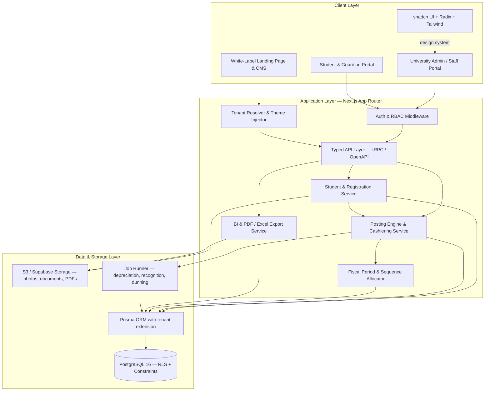
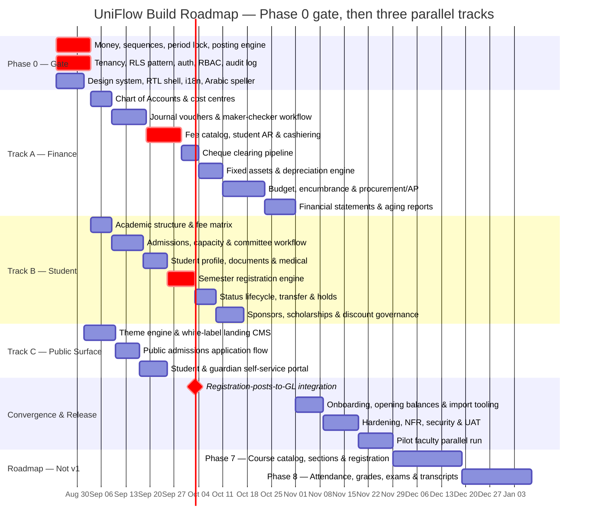

# Implementation Plan: UniFlow Multi-Tenant University ERP & White-Label Web Platform

**Version:** 2.2.0 · **Supersedes:** 1.0.0, 2.0.0, 2.1.0 · **Companion document:** [`srs_university_erp.md`](srs_university_erp.md) v2.2.0

Transformation of the legacy VB.NET / MS SQL desktop university system (Oasis E-University at Nile College; the Ribat University Application at Ribat and UOT) into a multi-tenant web application: student registration and lifecycle management, a double-entry university finance engine, and a white-label landing page per university client, built with **Next.js**, **shadcn UI** and **PostgreSQL**.

---

## 0. What changed from version 1.0.0

Version 1.0.0 was written from the legacy system's form and report filenames. Reading the VB.NET sources changed three things materially.

| # | Change | Reason |
| :--- | :--- | :--- |
| 1 | **New Phase 0** — ledger invariants and platform spine, before any screen is built | v1.0.0 began with the theme engine and landing CMS. Every hard correctness property of this product — voucher numbering, period locking, balanced postings, money precision, tenant isolation — lives in the ledger. None of it was a Phase 1 concern |
| 2 | **Roadmap restructured from one serial 93-day chain into three parallel tracks** with a named convergence milestone | The v1.0.0 Gantt was strictly sequential with no team allocation, implying a single infinitely fast developer, and gave no visibility into which work can proceed in parallel |
| 3 | **Legacy data migration removed** (was Phase 6.2), replaced by tenant onboarding and opening balances | Scope decision. Rationale in SRS §6 |
| 4 | Architecture diagram corrected | The v1.0.0 mermaid graph ended with `ClientLayer --> ApplicationLayer` and `ApplicationLayer --> DataLayer`, referencing node ids that were never declared — subgraph titles contain spaces and are not ids. Mermaid rendered three stray empty nodes |
| 5 | Stack pinned and an API-layer decision added | "Next.js 14+" is not a version. A student mobile app and public API are on the roadmap and Server Actions alone cannot serve them |
| 6 | RLS mechanism specified rather than asserted | Prisma does not emit `SET LOCAL app.tenant_id` on its own; v1.0.0 named RLS as the isolation strategy with no mechanism |
| 7 | Money type, idempotency, sequence allocation named as Phase 0 decisions | v1.0.0 never specified a monetary data type. The legacy system uses floating-point `Double` throughout |
| 8 | New modules scheduled: Fiscal Periods, Fee Catalog, Student Lifecycle, Sponsors, Procurement/AP, Admissions Capacity | See SRS §0 |
| 9 | Academic Records added as Phases 7-8 with a data-model-now constraint | The largest domain gap against comparable products; deferred, but the Phase 0 schema must accommodate it |
| 10 | Verification plan rewritten from five manual scenarios to property, concurrency, isolation, reconciliation, NFR and localization suites | v1.0.0's verification could not have caught any of the legacy defects the audit found |
| 11 | Risk register, environments/CI-CD, observability, security, team, and cutover sections added | Absent entirely from v1.0.0 |

---

## 0.1 Build status

**Phase 0 is complete. The gate is closed and Tracks A-C may start.** The
application lives in [`uniflow/`](uniflow/); see
[`uniflow/README.md`](uniflow/README.md) for setup and the Supabase deployment
path.

**315 tests pass across 12 suites; typecheck, lint and production build are all
clean.** Every item §4.1-§4.10 is built and verified.

**Track A1 (Chart of Accounts), A2 (journal vouchers and maker-checker) and
A3 (fee catalog, student AR and cashiering) are also complete** — see §0.2.

Six things were decided or corrected during the build and are recorded here
because they change what this document said (D-F are covered below the table):

| # | Decision / correction | Effect |
| :--- | :--- | :--- |
| A | **Next.js 16.3.1 + React 19.2** rather than the "Next.js 15 + React 19" pinned in §1 | Current release at scaffold time. No change to the architecture; the App Router / Server Component model this plan assumes is unchanged |
| B | **Prisma 7** moved connection URLs out of `schema.prisma` into `prisma.config.ts`, and made driver adapters mandatory | `datasource.url` in the config drives migrations; the runtime client is handed a `PrismaPg` adapter. This maps *better* onto Supabase's two endpoints than the old `directUrl` field did |
| C | **Tenant isolation is enforced by database ROLE, not by a session flag** — see below | Supersedes the "app-level tenant guard with RLS as defence-in-depth" option offered in §4.6 |
| D | **Local Postgres must be initialised `--encoding=UTF8`** | `initdb` inherits the Windows system locale and produces a WIN1252 cluster in which *no Arabic name can be stored at all*. Pinned in `scripts/pg.ts`; the test setup asserts it |

### On (C): the RLS trap was worse than §4.6 described

§4.6 offered two tenancy patterns and said to pick one. Building it showed the
choice is not free, and that the obvious implementation is silently inert:

1. PostgreSQL RLS **does not apply to superusers at all**, and does not apply
   to a table's owner unless the table is `FORCE ROW LEVEL SECURITY`. The role
   that runs migrations is necessarily the owner. An application connecting
   with that role has no isolation, and nothing reports this — no error, no
   warning, no degraded behaviour. On Supabase the default `postgres` role
   owns everything in `public`, so this is the *default* misconfiguration.
2. The first implementation added an `app.bypass_rls` session variable so that
   platform work could bypass policies. That is not a boundary: the same
   connection the policies constrain can set the variable and switch them off.

Both were caught by the isolation suite writing queries at the database layer.
The resolution is the standard Postgres separation, and the one Supabase uses
internally: **privilege comes from the role.** An owner role runs migrations
and platform work; a separate `NOSUPERUSER, NOBYPASSRLS`, non-owning app role
serves every request and is confined by RLS. The `app.bypass_rls` GUC is gone.

`npm run db:check-roles` asserts the split and **must run in CI against every
environment, production included**. A one-line connection-string mistake is
otherwise indistinguishable from a correct deployment until a tenant reads
another tenant's ledger.

### Phase 0 acceptance evidence

| Plan requirement | Status |
| :--- | :--- |
| §4.1 Money type and rounding policy | `numeric(19,4)` / `Prisma.Decimal`; half-up; exact-sum allocation for instalments and sponsor splits |
| §4.2 Sequence allocator, `MAX+1` prohibited | Row-locked counter per tenant × fiscal year × doc type; **60 parallel postings → 60 distinct gapless numbers** |
| §4.3 Fiscal period model and posting lock | Periods with `FUTURE/OPEN/CLOSED/PERMANENTLY_CLOSED`; non-overlap enforced by GiST exclusion constraint; posting into a non-open period rejected by trigger |
| §4.4 The posting engine | Single `post()`; balance, period, postability, control-account and cost-centre rules enforced in both the engine and the database |
| §4.5 Idempotency | Claim-before-work with stored response; replay returns the original; same key + different body is an error; failed work releases the claim |
| §4.6 Multi-tenancy and RLS | Role-based; verified at the database layer, not the API layer |
| §4.7 Audit log | Hash-chained per tenant, advisory-locked sequence, append-only by trigger; verifier locates both removal and alteration |
| §4.8 Auth, RBAC, segregation of duties | Argon2id, JWT sessions with immediate revocation, TOTP second factor with replay refusal, 52-permission catalogue, 13-pair SoD matrix enforced at role-save AND at role-assignment, plus per-document self-approval refusal |
| §4.9 Design system / localisation shell | Tailwind v4 tokens with per-tenant HSL palette, RTL shell (`dir` on `<html>`, Cairo for Arabic), next-intl with parity-tested catalogues, **working Arabic تفقيط**, Hijri/Gregorian dual calendar, Arabic search normalisation |
| §4.10 Data model accommodates Academic Records | Reviewed; `subledgerType`/`subledgerId`, `sourceModule`/`sourceRef` and the term-agnostic period model leave room for Module 18 without reshaping the ledger |

### Two further corrections found while closing the gate

| # | Correction | Effect |
| :--- | :--- | :--- |
| E | **Next.js 16 renamed Middleware to Proxy** — the file is `src/proxy.ts`, and a `middleware.ts` is simply not picked up | Locale negotiation lives there. Authorisation deliberately does **not**: Next's own guidance is that Proxy is for optimistic checks, not session management or authorisation. `requirePermission()` runs in the data access layer |
| F | **Arabic noun agreement is not what the first fixtures assumed** | After آلاف the counted noun is *singular* — خمسة آلاف جنيه, not جنيهات — and any count of 11 or more reverts to the singular. Three test fixtures were wrong and the implementation was right; corrected with the rule stated in the test. Getting this wrong prints a malformed amount on every voucher |

---

## 0.2 Track A progress

### A1 — Chart of Accounts & Cost Centres · complete

| Delivered | Notes |
| :--- | :--- |
| Normalised account tree | `id`, `code`, `parent_id`, derived `level`, bilingual names. Replaces five denormalised TEXT columns whose tree was rebuilt by five nested cursors on five separate connections |
| Single-query tree assembly | One indexed read, assembled in memory. The legacy screen issued O(nodes) round trips to render once |
| Structural rules enforced | Level derived from parent, never supplied · max depth 5 · only level-5 leaves postable · control accounts must declare their sub-ledger · root accounts must state their normal balance · sign inherited down each branch with an explicit override for contra-assets |
| Immutable code/level/parent | Ledger history attaches by id; re-parenting would silently restate prior periods. Deactivate and replace instead |
| Deactivate, never delete | Refuses while active children exist. Replaces the legacy `frmDeleteAcc.vb`, which deleted rows outright |
| Standard university COA template | 60+ accounts and 7 cost centres installed at onboarding (SRS §6 step 1), idempotent by code. Includes the three sub-ledger control accounts, accumulated depreciation as a contra-asset, unearned fees for REQ-FEE-02, and FX difference accounts for REQ-FIN-03 — none of which existed in the legacy chart |
| 27 tests | Template integrity, install idempotency, level derivation, sign inheritance, authorisation, deactivation rules, audit chain — plus an end-to-end posting of a tuition bill against the installed chart |

### A defect found by A1, fixed: the audit chain reported false tampering

The chart-of-accounts suite was the first to log an audit payload with more
than one key, and it failed the chain verification immediately.

**Cause.** Postgres `jsonb` does not preserve object key order — it normalises
keys by length then bytewise. A payload written as
`{nameAr, nameEn, requiresCostCenter, code}` reads back as
`{code, nameAr, nameEn, requiresCostCenter}`. The hash was taken over
`JSON.stringify` at write time and again at verify time, so the two digests
differed for byte-identical data.

**Impact had it shipped.** The scheduled chain verifier (plan §11) would have
raised a P1 tampering alert on essentially every real change, since almost
every audited change carries a multi-key before/after payload. The alert that
exists to detect a genuine breach would have been permanently crying wolf —
which is worse than not having it, because it would have been switched off.

**Fix.** Hashes are taken over a canonical, recursively key-sorted
serialisation ([`src/lib/canonical-json.ts`](uniflow/src/lib/canonical-json.ts)),
shared with the idempotency key hasher, which needed the same property for the
same reason. Two regression tests pin it: a multi-key payload, and a nested
payload with arrays.

### A2 — Journal Vouchers & Maker-Checker · complete

The legacy approval flow, in full: approving a voucher inserted its lines into
`Transactionees` and then ran `DELETE FROM TempVouchers`
(frmApprovingVouchers.vb:941-991). No reviewer stage, no reject path, no
comment, no approver recorded — and the delete destroyed the only evidence
that a voucher had ever been reviewed. With no roles in the system, anyone who
could open the approvals screen could approve their own work.

| Delivered | Notes |
| :--- | :--- |
| Four-state workflow | `DRAFT → PENDING_REVIEW → PENDING_APPROVAL → POSTED`, `REJECTED` reachable from either checker stage, plus `CANCELLED` for a maker abandoning their own draft. The legal transitions are enforced by trigger as well as in code |
| Full `approval_events` history | Every transition retained with actor, comment and timestamp. Append-only by trigger, because a rejection comment that can be edited afterwards is not evidence |
| Mandatory rejection comment | In code *and* as a CHECK constraint. A rejection with no reason produces a resubmission with the same defect |
| Approver ≠ maker ≠ reviewer | Three independent controls: the SoD matrix on permissions held, `assertNotSelfApproval` per document, and a reviewer check that reads who actually acted on *this* document — the case the matrix cannot see when roles change between stages |
| Content freeze | Once submitted, lines, date, description and type are immutable until rejection. Enforced at the table, because the attack (submit clean, swap the lines after review, get it approved) works against whichever code path forgets |
| Drafts are never deleted | Trigger-enforced. This is the single legacy behaviour the module exists to replace |
| Approval and posting in one transaction | A draft marked POSTED whose ledger entry rolled back cannot exist, and neither can the converse |
| Separate draft number series | An abandoned draft never burns a statutory voucher number. Allocated by the same row-locked upsert discipline as voucher numbers |
| Attachments | Metadata plus SHA-256 digest, frozen by the same trigger as the lines — "a checker approves what they were shown" has to include the evidence. Bytes go to object storage when that layer lands |
| Reversal | Bidirectional linkage, mandatory reason, once-only by UNIQUE constraint, posting into the period of the reversal date rather than the original's |
| Work queue | `awaitingMe` shows a checker only the stage they hold and never their own drafts; a queue listing items you cannot action trains people to ignore it |
| 56 tests | Including the four that describe attacks: self-approval, one person taking both checks, editing after review, and two approvers pressing Approve at the same instant |

**On "MFA above the approval threshold".** The threshold is zero, deliberately.
`voucher.approve` and `voucher.reverse` always demand a verified second factor.
A threshold below which approvals need no second factor is a documented amount
an attacker can stay under; the cost of a six-digit code is a few seconds. This
is stricter than §3 A2 specified, and is recorded here rather than silently
implemented.

**One refactor worth noting.** The line rules — sides, signs, FX conversion,
balancing — now live in one place
([`src/lib/ledger/lines.ts`](uniflow/src/lib/ledger/lines.ts)) shared by the
posting engine and the voucher grid. They were about to be written twice, once
throwing and once collecting, and a grid that reports "balanced" against a
server that reports "out by 0.01" leaves the maker unable to proceed and unable
to see why. Rounding a foreign-currency line to functional currency is exactly
where that divergence would have come from; a test now posts an FX voucher and
asserts the grid total equals the ledger total to the last digit.

**A structural gap closed while building it.** The isolation suite tested the
tables that existed when it was written. Adding a table and forgetting its RLS
policy is silent — the table simply has no isolation and every query returns
every tenant's rows. There is now a sweep over `pg_class` that fails if any
table in `public` lacks row-level security and a policy, with two names
declared global on purpose (`permissions`, `_prisma_migrations`).

---

### A3 — Fee Catalog, Student AR & Cashiering · complete

The critical path, and the part of the legacy system furthest from correct.
Its cashier screen had a fee grid **hardcoded to two rows**, looked accounts up
by their Arabic *names* and then wrote the English literals `"Current Assets"`,
`"Debtors"` and `"Students Fees"` into the grid, numbered receipts with
`MAX(MoveNo) + 1` read inside the transaction, recognised a full year's tuition
on registration day, and had no student control account at all — so a student's
balance and the general ledger could disagree indefinitely with nothing capable
of noticing.

| Delivered | Notes |
| :--- | :--- |
| Fee item catalog (REQ-FEE-01) | All fifteen heads, each with its own revenue account and its own deferrable / discountable / refundable flags. Installed at onboarding, idempotent by code |
| Structural account roles | Modules ask for `STUDENT_AR_CONTROL`, not for account code `11211`. A tenant may renumber its chart; the legacy system wrote account *names* into the source, so renaming an account broke posting |
| Student master (finance slice) | Number, bilingual name, national ID, status. Arabic-normalised search key, so a cashier typing احمد finds أحمد. National ID unique per tenant by partial index — duplicate applicants are the start of duplicate ledgers. Track B extends this table rather than replacing it |
| Charge raising (REQ-FEE-02) | `DR Student AR (net) · DR Discounts (discount) · CR Unearned or Revenue (gross)`. Gross billing keeps scholarship exposure on its own line — the number `viewDiscount` existed to reconstruct. Idempotency-keyed |
| Multi-channel cashiering (REQ-CSH-01) | Cash to the cashier's **own till**, bank transfer, cheque into cheques-receivable with its clearing detail, gateway. FIFO settlement by due date. **The idempotency key is a required argument, not an option** |
| Credit balances (REQ-FEE-04) | Unmatched money credits a *liability control account*, not receivables. Crediting the whole receipt to AR would leave a negative student balance sitting in an asset account. Applied to the next term's charges without burning a receipt number |
| Receipt cancellation (REQ-CSH-06) | Same day only, by a supervisor, with MFA; produces a linked reversal and keeps the number. After that day it goes through the voucher workflow and gets a second signature |
| Charge reversal | Unwinds recognised revenue and unearned income **in the proportions that apply now**, and returns money already paid to the student as credit rather than quietly keeping it |
| Revenue recognition (REQ-FEE-02) | The schedule is written when the charge is raised, so the period-end batch is a lookup and cannot arrive at a different answer on a re-run. Idempotent per period, period-locked, and it skips reversed charges |
| Instalment plans (REQ-CSH-02) | Dated schedules with exact-sum allocation. Overdue is cross-checked against the actual balance: a student who paid up front is not dunned because a date passed |
| Statement of account, aging | Running balance with a real opening figure carried into a date window. Aging from the due date, falling back to the document date |
| Fiscal year opening | Year, periods and **document counters in one transaction**, because a year without counters fails at its first posting |
| 56 tests | Including the reconciliation test below |

**The test that matters most.** After a scripted term — twelve students, mixed
discounts, cash and bank receipts, an overpayment, a same-day cancellation, a
partly-paid charge reversed, and two recognition runs — the student sub-ledger
equals its two control accounts **to the cent, with zero variance**. That check
is trivial to write against this design and was impossible against the legacy
one.

**Two ordering bugs, both mine, both caught by the database.**

1. Receipt cancellation released its allocations *after* stamping the
   cancellation. A cancelled receipt's allocations are frozen by trigger —
   which is what stops anyone re-pointing dead money at a live charge — so the
   database refused. The comment in the code had confidently asserted the
   opposite order was required. Fixed; the trigger is why this surfaced in a
   test rather than in a bursar's office.
2. `settled_amount` on a charge is denormalised so a screen listing forty
   charges does not aggregate the allocation table forty times. Denormalised
   totals are exactly what drifts, and a drifted student balance is what the
   legacy system shipped. A deferred constraint trigger now requires
   `settled_amount` to equal the sum of its allocations at commit, and a test
   proves a hand-written `UPDATE` cannot break it.

**A Prisma 7 interaction worth recording.** The statement-of-account query
originally pulled three sibling relations at once. Prisma 7's query interpreter
fans those loads out **concurrently onto the transaction's single connection**;
`pg` currently queues them and emits a deprecation warning, and will refuse
outright at pg 9. Correct today, an upgrade blocker tomorrow. The query now
resolves voucher references in one explicit pass — a fixed number of round
trips whatever the length of the history, which is the better shape anyway.
Worth watching for elsewhere: the only symptom is a `DeprecationWarning` from
`pg`, and nothing else.

**Deliberately not built yet, and why**

| Deferred | Reason |
| :--- | :--- |
| Payment-gateway provider adapters (REQ-CSH-05) | The interface is meaningless without a webhook route and a settlement-reconciliation job. `GATEWAY` receipts post to the bank account today and carry their provider reference |
| Automatic late fees (REQ-CSH-02) | Needs the durable job runner, which A5 (depreciation) and A6 (dunning) also need. The `LATE_FEE` catalog item and the overdue query are in place; only the schedule that raises it is missing |
| Refund disbursement (REQ-FEE-03) | Follows the payment-voucher workflow, which is A6. The withdrawal refund *policy* is a Track B lifecycle concern |

---


## 1. Architecture Decisions Requiring Sign-Off

> [!IMPORTANT]
> These five decisions constrain everything downstream. They should be agreed before Phase 0 begins.

**1. Multi-tenancy — shared database, `tenant_id` partitioning, defence in depth.**
A single PostgreSQL database with `tenant_id` on every operational table, protected by **both** Row-Level Security and an application-layer tenant guard. Neither alone is sufficient: RLS protects against an application bug that forgets a `WHERE`, the guard protects against a pooled connection that never had its tenant context set. See §4 for the Prisma mechanism, which is a known trap.

**2. Bilingual RTL/LTR from the first commit.**
Arabic RTL and English LTR via `next-intl`, with Cairo/Tajawal for Arabic and Inter for English, plus a correct Arabic monetary speller (تفقيط) and Hijri/Gregorian dual calendar. Retrofitting RTL is far more expensive than building with it; the legacy system's own amount speller is an English one patched with `.Replace("Dollar","Pound")`.

**3. Maker-checker with full state history.**
`Draft → Pending Review → Pending Approval → Posted`, with `Rejected` reachable from either review stage, and every transition retained. The legacy implementation deleted the draft row on approval, destroying the only evidence a voucher had been reviewed. Drafts are never deleted here.

**4. Money is `numeric(19,4)` in PostgreSQL and `Prisma.Decimal` in TypeScript.**
Floating-point arithmetic on monetary values is prohibited by lint rule and by code review. The legacy system uses VB `Double` throughout and formats with `"N2"` at the point of display, which hides accumulating error rather than preventing it.

**5. A typed API layer alongside Server Actions.**
Server Actions for form-driven server-rendered flows; a typed API layer (tRPC, or REST with an OpenAPI schema) for everything that a non-browser client must reach. The student mobile app and public API on the roadmap cannot consume Server Actions. Choosing this at Phase 0 costs little; retrofitting it after the finance module ships is a rewrite of every mutation path.

---

## 2. Technical Architecture



### Stack

| Concern | Choice | Note |
| :--- | :--- | :--- |
| Framework | **Next.js 15** (App Router, Server Components, Server Actions) + **React 19** | Pinned, not "14+" |
| Language | TypeScript, `strict: true` | |
| API | tRPC (or REST + OpenAPI) alongside Server Actions | Decision 5 |
| UI | **shadcn UI** — Dialog, DropdownMenu, Tabs, Popover, Command, Accordion, Tooltip, Select, Sheet, Card, Table, Form, Calendar, DatePicker, Badge, Sonner | |
| Styling | Tailwind CSS with HSL CSS-variable tokens for per-tenant theming | |
| Forms | React Hook Form + Zod, schemas shared client/server | |
| Data tables | TanStack Table v8 | Sorting, filtering, pagination, column visibility, export |
| Charts | Recharts | Revenue vs expenses, aging, enrolment by faculty |
| Icons | Lucide React | |
| Database | PostgreSQL 16 | Constraints and RLS carry the invariants — see SRS §4.3 |
| ORM | Prisma with a tenant-scoping client extension | §4 |
| Money | `numeric(19,4)` / `Prisma.Decimal` | Decision 4 |
| Jobs | A durable job runner (depreciation, revenue recognition, dunning, FX revaluation) | Must be idempotent and period-aware |
| PDF | `@react-pdf/renderer` with embedded Arabic fonts | Arabic shaping verified by visual snapshot, not assumed |
| i18n | `next-intl` + a custom Arabic/English monetary speller + Hijri calendar | |
| Auth | Argon2id, session cookies, TOTP MFA for financial approval | |

---

## 3. Roadmap

Phase 0 is a hard gate: nothing in Tracks A-C starts until it is complete. After that, three tracks run in parallel and converge at the **Registration-Posts-to-GL** milestone, which is the project's real integration test.



**Capacity assumption.** The durations above assume roughly **two engineers on Track A, two on Track B, one on Track C**, plus a shared lead across Phase 0 and convergence. State the actual figure before committing to dates — the v1.0.0 Gantt implied one developer working strictly serially, which is why its total looked achievable.

**Track dependencies.** Track C depends only on Phase 0 and can run start-to-finish in parallel. Track A `a3` (cashiering) and Track B `b4` (registration) must both complete before the convergence milestone; they are the two halves of the posting path the legacy system never joined.

---

## 4. Phase 0 — Ledger Invariants & Platform Spine

*The gate. Every item here is something the legacy system got wrong, and every one is far cheaper to build now than to retrofit.*

### 4.1 Money and arithmetic
- `numeric(19,4)` on every monetary column; `Prisma.Decimal` in application code.
- A single rounding policy (half-up to the currency's minor unit) applied at one place in the codebase.
- An ESLint rule failing arithmetic operators applied to values typed as monetary.

### 4.2 Document sequence allocator
- Per Tenant × Fiscal Year × Document Type, from a `document_sequences` row updated under `SELECT … FOR UPDATE`, or a dedicated PostgreSQL sequence per series where gapless numbering is not required.
- `UNIQUE (tenant_id, fiscal_year_id, voucher_type, voucher_no)` as a backstop.
- **`MAX(n)+1` is prohibited.** This is how the legacy system numbered every voucher; its fixed-asset module additionally omitted the `Year()` filter the other call sites applied, so its numbers collided with prior years.

### 4.3 Fiscal period model and posting lock
- `fiscal_years` and `fiscal_periods` with `Future | Open | Closed | PermanentlyClosed`.
- A trigger rejecting any `transaction_header` whose resolved period is not `Open`.
- Build this now even though period *close* ships with Track A: every posting path written after this point must resolve a period, and adding that later means touching all of them.

### 4.4 The posting engine
One function, used by every module that touches the ledger — registration, cashiering, cheques, depreciation, revenue recognition, procurement. It takes a document and a set of lines and either posts all of them or none.

```
post(tenantId, {
  voucherType, docDate, description, sourceModule, sourceRef,
  lines: [{ accountId, costCenterId, subledger, currency, fxRate, debit, credit, descr }]
}, idempotencyKey) → { headerId, voucherNo }
```

Responsibilities: resolve and lock the fiscal period · verify every account is postable and every control-account line carries sub-ledger identity · verify debits equal credits in functional currency · allocate the voucher number · insert header and lines · update `account_period_balances` · write the audit entry — all in one database transaction.

The database enforces the same invariants independently (SRS §4.3). The application check gives a good error message; the constraint guarantees correctness even when a code path is wrong.

### 4.5 Idempotency
- An `idempotency_keys` table storing key, endpoint, request hash and the original response.
- Every financial mutation requires a key. A replay returns the stored response and creates nothing; a key reused with a different request body is an error.
- **This is the highest-value single item in Phase 0.** A cashier on an unreliable connection pressing Save twice is the expected condition at these campuses, not the exceptional one.

### 4.6 Multi-tenancy and the Prisma/RLS mechanism
RLS needs `app.tenant_id` set on the *connection* for the duration of the transaction. Prisma does not do this on its own, and a pooled connection carrying a previous request's tenant is a cross-tenant data leak. Two workable patterns — pick one and apply it uniformly:

- **Transaction-scoped session variable.** Wrap every request in `prisma.$transaction`, issuing `SET LOCAL app.tenant_id = $1` as its first statement. `SET LOCAL` is scoped to the transaction, so it cannot leak across pooled connections. Costs a transaction on read paths.
- **Application guard with RLS as a backstop.** A Prisma client extension injects `tenant_id` into every `where`, `create` and `update`; RLS policies remain enabled and are verified by test rather than relied on at runtime.

Whichever is chosen, the cross-tenant isolation test (§8.3) asserts it at the database layer, not the API layer.

### 4.7 Audit log
- Append-only, hash-chained: each entry carries a hash of its predecessor, so deletion or alteration anywhere in the chain is detectable.
- Written inside the same transaction as the change it records.
- INSERT-only grants; a scheduled job verifies the chain and alerts on failure.

### 4.8 Auth, RBAC and segregation of duties
- Argon2id hashing, session cookies, TOTP MFA for financial approvals above a threshold.
- A permission model expressive enough for REQ-SOD-01, and a validator refusing to save a role that combines maker and checker rights on the same document type.

### 4.9 Design system and localization shell
- shadcn UI installed, tokenised theming wired to per-tenant HSL variables, RTL layout mirroring, `next-intl`.
- The **Arabic monetary speller** and **Hijri calendar** built and unit-tested here, with fixtures. They appear on every voucher and every official document, so they are infrastructure, not a feature.

### 4.10 Data model accommodates Academic Records
Even though Phases 7-8 are out of v1 scope, the Phase 0 schema must not preclude them: student-course enrolment, holds (already required by REQ-REG-06), and term structure need to slot in without reshaping `students`, `semester_registrations` or `academic_terms`. Review the Module 18 requirements against the schema before the Phase 0 gate closes.

---

## 5. Track A — Finance

**A1 · Chart of Accounts & Cost Centres** — Interactive tree table over the normalised 5-level COA with codes, `parent_id`, bilingual titles, normal balance, postable and control-account flags. Account maintenance with the constraint that an account carrying postings may be deactivated but never deleted or re-parented. Cost centre master.

**A2 · Journal Vouchers & Maker-Checker** — Multi-line voucher grid with live debit/credit balancing, attachments and draft saving. The four-state workflow with rejection comments, full `approval_events` history, approver-≠-maker enforcement, and MFA above the approval threshold. Voucher reversal with bidirectional linkage, mandatory reason, and the once-only constraint.

**A3 · Fee Catalog, Student AR & Cashiering** *(critical path)* — Fee item master with per-item GL mapping and deferrable/discountable/refundable/taxable flags. The cashier terminal: student lookup with live balance and instalment schedule, multi-channel capture (cash, bank, cheque, gateway), allocation across fee items, credit balances for overpayment, receipt numbering, bilingual thermal and A4 receipt PDFs with amount in words. Instalment plans with due dates and reminders. Receipt cancellation by linked reversal. Provider-agnostic gateway interface — no processor is hardcoded.

**A4 · Cheque Clearing Pipeline** — A real state machine (Received → Sent to Bank → Cleared / Bounced / Cancelled), each transition posting through the Phase 0 engine. Bounce reinstates student debt, optionally raises a penalty fee item, and records the bank's refusal code. Repeat-bounce reporting by drawer.

**A5 · Fixed Assets & Depreciation** — Registry with the GL account triple per category. A persisted depreciation schedule generated at capitalisation, with first- and final-period proration. The period-end batch is keyed on (tenant, period), rejects closed periods, and is a reporting no-op on repeat invocation. Disposal and write-off with gain/loss on NBV.

**A6 · Budget, Encumbrance & Procurement/AP** — Budget versions with approval; available = allocated − encumbered − actual. Vendor master with dual-authorised bank details. Requisition → PO → GRN → invoice → three-way match → payment voucher. PO approval creates the encumbrance; receipt converts it to accrual; payment clears it. AP aging and payment proposal runs. Year-end encumbrance lapse or carry-forward.

**A7 · Financial Statements & Reports** — Trial Balance (opening / movement / closing, sourced from `account_period_balances`), Balance Sheet L1-L4, Income Statement with comparatives and cost-centre filtering, Student Statement of Account, Receivables Aging from **instalment due date**, and the Sub-Ledger Reconciliation report that makes control-account divergence visible. Excel, CSV and bilingual PDF export.

---

## 6. Track B — Student

**B1 · Academic Structure & Fee Matrix** — Faculties, programmes, degrees, batches, academic years and terms. The **effective-dated, versioned** fee matrix: editing creates a new version, prior versions are retained and stay attached to the registrations raised under them. *(The legacy screen ran `DELETE FROM TuitionFees WHERE Batch=…` before re-inserting, destroying every prior schedule.)*

**B2 · Admissions, Capacity & Committee Workflow** — Seat quotas per programme × batch × channel with live counters and override logging. Automatic eligibility screening by certificate type and score. Committee scoring, ranking and decisions. Offers with acceptance deadlines, optional online seat deposits, automatic lapse and waitlist promotion. Duplicate-applicant detection on national ID, passport and normalised Arabic name plus date of birth. Bulk intake import with dry-run preview.

**B3 · Student Profile, Documents & Medical** — Multi-step wizard capturing discrete 4-part Arabic and English names, dual-calendar dates, guardian details, secondary school record, photo capture and document uploads. Per-programme document checklists with verification state and expiry. Medical record: the five legacy fields plus vaccination status, chronic conditions, officer notes and a fitness verdict. Directory search with **Arabic normalisation** — alef, taa marbuta, yaa and tatweel folded — over a trigram index.

**B4 · Semester Registration Engine** *(critical path)* — Student lookup auto-filling programme and the effective fee schedule version. Per-item discount application with approval above threshold. **Atomic**: the registration row and its balanced GL posting are created in one database transaction through the Phase 0 posting engine, carrying an idempotency key and rejected if the period is closed. Registration card with QR verification.

**B5 · Status Lifecycle, Transfer & Holds** — The full status state machine with effective-dated history, each transition declaring its financial consequence. Programme transfer reversing the prior programme's billing by linked reversal and posting the new. Holds (financial, academic, disciplinary, documentary) that block registration, with placement and clearance authority.

**B6 · Sponsors, Scholarships & Discount Governance** — Sponsor master with contract terms. Split funding apportioning charges across self-pay and sponsors at billing time, so a student's statement shows only what the student owes. Sponsor invoicing, settlement and aging; sponsor-default transfer back to the student. Scholarship schemes with budget caps and award approval. Discount exposure reporting by faculty, programme, batch, scheme and year.

---

## 7. Track C — Public Surface

**C1 · Theme Engine & Landing CMS** — Per-tenant branding tokens (names, logo, favicon, motto, HSL palette, typography, social links) driving both the public site and the admin portals. Hero with configurable media and CTAs; faculties and programmes explorer; news, announcements and academic calendar; campus contact and map. A live-preview editor in the admin panel for text, colours, banners and section toggles.

**C2 · Public Admissions Application Flow** — Multi-step public application: personal details, secondary certificate scores, ranked programme choices, document uploads. Optional application fee payable online. Tracking number and downloadable PDF slip. Feeds directly into the B2 committee queue.

**C3 · Student & Guardian Self-Service Portal** — Invoices, statement of account, instalment schedule with due dates, online payment, registration proofs and ID card, document upload, and application status. Guardian access scoped to their own students.

---

## 8. Verification

Replaces the five manual scenarios in v1.0.0, none of which would have detected any of the defects the legacy audit found.

### 8.1 Ledger property tests
Run against every posting path — registration, cashiering, cheque transitions, depreciation, revenue recognition, procurement:
- Posting leaves $\sum\text{debit} = \sum\text{credit}$ for the header, in functional currency.
- No posting lands in a period that is not `Open`.
- Replaying any request with the same idempotency key produces **exactly one** voucher and returns the original response.
- A control-account line without sub-ledger identity is rejected.
- A posting to a non-postable (level 1-4) account is rejected.
- Attempting to UPDATE or DELETE a posted transaction fails at the database, not merely in application code.

### 8.2 Concurrency
- N parallel receipt postings across the same tenant and fiscal year yield N distinct voucher numbers with no gaps and no collisions. Run at N = 500 to satisfy REQ-NFR-03.
- Concurrent registrations for the same student produce exactly one registration.
- Concurrent offers against a quota with one remaining seat produce exactly one confirmed allocation.

### 8.3 Tenant isolation
- An authenticated Tenant A principal cannot read or write any Tenant B row — asserted **at the database layer** by attempting the query with A's session context, not by checking that the API returns 403.
- A pooled connection that served Tenant A and is reused for Tenant B carries no residual context.

### 8.4 Reconciliation
- After a scripted term of activity (registrations, receipts, discounts, cheques including a bounce, a transfer, a withdrawal with refund, sponsor settlement), the student sub-ledger total equals the AR control account balance **to the cent**. Same for sponsor AR and vendor AP.
- Trial balance totals: debits equal credits; assets equal liabilities plus equity.
- Opening balances plus period movements equal closing balances for every account.

### 8.5 Business logic
- Fee calculation and per-item discount application across the discountable-flag matrix.
- Straight-line depreciation with first- and final-period proration; the batch is a no-op on a second run.
- Revenue recognition schedules sum exactly to the amount billed, with no rounding residue.
- Refund policy boundaries — the day before, the day of, and the day after each schedule threshold.
- Maker-checker state transitions, including every rejection path and the approver-≠-maker rule.

### 8.6 Non-functional
- Seed 100,000 students and 1,000,000 journal lines, then measure the latencies REQ-NFR-01 and REQ-NFR-02 promise. If trial balance is being computed by scanning the ledger rather than reading `account_period_balances`, this is where it surfaces.
- Load test 500 concurrent cashier sessions.
- Audit chain verification over a large log.

### 8.7 Localization
- RTL visual snapshots of every screen, in both themes.
- Arabic amount-in-words fixtures, including the cases the legacy speller gets wrong.
- Hijri ↔ Gregorian conversion across month and year boundaries.
- Arabic name search: `أحمد` / `احمد` / `آحمد` all match one another; `فاطمة` matches `فاطمه`.
- Arabic PDF output visually verified for shaping and right-alignment — this cannot be asserted by text comparison.

### 8.8 Security
- Automated dependency and container scanning in CI.
- Authorization tests per role against every endpoint, including the segregation-of-duties combinations.
- A penetration test as a gate before go-live.

### 8.9 User acceptance
Run with **actual cashiers and registrars, in Arabic, on the hardware and connection quality they have**. The single most likely production failure is a duplicate receipt created by a double-press on a slow link; that must be exercised deliberately in UAT, not discovered live.

---

## 9. Risk Register

| Risk | Impact | Likelihood | Mitigation |
| :--- | :--- | :--- | :--- |
| Opening balances wrong at go-live | Every subsequent statement is wrong; unwinding requires a re-implementation of the tenant | Medium | The §10 gate: debits = credits and every control account equals its sub-ledger, exported and signed off by the tenant's Financial Controller before go-live |
| Voucher number collision under concurrency | Duplicate or overwritten vouchers; statutory numbering broken | Medium without Phase 0 | Sequence allocator + unique constraint + the §8.2 concurrency test. This is a *realised* defect in the legacy system, not a hypothetical |
| Duplicate receipts from operator retry on a flaky link | Student overcharged or double-credited; cash reconciliation fails | **High** | Idempotency keys on every financial mutation (§4.5), exercised in UAT |
| Arabic PDF shaping fails in production | Every official document is unusable | Medium | Font embedding and visual snapshot tests in CI from Phase 0, not at the end |
| Scope creep from Academic Records | v1 never ships | High | Specified in the SRS, scheduled at Phases 7-8, and gated by the Phase 0 data-model review — but not built in v1 |
| Cross-tenant data leak via pooled connections | Catastrophic and contractually terminal | Low with §4.6, high without | One uniform tenancy pattern, plus the §8.3 database-layer isolation test |
| Sub-ledger diverges from control account | Silent, compounding, and exactly the legacy failure mode | Medium | Control-account postings only via sub-ledger; REQ-RPT-06 reconciliation report alerting on any variance |
| Connectivity or power loss at the cashier desk | Collections stop | High at these campuses | Offline-tolerant cashier PWA is in SRS §7 (unscheduled). Until then, document the manual fallback and the reconciliation procedure |
| Two-track integration lands late | Registration and cashiering ship but do not post correctly together | Medium | The convergence milestone is dated and treated as a hard gate, not as an integration to be discovered |

---

## 10. Tenant Onboarding & Opening Balances

Historical transactions are **not** migrated. Legacy databases remain available read-only for historical enquiry. Rationale in SRS §6.

1. **Chart of accounts** — CSV import or a shipped standard university template. Validates unique codes, parent references, five levels, normal balance set, control accounts identified.
2. **Master data** — faculties, programmes, batches, fee items, fee schedules, cost centres, and the student master. Student intake is by Excel/CSV import with column mapping, dry-run preview, per-row validation, duplicate detection and a correctable error report. The institutions already keep per-faculty student lists as spreadsheets, so this is the path they will actually use.
3. **Opening balances** — GL and per-party sub-ledger balances as at go-live.
4. **Gate** — debits = credits exactly; every control account equals the sum of its sub-ledger parties exactly; trial balance exported and signed off.
5. **Go-live** — users and roles created, SoD matrix reviewed, first fiscal year and periods opened, cashier accounts assigned, receipt numbering configured.

---

## 11. Environments, CI/CD & Operations

**Environments** — local, dev, staging (production-shaped, with a scrubbed dataset), production. Schema changes ship as reviewed Prisma migrations, forward-only, never edited after merge.

**CI** — typecheck, lint (including the monetary-arithmetic rule), unit and property suites, integration suite against an ephemeral PostgreSQL, RTL visual snapshots, dependency scan. The §8.1 ledger property tests and §8.3 isolation tests are **blocking**.

**Preview deployments** per pull request with a seeded tenant, so a reviewer can exercise a change in Arabic before approving it.

**Observability** — structured logs correlated by tenant and request; error tracking; alerting on posting failures, sub-ledger reconciliation variance, audit-chain verification failure, and job-runner failures for depreciation, revenue recognition and dunning.

**Runbooks** — a voucher stuck in approval; a failed period close; a depreciation batch that partially posted; a sub-ledger variance; a gateway webhook that never arrived.

**Backup & DR** — RPO ≤ 15 min, RTO ≤ 4 h, with a **scheduled restore drill**. A backup that has never been restored is not a backup.

---

## 12. Cutover

1. **Pilot faculty.** One faculty operates fully in the new system for a term while the rest continue as they are. Chosen for size, not for enthusiasm — a faculty large enough to exercise concurrency at the cashier desk.
2. **Parallel run.** Daily reconciliation of collections and registrations between old and new for the pilot period, with variances investigated rather than tolerated.
3. **Full cutover** at a fiscal period boundary, never mid-period.
4. **Rollback position** — the legacy system stays operable and its database untouched until the first full period has closed cleanly in the new system and its statements have been signed off.

---

## 13. Recommended, Not Scheduled

Deferred by decision, listed so the choice stays visible and revisitable. Full detail in SRS §7.

- **Cash controls** — cashier shift open/close with denomination count and Z-report; receipt-book serial custody per cashier; petty-cash imprest with settlement; bank statement import and reconciliation. *The legacy Ribat build already implements receipt-book serials (`BillSNo`, with an overlap check on issue) and imprest custody (`frmCustody`); deferring these means the new system temporarily loses controls the old one had.*
- **Payroll & HR-lite** — staff master, salary structure, monthly payroll journal, staff loans and advances, end-of-service.
- **Resilience** — offline-tolerant cashier PWA queueing receipts against pre-allocated serial ranges; ESC/POS thermal printing.
- **Engagement** — SMS / WhatsApp / email dunning; self-service certificate requests with workflow and fee; student mobile app.
- **Ancillary billing** — hostel, transport and library fines flowing into student AR.
- **Reporting & BI** — cash flow statement, statement of changes in equity; enrolment funnel; collection forecasting; at-risk early warning; regulator statistical returns.
- **Platform** — SaaS subscription billing and seat/feature metering; SSO; public API and webhooks; alumni verification portal.
- **Deeper finance** — period-end FX revaluation beyond REQ-FIN-03; declining-balance and units-of-production depreciation; asset componentisation; QR-based physical count.

---

*(End of Implementation Plan — Version 2.0.0)*
