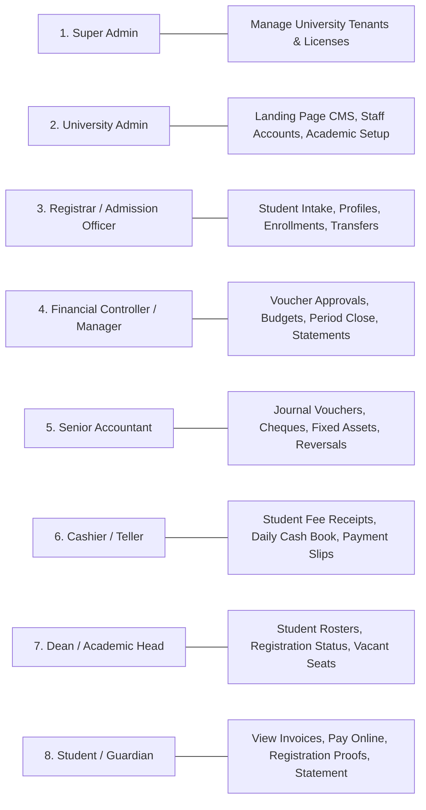
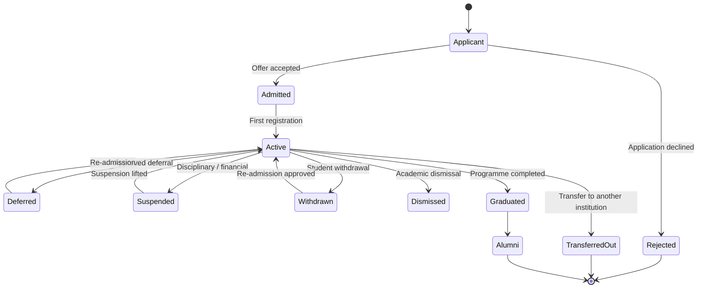
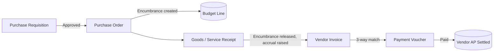
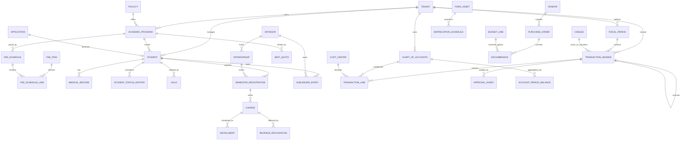

# Software Requirements Specification (SRS)
## Multi-Tenant University ERP & White-Label Web Platform
**Project Name:** UniFlow Enterprise ERP (Next-Gen Transformation of Oasis E-University)
**Document Version:** 2.0.0
**Supersedes:** v1.0.0
**Target Audience:** University Management, Technical Architects, Development Team, Product Owners, Quality Assurance
**Standard Compliance:** IEEE Std 830-1998 / ISO/IEC/IEEE 29148

---

## 0. Changes in Version 2.0.0

Version 1.0.0 of this document was written from the legacy system's *form and report filenames*. A subsequent read of the VB.NET sources found that several described behaviours do not exist in the legacy code. This version corrects those claims, adds the requirement groups that the legacy system's actual gaps make necessary, and reflects two scope decisions taken after v1.0.0.

| # | Change | Reason |
| :--- | :--- | :--- |
| 1 | §2.1 legacy mapping table rewritten with a verified-behaviour column and a Migrated/Rebuilt/New status | Four rows described features the legacy code does not implement — see §2.2 |
| 2 | §6 "Legacy Data Migration Plan" **removed**, replaced by "Tenant Onboarding & Opening Balances" | Scope decision: no historical transaction migration. Tenants start from opening balances |
| 3 | New Module 12 — Fiscal Calendar, Period Control & Opening Balances | Mandatory consequence of change #2, and a prerequisite for REQ-RPT-03 (Trial Balance opening columns), which v1.0.0 specified with no mechanism to produce it |
| 4 | New Module 13 — Fee Item Catalog & Revenue Recognition | v1.0.0 hardcoded a tuition + registration fee pair; real institutions bill 8-12 distinct fee heads |
| 5 | New Module 14 — Student Status Lifecycle | v1.0.0 had no concept of deferral, withdrawal, suspension, or re-admission |
| 6 | New Module 15 — Sponsors & Scholarships | Sponsored students (ministry, embassy, corporate) are a dominant funding channel in this market and were entirely absent |
| 7 | New Module 16 — Procurement & Accounts Payable with Encumbrance | REQ-BDG-03 reported on "Encumbrance" with nothing in the document that creates one |
| 8 | New Module 17 — Admissions Capacity & Committee Workflow | Recovers seat-quota control present in the legacy Ribat build but missing from v1.0.0 |
| 9 | New Module 18 — Academic Records (specified now, scheduled for Phase 7-8) | v1.0.0 had no courses, credit hours, grades, transcripts, attendance, or exams — the core of "student management" in every comparable product |
| 10 | REQ-FIN-03 extended with an explicit FX policy | v1.0.0 carried Currency and Exchange Rate per line with no functional-currency or revaluation rules |
| 11 | REQ-AST-02/03 extended with idempotency and period-lock rules | v1.0.0 specified a recurring batch job with no protection against running twice |
| 12 | §5 NFRs extended: money type, idempotency, Arabic-first, audit immutability, availability | v1.0.0 promised <100ms search over 100k records with no mechanism, and never specified a monetary data type |
| 13 | Payment gateway requirement made provider-agnostic | v1.0.0 named Fawry, an Egypt-only provider, as a requirement |

---

## 1. Introduction

### 1.1 Purpose
This document specifies the transformation of the legacy desktop university management system — built on VB.NET, Windows Forms, MS SQL Server and Crystal Reports, and deployed at Nile College, Ribat University and the University of Technology (UOT) — into a modern, responsive, multi-tenant, cloud-native SaaS web platform.

The system is designed for commercial deployment to any higher education institution (Universities, Colleges, Academies), featuring:
1. **White-Label University Landing Page & Public Admissions Portal** (customizable per client university).
2. **Student Admission, Academic Structure & Semester Registration Management Module**.
3. **Comprehensive Enterprise University Financial Management & Accounting Module** (Chart of Accounts, Fiscal Period Control, Multi-line Journal Vouchers, Multi-level Approval Workflows, Student Billing, Multi-channel Cashiering, Cheque Clearing, Budgeting, Procurement & AP, Fixed Assets & Depreciation, and Financial Reporting).
4. **Modern UI Design System** built with **shadcn UI**, **Tailwind CSS**, and **TypeScript**, supporting full bilingual localization (Arabic RTL and English LTR).

### 1.2 Scope of the Platform

```mermaid
graph TD
    A[UniFlow Multi-Tenant Platform] --> B[White-Label Landing Page & CMS]
    A --> C[Academic & Student Registration Module]
    A --> D[University Financial & Accounting Module]
    A --> E[Multi-Tenancy & Platform Administration]
    A --> F[Academic Records — Roadmap Phase 7-8]

    B --> B1[Custom University Branding & Theme Engine]
    B --> B2[Public Programs & Faculties Catalog]
    B --> B3[Online Student Admission Portal]
    B --> B4[News, Announcements & Academic Calendar]

    C --> C1[Academic Hierarchy: Faculties, Degrees, Programs, Batches]
    C --> C2[Student Admission & Digital Profile Management]
    C --> C3[Annual / Semester Registration Engine]
    C --> C4[Student Status Lifecycle & Program Transfer]
    C --> C5[Admissions Capacity, Quotas & Committee Workflow]
    C --> C6[Sponsors, Scholarships & Discount Governance]

    D --> D1[5-Tier Chart of Accounts & Cost Centers]
    D --> D2[Fiscal Calendar, Period Lock & Opening Balances]
    D --> D3[General Ledger & Double-Entry Journal Vouchers]
    D --> D4[Multi-Tier Voucher Approval Workflow - Maker/Checker]
    D --> D5[Fee Catalog, Student AR & Multi-Channel Cashiering]
    D --> D6[Cheque Management & Clearing Pipeline]
    D --> D7[Budgeting, Encumbrance & Procurement/AP]
    D --> D8[Fixed Assets Management & Depreciation]
    D --> D9[Financial Statements & Aging Reports]

    E --> E1[Tenant Configuration & License Enforcement]
    E --> E2[Role-Based Access Control - RBAC]
    E --> E3[Immutable Audit Trails & Reversal Logs]
    E --> E4[Bi-Lingual Engine - Arabic RTL / English LTR]

    F --> F1[Course Catalog, Curriculum & Prerequisites]
    F --> F2[Sections, Timetable & Registration]
    F --> F3[Attendance, Grades, GPA & Transcripts]
    F --> F4[Examinations & Results]
```

### 1.3 Definitions, Acronyms, and Abbreviations
| Term / Acronym | Definition |
| :--- | :--- |
| **SaaS** | Software as a Service (Multi-tenant cloud platform) |
| **COA** | Chart of Accounts (دليل الحسابات) – 5-tier accounting tree |
| **GL** | General Ledger (دفتر الأستاذ العام) |
| **JV** | Journal Voucher (قيد اليومية) |
| **RV / PV** | Receipt Voucher (سند قبض) / Payment Voucher (سند صرف) |
| **AR / AP** | Accounts Receivable (حسابات المدينين / الطلاب) / Accounts Payable (حسابات الموردين) |
| **RBAC** | Role-Based Access Control |
| **RTL / LTR** | Right-To-Left (Arabic) / Left-To-Right (English) |
| **Maker-Checker** | Separation of duties: one user drafts a financial voucher, a senior authority reviews/approves before posting |
| **shadcn UI** | Accessible, headless UI component ecosystem based on Radix UI primitives and Tailwind CSS |
| **NBV** | Net Book Value of a fixed asset (القيمة الدفترية الصافية للأصل) |
| **Tenant** | An individual university or college subscribing to the UniFlow platform |
| **Encumbrance** | A budget commitment reserved by an approved purchase order before the expense is incurred |
| **Functional Currency** | The single currency in which a tenant's books are kept and statements are presented |
| **Fiscal Period** | An accounting month/quarter within a fiscal year, individually openable and closable |
| **Idempotency Key** | A client-supplied token guaranteeing a repeated request creates at most one record |
| **تفقيط** | Rendering a monetary amount in written Arabic words on a voucher |
| **Sub-Ledger** | A detailed ledger (students, sponsors, vendors) whose total must reconcile to a GL control account |

---

## 2. Overall Description

### 2.1 Product Perspective & Legacy Migration Mapping

The legacy estate comprised two desktop solutions across three deployments:
1. **Oasis E-University (Nile College)** — Windows Forms client with direct ADO.NET SQL queries, connection strings compiled into source, modal dialogs, and embedded Crystal Reports. Split into a "Registration System" and a "Financial System".
2. **Ribat University Application** (also deployed at UOT) — a variant with fee-discount views (`viewDiscount`), seat allocations (`StudentsVacants`), receipt-book serial tracking (`BillSNo`), and petty-cash custody (`العهد`).

The table below maps each legacy capability to its replacement. **The status column is normative**: it tells the delivery team whether a behaviour is being carried across (Migrated), reimplemented because the legacy version is unsound (Rebuilt), or has no legacy counterpart at all (New). Version 1.0.0 of this document did not distinguish these, which materially understated the build.

| Capability | Legacy Source | Verified Legacy Behaviour | New Web Implementation | Status |
| :--- | :--- | :--- | :--- | :--- |
| **User Authentication** | `frmLogin.vb`, `Users`, `UsersLogin` | Plaintext password compared in application code. `Users` has a `Status` Enable/Disable flag and **no roles whatsoever**. Login writes machine name + IP to `UsersLogin` | Argon2id password hashing, session cookies (Secure/HttpOnly/SameSite), full RBAC, MFA for financial approvals, multi-tenant context resolver | **Rebuilt** |
| **Landing Page / Branding** | Hardcoded bitmaps (`NileLogo.bmp`, `NileBG.jpg`) | Static images compiled into the executable | Dynamic CMS & white-label landing page engine with per-tenant colour palette, logos and public admissions | **New** |
| **Student Admission / Profile** | `frmStudentProfiles.vb`, `FrmForm.vb`, `StudentsProfilees` | A single-screen form. `StudentsProfiles` has **6 columns** (`SNo, StudentIndex, StudentName, Program, PhoneNo, Address`); `StudentsProfilees` adds college, batch, admission type, nationality and fees. The 4-part Arabic/English names exist only as in-memory variables and are **stored concatenated into one `StudentName` field** | Multi-step registration wizard with client/server validation (Zod), separate structured name parts, photo capture/upload, document checklist | **Rebuilt** |
| **Medical Fitness Check** | `FrmMedical.vb`, `MedicalExamination` | Records exactly six fields: `UniversityID`, `DateofMedicalExamination`, `Hepatitis`, `Aids`, `BooldType`, `Employee`. There is **no vaccination status, no chronic conditions, no doctor sign-off, and no fitness verdict** | Medical records sub-module: the six legacy fields plus vaccination status, chronic conditions/allergies, medical officer notes, and a Fit/Unfit/Conditional clearance verdict | **Migrated + Extended** |
| **Annual / Semester Registration** | `frmStudentRegisteration.vb`, `Registrations` | Writes a row to `Registrations` with tuition, registration fee, discount % and reason. **It does not post to the general ledger** — the posting block is commented out and annotated *"the debit/cridit will be inserted from financial system"*. The two systems are reconciled by hand | Registration workflow that posts a balanced, atomic double-entry transaction as part of the same database transaction that creates the registration | **Rebuilt** |
| **Student Program Transfer** | `frmTransferStudent.vb` | Updates the student's program and rewrites registration rows | Transfer workflow that reverses the prior program's billing by linked reversal voucher and raises new billing entries | **Rebuilt** |
| **Fee Structure Configuration** | `frmTuitionFees.vb`, `TuitionFees` | Keyed on `Batch × Colleges × Program × Type`. Saving performs `DELETE FROM TuitionFees WHERE Batch=…` then re-inserts every row — **no effective dates, no version history, no audit trail**. Prior fee schedules are destroyed | Effective-dated fee matrix by Program × Batch × Admission Type × Nationality × Currency, with full version history and an audit record per change | **Rebuilt** |
| **Chart of Accounts** | `frmChartofAccounts.vb`, `Acc`, `Acc1` | Five denormalized **text name** columns (`Acc1`…`Acc5`) on one table — no account codes, no parent keys, no normal-balance flag. The tree is assembled by five nested `SELECT DISTINCT` cursors over five separate open connections. Account names appear in **both Arabic and English within the same database** | Normalized 5-level tree with surrogate keys, `parent_id`, account codes, bilingual titles, normal-balance enforcement and cost-centre association | **Rebuilt** |
| **General Ledger** | `Transactions`, `Transactionees` | **Two divergent ledger tables** with **two different amount-column pairs** (`TotalIn`/`TotalOut` and `TotalValueIn`/`TotalValueOut`). Different forms write to different tables; account identity on each line is the five text names copied inline | A single `transaction_headers` / `transaction_lines` pair with foreign keys to accounts, a database-enforced balance constraint, and immutability after posting | **Rebuilt** |
| **Voucher Numbering** | all posting forms | `SELECT ISNULL(MAX(MoveNo),0)+1` read inside the transaction — a lost-update race under concurrency. Fixed assets omits the `Year()` filter the other call sites apply, so its numbers collide with earlier years | Per-tenant, per-fiscal-year, per-document-type sequence allocator with a uniqueness constraint | **Rebuilt** |
| **Journal Vouchers (GL)** | `frmMakeVoucher.vb`, `TempVouchers` | Multi-row grid staged in `TempVouchers`, with a debit=credit check in the UI only | Responsive multi-row voucher grid with real-time balancing, attachments, draft saving, and a **database-level** balance constraint | **Migrated + Hardened** |
| **Voucher Approval Workflow** | `frmApprovingVouchers.vb` | **Two states, not maker-checker.** Approving inserts the lines into `Transactionees` then `DELETE`s the draft from `TempVouchers`. There is no reviewer stage, no reject path, no rejection reason, no record that an approval occurred, and no approver identity retained | Draft → Pending Review → Pending Approval → Posted, with rejection reasons, full state history, and approver identity on the posted voucher | **New** |
| **Cash / Bank Payment Vouchers** | `frmMakePayBill.vb`, `Transactionees` | Payment voucher capture with payee, cheque reference and cost centre | Payment voucher screen with payee details, cheque/transfer reference, cost-centre allocation and instant receipt PDF | **Migrated** |
| **Cash / Bank Receipt Vouchers** | `frmMakeGetBill.vb` | General (non-student) revenue receipts | General revenue receipt vouchers for grants, rents and services | **Migrated** |
| **Student Receipt Vouchers** | `frmStudantReceiptVoucher.vb` | Cash or Bank only (a third type `'O'` was added later — see `Ammar's Notes.txt`, whose author records being unsure of the consequences). The fee grid is **hardcoded to two rows**, tuition and registration, with English literals `"Current Assets", "Debtors", "Students Fees"` written into a database whose account tree is in Arabic | Multi-channel cashiering terminal (cash, bank, cheque, online gateway) allocating across the full fee-item catalog, with real-time ledger update and bilingual receipt | **Rebuilt** |
| **Voucher Reversal** | `frmVoucherReverse.vb` | Reversal exists, but there is no `Reversed` flag and no link from the original voucher to its reversal | Reversal engine with immutable linkage in both directions, mandatory justification, and audit trail | **Rebuilt** |
| **Cheque Clearing** | `frmCheqClearingSystem.vb` | A single boolean `CheqClear` on the transaction row, toggled by clicking a grid cell. **No GL entries are generated on clearing or bouncing.** `CheqClear=0` is displayed as "Rejected", but 0 is also the initial value — so every not-yet-cleared cheque displays as bounced | Cheque portfolio lifecycle (Received → Under Collection → Deposited → Cleared / Bounced / Cancelled) with automatic GL entries at each transition | **Rebuilt** |
| **Fixed Assets & Depreciation** | `frmFixedAssetsManagement.vb` | Posts a hardcoded 2-line journal per asset group. **No depreciation schedule table, no per-asset accumulated depreciation, no proration, no disposal handling, and no guard against running the same period twice** | Asset registry with a persisted depreciation schedule, per-asset accumulated depreciation, period-locked idempotent batch runs, and disposal/write-off with gain/loss | **Rebuilt** |
| **Budgeting** | `frmBudget.vb`, `AccBudget` | Budget amounts per account. **No commitment or encumbrance source exists** | Account- and cost-centre-level budgets with encumbrance fed by the procurement module, real-time utilisation and variance alerts | **Migrated + Extended** |
| **Fiscal Year Close** | *(absent)* | The older `ADC Acc App` backup contains `frmCloseYear.vb`; **the E-University build dropped it**. There is no fiscal period concept, therefore no opening balances and no way to produce the opening columns of a trial balance | Full fiscal calendar with per-period lock states, opening balances, and year-end close to retained earnings | **New** |
| **Multi-Currency** | *(absent)* | No currency column exists anywhere in the legacy schema | Functional currency per tenant, transaction currency per line, rate tables, and period-end revaluation | **New** |
| **Financial Statements** | `frmBalanceSheetLevels.vb`, `frmTrialBalance.vb`, `frmRptIncome.vb`, `frmStatement.vb`, `frmUncollectedFees.vb` | Crystal Reports driven by ad-hoc `SUM(TotalIn)-SUM(TotalOut)` scans over the whole ledger | Interactive reporting engine over maintained period-balance aggregates: Trial Balance, Balance Sheet L1-L4, Income Statement, Student Ledger, Aging | **Migrated + Rebuilt** |
| **Amount in Words** | `SpellNumber`, `EgyCurr.CurText` | An English number speller, patched with `.Replace("Dollar","Pound")` and `.Replace("and No Cent","")`. **Arabic تفقيط does not work** | A correct Arabic and English monetary speller with per-tenant currency naming | **Rebuilt** |
| **Seat Quotas** | `StudentsVacants` *(Ribat/UOT only)* | Seat capacity per college × batch, maintained manually | Quota model per program × batch × admission channel, enforced at offer time | **Migrated** |
| **Receipt Book Serials** | `BillSNo`, `frmVouchersSerialsNo` *(Ribat/UOT only)* | Pre-printed receipt-book serial ranges allocated per cashier, with an overlap check on issue | Retained as a recommended (unscheduled) module — see §7 | **Deferred** |
| **Petty Cash Custody** | `frmCustody.vb` *(Ribat/UOT only)* | Imprest accounts under an `العهد` parent, with per-holder balances | Retained as a recommended (unscheduled) module — see §7 | **Deferred** |
| **Discount Exposure Reporting** | `viewDiscount`, `UnivDiscountSummary` *(Ribat/UOT only)* | A SQL view joining `Transactions` to `CollegeFees` to derive the discount given per student | Scholarship and discount governance with approval workflow and exposure reporting — REQ-SPN-04 | **Migrated + Extended** |

### 2.2 Legacy Behaviours Explicitly Not Carried Forward

The following legacy behaviours are defects, not features. They are listed so that no one reintroduces them in the name of fidelity.

- **Registration and accounting are reconciled by hand.** Registration writes no ledger entry; a finance user re-keys it later. Any divergence is silent.
- **Money is a floating-point `Double`** throughout the VB code and is formatted for display with `"N2"`. Rounding error accumulates.
- **SQL is assembled by string concatenation** in every data-access path, including values typed by users. The system is trivially injectable.
- **Database credentials are compiled into the source**, including `sa` passwords, across several commented-out alternates.
- **Five module-level `SqlConnection` objects** (`cnn`…`cnn4`) are shared globally and opened/closed ad hoc, with `Catch` blocks that swallow exceptions and return `0`.
- **Hard deletes** are available on students (`FrmDelet.vb`, `frmDeleteStudent.vb`) and on approved voucher drafts.
- **Empty catch blocks return default values on failure.** `GetBalanceAcc` returns `0` when its query throws — a failed balance lookup is indistinguishable from a zero balance.

### 2.3 User Classes & Roles (RBAC)

**REQ-SOD-01: Segregation of Duties.** The permission model shall make the following combinations impossible to hold simultaneously, and the platform shall refuse to save a role that violates them:
- Create a voucher **and** approve the same voucher.
- Maintain the fee matrix **and** approve student discounts.
- Maintain vendor bank details **and** approve payments to vendors.
- Post journal entries **and** open a closed fiscal period.

---

## 3. Specific Functional Requirements

### Module 1: White-Label Landing Page & CMS Engine (Tenant-Specific)
*Each university purchasing the platform receives a dedicated, customized landing page and public portal.*

- **REQ-LP-01: Dynamic Theme & Branding Customization**
  - University Admin configures branding tokens: University Name (Arabic/English), Short Code, Logo (SVG/PNG), Favicon, Motto, Primary/Secondary/Accent HSL colours, Typography, and social links.
  - Landing page and administrative portals render these tokens dynamically without code modification.
- **REQ-LP-02: Customizable Hero & Call-To-Action**
  - Hero banner with customizable headline, sub-headline, image/video background, and action buttons ("Apply for Admission", "Student Portal Login", "Staff Portal Login").
- **REQ-LP-03: Faculties & Programs Explorer**
  - Public catalog of Faculties/Colleges, Degrees (B.Sc., M.Sc., Diploma), programme overviews, duration, career prospects, and published tuition schedules.
- **REQ-LP-04: Online Student Admission Portal**
  - Prospective students submit applications: personal details, secondary certificate, National ID/Passport upload, programme choice ranking (1st, 2nd, 3rd).
  - Generates a unique Application Tracking Number and downloadable Application Form PDF.
  - Optional application fee, payable online, gating submission where the tenant requires it.
- **REQ-LP-05: University News, Announcements & Academic Calendar**
  - CMS for news, semester start dates, examination schedules, and registration deadlines with rich text and media.
- **REQ-LP-06: Interactive Contact, Location & Campus Information**
  - Map embed, contact numbers, inquiry form, and campus addresses.

---

### Module 2: Academic Hierarchy & Configuration Module
- **REQ-AC-01: Faculty & Department Management** — Colleges/Faculties (Medicine, Pharmacy, Dentistry, Nursing, Medical Laboratories, Information Systems, Business — the faculties actually present in the legacy student lists).
- **REQ-AC-02: Academic Programs & Degrees** — Degree level (Bachelor, Diploma, Master, Ph.D.), standard duration in semesters/years, and credit requirements.
- **REQ-AC-03: Academic Years & Batch Cycles** — Academic Years (e.g. 2026/2027), Semesters (Fall, Spring, Summer), and Student Batches.
- **REQ-AC-04: Comprehensive Fee Matrix Configuration**
  - Matrix defining `Program × Batch × Admission Type (General / Private / Foreign / Staff Child) × Nationality Category → {fee items} + Currency`.
  - **Effective-dated and versioned.** Editing a fee schedule creates a new version; prior versions are retained and remain attached to registrations raised under them. *(The legacy system deleted and rewrote the whole batch — REQ-AC-04 exists specifically to prevent that.)*
- **REQ-AC-05: Nationalities & Admission Categories** — Master lists for national admission channels, expatriate quotas, and international fee structures.
- **REQ-AC-06: Cost Centre Master** — See REQ-FIN-02.

---

### Module 3: Student Admission & Digital Profile Management
- **REQ-ST-01: Multi-Step Admission & Profile Builder**
  - 4-part Arabic name (`First`, `Second`, `Third`, `Fourth`) and 4-part English name (`First`, `Middle`, `Third`, `Family`), **stored as discrete fields**.
  - Unique Student University ID generation with a per-tenant configurable mask (e.g. `[YEAR]-[PROG]-[SEQ]`).
  - Demographics: Gender, Date of Birth (Gregorian and Hijri), Place of Birth, Nationality, Religion, National Identification Number.
  - Contact: Student Mobile, WhatsApp, Email, Residential Address.
  - Guardian: Name, Relationship, Occupation, Work Address, Mobile, Emergency Contact.
  - Secondary School Record: Certificate Type (Sudanese, Egyptian, Saudi, IGCSE, SAT), Seat/Index Number, Graduation Year, Total Marks, Percentage.
  - Uploads: Student Photo (with webcam capture), Passport/National ID scan, Secondary Certificate scan.
- **REQ-ST-02: Medical Fitness & Examination Records**
  - Date of Examination, Blood Group, Hepatitis B status, HIV/AIDS status *(the five legacy fields)*, plus Vaccination Status, Chronic Conditions / Allergies, Medical Officer notes, and Fitness Clearance (Fit / Unfit / Conditional).
- **REQ-ST-03: Advanced Student Search & Filter**
  - Debounced search across University ID, Full Name (Arabic/English), Program, Batch, Academic Year, Nationality, and Status.
  - **Arabic search normalisation is mandatory**: alef variants (`ا أ إ آ`), taa marbuta/haa (`ة ه`), yaa/alef maqsura (`ي ى`), tatweel and diacritics shall be folded so that a name typed either way matches. *(Legacy search is an exact `N'…'` string match and routinely fails to find existing students.)*
- **REQ-ST-04: Student Profile Editing & Audit History**
  - Full modification interface with audit logging of every changed demographic or academic field, retaining before/after values, actor and timestamp.
- **REQ-ST-05: Student Document Checklist**
  - Per-programme required-document lists with per-document verification state, verifier identity, and expiry dates for renewable documents (passport, residence permit).

---

### Module 4: Annual / Semester Registration & Student Lifecycle
- **REQ-REG-01: Semester Registration Workflow**
  - Select Student ID → auto-load demographics and current programme/batch.
  - Select target Academic Year, Semester Level and Registration Date.
  - Fetch the fee-item set from the effective fee matrix version (REQ-AC-04) and REQ-FEE-01.
  - Apply Discount / Scholarship: percentage (0-100%), category (Sibling, Staff Child, Merit, Hardship, Sponsor), and justification. Discounts above a tenant-configured threshold require approval (REQ-SPN-04).
  - Compute Net Tuition: $\text{Net} = \text{Base} \times (1 - \text{Discount \%})$, applied per fee item according to that item's discountability flag.
- **REQ-REG-02: Automatic General Ledger Posting on Registration**
  - Saving the registration shall **atomically** create the registration record and post a balanced double-entry transaction **in the same database transaction**. Either both persist or neither does.
    - **Debit**: Student Accounts Receivable (control account, with the student sub-ledger detail) for the total billed.
    - **Credit**: Unearned/Deferred Fee Income per fee item (see REQ-FEE-02).
  - The posting shall be rejected if the registration date falls in a closed fiscal period (REQ-PER-02).
  - The request shall carry an idempotency key; a repeated submission returns the original result and creates nothing further (REQ-NFR-07).
- **REQ-REG-03: Registration Cancellation & Automatic Journal Reversal**
  - Authorized registrars may cancel a registration before semester lock.
  - Cancellation creates a **linked reversing journal entry**; it never edits or deletes the original.
  - Where fees have already been recognised or collected, the refund policy in REQ-FEE-03 applies.
- **REQ-REG-04: Student Program Transfer Management**
  - On transfer from Program A to Program B: display the active registration, select target programme and effective academic year, reverse the prior programme's billing by linked reversal, compute and post the new programme's billing, and update the student's programme with an effective-dated history record.
- **REQ-REG-05: Digital Registration Proof & ID Cards**
  - Printable/downloadable Registration Card (بطاقة التسجيل) and Student ID Card with a QR code resolving to a public verification endpoint.
- **REQ-REG-06: Registration Holds**
  - A student may carry holds (financial, academic, disciplinary, documentary). A hold blocks registration and configurable downstream services. Holds record who placed them, why, and who may clear them.
  - The financial hold is evaluated against the student's outstanding balance and instalment due dates.

---

### Module 5: 5-Tier Chart of Accounts & General Ledger (GL)
- **REQ-FIN-01: 5-Tier Chart of Accounts (دليل الحسابات الشجري)**
  - Levels: (1) Major Class — Assets, Liabilities, Equity, Revenues, Expenses; (2) Group; (3) Sub-Group; (4) Parent Account; (5) Detail/Sub Ledger Account.
  - Each account carries: Account Code, Arabic Title, English Title, Level (1-5), `parent_id`, Normal Balance (Debit/Credit), Active flag, Cost Centre requirement, and a Control-Account flag.
  - **Only level-5 accounts are postable.** Levels 1-4 are aggregation nodes and shall reject direct postings.
  - **Control accounts** (Student AR, Sponsor AR, Vendor AP) accept postings only through their sub-ledger, never by manual journal, so that the sub-ledger and the control account cannot diverge.
  - An account with any posted transaction may be deactivated but never deleted or re-parented.
- **REQ-FIN-02: Cost Center Management**
  - Multi-dimensional cost centres: Colleges, Academic Departments, Administration, Cafeteria, Transport, Clinics. Accounts may require a cost centre; postings to such accounts without one are rejected.
- **REQ-FIN-03: Multi-Line General Journal Vouchers (قيود اليومية العامة)**
  - Multi-row grid supporting N debit and N credit lines.
  - Real-time validation that $\sum\text{Debits} = \sum\text{Credits}$ in the functional currency, **enforced additionally as a database constraint** so that no code path can post an unbalanced voucher.
  - Each line captures: Account (level 5), Cost Centre, Sub-ledger reference (student/sponsor/vendor, where the account is a control account), Transaction Currency, Exchange Rate, Debit, Credit, Line Description.
  - File attachments (invoices, receipts, supporting documents) with virus scanning.
  - **FX policy:**
    - Each tenant declares one **functional currency**; all statements are presented in it.
    - Transactions may be entered in any configured currency; each line stores the transaction amount, the rate used, and the functional-currency amount. The balance check applies to the functional-currency amounts.
    - Rates come from a dated rate table; the rate applicable to the document date is defaulted and may be overridden with a reason.
    - Realised exchange differences post to a configured Exchange Gain/Loss account on settlement.
    - Period-end revaluation of monetary balances in foreign currency posts unrealised differences to a configured account and reverses at the start of the next period.
- **REQ-FIN-04: Maker-Checker Multi-Tier Voucher Approval Workflow**
  - States: `Draft → Pending Review → Pending Approval → Posted`, with `Rejected` reachable from either review stage.
  - Stage 1 — Accountant drafts; saved as a draft, not in the ledger.
  - Stage 2 — Financial Auditor verifies account codes, amounts and attachments; may reject with a mandatory comment.
  - Stage 3 — Financial Manager approves or rejects with a mandatory comment.
  - Stage 4 — On approval the voucher receives an immutable sequential number from the allocator (REQ-FIN-06) and is committed to the ledger.
  - **The full state history is retained**, including rejections, comments, actor identity and timestamps. Drafts are never deleted. *(The legacy implementation deleted the draft row on approval, destroying the only evidence the voucher had ever been reviewed.)*
  - The approver shall not be the maker (REQ-SOD-01).
  - Approvals above a tenant-configured amount threshold require MFA re-authentication.
- **REQ-FIN-05: Audit-Compliant Voucher Reversal Engine**
  - Posted vouchers cannot be edited or deleted by any role.
  - An authorised controller may reverse a posted voucher: the system creates a linked reversal with inverted debits/credits, sets `reversed = TRUE` and `reversal_id` on the original, sets `reverses_id` on the reversal, and requires a mandatory reason with actor and timestamp.
  - A voucher may be reversed at most once. Reversals cannot themselves be reversed; correct by posting anew.
  - Reversal into a closed period is rejected; the reversal posts to the current open period with the original date recorded as a reference.
- **REQ-FIN-06: Document Numbering & Sequence Allocation**
  - Numbers are allocated per Tenant × Fiscal Year × Document Type from a transactional sequence allocator, unique by database constraint.
  - Allocation is gapless for statutory document types and the numbering scheme is configurable per tenant (prefix, padding, reset policy).
  - `MAX(n)+1` allocation is explicitly prohibited. *(This is how the legacy system numbered every voucher, and its fixed-asset module omitted the year filter that the other call sites applied, guaranteeing collisions with prior years.)*

---

### Module 6: Cashiering, Student Billing & Accounts Receivable
- **REQ-CSH-01: Student Fee Collection & Receipt Vouchers (سندات قبض الطلاب)**
  - Cashier searches by Student ID or name → displays total charges, paid to date, outstanding balance, and instalment schedule with due dates.
  - Payment channels:
    - **Cash (نقداً):** posts to the cashier's assigned cash/safe account.
    - **Bank Transfer / Deposit (إيداع بنكي):** university bank account, slip/reference number, deposit date.
    - **Cheque (شيك):** cheque number, drawee bank, due date, drawer name → enters the cheque pipeline (Module 7).
    - **Online Payment Gateway (دفع إلكتروني):** see REQ-CSH-05.
  - Amount and allocation across fee items (tuition, registration, exam, lab, fines, hostel, transport). Unallocated overpayment posts to a student credit balance.
  - On submission: allocate a receipt number (REQ-FIN-06); post Debit Cash/Bank/Cheques Receivable, Credit Student AR; update the balance; render a bilingual receipt as thermal or A4/A5 PDF, with the amount in words (REQ-NFR-09).
  - The request carries an idempotency key. **This is the single highest-risk duplicate-creation path in the product**: a cashier on an unreliable connection will press Save twice.
- **REQ-CSH-02: Payment Installment Plans & Due Dates**
  - Configurable instalment schedules per programme or per student (e.g. 50% at registration, 25% mid-term, 25% pre-finals).
  - Automated SMS/Email reminders for upcoming and overdue instalments.
  - Optional late fees, raised automatically as a fee-item charge on a configurable rule.
- **REQ-CSH-03: General Payment Vouchers (سند صرف عام)**
  - Vendor invoices, faculty honorariums, utilities, refunds. Maker-checker workflow with cheque printing.
- **REQ-CSH-04: General Receipt Vouchers (سند قبض عام)**
  - Non-student revenue: research grants, facility rentals, donations, transcript fees.
- **REQ-CSH-05: Payment Gateway Integration (Provider-Agnostic)**
  - The platform defines a **payment provider interface** (initiate, verify, webhook callback, reconcile, refund). Providers are registered per tenant as configuration.
  - No specific provider is a requirement of this system. Provider availability varies by jurisdiction and by the tenant's banking relationships; the platform shall not assume any particular processor is reachable.
  - Every gateway payment records the provider reference and is reconciled against the provider's settlement report before the receipt is treated as cleared funds.
- **REQ-CSH-06: Receipt Cancellation**
  - A receipt may be cancelled on the day of issue by an authorised supervisor, producing a linked reversal and retaining the original. Cancellation after day-of-issue requires the reversal workflow (REQ-FIN-05).
  - Cancelled receipt numbers are retained and reported, never reused.

---

### Module 7: Cheque Management & Clearing Pipeline
- **REQ-CHQ-01: Cheque Portfolio & Custody Tracking**
  - Central portfolio of post-dated and on-demand cheques from students and sponsors.
  - Fields: Cheque No, Bank, Branch, Due Date, Drawer Name, Amount, associated Student/Sponsor, and Current Custody (Vault / With Bank).
- **REQ-CHQ-02: Cheque Clearing Workflow**
  - Lifecycle with a GL consequence at every transition — **not a display flag**:
    $$\text{Received (تحت التحصيل)} \longrightarrow \text{Sent to Bank (برسم التحصيل)} \longrightarrow \begin{cases} \text{Cleared (محصل)} \implies \text{Dr Bank, Cr Cheques Receivable} \\ \text{Bounced (مرتجع)} \implies \text{Dr Student AR, Cr Cheques Receivable} \\ \text{Cancelled (ملغي)} \end{cases}$$
  - Each state is a distinct value with its own semantics. A cheque that has not yet been presented is **not** in the same state as one the bank refused. *(The legacy system conflated these into a single boolean, so every uncleared cheque displayed as "Rejected".)*
- **REQ-CHQ-03: Bounced Cheque Handling**
  - Marking a cheque Bounced reinstates the student's debt, optionally applies a returned-cheque penalty as a fee-item charge, and logs the bank's refusal reason code.
  - Repeat bounces per drawer are reported so the institution can refuse cheques from that payer.

---

### Module 8: Institutional Budgeting & Financial Control
- **REQ-BDG-01: Annual Fiscal Budget Preparation**
  - Budgets by Fiscal Year × Level 4/5 Account × Cost Centre, with monthly/quarterly distributions.
  - Budget versions (Original, Revised) with an approval workflow; posted budgets are immutable and revised by a new version.
- **REQ-BDG-02: Real-Time Budgetary Control**
  - Available budget $= \text{Allocated} - \text{Encumbered} - \text{Actual}$.
  - Requisitions and payment vouchers check availability. Per-account policy determines whether an overrun warns or hard-stops.
  - Budget transfers between lines follow an approval workflow and are logged.
- **REQ-BDG-03: Budget vs. Actual Variance Reporting**
  - Comparison of Budgeted, Encumbered, Actual, Available, Variance and Utilisation %.
  - Encumbrance figures are produced by Module 16. *(In v1.0.0 this column had no source anywhere in the document.)*

---

### Module 9: Fixed Assets Management & Depreciation Engine
- **REQ-AST-01: Fixed Asset Registry**
  - Laboratory equipment, IT, furniture, vehicles, buildings, library collections.
  - Fields: Asset Code, Barcode/QR, Serial Number, Category, Purchase Date, In-Service Date, Purchase Cost, Salvage Value, Useful Life, Location/Room, Assigned Custodian, and the GL asset/accumulated-depreciation/expense account triple for its category.
- **REQ-AST-02: Depreciation Engine**
  - Straight-line as the default method: $\text{Annual Depreciation} = \dfrac{\text{Cost} - \text{Salvage}}{\text{Useful Life in Years}}$
  - A **persisted depreciation schedule** per asset, generated at capitalisation, holding one row per period with its planned charge. Accumulated Depreciation and NBV are derived from posted schedule rows, not recomputed ad hoc.
  - First and final periods are prorated from the in-service date.
- **REQ-AST-03: Automated Depreciation Journal Dispatch**
  - Period-end batch posting: **Debit** Depreciation Expense (by cost centre), **Credit** Accumulated Depreciation (contra-asset, per asset category).
  - **The run is idempotent and period-locked.** A period already depreciated cannot be depreciated again; the batch is keyed on (tenant, period) and a repeat invocation is a no-op that reports what was already posted. The run is rejected if the period is closed. *(The legacy batch had neither protection and would double-post on a second click.)*
  - The batch reports assets skipped and why (fully depreciated, disposed, not yet in service).
- **REQ-AST-04: Asset Disposal, Write-Off & Revaluation**
  - Sale, scrap or revaluation with automatic gain/loss on disposal: $\text{Gain/Loss} = \text{Proceeds} - \text{NBV at disposal}$, derecognising cost and accumulated depreciation.
  - Asset transfer between custodians and locations with a retained history.

---

### Module 10: Financial Statements, Reports & Business Intelligence
- **REQ-RPT-01: Student Statement of Account (كشف حساب طالب)**
  - Date-ranged statement: opening balance, all charges (tuition, registration, medical, fines), all credits (cash, bank, discounts, sponsor settlements), running balance, and receipt references.
- **REQ-RPT-02: Aging of Student Receivables (تقرير المتأخرات)**
  - Buckets: Current (<30 days), 31-60, 61-90, >90, Total Arrears — aged from the **instalment due date**, not the registration date.
  - Grouped by Programme, Batch, Faculty and University total.
- **REQ-RPT-03: Trial Balance (ميزان المراجعة)**
  - Opening Debit/Credit, Period Movement Debit/Credit, Closing Debit/Credit for all levels 1-5.
  - Opening balances are sourced from the fiscal period model (Module 12); they are not derivable without it.
- **REQ-RPT-04: Multi-Level Balance Sheet (الميزانية العمومية)** — at Level 1 (Summary) through Level 4, for any cutoff date.
- **REQ-RPT-05: Income Statement (قائمة الدخل)** — revenues less operating expenses, net surplus/deficit, filterable by Faculty/Cost Centre, with comparative prior period.
- **REQ-RPT-06: Sub-Ledger Reconciliation Report**
  - For each control account, the sub-ledger total against the GL control balance, with any variance itemised. A non-zero variance is a P1 data-integrity alert. *(The legacy system's two divergent ledger tables made this impossible to compute at all.)*
- **REQ-RPT-07: Export Formats & Print Engine**
  - Excel (.xlsx), CSV, and bilingual PDF with university letterhead. Arabic PDF output shall be correctly shaped and right-aligned, with tabular figures.

---

### Module 11: Multi-Tenancy, Security & Administration
- **REQ-ADM-01: Multi-Tenant Architecture & Data Partitioning**
  - `tenant_id` on every operational table, enforced by PostgreSQL Row-Level Security **and** an application-layer tenant guard. Neither alone is sufficient: RLS protects against application bugs, the guard protects against a connection that failed to set its tenant context.
- **REQ-ADM-02: Role-Based Access Control & Granular Permissions**
  - Configurable roles with view/create/edit/approve/reverse permissions per module and screen, subject to REQ-SOD-01.
- **REQ-ADM-03: Immutable Audit Trail & Activity Logs**
  - Every action logged with User, Tenant, IP, Timestamp, Action, Resource, and before/after JSON.
  - The log is **append-only and hash-chained**: each entry includes a hash of its predecessor, so that deletion or alteration of any entry is detectable. No role, including Super Admin, can modify it.
- **REQ-ADM-04: Multi-Lingual Engine (Arabic RTL / English LTR)**
  - Zero-reload language switching, full RTL layout mirroring, localized date and number formats, and Arabic monetary amount spelling (تفقيط).
  - **Dual calendar**: Gregorian and Hijri displayed together wherever a date is shown to a student or printed on an official document.
- **REQ-ADM-05: Tenant Licensing & Feature Entitlement**
  - Per-tenant plan with enabled modules, user-seat limits and student-count limits, enforced at the API layer.

---

### Module 12: Fiscal Calendar, Period Control & Opening Balances *(new in v2.0.0)*

*This module is a hard prerequisite for REQ-RPT-03, REQ-AST-03 and the entire onboarding path in §6. The legacy E-University build has no fiscal period concept at all.*

- **REQ-PER-01: Fiscal Year & Period Definition**
  - Per-tenant fiscal years with a configurable start month, divided into periods (monthly by default). Each period has a state: `Future | Open | Closed | Permanently Closed`.
- **REQ-PER-02: Posting Period Lock**
  - Every posting resolves its fiscal period from the document date and is **rejected** if that period is not `Open`.
  - Closing a period requires the Financial Controller role and runs a pre-close checklist: no vouchers pending approval, all sub-ledgers reconciled to their control accounts (REQ-RPT-06), depreciation posted, FX revaluation posted.
  - A `Closed` period may be reopened by the Financial Controller with a logged reason. `Permanently Closed` cannot be reopened.
- **REQ-PER-03: Opening Balances**
  - A dedicated opening-balance entry mode for tenant go-live: per GL account, and per sub-ledger party (student, sponsor, vendor) for control accounts.
  - The tenant cannot go live until total opening debits equal total opening credits and each control account equals the sum of its sub-ledger parties.
  - Opening balances post as a single system-generated voucher into the first period, flagged as an opening entry and excluded from period-movement columns.
- **REQ-PER-04: Year-End Close**
  - Revenue and expense accounts roll to Retained Earnings/Accumulated Surplus; balance-sheet accounts carry forward as the next year's opening balances.
  - The close is reversible until the year is `Permanently Closed`.

---

### Module 13: Fee Item Catalog & Revenue Recognition *(new in v2.0.0)*

- **REQ-FEE-01: Fee Item Master**
  - A catalog of billable items: Tuition, Registration, Examination, Laboratory, Library, ID Card, Hostel, Transport, Insurance, Stamp Duty, Late Payment, Returned Cheque, Transcript, Certificate, Re-sit.
  - Each item carries: bilingual name, its own GL revenue account, a deferrable flag, a discountable flag, a refundable flag, a taxable flag, and whether it is recurring per semester or one-off.
  - Registration draws its charges from this catalog via the fee matrix. *(The legacy cashier screen hardcoded exactly two rows — tuition and registration — into the grid.)*
- **REQ-FEE-02: Revenue Recognition (Deferred Income)**
  - Billing a deferrable fee item credits **Unearned Fee Income** (a liability), not revenue.
  - A recognition schedule transfers Unearned Income to Revenue across the periods of the semester it relates to, posted by a period-end batch subject to the same idempotency and period-lock rules as REQ-AST-03.
  - Non-deferrable items (ID card, transcript, fines) recognise immediately.
  - *Rationale: the legacy system recognises a full year's tuition on registration day. Any institution reporting monthly, or preparing statements mid-year, materially overstates revenue.*
- **REQ-FEE-03: Refunds & Withdrawal Refund Policy**
  - Per-tenant refund schedules by elapsed time from semester start (e.g. 100% before week 2, 50% before week 4, 0% thereafter), by fee item, honouring each item's refundable flag.
  - A withdrawal computes the refundable amount, reverses unrecognised revenue, and raises either a refund payable or a retained credit balance at the student's election.
  - Refund disbursement follows the payment voucher approval workflow.
- **REQ-FEE-04: Student Credit Balances**
  - Overpayments and refundable credits are held on the student account, applied automatically to the next registration, and refundable on withdrawal or graduation.

---

### Module 14: Student Status Lifecycle *(new in v2.0.0)*

*The legacy system carries a second table, `StudentsProfilesIndecent`, with a `ReasonofIndecent` column — evidence that withdrawal and deferral are real business events that the schema had nowhere to put.*

- **REQ-LIF-01: Status Model**

- **REQ-LIF-02: Transition Governance**
  - Every transition records effective date, reason, supporting document, requesting party and approver.
  - Each transition declares its financial consequence: which charges are reversed, which are retained, whether the refund policy (REQ-FEE-03) applies, and whether a hold is placed or released.
  - Status is effective-dated and queryable historically — "who was Active in Fall 2026" must be answerable after the fact.
- **REQ-LIF-03: Re-Admission**
  - A returning Deferred or Withdrawn student resumes with their original student ID, prior academic and financial history intact, and is billed under the fee matrix version effective at re-admission.

---

### Module 15: Sponsors & Scholarships *(new in v2.0.0)*

- **REQ-SPN-01: Sponsor Master**
  - Sponsor types: Government Ministry, Embassy, Corporate, Foundation, Individual.
  - Contract terms: covered fee items, coverage percentage or capped amount, covered period, billing cycle, contact and billing address, and the sponsor's AR sub-ledger account.
- **REQ-SPN-02: Split Funding**
  - A student's charges are apportioned at billing time across self-pay and one or more sponsors per the applicable contract terms.
  - Sponsor-funded portions debit Sponsor AR, not Student AR, so that the student's statement shows only what the student personally owes.
- **REQ-SPN-03: Sponsor Invoicing & Settlement**
  - Consolidated invoices per sponsor per billing cycle, listing covered students and amounts.
  - Sponsor receipts settle against the sponsor sub-ledger; sponsor AR aging mirrors REQ-RPT-02.
  - Where a sponsor defaults, an authorised action transfers the uncollected balance back to the student's account, with notification.
- **REQ-SPN-04: Scholarship Schemes & Discount Governance**
  - Named schemes with eligibility rules, an award cap (total budget), an award approval workflow, and an award register.
  - Discounts above a configurable percentage or amount require approval before the registration can post.
  - **Discount exposure reporting** by faculty, programme, batch, scheme and academic year — total foregone revenue against the scheme budget. *(This rebuilds the legacy `viewDiscount` view and `UnivDiscountSummary` report, which computed discount as `CollegeFees.TuitionFees - Transactions.TuitionFees`.)*

---

### Module 16: Procurement & Accounts Payable with Encumbrance *(new in v2.0.0)*

*This module exists to give REQ-BDG-02 and REQ-BDG-03 a source of encumbrance data. The legacy Ribat build's `frmRequestGetBill` is a rudimentary precursor.*

- **REQ-PRC-01: Vendor Master**
  - Vendor details, tax registration, bank details, payment terms, category, and AP sub-ledger account. Bank-detail changes require dual authorisation (REQ-SOD-01).
- **REQ-PRC-02: Procure-to-Pay Cycle**

- **REQ-PRC-03: Encumbrance Accounting**
  - Approving a PO reserves the committed amount against the budget line as an encumbrance. It reduces available budget without touching actual expenditure.
  - Receipt converts the encumbrance to an accrued liability; invoicing and payment clear it.
  - Unliquidated encumbrances at year-end either lapse or carry forward per tenant policy.
- **REQ-PRC-04: Three-Way Match**
  - Invoice quantities and prices are matched against the PO and the receipt within configurable tolerances. Out-of-tolerance invoices are held for exception approval.
- **REQ-PRC-05: AP Aging & Payment Run**
  - Vendor aging by due date, and a payment proposal run selecting due invoices for batch payment voucher creation.

---

### Module 17: Admissions Capacity & Committee Workflow *(new in v2.0.0)*

- **REQ-ADM-CAP-01: Seat Quotas**
  - Capacity per Programme × Batch × Admission Channel (General, Private, Foreign, Staff Child, Scholarship).
  - Live counters of allocated, confirmed and available seats. Offers beyond capacity are blocked or require an override with a logged reason. *(Rebuilds the legacy `StudentsVacants` table, present only in the Ribat/UOT build.)*
- **REQ-ADM-CAP-02: Eligibility Rules**
  - Per-programme minimum score by certificate type, required subjects, and age or nationality constraints. Applications are screened automatically and flagged where a rule fails.
- **REQ-ADM-CAP-03: Committee Review, Scoring & Ranking**
  - Configurable scoring model; a ranked list per programme; committee decisions of Accept, Conditional Accept, Waitlist or Reject, each with a recorded rationale.
- **REQ-ADM-CAP-04: Offers, Deposits & Waitlists**
  - Offer letters generated as bilingual PDFs with an acceptance deadline, optional seat deposit payable online, automatic lapse on deadline, and automatic waitlist promotion when a seat frees.
- **REQ-ADM-CAP-05: Duplicate Applicant Detection**
  - Candidate matching on national ID, passport number, and normalised Arabic name plus date of birth, surfaced to the reviewer before an offer is made.
- **REQ-ADM-CAP-06: Bulk Intake Import**
  - Import of centrally-allocated admissions (e.g. a national admissions body's roster) from Excel/CSV, with validation, duplicate detection and a dry-run preview before commit.

---

### Module 18: Academic Records *(new in v2.0.0 — specified now, scheduled for Phase 7-8)*

*Not part of the first release. It is specified here because the Phase 0 data model must accommodate it without rework, and because REQ-REG-06 financial holds are meaningless until course registration exists to be blocked.*

- **REQ-ACD-01: Course Catalog & Curriculum**
  - Courses with code, bilingual title, credit hours, contact hours, and type (core, elective, university requirement).
  - A plan of study per programme and batch: which courses in which semester, with prerequisites and co-requisites.
- **REQ-ACD-02: Sections, Timetable & Resources**
  - Course sections per term with capacity, instructor assignment, room allocation and meeting pattern, with clash detection across instructor, room and student cohort.
- **REQ-ACD-03: Course Registration**
  - Add/drop/withdraw within configurable windows, prerequisite verification, credit-load minimum and maximum by academic standing, and section capacity enforcement.
  - **Registration is blocked by an unresolved financial hold (REQ-REG-06).** This is the primary integration point between the academic and financial modules.
- **REQ-ACD-04: Attendance**
  - Session-level attendance capture, per-course attendance percentage, and configurable exam-eligibility thresholds (the 75% rule common in the region), with automatic warnings as a student approaches the threshold.
- **REQ-ACD-05: Assessment, Grades & GPA**
  - Configurable grade components and weights per course; grade submission with an instructor→department-head approval workflow; a configurable grade scale; term GPA and cumulative GPA; academic standing (good standing, warning, probation, dismissal).
- **REQ-ACD-06: Examinations**
  - Exam scheduling, hall and seat allocation, invigilator rostering, results publication windows, and re-sit/remark requests that raise the corresponding fee-item charge (REQ-FEE-01).
- **REQ-ACD-07: Transcripts, Degree Audit & Graduation**
  - Official bilingual transcripts with QR verification; degree audit showing requirements met and outstanding; graduation clearance across academic, financial, library and hostel obligations before a certificate is issued.

---

## 4. Data Architecture

### 4.1 Entity Relationships

### 4.2 Core Schema

Tables added in v2.0.0 are marked **†**.

**Platform & security**
1. `tenants` (id, slug, name_en, name_ar, logo_url, theme_config, functional_currency, fiscal_year_start_month, plan_id, is_active)
2. `users`, `roles`, `permissions`, `role_permissions`, `user_roles`
3. `audit_log` **†** (id, tenant_id, actor_id, ip, occurred_at, action, resource_type, resource_id, before_json, after_json, prev_hash, hash) — append-only
4. `idempotency_keys` **†** (key, tenant_id, endpoint, request_hash, response_json, created_at)
5. `document_sequences` **†** (tenant_id, fiscal_year_id, doc_type, next_value, prefix, padding) — replaces `MAX+1`

**Academic structure**
6. `landing_page_cms`, `faculties`, `academic_programs`, `academic_batches`, `academic_years`, `academic_terms`
7. `fee_items` **†** (id, tenant_id, code, name_ar, name_en, revenue_account_id, unearned_account_id, is_deferrable, is_discountable, is_refundable, is_taxable, recurrence)
8. `fee_schedules` **†** (id, tenant_id, program_id, batch_id, admission_type, nationality_cat, currency, effective_from, effective_to, version, superseded_by) — effective-dated, never overwritten
9. `fee_schedule_lines` **†** (schedule_id, fee_item_id, amount)
10. `seat_quotas` **†** (id, tenant_id, program_id, batch_id, admission_channel, capacity, allocated, confirmed)

**Students**
11. `applications` **†** (id, tenant_id, tracking_no, applicant_data, choices, score, decision, offer_expires_at, deposit_payment_id)
12. `students` (id, tenant_id, student_index, national_id, name_ar_1..4, name_en_1..4, name_ar_normalized **†**, gender, dob_gregorian, dob_hijri **†**, nationality, phone, email, guardian_*, current_program_id, photo_url, current_status **†**)
13. `student_status_history` **†** (id, student_id, from_status, to_status, effective_date, reason, document_id, approved_by, created_at)
14. `holds` **†** (id, student_id, hold_type, reason, placed_by, cleared_by, cleared_at)
15. `medical_records`, `student_documents` **†** (id, student_id, doc_type, file_id, verified_by, verified_at, expires_at)

**Registration & billing**
16. `semester_registrations` (id, tenant_id, student_id, program_id, academic_year, term_id, fee_schedule_id **†**, discount_pct, discount_scheme_id **†**, discount_approved_by **†**, status, posted_header_id **†**)
17. `charges` **†** (id, registration_id, fee_item_id, gross_amount, discount_amount, net_amount, currency)
18. `installments` **†** (id, charge_id, seq, due_date, amount, paid_amount, status)
19. `revenue_recognition_schedule` **†** (id, charge_id, period_id, amount, posted_header_id)
20. `sponsors` **†**, `sponsorships` **†** (id, sponsor_id, student_id, fee_item_id, coverage_pct, cap_amount, valid_from, valid_to)

**General ledger**
21. `fiscal_years` **†** (id, tenant_id, name, start_date, end_date, status)
22. `fiscal_periods` **†** (id, fiscal_year_id, seq, start_date, end_date, status) — `Future | Open | Closed | PermanentlyClosed`
23. `chart_of_accounts` (id, tenant_id, account_code, name_ar, name_en, level, parent_id, normal_balance, is_postable, is_control_account **†**, requires_cost_center, is_active)
24. `cost_centers`
25. `voucher_drafts` **†** (id, tenant_id, draft_no, voucher_type, doc_date, descr, created_by, state, lines_json) — replaces `TempVouchers`; **never deleted on approval**
26. `approval_events` **†** (id, draft_id, from_state, to_state, actor_id, comment, occurred_at) — full history including rejections
27. `transaction_headers` (id, tenant_id, fiscal_period_id **†**, voucher_no, voucher_type, doc_date, posting_date **†**, descr, source_module **†**, source_ref **†**, total_amount, currency **†**, posted_by, posted_at, reversed **†**, reversal_id **†**, reverses_id **†**, is_opening_entry **†**)
28. `transaction_lines` (id, header_id, line_no, account_id, cost_center_id, subledger_type **†**, subledger_id **†**, txn_currency **†**, txn_amount **†**, fx_rate **†**, debit_amount, credit_amount, line_descr) — amounts `numeric(19,4)`
29. `account_period_balances` **†** (tenant_id, account_id, cost_center_id, fiscal_period_id, opening_debit, opening_credit, movement_debit, movement_credit) — maintained on post; the mechanism behind REQ-NFR-02
30. `exchange_rates` **†** (tenant_id, from_currency, to_currency, rate_date, rate)

**Treasury, assets, budget, procurement**
31. `cheques` (id, tenant_id, cheque_no, bank_name, branch, due_date, drawer_name, amount, subledger_type **†**, subledger_id **†**, status **†**, custody **†**, bounce_reason **†**)
32. `fixed_assets` (id, tenant_id, asset_code, barcode, name_ar, name_en, category_id, purchase_date, in_service_date **†**, purchase_cost, salvage_value, useful_life_months **†**, location, custodian, status **†**)
33. `depreciation_schedule` **†** (id, asset_id, fiscal_period_id, planned_amount, posted_header_id)
34. `budgets`, `budget_lines` **†** (id, budget_id, account_id, cost_center_id, period_id, allocated_amount)
35. `vendors` **†**, `purchase_requisitions` **†**, `purchase_orders` **†**, `goods_receipts` **†**, `vendor_invoices` **†**
36. `encumbrances` **†** (id, budget_line_id, po_id, amount, released_amount, status)

### 4.3 Database-Enforced Invariants

These are constraints, not application conventions. Each exists because the legacy system violated it.

| Invariant | Enforcement |
| :--- | :--- |
| A posted voucher balances | Deferred constraint trigger: `SUM(debit) = SUM(credit)` per `header_id` in functional currency |
| Voucher numbers are unique | `UNIQUE (tenant_id, fiscal_year_id, voucher_type, voucher_no)` |
| Nothing posts to a closed period | Trigger on `transaction_headers` checking `fiscal_periods.status = 'Open'` |
| Only level-5 accounts receive postings | `CHECK` via FK to accounts where `is_postable` |
| Control accounts carry sub-ledger identity | `CHECK (NOT is_control_account OR subledger_id IS NOT NULL)` |
| Posted transactions are immutable | Revoked UPDATE/DELETE grants; corrections only via reversal |
| Money never loses precision | `numeric(19,4)` on every monetary column |
| Tenant rows never leak | Row-Level Security policy on every tenant-scoped table |
| A voucher is reversed at most once | `UNIQUE (reverses_id) WHERE reverses_id IS NOT NULL` |
| Audit log is tamper-evident | Append-only grants; `prev_hash` chain verified by a scheduled job |

---

## 5. Non-Functional Requirements

### 5.1 Performance & Responsiveness
- **REQ-NFR-01: Page Load** — initial load < 1.5 s; client-side route transitions < 200 ms.
- **REQ-NFR-02: Search & Report Latency** — debounced student and account search resolves in < 100 ms at 100,000+ students and 1,000,000+ journal lines.
  - **Mechanism (normative):** trial balance and balance sheet read from `account_period_balances`, maintained incrementally as vouchers post. Ad-hoc `SUM()` over the full ledger is prohibited in report paths. Student search uses a normalised-name index (REQ-ST-03) with a trigram index for partial matching.
- **REQ-NFR-03: Concurrency** — 500+ simultaneous cashier and registration transactions with no deadlock and no voucher-number collision. Verified by the concurrency test in the delivery plan, not by inspection.

### 5.2 Security & Compliance
- **REQ-NFR-04: Transport & Storage** — TLS 1.3 in transit; encryption at rest for the database and for medical and financial documents.
- **REQ-NFR-05: Session & Auth** — session tokens in Secure/HttpOnly/SameSite cookies; Argon2id password hashing; MFA required for financial approvals above a configurable threshold; session invalidation on role change.
- **REQ-NFR-06: Financial Audit Integrity** — no hard delete or silent edit of any posted financial transaction, at any privilege level. All alteration is by linked reversal.
- **REQ-NFR-07: Idempotency** — every state-changing financial endpoint accepts a client-supplied idempotency key. A replayed key returns the original response and creates nothing. This is a **release-blocking** requirement: intermittent connectivity plus operator retry is the expected condition, not the exceptional one.
- **REQ-NFR-08: Input Handling** — all database access via parameterised queries or an ORM. Dynamic SQL assembled from user input is prohibited.

### 5.3 Accessibility, i18n & UI Ergonomics
- **REQ-NFR-09: Bilingual & RTL** — native Arabic RTL with Cairo / Tajawal / IBM Plex Arabic typography and Inter for English; correct Arabic PDF shaping; a correct Arabic and English monetary speller (تفقيط) driven by the tenant's currency configuration.
- **REQ-NFR-10: Dual Calendar** — Hijri and Gregorian shown together on student-facing screens and official documents; date entry accepts either.
- **REQ-NFR-11: Responsive Layout** — fluid across desktop (1920×1080, 1440×900), tablet, and mobile cashier/student devices.
- **REQ-NFR-12: Design Tokens & Theming** — shadcn UI / Tailwind tokens with light and dark modes and per-tenant colour presets.
- **REQ-NFR-13: Accessibility** — WCAG 2.2 AA for all public and student-facing surfaces.

### 5.4 Availability & Operability
- **REQ-NFR-14: Backup & Recovery** — RPO ≤ 15 minutes, RTO ≤ 4 hours; restore verified by scheduled drill, not by the existence of a backup job.
- **REQ-NFR-15: Observability** — structured logs with tenant and request correlation; alerting on posting failures, sub-ledger reconciliation variance (REQ-RPT-06), and audit-chain verification failure.
- **REQ-NFR-16: Data Retention & Export** — a tenant may export its complete data set in an open format; retention periods are configurable to meet local statutory requirements.

---

## 6. Tenant Onboarding & Opening Balances
*(Replaces §6 "Legacy Data Migration Plan" from v1.0.0. Scope decision: no historical transaction migration. Each tenant begins with opening balances only.)*

Historical transactions are **not** migrated from the legacy `NileCollege.mdf`, `RebatUniv.mdf` or `UOT1.mdf` databases. Those databases remain available read-only for historical enquiry. The rationale is in the legacy findings: the ledger is split across two tables with two amount-column pairs, account identity is denormalised text in two languages with no codes, and no fiscal period boundaries exist to reconcile against. A migration would import an unreconcilable ledger and permanently contaminate the new one.

Onboarding proceeds in four gated steps.

**Step 1 — Chart of Accounts**
Import from a CSV template, or seed from a standard university COA template shipped with the platform. Validation: unique codes, valid parent references, exactly five levels, normal balance set on every account, control accounts identified.

**Step 2 — Master Data**
Faculties, programmes, batches, fee items, fee schedules, cost centres, and the student master. Student intake is by Excel/CSV import — the institutions already maintain per-faculty student lists as spreadsheets (`Nile College - Students List/`), which is the realistic intake path. The importer provides column mapping, a dry-run preview, per-row validation, duplicate detection on national ID and normalised name, and an error report that can be corrected and re-uploaded.

**Step 3 — Opening Balances**
GL account balances and per-student, per-sponsor and per-vendor sub-ledger balances as at the go-live date, entered or imported through the mode defined in REQ-PER-03.

**Gate:** the tenant cannot proceed to live operation until:
- total opening debits = total opening credits, exactly; and
- every control account balance = the sum of its sub-ledger party balances, exactly; and
- the resulting trial balance has been exported and signed off by the tenant's Financial Controller.

**Step 4 — Go-Live**
Users and roles created, segregation-of-duties matrix reviewed, first fiscal year and periods opened, cashier accounts assigned, receipt numbering configured, and a pilot faculty operated in parallel before full cutover.

---

## 7. Recommended Scope Not Currently Scheduled

Specified at summary level so the decision to defer them is explicit and revisitable. None is in the committed release scope.

| Area | Capability | Why it matters here |
| :--- | :--- | :--- |
| **Cash controls** | Cashier shift open/close with denomination count and Z-report; receipt-book serial custody per cashier; petty-cash imprest with settlement; bank statement import and auto-reconciliation | The legacy Ribat build already implements receipt-book serials (`BillSNo`, with an overlap check) and imprest custody (`frmCustody`). These are established local controls that the new system would otherwise lose |
| **Payroll & HR-lite** | Staff master, salary structure, monthly payroll journal, staff loans and advances, end-of-service | Payroll is typically an institution's largest expense line and currently sits entirely outside the system |
| **Resilience** | Offline-tolerant cashier PWA queueing receipts against pre-allocated serial ranges; ESC/POS thermal printing | Power and connectivity at these campuses are not reliable, and the cashier desk cannot stop when the link drops |
| **Engagement** | SMS / WhatsApp / email dunning and notification pipeline; student and guardian self-service certificate requests with workflow and fee; student mobile app | Collections improve materially with automated reminders; certificate requests are currently a counter queue |
| **Ancillary billing** | Hostel allocation, transport route subscription, library fines — all flowing into student AR | Revenue currently tracked outside the system, if at all |
| **Reporting & BI** | Cash flow statement, statement of changes in equity, comparative periods; enrolment funnel analytics; collection forecasting; at-risk student early warning; regulator statistical returns | Statutory statements beyond the three the SRS covers, plus the management reporting that justifies the platform |
| **Platform** | SaaS subscription billing and seat/feature metering; SSO (Google / Microsoft / SAML); public API and webhooks; alumni certificate verification portal | The platform is sold as a product but currently has no mechanism to bill for itself |
| **Deeper finance** | Multi-currency period-end revaluation beyond REQ-FIN-03; declining-balance and units-of-production depreciation; asset componentisation; QR-based physical asset count | Needed as tenants grow beyond a single currency and a simple asset register |

---

*(End of SRS Document — Version 2.0.0)*
